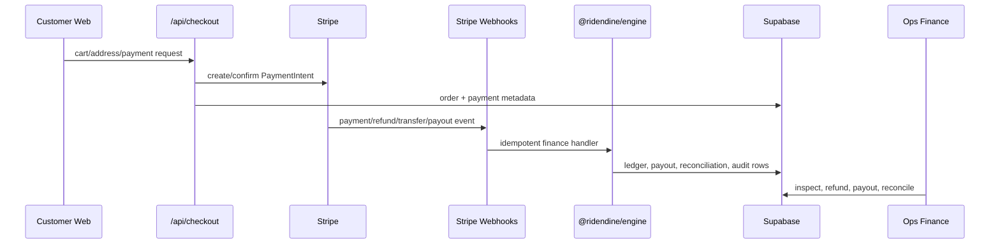
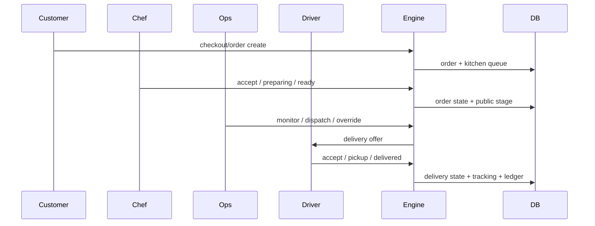
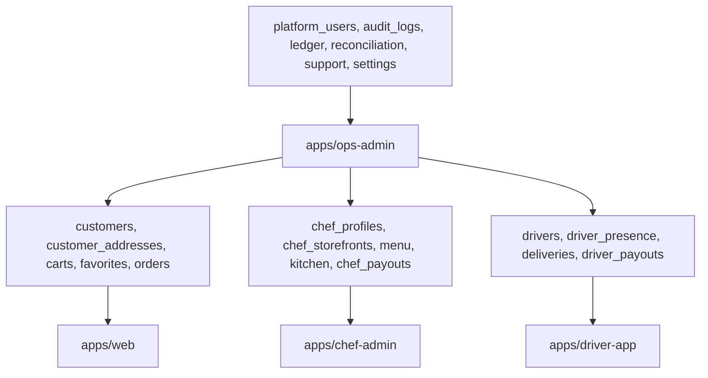

# Complete Codebase Review

## Executive Read

RideNDine is a four-app Next.js monorepo. Ops Admin is the control plane. Customer Web is public/customer-facing. Chef Admin is the chef operating surface. Driver App is the driver operating surface. Shared behavior lives in `packages/*`, with Supabase as auth/database, Stripe for payments and payouts, and routing/ETA logic in shared routing/engine services.

## What Is Working By Static Evidence

- Route files exist for all four app surfaces.
- API route files exist for customer, chef, driver, and ops workflows.
- Shared packages are wired into app/API files through `@ridendine/*` imports.
- Supabase table/RPC references and migration sources are discoverable from the repo.
- Stripe checkout/webhook/payout/reconciliation source files are present and mapped.
- The internal command center already references wiring docs under `docs/wiring`.

## What Is Not Proven Or Needs Review

- Static scans cannot prove runtime auth/RBAC correctness. Finance, dispatch, admin, refund, and payout APIs must still be reviewed/tested manually.
- Dynamic links with template strings can only be matched when the route pattern is obvious.
- External domains are labeled but not network-tested by this generator.
- Pages marked `PARTIAL` often have data/API references but no explicit metadata declaring the intended auth/data contract.
- Legal, launch, production readiness, and live payment readiness remain outside this static wiring proof.

## Broken Static Internal Links

| App | Source file | Kind | Target | Notes |
| --- | --- | --- | --- | --- |
| Chef Admin | [apps/chef-admin/src/app/auth/login/page.tsx](../../../apps/chef-admin/src/app/auth/login/page.tsx) | href | `/auth/forgot-password` | No matching page route file detected |
| Chef Admin | [apps/chef-admin/src/app/auth/signup/page.tsx](../../../apps/chef-admin/src/app/auth/signup/page.tsx) | href | `/privacy` | No matching page route file detected |
| Chef Admin | [apps/chef-admin/src/app/auth/signup/page.tsx](../../../apps/chef-admin/src/app/auth/signup/page.tsx) | href | `/terms` | No matching page route file detected |
| Chef Admin | [apps/chef-admin/src/app/dashboard/storefront/page.tsx](../../../apps/chef-admin/src/app/dashboard/storefront/page.tsx) | href | `/dashboard/storefront/setup` | No matching page route file detected |
| Driver App | [apps/driver-app/src/app/auth/signup/page.tsx](../../../apps/driver-app/src/app/auth/signup/page.tsx) | href | `/privacy` | No matching page route file detected |
| Driver App | [apps/driver-app/src/app/auth/signup/page.tsx](../../../apps/driver-app/src/app/auth/signup/page.tsx) | href | `/terms` | No matching page route file detected |
| Driver App | [apps/driver-app/src/app/delivery/[id]/components/DeliveryDetail.tsx](../../../apps/driver-app/src/app/delivery/[id]/components/DeliveryDetail.tsx) | fetch | `/api/upload` | No matching API route file detected |

## Unknown Dynamic Links

| App | Source file | Kind | Target | Notes |
| --- | --- | --- | --- | --- |
| Chef Admin | [apps/chef-admin/src/app/dashboard/page.tsx](../../../apps/chef-admin/src/app/dashboard/page.tsx) | href | `/chefs/${storefront.slug}` | No matching page route file detected |
| Ops Admin | [apps/ops-admin/src/app/dashboard/health/page.tsx](../../../apps/ops-admin/src/app/dashboard/health/page.tsx) | fetch | `${baseUrl}/api/health` | Not an internal route path |

## Payment Flow

## Order And Delivery Flow

## Data Ownership

