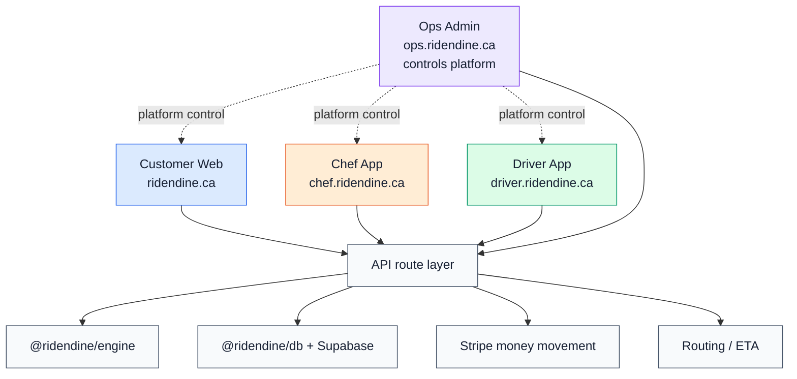

# RideNDine Complete Codebase Map

Generated by `pnpm docs:wiring` from app routes, API routes, package imports, Supabase table references, internal links, fetch calls, env references, and migration files.

## App Split

| App | Domain | Local URL | Users | Root | Purpose |
| --- | --- | --- | --- | --- | --- |
| Customer Web | `ridendine.ca` | `http://localhost:3000` | Customers | `apps/web` | Customer-facing marketplace, chef discovery, cart, checkout, account, support, loyalty, and order tracking. |
| Ops Admin | `ops.ridendine.ca` | `http://localhost:3002` | Platform operators | `apps/ops-admin` | Control plane for operations, customers, chefs, drivers, dispatch, finance, payouts, reconciliation, support, and system health. |
| Chef Admin | `chef.ridendine.ca` | `http://localhost:3001` | Chefs | `apps/chef-admin` | Chef storefront management, menu, availability, orders, kitchen operations, analytics, payouts, profile, and reviews. |
| Driver App | `driver.ridendine.ca` | `http://localhost:3003` | Delivery drivers | `apps/driver-app` | Driver onboarding, presence, delivery offers, active deliveries, location updates, history, earnings, and payout setup. |

## Global Counts

- App pages detected: 82
- API route files detected: 103
- Internal/external link and fetch references detected: 246
- Broken static internal references: 7
- Unknown dynamic references: 2
- Supabase migration files scanned: 29
- Data/engine/package source files scanned: 248
- Table/RPC identifiers detected: 134

## Main Map

## Where To Look

- App maps: `docs/architecture/codebase-map/apps/*.md`
- Every page document: `docs/architecture/codebase-map/pages/EVERY_PAGE_DOCUMENT.md`
- Separate wiring/link folder: `docs/wiring`
- Architecture mirror of wiring: `docs/architecture/codebase-map/wiring`
- Obsidian notes: `docs/obsidian/codebase-map`
- Graphify outputs: `graphify-out/ridendine-codebase-map`
