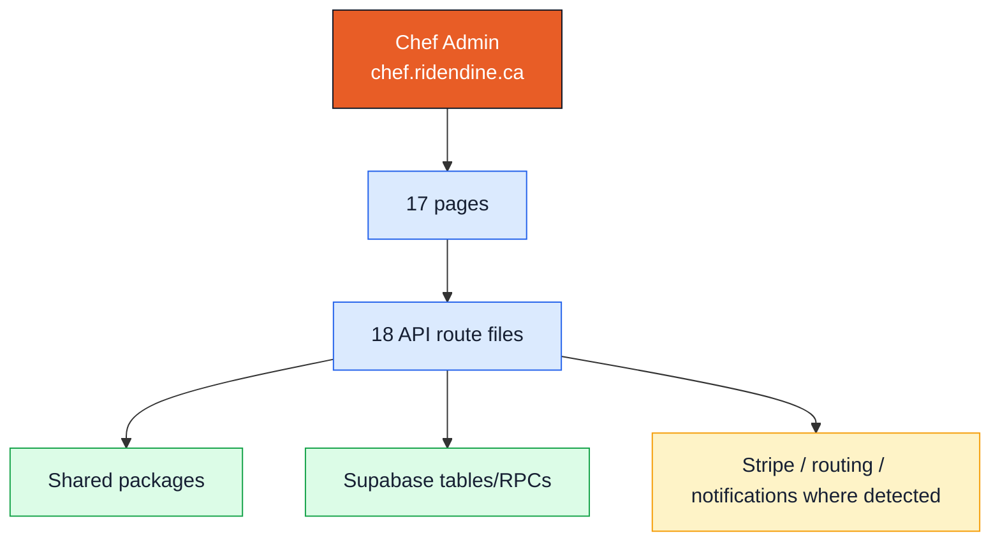

# Chef Admin Standalone Map

## Surface

- Domain: `chef.ridendine.ca`
- Local development URL: `http://localhost:3001`
- Primary users: Chefs
- Code root: `apps/chef-admin`
- App router root: `apps/chef-admin/src/app`
- Purpose: Chef storefront management, menu, availability, orders, kitchen operations, analytics, payouts, profile, and reviews.

## Status Summary

- Page routes: 17 total, 12 WIRED, 5 PARTIAL, 0 MISSING.
- API route files: 18 total, 16 WIRED, 2 PARTIAL.
- Internal link/API references: 44 total, 0 BROKEN, 0 UNKNOWN_DYNAMIC.

## Standalone App Diagram

## Pages

| Status | Route | Page file | Layout | Auth | Tables | APIs called | Components |
| --- | --- | --- | --- | --- | --- | --- | --- |
| PARTIAL | `/auth/forgot-password` | [apps/chef-admin/src/app/auth/forgot-password/page.tsx](../../../../apps/chef-admin/src/app/auth/forgot-password/page.tsx) | [apps/chef-admin/src/app/auth/layout.tsx](../../../../apps/chef-admin/src/app/auth/layout.tsx) | Public | None detected | None detected | `Button`, `Input` |
| PARTIAL | `/auth/login` | [apps/chef-admin/src/app/auth/login/page.tsx](../../../../apps/chef-admin/src/app/auth/login/page.tsx) | [apps/chef-admin/src/app/auth/layout.tsx](../../../../apps/chef-admin/src/app/auth/layout.tsx) | Public | None detected | None detected | `Button`, `Input` |
| PARTIAL | `/auth/signup` | [apps/chef-admin/src/app/auth/signup/page.tsx](../../../../apps/chef-admin/src/app/auth/signup/page.tsx) | [apps/chef-admin/src/app/auth/layout.tsx](../../../../apps/chef-admin/src/app/auth/layout.tsx) | Public | None detected | `/api/auth/signup` | `Button`, `Input`, `PasswordStrength` |
| PARTIAL | `/dashboard/analytics` | [apps/chef-admin/src/app/dashboard/analytics/page.tsx](../../../../apps/chef-admin/src/app/dashboard/analytics/page.tsx) | [apps/chef-admin/src/app/dashboard/layout.tsx](../../../../apps/chef-admin/src/app/dashboard/layout.tsx) | Undetected | None detected | `/api/analytics?period=${p}` | `Card` |
| WIRED | `/dashboard/availability` | [apps/chef-admin/src/app/dashboard/availability/page.tsx](../../../../apps/chef-admin/src/app/dashboard/availability/page.tsx) | [apps/chef-admin/src/app/dashboard/layout.tsx](../../../../apps/chef-admin/src/app/dashboard/layout.tsx) | Undetected | None detected | None detected | `@/components/availability/weekly-availability-form` |
| WIRED | `/dashboard/menu` | [apps/chef-admin/src/app/dashboard/menu/page.tsx](../../../../apps/chef-admin/src/app/dashboard/menu/page.tsx) | [apps/chef-admin/src/app/dashboard/layout.tsx](../../../../apps/chef-admin/src/app/dashboard/layout.tsx) | Detected | `chef_profiles` | None detected | `@/components/menu/menu-list` |
| WIRED | `/dashboard/orders/:id` | [apps/chef-admin/src/app/dashboard/orders/[id]/page.tsx](../../../../apps/chef-admin/src/app/dashboard/orders/[id]/page.tsx) | [apps/chef-admin/src/app/dashboard/layout.tsx](../../../../apps/chef-admin/src/app/dashboard/layout.tsx) | Detected | `chef_profiles`, `chef_storefronts`, `orders` | None detected | `Badge`, `Card` |
| WIRED | `/dashboard/orders` | [apps/chef-admin/src/app/dashboard/orders/page.tsx](../../../../apps/chef-admin/src/app/dashboard/orders/page.tsx) | [apps/chef-admin/src/app/dashboard/layout.tsx](../../../../apps/chef-admin/src/app/dashboard/layout.tsx) | Detected | `chef_profiles`, `orders` | None detected | `@/components/orders/orders-list` |
| WIRED | `/dashboard` | [apps/chef-admin/src/app/dashboard/page.tsx](../../../../apps/chef-admin/src/app/dashboard/page.tsx) | [apps/chef-admin/src/app/dashboard/layout.tsx](../../../../apps/chef-admin/src/app/dashboard/layout.tsx) | Detected | `chef_availability`, `chef_payout_accounts`, `chef_profiles`, `customers` | None detected | None detected |
| WIRED | `/dashboard/payouts` | [apps/chef-admin/src/app/dashboard/payouts/page.tsx](../../../../apps/chef-admin/src/app/dashboard/payouts/page.tsx) | [apps/chef-admin/src/app/dashboard/layout.tsx](../../../../apps/chef-admin/src/app/dashboard/layout.tsx) | Detected | `chef_payout_accounts`, `chef_payouts`, `chef_profiles`, `chef_storefronts`, `orders` | `/api/payouts/request`, `/api/payouts/setup` | `Badge`, `Button`, `Card` |
| PARTIAL | `/dashboard/reviews` | [apps/chef-admin/src/app/dashboard/reviews/page.tsx](../../../../apps/chef-admin/src/app/dashboard/reviews/page.tsx) | [apps/chef-admin/src/app/dashboard/layout.tsx](../../../../apps/chef-admin/src/app/dashboard/layout.tsx) | Detected | `chef_profiles`, `chef_storefronts`, `reviews` | None detected | `Badge`, `Button`, `Card` |
| WIRED | `/dashboard/settings` | [apps/chef-admin/src/app/dashboard/settings/page.tsx](../../../../apps/chef-admin/src/app/dashboard/settings/page.tsx) | [apps/chef-admin/src/app/dashboard/layout.tsx](../../../../apps/chef-admin/src/app/dashboard/layout.tsx) | Detected | None detected | None detected | `@/components/profile/profile-form`, `@/components/settings/notification-preferences` |
| WIRED | `/dashboard/storefront` | [apps/chef-admin/src/app/dashboard/storefront/page.tsx](../../../../apps/chef-admin/src/app/dashboard/storefront/page.tsx) | [apps/chef-admin/src/app/dashboard/layout.tsx](../../../../apps/chef-admin/src/app/dashboard/layout.tsx) | Detected | `chef_profiles` | None detected | `@/components/storefront/storefront-form`, `@/components/storefront/storefront-setup-form`, `EmptyState` |
| WIRED | `/dashboard/storefront/setup` | [apps/chef-admin/src/app/dashboard/storefront/setup/page.tsx](../../../../apps/chef-admin/src/app/dashboard/storefront/setup/page.tsx) | [apps/chef-admin/src/app/dashboard/layout.tsx](../../../../apps/chef-admin/src/app/dashboard/layout.tsx) | Detected | `chef_profiles` | None detected | `@/components/storefront/storefront-setup-form`, `EmptyState` |
| WIRED | `/` | [apps/chef-admin/src/app/page.tsx](../../../../apps/chef-admin/src/app/page.tsx) | [apps/chef-admin/src/app/layout.tsx](../../../../apps/chef-admin/src/app/layout.tsx) | Public | None detected | None detected | None detected |
| WIRED | `/privacy` | [apps/chef-admin/src/app/privacy/page.tsx](../../../../apps/chef-admin/src/app/privacy/page.tsx) | [apps/chef-admin/src/app/layout.tsx](../../../../apps/chef-admin/src/app/layout.tsx) | Public | None detected | None detected | None detected |
| WIRED | `/terms` | [apps/chef-admin/src/app/terms/page.tsx](../../../../apps/chef-admin/src/app/terms/page.tsx) | [apps/chef-admin/src/app/layout.tsx](../../../../apps/chef-admin/src/app/layout.tsx) | Public | None detected | None detected | None detected |

## APIs

| Status | Endpoint | Methods | File | Auth | Tables | Packages | External |
| --- | --- | --- | --- | --- | --- | --- | --- |
| WIRED | `/api/analytics` | GET | [apps/chef-admin/src/app/api/analytics/route.ts](../../../../apps/chef-admin/src/app/api/analytics/route.ts) | Detected | `order_items`, `orders`, `reviews` | @ridendine/db | None detected |
| WIRED | `/api/auth/signup` | POST | [apps/chef-admin/src/app/api/auth/signup/route.ts](../../../../apps/chef-admin/src/app/api/auth/signup/route.ts) | Detected | None detected | @ridendine/db, @ridendine/utils, @ridendine/validation | Supabase |
| PARTIAL | `/api/health` | GET | [apps/chef-admin/src/app/api/health/route.ts](../../../../apps/chef-admin/src/app/api/health/route.ts) | Undetected | `chef_profiles` | @ridendine/db, @ridendine/utils | Stripe, Supabase |
| WIRED | `/api/menu/:id/options/:optionId` | DELETE, PATCH | [apps/chef-admin/src/app/api/menu/[id]/options/[optionId]/route.ts](../../../../apps/chef-admin/src/app/api/menu/[id]/options/[optionId]/route.ts) | Detected | `menu_item_options` | @ridendine/validation | None detected |
| WIRED | `/api/menu/:id/options/:optionId/values/:valueId` | DELETE, PATCH | [apps/chef-admin/src/app/api/menu/[id]/options/[optionId]/values/[valueId]/route.ts](../../../../apps/chef-admin/src/app/api/menu/[id]/options/[optionId]/values/[valueId]/route.ts) | Detected | `menu_item_option_values` | @ridendine/validation | None detected |
| WIRED | `/api/menu/:id/options/:optionId/values` | POST | [apps/chef-admin/src/app/api/menu/[id]/options/[optionId]/values/route.ts](../../../../apps/chef-admin/src/app/api/menu/[id]/options/[optionId]/values/route.ts) | Detected | `menu_item_option_values` | @ridendine/validation | None detected |
| WIRED | `/api/menu/:id/options` | GET, POST | [apps/chef-admin/src/app/api/menu/[id]/options/route.ts](../../../../apps/chef-admin/src/app/api/menu/[id]/options/route.ts) | Detected | `menu_item_option_values`, `menu_item_options` | @ridendine/validation | None detected |
| WIRED | `/api/menu/:id` | DELETE, GET, PATCH | [apps/chef-admin/src/app/api/menu/[id]/route.ts](../../../../apps/chef-admin/src/app/api/menu/[id]/route.ts) | Detected | None detected | @ridendine/db | Supabase |
| WIRED | `/api/menu/categories` | GET, POST | [apps/chef-admin/src/app/api/menu/categories/route.ts](../../../../apps/chef-admin/src/app/api/menu/categories/route.ts) | Detected | None detected | @ridendine/db | Supabase |
| WIRED | `/api/menu` | GET, POST | [apps/chef-admin/src/app/api/menu/route.ts](../../../../apps/chef-admin/src/app/api/menu/route.ts) | Detected | None detected | @ridendine/db | Supabase |
| WIRED | `/api/orders/:id` | GET, PATCH | [apps/chef-admin/src/app/api/orders/[id]/route.ts](../../../../apps/chef-admin/src/app/api/orders/[id]/route.ts) | Detected | `orders` | @ridendine/db, @ridendine/types, @ridendine/utils | None detected |
| WIRED | `/api/orders` | GET | [apps/chef-admin/src/app/api/orders/route.ts](../../../../apps/chef-admin/src/app/api/orders/route.ts) | Detected | `customer_addresses`, `customers`, `orders` | @ridendine/db | None detected |
| WIRED | `/api/payouts/request` | POST | [apps/chef-admin/src/app/api/payouts/request/route.ts](../../../../apps/chef-admin/src/app/api/payouts/request/route.ts) | Detected | None detected | None detected | None detected |
| WIRED | `/api/payouts/setup` | POST | [apps/chef-admin/src/app/api/payouts/setup/route.ts](../../../../apps/chef-admin/src/app/api/payouts/setup/route.ts) | Detected | `chef_payout_accounts`, `chef_profiles` | @ridendine/db, @ridendine/engine | Stripe, Supabase |
| WIRED | `/api/profile` | GET, PATCH | [apps/chef-admin/src/app/api/profile/route.ts](../../../../apps/chef-admin/src/app/api/profile/route.ts) | Detected | None detected | @ridendine/db | Supabase |
| WIRED | `/api/storefront/availability` | GET, PUT | [apps/chef-admin/src/app/api/storefront/availability/route.ts](../../../../apps/chef-admin/src/app/api/storefront/availability/route.ts) | Detected | `chef_availability` | @ridendine/db | None detected |
| PARTIAL | `/api/storefront` | GET, PATCH, POST | [apps/chef-admin/src/app/api/storefront/route.ts](../../../../apps/chef-admin/src/app/api/storefront/route.ts) | Detected | `chef_kitchens`, `chef_storefronts` | @ridendine/db | Supabase |
| WIRED | `/api/upload` | POST | [apps/chef-admin/src/app/api/upload/route.ts](../../../../apps/chef-admin/src/app/api/upload/route.ts) | Detected | None detected | @ridendine/db, @ridendine/utils | Supabase |

## Broken Or Unproven Links

No broken or unknown dynamic internal links detected by the static scanner.
