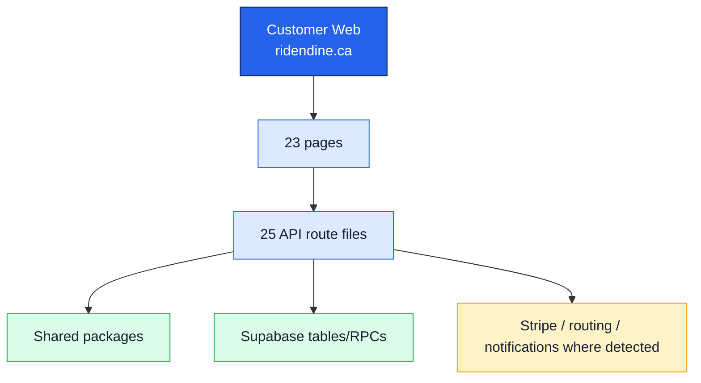

# Customer Web Standalone Map

## Surface

- Domain: `ridendine.ca`
- Local development URL: `http://localhost:3000`
- Primary users: Customers
- Code root: `apps/web`
- App router root: `apps/web/src/app`
- Purpose: Customer-facing marketplace, chef discovery, cart, checkout, account, support, loyalty, and order tracking.

## Status Summary

- Page routes: 23 total, 12 WIRED, 11 PARTIAL, 0 MISSING.
- API route files: 25 total, 15 WIRED, 10 PARTIAL.
- Internal link/API references: 100 total, 0 BROKEN, 0 UNKNOWN_DYNAMIC.

## Standalone App Diagram

## Pages

| Status | Route | Page file | Layout | Auth | Tables | APIs called | Components |
| --- | --- | --- | --- | --- | --- | --- | --- |
| WIRED | `/about` | [apps/web/src/app/about/page.tsx](../../../../apps/web/src/app/about/page.tsx) | [apps/web/src/app/layout.tsx](../../../../apps/web/src/app/layout.tsx) | Public | None detected | None detected | `@/components/layout/header`, `Card` |
| PARTIAL | `/account/addresses` | [apps/web/src/app/account/addresses/page.tsx](../../../../apps/web/src/app/account/addresses/page.tsx) | [apps/web/src/app/account/layout.tsx](../../../../apps/web/src/app/account/layout.tsx) | Undetected | None detected | `/api/addresses`, `/api/addresses?id=${id}` | `@/components/layout/header`, `Button`, `Card` |
| WIRED | `/account/favorites` | [apps/web/src/app/account/favorites/page.tsx](../../../../apps/web/src/app/account/favorites/page.tsx) | [apps/web/src/app/account/layout.tsx](../../../../apps/web/src/app/account/layout.tsx) | Undetected | None detected | None detected | `@/components/layout/header`, `Button`, `Card`, `EmptyState` |
| PARTIAL | `/account/orders` | [apps/web/src/app/account/orders/page.tsx](../../../../apps/web/src/app/account/orders/page.tsx) | [apps/web/src/app/account/layout.tsx](../../../../apps/web/src/app/account/layout.tsx) | Undetected | None detected | `/api/cart`, `/api/orders`, `/api/orders/${order.id}` | `@/components/layout/header`, `Badge`, `Button`, `Card`, `NoOrdersEmpty`, `Spinner` |
| WIRED | `/account` | [apps/web/src/app/account/page.tsx](../../../../apps/web/src/app/account/page.tsx) | [apps/web/src/app/account/layout.tsx](../../../../apps/web/src/app/account/layout.tsx) | Undetected | None detected | None detected | `@/components/layout/header`, `Avatar`, `Button`, `Card` |
| PARTIAL | `/account/settings` | [apps/web/src/app/account/settings/page.tsx](../../../../apps/web/src/app/account/settings/page.tsx) | [apps/web/src/app/account/layout.tsx](../../../../apps/web/src/app/account/layout.tsx) | Undetected | None detected | `/api/profile` | `@/components/layout/header`, `@/components/profile/saved-cards`, `Button`, `Card`, `Input` |
| PARTIAL | `/auth/forgot-password` | [apps/web/src/app/auth/forgot-password/page.tsx](../../../../apps/web/src/app/auth/forgot-password/page.tsx) | [apps/web/src/app/auth/layout.tsx](../../../../apps/web/src/app/auth/layout.tsx) | Public | None detected | None detected | `@/components/auth/auth-layout`, `Button`, `Input` |
| PARTIAL | `/auth/login` | [apps/web/src/app/auth/login/page.tsx](../../../../apps/web/src/app/auth/login/page.tsx) | [apps/web/src/app/auth/layout.tsx](../../../../apps/web/src/app/auth/layout.tsx) | Public | None detected | `/api/auth/login` | `Button`, `Input` |
| PARTIAL | `/auth/signup` | [apps/web/src/app/auth/signup/page.tsx](../../../../apps/web/src/app/auth/signup/page.tsx) | [apps/web/src/app/auth/layout.tsx](../../../../apps/web/src/app/auth/layout.tsx) | Public | None detected | `/api/referrals/apply` | `Button`, `Input`, `PasswordStrength` |
| WIRED | `/cart` | [apps/web/src/app/cart/page.tsx](../../../../apps/web/src/app/cart/page.tsx) | [apps/web/src/app/cart/layout.tsx](../../../../apps/web/src/app/cart/layout.tsx) | Undetected | None detected | None detected | `@/components/layout/header`, `Button`, `Card`, `EmptyState` |
| PARTIAL | `/checkout` | [apps/web/src/app/checkout/page.tsx](../../../../apps/web/src/app/checkout/page.tsx) | [apps/web/src/app/layout.tsx](../../../../apps/web/src/app/layout.tsx) | Undetected | None detected | `/api/addresses`, `/api/cart?storefrontId=${storefrontId}`, `/api/checkout` | `@/components/checkout/checkout-skeleton`, `@/components/checkout/delivery-time-picker`, `@/components/checkout/saved-card-selector`, `@/components/checkout/stripe-payment-form`, `@/components/layout/header`, `Button`, `Card`, `Input` |
| WIRED | `/chef-resources` | [apps/web/src/app/chef-resources/page.tsx](../../../../apps/web/src/app/chef-resources/page.tsx) | [apps/web/src/app/layout.tsx](../../../../apps/web/src/app/layout.tsx) | Undetected | None detected | None detected | `@/components/layout/header`, `Button`, `Card`, `CardDescription`, `CardHeader`, `CardTitle` |
| PARTIAL | `/chef-signup` | [apps/web/src/app/chef-signup/page.tsx](../../../../apps/web/src/app/chef-signup/page.tsx) | [apps/web/src/app/layout.tsx](../../../../apps/web/src/app/layout.tsx) | Undetected | None detected | None detected | `@/components/layout/header`, `Button`, `Card`, `Input`, `Textarea` |
| WIRED | `/chefs/:slug` | [apps/web/src/app/chefs/[slug]/page.tsx](../../../../apps/web/src/app/chefs/[slug]/page.tsx) | [apps/web/src/app/layout.tsx](../../../../apps/web/src/app/layout.tsx) | Detected | None detected | None detected | `@/components/layout/header`, `@/components/reviews/reviews-list`, `@/components/storefront/storefront-header`, `@/components/storefront/storefront-menu` |
| WIRED | `/chefs` | [apps/web/src/app/chefs/page.tsx](../../../../apps/web/src/app/chefs/page.tsx) | [apps/web/src/app/layout.tsx](../../../../apps/web/src/app/layout.tsx) | Undetected | None detected | None detected | `@/components/chefs/chefs-filters`, `@/components/chefs/chefs-list`, `@/components/layout/header` |
| PARTIAL | `/contact` | [apps/web/src/app/contact/page.tsx](../../../../apps/web/src/app/contact/page.tsx) | [apps/web/src/app/layout.tsx](../../../../apps/web/src/app/layout.tsx) | Undetected | None detected | `/api/support` | `@/components/layout/header`, `Button`, `Card`, `Input` |
| WIRED | `/how-it-works` | [apps/web/src/app/how-it-works/page.tsx](../../../../apps/web/src/app/how-it-works/page.tsx) | [apps/web/src/app/layout.tsx](../../../../apps/web/src/app/layout.tsx) | Undetected | None detected | None detected | `@/components/layout/header`, `Card` |
| WIRED | `/maintenance` | [apps/web/src/app/maintenance/page.tsx](../../../../apps/web/src/app/maintenance/page.tsx) | [apps/web/src/app/layout.tsx](../../../../apps/web/src/app/layout.tsx) | Undetected | None detected | None detected | None detected |
| WIRED | `/order-confirmation/:orderId` | [apps/web/src/app/order-confirmation/[orderId]/page.tsx](../../../../apps/web/src/app/order-confirmation/[orderId]/page.tsx) | [apps/web/src/app/layout.tsx](../../../../apps/web/src/app/layout.tsx) | Undetected | None detected | None detected | None detected |
| WIRED | `/orders/:id/confirmation` | [apps/web/src/app/orders/[id]/confirmation/page.tsx](../../../../apps/web/src/app/orders/[id]/confirmation/page.tsx) | [apps/web/src/app/layout.tsx](../../../../apps/web/src/app/layout.tsx) | Detected | `orders` | None detected | `@/components/layout/header`, `@/components/reviews/review-form`, `@/components/tracking/live-order-tracker`, `Button`, `Card` |
| WIRED | `/` | [apps/web/src/app/page.tsx](../../../../apps/web/src/app/page.tsx) | [apps/web/src/app/layout.tsx](../../../../apps/web/src/app/layout.tsx) | Public | `chef_storefronts`, `menu_items` | None detected | `@/components/home/featured-chefs`, `@/components/home/scroll-reveal-section`, `@/components/layout/header`, `Button` |
| PARTIAL | `/privacy` | [apps/web/src/app/privacy/page.tsx](../../../../apps/web/src/app/privacy/page.tsx) | [apps/web/src/app/layout.tsx](../../../../apps/web/src/app/layout.tsx) | Public | None detected | None detected | `@/components/layout/header` |
| PARTIAL | `/terms` | [apps/web/src/app/terms/page.tsx](../../../../apps/web/src/app/terms/page.tsx) | [apps/web/src/app/layout.tsx](../../../../apps/web/src/app/layout.tsx) | Public | None detected | None detected | `@/components/layout/header` |

## APIs

| Status | Endpoint | Methods | File | Auth | Tables | Packages | External |
| --- | --- | --- | --- | --- | --- | --- | --- |
| WIRED | `/api/addresses` | DELETE, GET, PATCH, POST | [apps/web/src/app/api/addresses/route.ts](../../../../apps/web/src/app/api/addresses/route.ts) | Detected | `customer_addresses` | @ridendine/db, @ridendine/engine, @ridendine/validation | Supabase |
| WIRED | `/api/auth/login` | POST | [apps/web/src/app/api/auth/login/route.ts](../../../../apps/web/src/app/api/auth/login/route.ts) | Detected | None detected | @ridendine/db, @ridendine/utils, @ridendine/validation | Supabase |
| WIRED | `/api/auth/signup` | POST | [apps/web/src/app/api/auth/signup/route.ts](../../../../apps/web/src/app/api/auth/signup/route.ts) | Detected | None detected | @ridendine/db, @ridendine/utils, @ridendine/validation | Supabase |
| WIRED | `/api/cart` | DELETE, GET, PATCH, POST | [apps/web/src/app/api/cart/route.ts](../../../../apps/web/src/app/api/cart/route.ts) | Detected | `cart_items`, `menu_items` | @ridendine/db, @ridendine/validation | Supabase |
| PARTIAL | `/api/checkout` | POST | [apps/web/src/app/api/checkout/route.ts](../../../../apps/web/src/app/api/checkout/route.ts) | Undetected | `checkout_idempotency_keys`, `chef_kitchens`, `customer_addresses`, `customers`, `menu_items`, `orders`, `promo_codes`, `service_areas` | @ridendine/db, @ridendine/engine, @ridendine/utils, @ridendine/validation | Stripe, Supabase |
| PARTIAL | `/api/eta` | GET | [apps/web/src/app/api/eta/route.ts](../../../../apps/web/src/app/api/eta/route.ts) | Undetected | None detected | @ridendine/db, @ridendine/routing | Routing provider |
| WIRED | `/api/favorites` | GET, POST | [apps/web/src/app/api/favorites/route.ts](../../../../apps/web/src/app/api/favorites/route.ts) | Detected | `customers`, `favorites` | @ridendine/db, @ridendine/engine/server, @ridendine/utils | Supabase |
| PARTIAL | `/api/health` | GET | [apps/web/src/app/api/health/route.ts](../../../../apps/web/src/app/api/health/route.ts) | Undetected | `chef_storefronts` | @ridendine/db, @ridendine/utils | Stripe, Supabase |
| PARTIAL | `/api/loyalty` | GET, POST | [apps/web/src/app/api/loyalty/route.ts](../../../../apps/web/src/app/api/loyalty/route.ts) | Undetected | `loyalty_transactions` | @ridendine/db, @ridendine/engine | None detected |
| WIRED | `/api/notifications` | GET, PATCH, POST | [apps/web/src/app/api/notifications/route.ts](../../../../apps/web/src/app/api/notifications/route.ts) | Detected | `notifications` | @ridendine/db, @ridendine/engine/server | Supabase |
| WIRED | `/api/notifications/subscribe` | DELETE, POST | [apps/web/src/app/api/notifications/subscribe/route.ts](../../../../apps/web/src/app/api/notifications/subscribe/route.ts) | Detected | `push_subscriptions` | @ridendine/db | Supabase |
| PARTIAL | `/api/orders/:id/cancel` | POST | [apps/web/src/app/api/orders/[id]/cancel/route.ts](../../../../apps/web/src/app/api/orders/[id]/cancel/route.ts) | Undetected | `orders` | @ridendine/db, @ridendine/utils | None detected |
| PARTIAL | `/api/orders/:id` | GET, PATCH | [apps/web/src/app/api/orders/[id]/route.ts](../../../../apps/web/src/app/api/orders/[id]/route.ts) | Undetected | `order_status_history`, `orders` | @ridendine/db, @ridendine/utils | Supabase |
| PARTIAL | `/api/orders` | GET | [apps/web/src/app/api/orders/route.ts](../../../../apps/web/src/app/api/orders/route.ts) | Undetected | `orders` | @ridendine/db | None detected |
| WIRED | `/api/payment-methods` | DELETE, GET | [apps/web/src/app/api/payment-methods/route.ts](../../../../apps/web/src/app/api/payment-methods/route.ts) | Detected | None detected | @ridendine/db, @ridendine/engine | Stripe, Supabase |
| WIRED | `/api/profile` | GET, PATCH | [apps/web/src/app/api/profile/route.ts](../../../../apps/web/src/app/api/profile/route.ts) | Detected | None detected | @ridendine/db, @ridendine/validation | Supabase |
| WIRED | `/api/promos/validate` | GET | [apps/web/src/app/api/promos/validate/route.ts](../../../../apps/web/src/app/api/promos/validate/route.ts) | Detected | `promo_codes` | @ridendine/db | Supabase |
| WIRED | `/api/referrals/apply` | POST | [apps/web/src/app/api/referrals/apply/route.ts](../../../../apps/web/src/app/api/referrals/apply/route.ts) | Detected | None detected | @ridendine/db, @ridendine/engine | Supabase |
| PARTIAL | `/api/referrals` | GET, POST | [apps/web/src/app/api/referrals/route.ts](../../../../apps/web/src/app/api/referrals/route.ts) | Undetected | None detected | @ridendine/db, @ridendine/engine | Supabase |
| WIRED | `/api/reviews` | GET, POST | [apps/web/src/app/api/reviews/route.ts](../../../../apps/web/src/app/api/reviews/route.ts) | Detected | `chef_storefronts`, `customers`, `orders`, `reviews` | @ridendine/db, @ridendine/engine/server, @ridendine/utils | Supabase |
| PARTIAL | `/api/support` | GET, POST | [apps/web/src/app/api/support/route.ts](../../../../apps/web/src/app/api/support/route.ts) | Undetected | None detected | @ridendine/db, @ridendine/engine/server, @ridendine/utils, @ridendine/validation | Supabase |
| WIRED | `/api/support/tickets/:id` | GET | [apps/web/src/app/api/support/tickets/[id]/route.ts](../../../../apps/web/src/app/api/support/tickets/[id]/route.ts) | Detected | None detected | @ridendine/db | Supabase |
| WIRED | `/api/support/tickets` | GET | [apps/web/src/app/api/support/tickets/route.ts](../../../../apps/web/src/app/api/support/tickets/route.ts) | Detected | None detected | @ridendine/db | Supabase |
| WIRED | `/api/upload` | POST | [apps/web/src/app/api/upload/route.ts](../../../../apps/web/src/app/api/upload/route.ts) | Detected | None detected | @ridendine/db, @ridendine/engine/server, @ridendine/utils | Supabase |
| PARTIAL | `/api/webhooks/stripe` | POST | [apps/web/src/app/api/webhooks/stripe/route.ts](../../../../apps/web/src/app/api/webhooks/stripe/route.ts) | Undetected | None detected | @ridendine/db, @ridendine/engine, @ridendine/utils | Stripe |

## Broken Or Unproven Links

No broken or unknown dynamic internal links detected by the static scanner.
