# Every Page Application Document

This document is generated from the current codebase by `pnpm docs:wiring`. It covers every detected Next.js App Router page in the four RideNDine applications.

## Legend

- `WIRED`: static scan found a plausible route implementation and no high-confidence missing source.
- `PARTIAL`: page exists, but auth/data/API metadata is not fully provable by static scan.
- `MISSING`: page exists but looks empty or not meaningfully wired by static scan.
- Link statuses are documented in `docs/wiring/links/LINK_WIRING_MATRIX.md`.

## Application Diagram

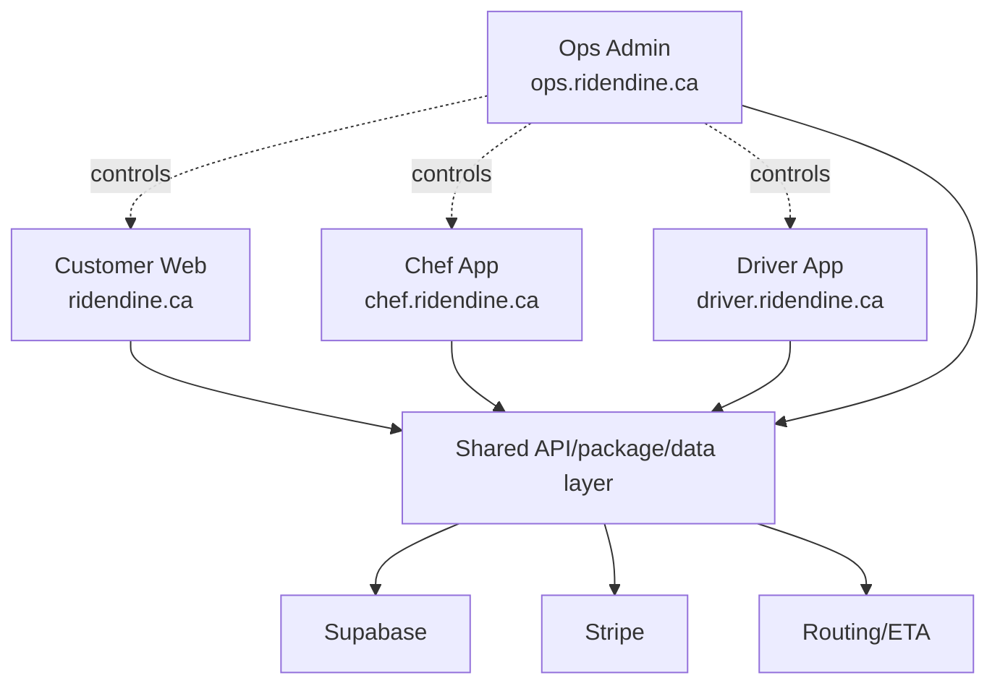

## Page Index

| App | Route | Status | Page file |
| --- | --- | --- | --- |
| Customer Web | `/about` | WIRED | [apps/web/src/app/about/page.tsx](../../../../apps/web/src/app/about/page.tsx) |
| Customer Web | `/account/addresses` | PARTIAL | [apps/web/src/app/account/addresses/page.tsx](../../../../apps/web/src/app/account/addresses/page.tsx) |
| Customer Web | `/account/favorites` | WIRED | [apps/web/src/app/account/favorites/page.tsx](../../../../apps/web/src/app/account/favorites/page.tsx) |
| Customer Web | `/account/orders` | PARTIAL | [apps/web/src/app/account/orders/page.tsx](../../../../apps/web/src/app/account/orders/page.tsx) |
| Customer Web | `/account` | WIRED | [apps/web/src/app/account/page.tsx](../../../../apps/web/src/app/account/page.tsx) |
| Customer Web | `/account/settings` | PARTIAL | [apps/web/src/app/account/settings/page.tsx](../../../../apps/web/src/app/account/settings/page.tsx) |
| Customer Web | `/auth/forgot-password` | PARTIAL | [apps/web/src/app/auth/forgot-password/page.tsx](../../../../apps/web/src/app/auth/forgot-password/page.tsx) |
| Customer Web | `/auth/login` | PARTIAL | [apps/web/src/app/auth/login/page.tsx](../../../../apps/web/src/app/auth/login/page.tsx) |
| Customer Web | `/auth/signup` | PARTIAL | [apps/web/src/app/auth/signup/page.tsx](../../../../apps/web/src/app/auth/signup/page.tsx) |
| Customer Web | `/cart` | WIRED | [apps/web/src/app/cart/page.tsx](../../../../apps/web/src/app/cart/page.tsx) |
| Customer Web | `/checkout` | PARTIAL | [apps/web/src/app/checkout/page.tsx](../../../../apps/web/src/app/checkout/page.tsx) |
| Customer Web | `/chef-resources` | WIRED | [apps/web/src/app/chef-resources/page.tsx](../../../../apps/web/src/app/chef-resources/page.tsx) |
| Customer Web | `/chef-signup` | PARTIAL | [apps/web/src/app/chef-signup/page.tsx](../../../../apps/web/src/app/chef-signup/page.tsx) |
| Customer Web | `/chefs/:slug` | WIRED | [apps/web/src/app/chefs/[slug]/page.tsx](../../../../apps/web/src/app/chefs/[slug]/page.tsx) |
| Customer Web | `/chefs` | WIRED | [apps/web/src/app/chefs/page.tsx](../../../../apps/web/src/app/chefs/page.tsx) |
| Customer Web | `/contact` | PARTIAL | [apps/web/src/app/contact/page.tsx](../../../../apps/web/src/app/contact/page.tsx) |
| Customer Web | `/how-it-works` | WIRED | [apps/web/src/app/how-it-works/page.tsx](../../../../apps/web/src/app/how-it-works/page.tsx) |
| Customer Web | `/maintenance` | WIRED | [apps/web/src/app/maintenance/page.tsx](../../../../apps/web/src/app/maintenance/page.tsx) |
| Customer Web | `/order-confirmation/:orderId` | WIRED | [apps/web/src/app/order-confirmation/[orderId]/page.tsx](../../../../apps/web/src/app/order-confirmation/[orderId]/page.tsx) |
| Customer Web | `/orders/:id/confirmation` | WIRED | [apps/web/src/app/orders/[id]/confirmation/page.tsx](../../../../apps/web/src/app/orders/[id]/confirmation/page.tsx) |
| Customer Web | `/` | WIRED | [apps/web/src/app/page.tsx](../../../../apps/web/src/app/page.tsx) |
| Customer Web | `/privacy` | PARTIAL | [apps/web/src/app/privacy/page.tsx](../../../../apps/web/src/app/privacy/page.tsx) |
| Customer Web | `/terms` | PARTIAL | [apps/web/src/app/terms/page.tsx](../../../../apps/web/src/app/terms/page.tsx) |
| Ops Admin | `/auth/login` | PARTIAL | [apps/ops-admin/src/app/auth/login/page.tsx](../../../../apps/ops-admin/src/app/auth/login/page.tsx) |
| Ops Admin | `/dashboard/activity` | PARTIAL | [apps/ops-admin/src/app/dashboard/activity/page.tsx](../../../../apps/ops-admin/src/app/dashboard/activity/page.tsx) |
| Ops Admin | `/dashboard/analytics` | PARTIAL | [apps/ops-admin/src/app/dashboard/analytics/page.tsx](../../../../apps/ops-admin/src/app/dashboard/analytics/page.tsx) |
| Ops Admin | `/dashboard/announcements` | PARTIAL | [apps/ops-admin/src/app/dashboard/announcements/page.tsx](../../../../apps/ops-admin/src/app/dashboard/announcements/page.tsx) |
| Ops Admin | `/dashboard/automation` | PARTIAL | [apps/ops-admin/src/app/dashboard/automation/page.tsx](../../../../apps/ops-admin/src/app/dashboard/automation/page.tsx) |
| Ops Admin | `/dashboard/chefs/:id` | WIRED | [apps/ops-admin/src/app/dashboard/chefs/[id]/page.tsx](../../../../apps/ops-admin/src/app/dashboard/chefs/[id]/page.tsx) |
| Ops Admin | `/dashboard/chefs/approvals` | PARTIAL | [apps/ops-admin/src/app/dashboard/chefs/approvals/page.tsx](../../../../apps/ops-admin/src/app/dashboard/chefs/approvals/page.tsx) |
| Ops Admin | `/dashboard/chefs` | WIRED | [apps/ops-admin/src/app/dashboard/chefs/page.tsx](../../../../apps/ops-admin/src/app/dashboard/chefs/page.tsx) |
| Ops Admin | `/dashboard/customers/:id` | WIRED | [apps/ops-admin/src/app/dashboard/customers/[id]/page.tsx](../../../../apps/ops-admin/src/app/dashboard/customers/[id]/page.tsx) |
| Ops Admin | `/dashboard/customers` | PARTIAL | [apps/ops-admin/src/app/dashboard/customers/page.tsx](../../../../apps/ops-admin/src/app/dashboard/customers/page.tsx) |
| Ops Admin | `/dashboard/deliveries/:id` | WIRED | [apps/ops-admin/src/app/dashboard/deliveries/[id]/page.tsx](../../../../apps/ops-admin/src/app/dashboard/deliveries/[id]/page.tsx) |
| Ops Admin | `/dashboard/deliveries` | PARTIAL | [apps/ops-admin/src/app/dashboard/deliveries/page.tsx](../../../../apps/ops-admin/src/app/dashboard/deliveries/page.tsx) |
| Ops Admin | `/dashboard/dispatch` | PARTIAL | [apps/ops-admin/src/app/dashboard/dispatch/page.tsx](../../../../apps/ops-admin/src/app/dashboard/dispatch/page.tsx) |
| Ops Admin | `/dashboard/drivers/:id` | WIRED | [apps/ops-admin/src/app/dashboard/drivers/[id]/page.tsx](../../../../apps/ops-admin/src/app/dashboard/drivers/[id]/page.tsx) |
| Ops Admin | `/dashboard/drivers` | WIRED | [apps/ops-admin/src/app/dashboard/drivers/page.tsx](../../../../apps/ops-admin/src/app/dashboard/drivers/page.tsx) |
| Ops Admin | `/dashboard/finance/accounts/chefs/:id` | MISSING | [apps/ops-admin/src/app/dashboard/finance/accounts/chefs/[id]/page.tsx](../../../../apps/ops-admin/src/app/dashboard/finance/accounts/chefs/[id]/page.tsx) |
| Ops Admin | `/dashboard/finance/accounts/chefs` | PARTIAL | [apps/ops-admin/src/app/dashboard/finance/accounts/chefs/page.tsx](../../../../apps/ops-admin/src/app/dashboard/finance/accounts/chefs/page.tsx) |
| Ops Admin | `/dashboard/finance/accounts/drivers/:id` | MISSING | [apps/ops-admin/src/app/dashboard/finance/accounts/drivers/[id]/page.tsx](../../../../apps/ops-admin/src/app/dashboard/finance/accounts/drivers/[id]/page.tsx) |
| Ops Admin | `/dashboard/finance/accounts/drivers` | PARTIAL | [apps/ops-admin/src/app/dashboard/finance/accounts/drivers/page.tsx](../../../../apps/ops-admin/src/app/dashboard/finance/accounts/drivers/page.tsx) |
| Ops Admin | `/dashboard/finance/instant-payouts` | PARTIAL | [apps/ops-admin/src/app/dashboard/finance/instant-payouts/page.tsx](../../../../apps/ops-admin/src/app/dashboard/finance/instant-payouts/page.tsx) |
| Ops Admin | `/dashboard/finance` | WIRED | [apps/ops-admin/src/app/dashboard/finance/page.tsx](../../../../apps/ops-admin/src/app/dashboard/finance/page.tsx) |
| Ops Admin | `/dashboard/finance/payouts/:runId` | PARTIAL | [apps/ops-admin/src/app/dashboard/finance/payouts/[runId]/page.tsx](../../../../apps/ops-admin/src/app/dashboard/finance/payouts/[runId]/page.tsx) |
| Ops Admin | `/dashboard/finance/payouts` | PARTIAL | [apps/ops-admin/src/app/dashboard/finance/payouts/page.tsx](../../../../apps/ops-admin/src/app/dashboard/finance/payouts/page.tsx) |
| Ops Admin | `/dashboard/finance/reconciliation` | PARTIAL | [apps/ops-admin/src/app/dashboard/finance/reconciliation/page.tsx](../../../../apps/ops-admin/src/app/dashboard/finance/reconciliation/page.tsx) |
| Ops Admin | `/dashboard/finance/refunds` | WIRED | [apps/ops-admin/src/app/dashboard/finance/refunds/page.tsx](../../../../apps/ops-admin/src/app/dashboard/finance/refunds/page.tsx) |
| Ops Admin | `/dashboard/health` | PARTIAL | [apps/ops-admin/src/app/dashboard/health/page.tsx](../../../../apps/ops-admin/src/app/dashboard/health/page.tsx) |
| Ops Admin | `/dashboard/integrations` | WIRED | [apps/ops-admin/src/app/dashboard/integrations/page.tsx](../../../../apps/ops-admin/src/app/dashboard/integrations/page.tsx) |
| Ops Admin | `/dashboard/map` | WIRED | [apps/ops-admin/src/app/dashboard/map/page.tsx](../../../../apps/ops-admin/src/app/dashboard/map/page.tsx) |
| Ops Admin | `/dashboard/orders/:id` | WIRED | [apps/ops-admin/src/app/dashboard/orders/[id]/page.tsx](../../../../apps/ops-admin/src/app/dashboard/orders/[id]/page.tsx) |
| Ops Admin | `/dashboard/orders` | PARTIAL | [apps/ops-admin/src/app/dashboard/orders/page.tsx](../../../../apps/ops-admin/src/app/dashboard/orders/page.tsx) |
| Ops Admin | `/dashboard` | WIRED | [apps/ops-admin/src/app/dashboard/page.tsx](../../../../apps/ops-admin/src/app/dashboard/page.tsx) |
| Ops Admin | `/dashboard/promos` | PARTIAL | [apps/ops-admin/src/app/dashboard/promos/page.tsx](../../../../apps/ops-admin/src/app/dashboard/promos/page.tsx) |
| Ops Admin | `/dashboard/reports` | WIRED | [apps/ops-admin/src/app/dashboard/reports/page.tsx](../../../../apps/ops-admin/src/app/dashboard/reports/page.tsx) |
| Ops Admin | `/dashboard/settings` | WIRED | [apps/ops-admin/src/app/dashboard/settings/page.tsx](../../../../apps/ops-admin/src/app/dashboard/settings/page.tsx) |
| Ops Admin | `/dashboard/support` | PARTIAL | [apps/ops-admin/src/app/dashboard/support/page.tsx](../../../../apps/ops-admin/src/app/dashboard/support/page.tsx) |
| Ops Admin | `/dashboard/team` | PARTIAL | [apps/ops-admin/src/app/dashboard/team/page.tsx](../../../../apps/ops-admin/src/app/dashboard/team/page.tsx) |
| Ops Admin | `/internal/command-center` | WIRED | [apps/ops-admin/src/app/internal/command-center/page.tsx](../../../../apps/ops-admin/src/app/internal/command-center/page.tsx) |
| Ops Admin | `/` | WIRED | [apps/ops-admin/src/app/page.tsx](../../../../apps/ops-admin/src/app/page.tsx) |
| Chef Admin | `/auth/login` | PARTIAL | [apps/chef-admin/src/app/auth/login/page.tsx](../../../../apps/chef-admin/src/app/auth/login/page.tsx) |
| Chef Admin | `/auth/signup` | PARTIAL | [apps/chef-admin/src/app/auth/signup/page.tsx](../../../../apps/chef-admin/src/app/auth/signup/page.tsx) |
| Chef Admin | `/dashboard/analytics` | PARTIAL | [apps/chef-admin/src/app/dashboard/analytics/page.tsx](../../../../apps/chef-admin/src/app/dashboard/analytics/page.tsx) |
| Chef Admin | `/dashboard/availability` | WIRED | [apps/chef-admin/src/app/dashboard/availability/page.tsx](../../../../apps/chef-admin/src/app/dashboard/availability/page.tsx) |
| Chef Admin | `/dashboard/menu` | WIRED | [apps/chef-admin/src/app/dashboard/menu/page.tsx](../../../../apps/chef-admin/src/app/dashboard/menu/page.tsx) |
| Chef Admin | `/dashboard/orders/:id` | WIRED | [apps/chef-admin/src/app/dashboard/orders/[id]/page.tsx](../../../../apps/chef-admin/src/app/dashboard/orders/[id]/page.tsx) |
| Chef Admin | `/dashboard/orders` | WIRED | [apps/chef-admin/src/app/dashboard/orders/page.tsx](../../../../apps/chef-admin/src/app/dashboard/orders/page.tsx) |
| Chef Admin | `/dashboard` | WIRED | [apps/chef-admin/src/app/dashboard/page.tsx](../../../../apps/chef-admin/src/app/dashboard/page.tsx) |
| Chef Admin | `/dashboard/payouts` | WIRED | [apps/chef-admin/src/app/dashboard/payouts/page.tsx](../../../../apps/chef-admin/src/app/dashboard/payouts/page.tsx) |
| Chef Admin | `/dashboard/reviews` | PARTIAL | [apps/chef-admin/src/app/dashboard/reviews/page.tsx](../../../../apps/chef-admin/src/app/dashboard/reviews/page.tsx) |
| Chef Admin | `/dashboard/settings` | WIRED | [apps/chef-admin/src/app/dashboard/settings/page.tsx](../../../../apps/chef-admin/src/app/dashboard/settings/page.tsx) |
| Chef Admin | `/dashboard/storefront` | WIRED | [apps/chef-admin/src/app/dashboard/storefront/page.tsx](../../../../apps/chef-admin/src/app/dashboard/storefront/page.tsx) |
| Chef Admin | `/` | WIRED | [apps/chef-admin/src/app/page.tsx](../../../../apps/chef-admin/src/app/page.tsx) |
| Driver App | `/auth/login` | PARTIAL | [apps/driver-app/src/app/auth/login/page.tsx](../../../../apps/driver-app/src/app/auth/login/page.tsx) |
| Driver App | `/auth/signup` | PARTIAL | [apps/driver-app/src/app/auth/signup/page.tsx](../../../../apps/driver-app/src/app/auth/signup/page.tsx) |
| Driver App | `/delivery/:id` | WIRED | [apps/driver-app/src/app/delivery/[id]/page.tsx](../../../../apps/driver-app/src/app/delivery/[id]/page.tsx) |
| Driver App | `/earnings` | WIRED | [apps/driver-app/src/app/earnings/page.tsx](../../../../apps/driver-app/src/app/earnings/page.tsx) |
| Driver App | `/history` | WIRED | [apps/driver-app/src/app/history/page.tsx](../../../../apps/driver-app/src/app/history/page.tsx) |
| Driver App | `/` | WIRED | [apps/driver-app/src/app/page.tsx](../../../../apps/driver-app/src/app/page.tsx) |
| Driver App | `/profile` | WIRED | [apps/driver-app/src/app/profile/page.tsx](../../../../apps/driver-app/src/app/profile/page.tsx) |
| Driver App | `/settings` | WIRED | [apps/driver-app/src/app/settings/page.tsx](../../../../apps/driver-app/src/app/settings/page.tsx) |

---

## Customer Web: `/about`

### Page Diagram

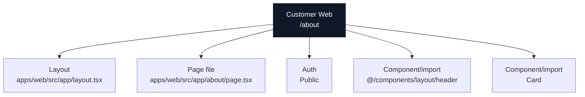

### Actual Page Information

| Field | Value |
| --- | --- |
| App | Customer Web |
| Domain | `ridendine.ca` |
| Route | `/about` |
| Status | `WIRED` |
| Auth | Public |
| Page file | [apps/web/src/app/about/page.tsx](../../../../apps/web/src/app/about/page.tsx) |
| Layout | [apps/web/src/app/layout.tsx](../../../../apps/web/src/app/layout.tsx) |
| Data source summary | @ridendine/ui |

### Data And API Wiring

| Type | Details |
| --- | --- |
| DB tables/RPCs | None detected |
| Fetch/API calls | None detected |
| Shared packages | @ridendine/ui |
| Components/imports | `@/components/layout/header`, `Card` |
| Environment vars | None detected |

### Navigation And Links

| Status | Kind | Target | Resolved app | Resolved file | Notes |
| --- | --- | --- | --- | --- | --- |
| WORKING | href | `/chef-signup` | Customer Web | [apps/web/src/app/chef-signup/page.tsx](../../../../apps/web/src/app/chef-signup/page.tsx) | href resolves to page /chef-signup |
| WORKING | href | `/chefs` | Customer Web | [apps/web/src/app/chefs/page.tsx](../../../../apps/web/src/app/chefs/page.tsx) | href resolves to page /chefs |

### API Calls From This Page

No outgoing API/fetch calls detected.

### Incoming References

| Source app | Source file | Kind | Target | Status |
| --- | --- | --- | --- | --- |
| Customer Web | [apps/web/src/app/not-found.tsx](../../../../apps/web/src/app/not-found.tsx) | href | `/about` | WORKING |
| Customer Web | [apps/web/src/app/page.tsx](../../../../apps/web/src/app/page.tsx) | href | `/about` | WORKING |
| Customer Web | [apps/web/src/components/layout/header.tsx](../../../../apps/web/src/components/layout/header.tsx) | href | `/about` | WORKING |

### Review Notes

- Static wiring scan did not flag this page, but runtime auth, DB data, and external services still need smoke/e2e proof.


---

## Customer Web: `/account/addresses`

### Page Diagram

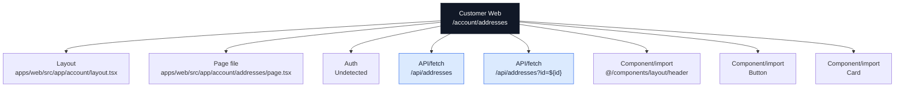

### Actual Page Information

| Field | Value |
| --- | --- |
| App | Customer Web |
| Domain | `ridendine.ca` |
| Route | `/account/addresses` |
| Status | `PARTIAL` |
| Auth | Undetected |
| Page file | [apps/web/src/app/account/addresses/page.tsx](../../../../apps/web/src/app/account/addresses/page.tsx) |
| Layout | [apps/web/src/app/account/layout.tsx](../../../../apps/web/src/app/account/layout.tsx) |
| Data source summary | @ridendine/auth, @ridendine/ui |

### Data And API Wiring

| Type | Details |
| --- | --- |
| DB tables/RPCs | None detected |
| Fetch/API calls | `/api/addresses` (DELETE, GET, PATCH, POST)<br>`/api/addresses?id=${id}` (DELETE, GET, PATCH, POST) |
| Shared packages | @ridendine/auth, @ridendine/ui |
| Components/imports | `@/components/layout/header`, `Button`, `Card` |
| Environment vars | None detected |

### Navigation And Links

| Status | Kind | Target | Resolved app | Resolved file | Notes |
| --- | --- | --- | --- | --- | --- |
| WORKING | href | `/account` | Customer Web | [apps/web/src/app/account/page.tsx](../../../../apps/web/src/app/account/page.tsx) | href resolves to page /account |

### API Calls From This Page

| Status | Kind | Target | Resolved app | Resolved file | Notes |
| --- | --- | --- | --- | --- | --- |
| WORKING | fetch | `/api/addresses` | Customer Web | [apps/web/src/app/api/addresses/route.ts](../../../../apps/web/src/app/api/addresses/route.ts) | fetch resolves to API /api/addresses |
| WORKING | fetch | `/api/addresses?id=${id}` | Customer Web | [apps/web/src/app/api/addresses/route.ts](../../../../apps/web/src/app/api/addresses/route.ts) | fetch resolves to API /api/addresses |

### Incoming References

No incoming static references detected.

### Review Notes

- Page status is PARTIAL; review auth/data/API metadata and runtime behavior.


---

## Customer Web: `/account/favorites`

### Page Diagram

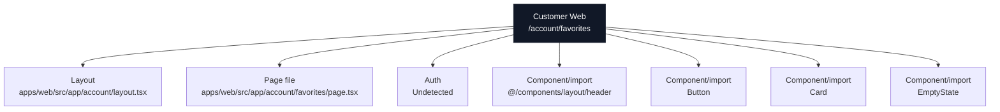

### Actual Page Information

| Field | Value |
| --- | --- |
| App | Customer Web |
| Domain | `ridendine.ca` |
| Route | `/account/favorites` |
| Status | `WIRED` |
| Auth | Undetected |
| Page file | [apps/web/src/app/account/favorites/page.tsx](../../../../apps/web/src/app/account/favorites/page.tsx) |
| Layout | [apps/web/src/app/account/layout.tsx](../../../../apps/web/src/app/account/layout.tsx) |
| Data source summary | @ridendine/auth, @ridendine/ui |

### Data And API Wiring

| Type | Details |
| --- | --- |
| DB tables/RPCs | None detected |
| Fetch/API calls | None detected |
| Shared packages | @ridendine/auth, @ridendine/ui |
| Components/imports | `@/components/layout/header`, `Button`, `Card`, `EmptyState` |
| Environment vars | None detected |

### Navigation And Links

| Status | Kind | Target | Resolved app | Resolved file | Notes |
| --- | --- | --- | --- | --- | --- |
| WORKING | href | `/account` | Customer Web | [apps/web/src/app/account/page.tsx](../../../../apps/web/src/app/account/page.tsx) | href resolves to page /account |
| WORKING | router.push | `/auth/login` | Customer Web | [apps/web/src/app/auth/login/page.tsx](../../../../apps/web/src/app/auth/login/page.tsx) | router.push resolves to page /auth/login |
| WORKING | href | `/chefs` | Customer Web | [apps/web/src/app/chefs/page.tsx](../../../../apps/web/src/app/chefs/page.tsx) | href resolves to page /chefs |

### API Calls From This Page

No outgoing API/fetch calls detected.

### Incoming References

No incoming static references detected.

### Review Notes

- Static wiring scan did not flag this page, but runtime auth, DB data, and external services still need smoke/e2e proof.


---

## Customer Web: `/account/orders`

### Page Diagram

```mermaid
flowchart TB
  Page["Customer Web<br/>/account/orders"]
  Layout["Layout<br/>apps/web/src/app/account/layout.tsx"]
  File["Page file<br/>apps/web/src/app/account/orders/page.tsx"]
  Auth["Auth<br/>Undetected"]
  Page --> Layout
  Page --> File
  Page --> Auth
  Api0["API/fetch<br/>/api/cart"]
  Page --> Api0
  Api1["API/fetch<br/>/api/orders"]
  Page --> Api1
  Api2["API/fetch<br/>/api/orders/${order.id}"]
  Page --> Api2
  Component0["Component/import<br/>@/components/layout/header"]
  Page --> Component0
  Component1["Component/import<br/>Badge"]
  Page --> Component1
  Component2["Component/import<br/>Button"]
  Page --> Component2
  Component3["Component/import<br/>Card"]
  Page --> Component3
  Component4["Component/import<br/>NoOrdersEmpty"]
  Page --> Component4
  Component5["Component/import<br/>Spinner"]
  Page --> Component5
  classDef page fill:#111827,stroke:#111827,color:#ffffff
  classDef data fill:#dcfce7,stroke:#16a34a,color:#172033
  classDef api fill:#dbeafe,stroke:#2563eb,color:#172033
  classDef warn fill:#fef3c7,stroke:#f59e0b,color:#172033
  class Page page
  class Api0,Api1,Api2 api
```

### Actual Page Information

| Field | Value |
| --- | --- |
| App | Customer Web |
| Domain | `ridendine.ca` |
| Route | `/account/orders` |
| Status | `PARTIAL` |
| Auth | Undetected |
| Page file | [apps/web/src/app/account/orders/page.tsx](../../../../apps/web/src/app/account/orders/page.tsx) |
| Layout | [apps/web/src/app/account/layout.tsx](../../../../apps/web/src/app/account/layout.tsx) |
| Data source summary | @ridendine/auth, @ridendine/ui |

### Data And API Wiring

| Type | Details |
| --- | --- |
| DB tables/RPCs | None detected |
| Fetch/API calls | `/api/cart` (DELETE, GET, PATCH, POST)<br>`/api/orders` (GET)<br>`/api/orders/${order.id}` (GET, PATCH) |
| Shared packages | @ridendine/auth, @ridendine/ui |
| Components/imports | `@/components/layout/header`, `Badge`, `Button`, `Card`, `NoOrdersEmpty`, `Spinner` |
| Environment vars | None detected |

### Navigation And Links

| Status | Kind | Target | Resolved app | Resolved file | Notes |
| --- | --- | --- | --- | --- | --- |
| WORKING | href | `/account` | Customer Web | [apps/web/src/app/account/page.tsx](../../../../apps/web/src/app/account/page.tsx) | href resolves to page /account |
| WORKING | router.push | `/checkout?storefrontId=${order.storefront.id}` | Customer Web | [apps/web/src/app/checkout/page.tsx](../../../../apps/web/src/app/checkout/page.tsx) | router.push resolves to page /checkout |
| WORKING_DYNAMIC | href | `/chefs/${order.storefront.slug}` | Customer Web | [apps/web/src/app/chefs/[slug]/page.tsx](../../../../apps/web/src/app/chefs/[slug]/page.tsx) | href resolves to page /chefs/:slug |

### API Calls From This Page

| Status | Kind | Target | Resolved app | Resolved file | Notes |
| --- | --- | --- | --- | --- | --- |
| WORKING | fetch | `/api/cart` | Customer Web | [apps/web/src/app/api/cart/route.ts](../../../../apps/web/src/app/api/cart/route.ts) | fetch resolves to API /api/cart |
| WORKING | fetch | `/api/orders` | Customer Web | [apps/web/src/app/api/orders/route.ts](../../../../apps/web/src/app/api/orders/route.ts) | fetch resolves to API /api/orders |
| WORKING_DYNAMIC | fetch | `/api/orders/${order.id}` | Customer Web | [apps/web/src/app/api/orders/[id]/route.ts](../../../../apps/web/src/app/api/orders/[id]/route.ts) | fetch resolves to API /api/orders/:id |

### Incoming References

| Source app | Source file | Kind | Target | Status |
| --- | --- | --- | --- | --- |
| Customer Web | [apps/web/src/app/page.tsx](../../../../apps/web/src/app/page.tsx) | href | `/account/orders` | WORKING |

### Review Notes

- Page status is PARTIAL; review auth/data/API metadata and runtime behavior.


---

## Customer Web: `/account`

### Page Diagram

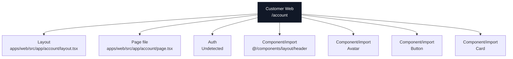

### Actual Page Information

| Field | Value |
| --- | --- |
| App | Customer Web |
| Domain | `ridendine.ca` |
| Route | `/account` |
| Status | `WIRED` |
| Auth | Undetected |
| Page file | [apps/web/src/app/account/page.tsx](../../../../apps/web/src/app/account/page.tsx) |
| Layout | [apps/web/src/app/account/layout.tsx](../../../../apps/web/src/app/account/layout.tsx) |
| Data source summary | @ridendine/auth, @ridendine/ui |

### Data And API Wiring

| Type | Details |
| --- | --- |
| DB tables/RPCs | None detected |
| Fetch/API calls | None detected |
| Shared packages | @ridendine/auth, @ridendine/ui |
| Components/imports | `@/components/layout/header`, `Avatar`, `Button`, `Card` |
| Environment vars | None detected |

### Navigation And Links

| Status | Kind | Target | Resolved app | Resolved file | Notes |
| --- | --- | --- | --- | --- | --- |
| WORKING | router.push | `/` | Customer Web | [apps/web/src/app/page.tsx](../../../../apps/web/src/app/page.tsx) | router.push resolves to page / |
| WORKING | router.push | `/auth/login` | Customer Web | [apps/web/src/app/auth/login/page.tsx](../../../../apps/web/src/app/auth/login/page.tsx) | router.push resolves to page /auth/login |

### API Calls From This Page

No outgoing API/fetch calls detected.

### Incoming References

| Source app | Source file | Kind | Target | Status |
| --- | --- | --- | --- | --- |
| Customer Web | [apps/web/src/app/account/addresses/page.tsx](../../../../apps/web/src/app/account/addresses/page.tsx) | href | `/account` | WORKING |
| Customer Web | [apps/web/src/app/account/favorites/page.tsx](../../../../apps/web/src/app/account/favorites/page.tsx) | href | `/account` | WORKING |
| Customer Web | [apps/web/src/app/account/orders/page.tsx](../../../../apps/web/src/app/account/orders/page.tsx) | href | `/account` | WORKING |
| Customer Web | [apps/web/src/app/account/settings/page.tsx](../../../../apps/web/src/app/account/settings/page.tsx) | href | `/account` | WORKING |
| Customer Web | [apps/web/src/components/layout/header.tsx](../../../../apps/web/src/components/layout/header.tsx) | href | `/account` | WORKING |

### Review Notes

- Static wiring scan did not flag this page, but runtime auth, DB data, and external services still need smoke/e2e proof.


---

## Customer Web: `/account/settings`

### Page Diagram

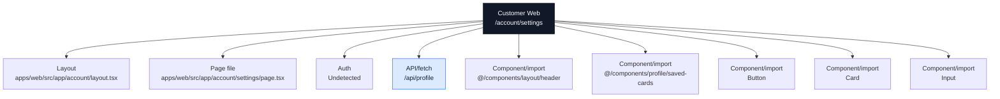

### Actual Page Information

| Field | Value |
| --- | --- |
| App | Customer Web |
| Domain | `ridendine.ca` |
| Route | `/account/settings` |
| Status | `PARTIAL` |
| Auth | Undetected |
| Page file | [apps/web/src/app/account/settings/page.tsx](../../../../apps/web/src/app/account/settings/page.tsx) |
| Layout | [apps/web/src/app/account/layout.tsx](../../../../apps/web/src/app/account/layout.tsx) |
| Data source summary | @ridendine/auth, @ridendine/ui |

### Data And API Wiring

| Type | Details |
| --- | --- |
| DB tables/RPCs | None detected |
| Fetch/API calls | `/api/profile` (GET, PATCH) |
| Shared packages | @ridendine/auth, @ridendine/ui |
| Components/imports | `@/components/layout/header`, `@/components/profile/saved-cards`, `Button`, `Card`, `Input` |
| Environment vars | None detected |

### Navigation And Links

| Status | Kind | Target | Resolved app | Resolved file | Notes |
| --- | --- | --- | --- | --- | --- |
| WORKING | href | `/account` | Customer Web | [apps/web/src/app/account/page.tsx](../../../../apps/web/src/app/account/page.tsx) | href resolves to page /account |
| WORKING | href | `/auth/forgot-password` | Customer Web | [apps/web/src/app/auth/forgot-password/page.tsx](../../../../apps/web/src/app/auth/forgot-password/page.tsx) | href resolves to page /auth/forgot-password |
| WORKING | router.push | `/auth/login` | Customer Web | [apps/web/src/app/auth/login/page.tsx](../../../../apps/web/src/app/auth/login/page.tsx) | router.push resolves to page /auth/login |
| WORKING | href | `/privacy` | Customer Web | [apps/web/src/app/privacy/page.tsx](../../../../apps/web/src/app/privacy/page.tsx) | href resolves to page /privacy |
| WORKING | href | `/terms` | Customer Web | [apps/web/src/app/terms/page.tsx](../../../../apps/web/src/app/terms/page.tsx) | href resolves to page /terms |

### API Calls From This Page

| Status | Kind | Target | Resolved app | Resolved file | Notes |
| --- | --- | --- | --- | --- | --- |
| WORKING | fetch | `/api/profile` | Customer Web | [apps/web/src/app/api/profile/route.ts](../../../../apps/web/src/app/api/profile/route.ts) | fetch resolves to API /api/profile |

### Incoming References

No incoming static references detected.

### Review Notes

- Page status is PARTIAL; review auth/data/API metadata and runtime behavior.


---

## Customer Web: `/auth/forgot-password`

### Page Diagram

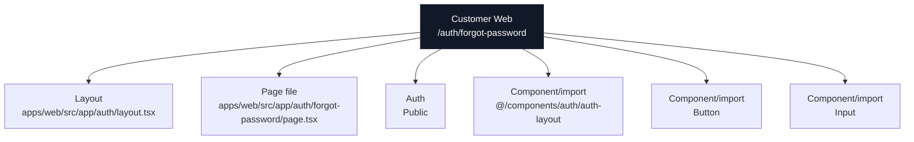

### Actual Page Information

| Field | Value |
| --- | --- |
| App | Customer Web |
| Domain | `ridendine.ca` |
| Route | `/auth/forgot-password` |
| Status | `PARTIAL` |
| Auth | Public |
| Page file | [apps/web/src/app/auth/forgot-password/page.tsx](../../../../apps/web/src/app/auth/forgot-password/page.tsx) |
| Layout | [apps/web/src/app/auth/layout.tsx](../../../../apps/web/src/app/auth/layout.tsx) |
| Data source summary | @ridendine/auth, @ridendine/ui |

### Data And API Wiring

| Type | Details |
| --- | --- |
| DB tables/RPCs | None detected |
| Fetch/API calls | None detected |
| Shared packages | @ridendine/auth, @ridendine/ui |
| Components/imports | `@/components/auth/auth-layout`, `Button`, `Input` |
| Environment vars | None detected |

### Navigation And Links

| Status | Kind | Target | Resolved app | Resolved file | Notes |
| --- | --- | --- | --- | --- | --- |
| WORKING | href | `/auth/login` | Customer Web | [apps/web/src/app/auth/login/page.tsx](../../../../apps/web/src/app/auth/login/page.tsx) | href resolves to page /auth/login |
| WORKING | href | `/auth/signup` | Customer Web | [apps/web/src/app/auth/signup/page.tsx](../../../../apps/web/src/app/auth/signup/page.tsx) | href resolves to page /auth/signup |

### API Calls From This Page

No outgoing API/fetch calls detected.

### Incoming References

| Source app | Source file | Kind | Target | Status |
| --- | --- | --- | --- | --- |
| Customer Web | [apps/web/src/app/account/settings/page.tsx](../../../../apps/web/src/app/account/settings/page.tsx) | href | `/auth/forgot-password` | WORKING |
| Customer Web | [apps/web/src/app/auth/login/page.tsx](../../../../apps/web/src/app/auth/login/page.tsx) | href | `/auth/forgot-password` | WORKING |

### Review Notes

- Page status is PARTIAL; review auth/data/API metadata and runtime behavior.


---

## Customer Web: `/auth/login`

### Page Diagram

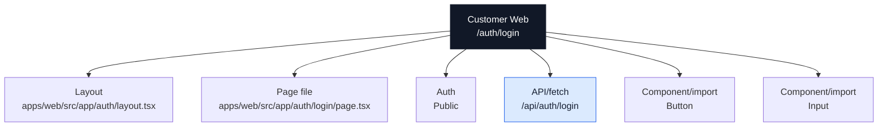

### Actual Page Information

| Field | Value |
| --- | --- |
| App | Customer Web |
| Domain | `ridendine.ca` |
| Route | `/auth/login` |
| Status | `PARTIAL` |
| Auth | Public |
| Page file | [apps/web/src/app/auth/login/page.tsx](../../../../apps/web/src/app/auth/login/page.tsx) |
| Layout | [apps/web/src/app/auth/layout.tsx](../../../../apps/web/src/app/auth/layout.tsx) |
| Data source summary | @ridendine/ui |

### Data And API Wiring

| Type | Details |
| --- | --- |
| DB tables/RPCs | None detected |
| Fetch/API calls | `/api/auth/login` (POST) |
| Shared packages | @ridendine/ui |
| Components/imports | `Button`, `Input` |
| Environment vars | None detected |

### Navigation And Links

| Status | Kind | Target | Resolved app | Resolved file | Notes |
| --- | --- | --- | --- | --- | --- |
| WORKING | href | `/auth/forgot-password` | Customer Web | [apps/web/src/app/auth/forgot-password/page.tsx](../../../../apps/web/src/app/auth/forgot-password/page.tsx) | href resolves to page /auth/forgot-password |
| WORKING | href | `/auth/signup` | Customer Web | [apps/web/src/app/auth/signup/page.tsx](../../../../apps/web/src/app/auth/signup/page.tsx) | href resolves to page /auth/signup |

### API Calls From This Page

| Status | Kind | Target | Resolved app | Resolved file | Notes |
| --- | --- | --- | --- | --- | --- |
| WORKING | fetch | `/api/auth/login` | Customer Web | [apps/web/src/app/api/auth/login/route.ts](../../../../apps/web/src/app/api/auth/login/route.ts) | fetch resolves to API /api/auth/login |

### Incoming References

| Source app | Source file | Kind | Target | Status |
| --- | --- | --- | --- | --- |
| Customer Web | [apps/web/src/app/account/favorites/page.tsx](../../../../apps/web/src/app/account/favorites/page.tsx) | router.push | `/auth/login` | WORKING |
| Customer Web | [apps/web/src/app/account/page.tsx](../../../../apps/web/src/app/account/page.tsx) | router.push | `/auth/login` | WORKING |
| Customer Web | [apps/web/src/app/account/settings/page.tsx](../../../../apps/web/src/app/account/settings/page.tsx) | router.push | `/auth/login` | WORKING |
| Customer Web | [apps/web/src/app/auth/forgot-password/page.tsx](../../../../apps/web/src/app/auth/forgot-password/page.tsx) | href | `/auth/login` | WORKING |
| Customer Web | [apps/web/src/app/auth/signup/page.tsx](../../../../apps/web/src/app/auth/signup/page.tsx) | href | `/auth/login` | WORKING |
| Customer Web | [apps/web/src/app/checkout/page.tsx](../../../../apps/web/src/app/checkout/page.tsx) | router.push | `/auth/login` | WORKING |
| Customer Web | [apps/web/src/app/chef-resources/page.tsx](../../../../apps/web/src/app/chef-resources/page.tsx) | href | `/auth/login` | WORKING |
| Customer Web | [apps/web/src/app/chef-signup/page.tsx](../../../../apps/web/src/app/chef-signup/page.tsx) | href | `/auth/login` | WORKING |
| Customer Web | [apps/web/src/app/orders/[id]/confirmation/page.tsx](../../../../apps/web/src/app/orders/[id]/confirmation/page.tsx) | redirect | `/auth/login` | WORKING |
| Customer Web | [apps/web/src/components/layout/header.tsx](../../../../apps/web/src/components/layout/header.tsx) | href | `/auth/login` | WORKING |

### Review Notes

- Page status is PARTIAL; review auth/data/API metadata and runtime behavior.


---

## Customer Web: `/auth/signup`

### Page Diagram

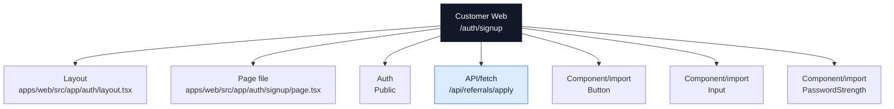

### Actual Page Information

| Field | Value |
| --- | --- |
| App | Customer Web |
| Domain | `ridendine.ca` |
| Route | `/auth/signup` |
| Status | `PARTIAL` |
| Auth | Public |
| Page file | [apps/web/src/app/auth/signup/page.tsx](../../../../apps/web/src/app/auth/signup/page.tsx) |
| Layout | [apps/web/src/app/auth/layout.tsx](../../../../apps/web/src/app/auth/layout.tsx) |
| Data source summary | @ridendine/auth, @ridendine/ui |

### Data And API Wiring

| Type | Details |
| --- | --- |
| DB tables/RPCs | None detected |
| Fetch/API calls | `/api/referrals/apply` (POST) |
| Shared packages | @ridendine/auth, @ridendine/ui |
| Components/imports | `Button`, `Input`, `PasswordStrength` |
| Environment vars | None detected |

### Navigation And Links

| Status | Kind | Target | Resolved app | Resolved file | Notes |
| --- | --- | --- | --- | --- | --- |
| WORKING | href | `/auth/login` | Customer Web | [apps/web/src/app/auth/login/page.tsx](../../../../apps/web/src/app/auth/login/page.tsx) | href resolves to page /auth/login |
| WORKING | router.push | `/chefs` | Customer Web | [apps/web/src/app/chefs/page.tsx](../../../../apps/web/src/app/chefs/page.tsx) | router.push resolves to page /chefs |
| WORKING | href | `/privacy` | Customer Web | [apps/web/src/app/privacy/page.tsx](../../../../apps/web/src/app/privacy/page.tsx) | href resolves to page /privacy |
| WORKING | href | `/terms` | Customer Web | [apps/web/src/app/terms/page.tsx](../../../../apps/web/src/app/terms/page.tsx) | href resolves to page /terms |

### API Calls From This Page

| Status | Kind | Target | Resolved app | Resolved file | Notes |
| --- | --- | --- | --- | --- | --- |
| WORKING | fetch | `/api/referrals/apply` | Customer Web | [apps/web/src/app/api/referrals/apply/route.ts](../../../../apps/web/src/app/api/referrals/apply/route.ts) | fetch resolves to API /api/referrals/apply |

### Incoming References

| Source app | Source file | Kind | Target | Status |
| --- | --- | --- | --- | --- |
| Customer Web | [apps/web/src/app/auth/forgot-password/page.tsx](../../../../apps/web/src/app/auth/forgot-password/page.tsx) | href | `/auth/signup` | WORKING |
| Customer Web | [apps/web/src/app/auth/login/page.tsx](../../../../apps/web/src/app/auth/login/page.tsx) | href | `/auth/signup` | WORKING |
| Customer Web | [apps/web/src/app/how-it-works/page.tsx](../../../../apps/web/src/app/how-it-works/page.tsx) | href | `/auth/signup` | WORKING |
| Customer Web | [apps/web/src/app/page.tsx](../../../../apps/web/src/app/page.tsx) | href | `/auth/signup?role=chef` | WORKING |
| Customer Web | [apps/web/src/components/layout/header.tsx](../../../../apps/web/src/components/layout/header.tsx) | href | `/auth/signup` | WORKING |

### Review Notes

- Page status is PARTIAL; review auth/data/API metadata and runtime behavior.


---

## Customer Web: `/cart`

### Page Diagram

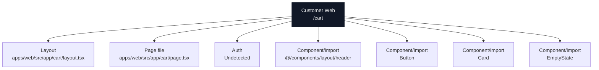

### Actual Page Information

| Field | Value |
| --- | --- |
| App | Customer Web |
| Domain | `ridendine.ca` |
| Route | `/cart` |
| Status | `WIRED` |
| Auth | Undetected |
| Page file | [apps/web/src/app/cart/page.tsx](../../../../apps/web/src/app/cart/page.tsx) |
| Layout | [apps/web/src/app/cart/layout.tsx](../../../../apps/web/src/app/cart/layout.tsx) |
| Data source summary | @ridendine/ui |

### Data And API Wiring

| Type | Details |
| --- | --- |
| DB tables/RPCs | None detected |
| Fetch/API calls | None detected |
| Shared packages | @ridendine/ui |
| Components/imports | `@/components/layout/header`, `Button`, `Card`, `EmptyState` |
| Environment vars | None detected |

### Navigation And Links

| Status | Kind | Target | Resolved app | Resolved file | Notes |
| --- | --- | --- | --- | --- | --- |
| WORKING | href | `/checkout?storefrontId=${cart?.storefront_id}` | Customer Web | [apps/web/src/app/checkout/page.tsx](../../../../apps/web/src/app/checkout/page.tsx) | href resolves to page /checkout |
| WORKING | href | `/chefs` | Customer Web | [apps/web/src/app/chefs/page.tsx](../../../../apps/web/src/app/chefs/page.tsx) | href resolves to page /chefs |

### API Calls From This Page

No outgoing API/fetch calls detected.

### Incoming References

| Source app | Source file | Kind | Target | Status |
| --- | --- | --- | --- | --- |
| Customer Web | [apps/web/src/components/layout/header.tsx](../../../../apps/web/src/components/layout/header.tsx) | href | `/cart` | WORKING |
| Customer Web | [apps/web/src/components/storefront/storefront-menu.tsx](../../../../apps/web/src/components/storefront/storefront-menu.tsx) | href | `/cart?storefrontId=${storefrontId}` | WORKING |

### Review Notes

- Static wiring scan did not flag this page, but runtime auth, DB data, and external services still need smoke/e2e proof.


---

## Customer Web: `/checkout`

### Page Diagram

```mermaid
flowchart TB
  Page["Customer Web<br/>/checkout"]
  Layout["Layout<br/>apps/web/src/app/layout.tsx"]
  File["Page file<br/>apps/web/src/app/checkout/page.tsx"]
  Auth["Auth<br/>Undetected"]
  Page --> Layout
  Page --> File
  Page --> Auth
  Api0["API/fetch<br/>/api/addresses"]
  Page --> Api0
  Api1["API/fetch<br/>/api/cart?storefrontId=${storefrontId}"]
  Page --> Api1
  Api2["API/fetch<br/>/api/checkout"]
  Page --> Api2
  Component0["Component/import<br/>@/components/checkout/checkout-skeleton"]
  Page --> Component0
  Component1["Component/import<br/>@/components/checkout/delivery-time-picker"]
  Page --> Component1
  Component2["Component/import<br/>@/components/checkout/saved-card-selector"]
  Page --> Component2
  Component3["Component/import<br/>@/components/checkout/stripe-payment-form"]
  Page --> Component3
  Component4["Component/import<br/>@/components/layout/header"]
  Page --> Component4
  Component5["Component/import<br/>Button"]
  Page --> Component5
  classDef page fill:#111827,stroke:#111827,color:#ffffff
  classDef data fill:#dcfce7,stroke:#16a34a,color:#172033
  classDef api fill:#dbeafe,stroke:#2563eb,color:#172033
  classDef warn fill:#fef3c7,stroke:#f59e0b,color:#172033
  class Page page
  class Api0,Api1,Api2 api
```

### Actual Page Information

| Field | Value |
| --- | --- |
| App | Customer Web |
| Domain | `ridendine.ca` |
| Route | `/checkout` |
| Status | `PARTIAL` |
| Auth | Undetected |
| Page file | [apps/web/src/app/checkout/page.tsx](../../../../apps/web/src/app/checkout/page.tsx) |
| Layout | [apps/web/src/app/layout.tsx](../../../../apps/web/src/app/layout.tsx) |
| Data source summary | @ridendine/ui |

### Data And API Wiring

| Type | Details |
| --- | --- |
| DB tables/RPCs | None detected |
| Fetch/API calls | `/api/addresses` (DELETE, GET, PATCH, POST)<br>`/api/cart?storefrontId=${storefrontId}` (DELETE, GET, PATCH, POST)<br>`/api/checkout` (POST) |
| Shared packages | @ridendine/ui |
| Components/imports | `@/components/checkout/checkout-skeleton`, `@/components/checkout/delivery-time-picker`, `@/components/checkout/saved-card-selector`, `@/components/checkout/stripe-payment-form`, `@/components/layout/header`, `Button`, `Card`, `Input` |
| Environment vars | `NEXT_PUBLIC_STRIPE_PUBLISHABLE_KEY` |

### Navigation And Links

| Status | Kind | Target | Resolved app | Resolved file | Notes |
| --- | --- | --- | --- | --- | --- |
| WORKING | router.push | `/auth/login` | Customer Web | [apps/web/src/app/auth/login/page.tsx](../../../../apps/web/src/app/auth/login/page.tsx) | router.push resolves to page /auth/login |
| WORKING | href | `/chefs` | Customer Web | [apps/web/src/app/chefs/page.tsx](../../../../apps/web/src/app/chefs/page.tsx) | href resolves to page /chefs |

### API Calls From This Page

| Status | Kind | Target | Resolved app | Resolved file | Notes |
| --- | --- | --- | --- | --- | --- |
| WORKING | fetch | `/api/addresses` | Customer Web | [apps/web/src/app/api/addresses/route.ts](../../../../apps/web/src/app/api/addresses/route.ts) | fetch resolves to API /api/addresses |
| WORKING | fetch | `/api/cart?storefrontId=${storefrontId}` | Customer Web | [apps/web/src/app/api/cart/route.ts](../../../../apps/web/src/app/api/cart/route.ts) | fetch resolves to API /api/cart |
| WORKING | fetch | `/api/checkout` | Customer Web | [apps/web/src/app/api/checkout/route.ts](../../../../apps/web/src/app/api/checkout/route.ts) | fetch resolves to API /api/checkout |

### Incoming References

| Source app | Source file | Kind | Target | Status |
| --- | --- | --- | --- | --- |
| Customer Web | [apps/web/src/app/account/orders/page.tsx](../../../../apps/web/src/app/account/orders/page.tsx) | router.push | `/checkout?storefrontId=${order.storefront.id}` | WORKING |
| Customer Web | [apps/web/src/app/cart/page.tsx](../../../../apps/web/src/app/cart/page.tsx) | href | `/checkout?storefrontId=${cart?.storefront_id}` | WORKING |
| Customer Web | [apps/web/src/components/storefront/storefront-menu.tsx](../../../../apps/web/src/components/storefront/storefront-menu.tsx) | href | `/checkout?storefrontId=${storefrontId}` | WORKING |

### Review Notes

- Page status is PARTIAL; review auth/data/API metadata and runtime behavior.


---

## Customer Web: `/chef-resources`

### Page Diagram

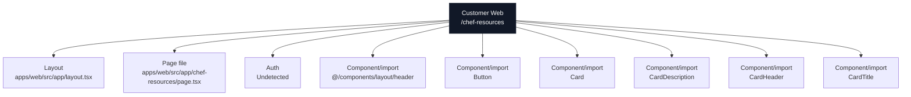

### Actual Page Information

| Field | Value |
| --- | --- |
| App | Customer Web |
| Domain | `ridendine.ca` |
| Route | `/chef-resources` |
| Status | `WIRED` |
| Auth | Undetected |
| Page file | [apps/web/src/app/chef-resources/page.tsx](../../../../apps/web/src/app/chef-resources/page.tsx) |
| Layout | [apps/web/src/app/layout.tsx](../../../../apps/web/src/app/layout.tsx) |
| Data source summary | @ridendine/ui |

### Data And API Wiring

| Type | Details |
| --- | --- |
| DB tables/RPCs | None detected |
| Fetch/API calls | None detected |
| Shared packages | @ridendine/ui |
| Components/imports | `@/components/layout/header`, `Button`, `Card`, `CardDescription`, `CardHeader`, `CardTitle` |
| Environment vars | None detected |

### Navigation And Links

| Status | Kind | Target | Resolved app | Resolved file | Notes |
| --- | --- | --- | --- | --- | --- |
| WORKING | href | `/auth/login` | Customer Web | [apps/web/src/app/auth/login/page.tsx](../../../../apps/web/src/app/auth/login/page.tsx) | href resolves to page /auth/login |
| WORKING | href | `/chef-signup` | Customer Web | [apps/web/src/app/chef-signup/page.tsx](../../../../apps/web/src/app/chef-signup/page.tsx) | href resolves to page /chef-signup |
| WORKING | href | `/contact` | Customer Web | [apps/web/src/app/contact/page.tsx](../../../../apps/web/src/app/contact/page.tsx) | href resolves to page /contact |

### API Calls From This Page

No outgoing API/fetch calls detected.

### Incoming References

| Source app | Source file | Kind | Target | Status |
| --- | --- | --- | --- | --- |
| Customer Web | [apps/web/src/app/chef-signup/page.tsx](../../../../apps/web/src/app/chef-signup/page.tsx) | href | `/chef-resources` | WORKING |
| Customer Web | [apps/web/src/app/page.tsx](../../../../apps/web/src/app/page.tsx) | href | `/chef-resources` | WORKING |

### Review Notes

- Static wiring scan did not flag this page, but runtime auth, DB data, and external services still need smoke/e2e proof.


---

## Customer Web: `/chef-signup`

### Page Diagram

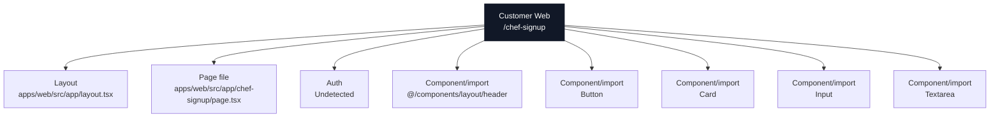

### Actual Page Information

| Field | Value |
| --- | --- |
| App | Customer Web |
| Domain | `ridendine.ca` |
| Route | `/chef-signup` |
| Status | `PARTIAL` |
| Auth | Undetected |
| Page file | [apps/web/src/app/chef-signup/page.tsx](../../../../apps/web/src/app/chef-signup/page.tsx) |
| Layout | [apps/web/src/app/layout.tsx](../../../../apps/web/src/app/layout.tsx) |
| Data source summary | @ridendine/ui |

### Data And API Wiring

| Type | Details |
| --- | --- |
| DB tables/RPCs | None detected |
| Fetch/API calls | None detected |
| Shared packages | @ridendine/ui |
| Components/imports | `@/components/layout/header`, `Button`, `Card`, `Input`, `Textarea` |
| Environment vars | `NEXT_PUBLIC_CHEF_ADMIN_URL` |

### Navigation And Links

| Status | Kind | Target | Resolved app | Resolved file | Notes |
| --- | --- | --- | --- | --- | --- |
| WORKING | href | `/` | Customer Web | [apps/web/src/app/page.tsx](../../../../apps/web/src/app/page.tsx) | href resolves to page / |
| WORKING | href | `/auth/login` | Customer Web | [apps/web/src/app/auth/login/page.tsx](../../../../apps/web/src/app/auth/login/page.tsx) | href resolves to page /auth/login |
| WORKING | href | `/chef-resources` | Customer Web | [apps/web/src/app/chef-resources/page.tsx](../../../../apps/web/src/app/chef-resources/page.tsx) | href resolves to page /chef-resources |

### API Calls From This Page

No outgoing API/fetch calls detected.

### Incoming References

| Source app | Source file | Kind | Target | Status |
| --- | --- | --- | --- | --- |
| Customer Web | [apps/web/src/app/about/page.tsx](../../../../apps/web/src/app/about/page.tsx) | href | `/chef-signup` | WORKING |
| Customer Web | [apps/web/src/app/chef-resources/page.tsx](../../../../apps/web/src/app/chef-resources/page.tsx) | href | `/chef-signup` | WORKING |
| Customer Web | [apps/web/src/app/page.tsx](../../../../apps/web/src/app/page.tsx) | href | `/chef-signup` | WORKING |
| Customer Web | [apps/web/src/components/home/featured-chefs.tsx](../../../../apps/web/src/components/home/featured-chefs.tsx) | href | `/chef-signup` | WORKING |

### Review Notes

- Page status is PARTIAL; review auth/data/API metadata and runtime behavior.


---

## Customer Web: `/chefs/:slug`

### Page Diagram

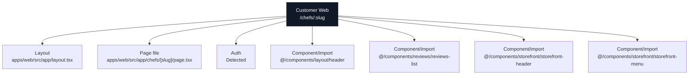

### Actual Page Information

| Field | Value |
| --- | --- |
| App | Customer Web |
| Domain | `ridendine.ca` |
| Route | `/chefs/:slug` |
| Status | `WIRED` |
| Auth | Detected |
| Page file | [apps/web/src/app/chefs/[slug]/page.tsx](../../../../apps/web/src/app/chefs/[slug]/page.tsx) |
| Layout | [apps/web/src/app/layout.tsx](../../../../apps/web/src/app/layout.tsx) |
| Data source summary | @ridendine/db |

### Data And API Wiring

| Type | Details |
| --- | --- |
| DB tables/RPCs | None detected |
| Fetch/API calls | None detected |
| Shared packages | @ridendine/db |
| Components/imports | `@/components/layout/header`, `@/components/reviews/reviews-list`, `@/components/storefront/storefront-header`, `@/components/storefront/storefront-menu` |
| Environment vars | `NEXT_PUBLIC_APP_URL` |

### Navigation And Links

No outgoing page-navigation links detected.

### API Calls From This Page

No outgoing API/fetch calls detected.

### Incoming References

| Source app | Source file | Kind | Target | Status |
| --- | --- | --- | --- | --- |
| Customer Web | [apps/web/src/app/account/orders/page.tsx](../../../../apps/web/src/app/account/orders/page.tsx) | href | `/chefs/${order.storefront.slug}` | WORKING_DYNAMIC |
| Customer Web | [apps/web/src/components/chefs/chefs-list.tsx](../../../../apps/web/src/components/chefs/chefs-list.tsx) | href | `/chefs/${chef.slug}` | WORKING_DYNAMIC |
| Customer Web | [apps/web/src/components/home/featured-chefs.tsx](../../../../apps/web/src/components/home/featured-chefs.tsx) | href | `/chefs/${chef.slug}` | WORKING_DYNAMIC |

### Review Notes

- Static wiring scan did not flag this page, but runtime auth, DB data, and external services still need smoke/e2e proof.


---

## Customer Web: `/chefs`

### Page Diagram

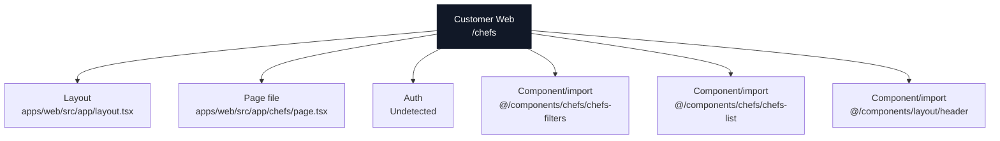

### Actual Page Information

| Field | Value |
| --- | --- |
| App | Customer Web |
| Domain | `ridendine.ca` |
| Route | `/chefs` |
| Status | `WIRED` |
| Auth | Undetected |
| Page file | [apps/web/src/app/chefs/page.tsx](../../../../apps/web/src/app/chefs/page.tsx) |
| Layout | [apps/web/src/app/layout.tsx](../../../../apps/web/src/app/layout.tsx) |
| Data source summary | Static/client component/undetected |

### Data And API Wiring

| Type | Details |
| --- | --- |
| DB tables/RPCs | None detected |
| Fetch/API calls | None detected |
| Shared packages | None detected |
| Components/imports | `@/components/chefs/chefs-filters`, `@/components/chefs/chefs-list`, `@/components/layout/header` |
| Environment vars | None detected |

### Navigation And Links

No outgoing page-navigation links detected.

### API Calls From This Page

No outgoing API/fetch calls detected.

### Incoming References

| Source app | Source file | Kind | Target | Status |
| --- | --- | --- | --- | --- |
| Customer Web | [apps/web/src/app/about/page.tsx](../../../../apps/web/src/app/about/page.tsx) | href | `/chefs` | WORKING |
| Customer Web | [apps/web/src/app/account/favorites/page.tsx](../../../../apps/web/src/app/account/favorites/page.tsx) | href | `/chefs` | WORKING |
| Customer Web | [apps/web/src/app/auth/signup/page.tsx](../../../../apps/web/src/app/auth/signup/page.tsx) | router.push | `/chefs` | WORKING |
| Customer Web | [apps/web/src/app/cart/page.tsx](../../../../apps/web/src/app/cart/page.tsx) | href | `/chefs` | WORKING |
| Customer Web | [apps/web/src/app/checkout/page.tsx](../../../../apps/web/src/app/checkout/page.tsx) | href | `/chefs` | WORKING |
| Customer Web | [apps/web/src/app/how-it-works/page.tsx](../../../../apps/web/src/app/how-it-works/page.tsx) | href | `/chefs` | WORKING |
| Customer Web | [apps/web/src/app/not-found.tsx](../../../../apps/web/src/app/not-found.tsx) | href | `/chefs` | WORKING |
| Customer Web | [apps/web/src/app/orders/[id]/confirmation/page.tsx](../../../../apps/web/src/app/orders/[id]/confirmation/page.tsx) | href | `/chefs` | WORKING |
| Customer Web | [apps/web/src/app/page.tsx](../../../../apps/web/src/app/page.tsx) | href | `/chefs` | WORKING |
| Customer Web | [apps/web/src/components/chefs/chefs-filters.tsx](../../../../apps/web/src/components/chefs/chefs-filters.tsx) | router.push | `/chefs` | WORKING |
| Customer Web | [apps/web/src/components/chefs/chefs-filters.tsx](../../../../apps/web/src/components/chefs/chefs-filters.tsx) | router.push | `/chefs?${params.toString()}` | WORKING |
| Customer Web | [apps/web/src/components/chefs/chefs-list.tsx](../../../../apps/web/src/components/chefs/chefs-list.tsx) | href | `/chefs` | WORKING |
| Customer Web | [apps/web/src/components/layout/header.tsx](../../../../apps/web/src/components/layout/header.tsx) | href | `/chefs` | WORKING |

### Review Notes

- Static wiring scan did not flag this page, but runtime auth, DB data, and external services still need smoke/e2e proof.


---

## Customer Web: `/contact`

### Page Diagram

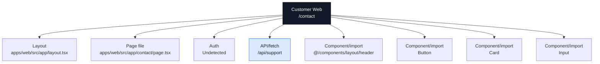

### Actual Page Information

| Field | Value |
| --- | --- |
| App | Customer Web |
| Domain | `ridendine.ca` |
| Route | `/contact` |
| Status | `PARTIAL` |
| Auth | Undetected |
| Page file | [apps/web/src/app/contact/page.tsx](../../../../apps/web/src/app/contact/page.tsx) |
| Layout | [apps/web/src/app/layout.tsx](../../../../apps/web/src/app/layout.tsx) |
| Data source summary | @ridendine/ui |

### Data And API Wiring

| Type | Details |
| --- | --- |
| DB tables/RPCs | None detected |
| Fetch/API calls | `/api/support` (GET, POST) |
| Shared packages | @ridendine/ui |
| Components/imports | `@/components/layout/header`, `Button`, `Card`, `Input` |
| Environment vars | None detected |

### Navigation And Links

No outgoing page-navigation links detected.

### API Calls From This Page

| Status | Kind | Target | Resolved app | Resolved file | Notes |
| --- | --- | --- | --- | --- | --- |
| WORKING | fetch | `/api/support` | Customer Web | [apps/web/src/app/api/support/route.ts](../../../../apps/web/src/app/api/support/route.ts) | fetch resolves to API /api/support |

### Incoming References

| Source app | Source file | Kind | Target | Status |
| --- | --- | --- | --- | --- |
| Customer Web | [apps/web/src/app/chef-resources/page.tsx](../../../../apps/web/src/app/chef-resources/page.tsx) | href | `/contact` | WORKING |
| Customer Web | [apps/web/src/app/not-found.tsx](../../../../apps/web/src/app/not-found.tsx) | href | `/contact` | WORKING |
| Customer Web | [apps/web/src/app/page.tsx](../../../../apps/web/src/app/page.tsx) | href | `/contact` | WORKING |

### Review Notes

- Page status is PARTIAL; review auth/data/API metadata and runtime behavior.


---

## Customer Web: `/how-it-works`

### Page Diagram

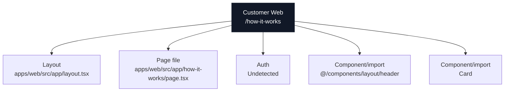

### Actual Page Information

| Field | Value |
| --- | --- |
| App | Customer Web |
| Domain | `ridendine.ca` |
| Route | `/how-it-works` |
| Status | `WIRED` |
| Auth | Undetected |
| Page file | [apps/web/src/app/how-it-works/page.tsx](../../../../apps/web/src/app/how-it-works/page.tsx) |
| Layout | [apps/web/src/app/layout.tsx](../../../../apps/web/src/app/layout.tsx) |
| Data source summary | @ridendine/ui |

### Data And API Wiring

| Type | Details |
| --- | --- |
| DB tables/RPCs | None detected |
| Fetch/API calls | None detected |
| Shared packages | @ridendine/ui |
| Components/imports | `@/components/layout/header`, `Card` |
| Environment vars | None detected |

### Navigation And Links

| Status | Kind | Target | Resolved app | Resolved file | Notes |
| --- | --- | --- | --- | --- | --- |
| WORKING | href | `/auth/signup` | Customer Web | [apps/web/src/app/auth/signup/page.tsx](../../../../apps/web/src/app/auth/signup/page.tsx) | href resolves to page /auth/signup |
| WORKING | href | `/chefs` | Customer Web | [apps/web/src/app/chefs/page.tsx](../../../../apps/web/src/app/chefs/page.tsx) | href resolves to page /chefs |

### API Calls From This Page

No outgoing API/fetch calls detected.

### Incoming References

| Source app | Source file | Kind | Target | Status |
| --- | --- | --- | --- | --- |
| Customer Web | [apps/web/src/app/not-found.tsx](../../../../apps/web/src/app/not-found.tsx) | href | `/how-it-works` | WORKING |
| Customer Web | [apps/web/src/app/page.tsx](../../../../apps/web/src/app/page.tsx) | href | `/how-it-works` | WORKING |
| Customer Web | [apps/web/src/components/layout/header.tsx](../../../../apps/web/src/components/layout/header.tsx) | href | `/how-it-works` | WORKING |

### Review Notes

- Static wiring scan did not flag this page, but runtime auth, DB data, and external services still need smoke/e2e proof.


---

## Customer Web: `/maintenance`

### Page Diagram

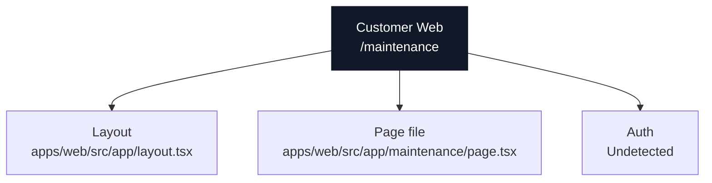

### Actual Page Information

| Field | Value |
| --- | --- |
| App | Customer Web |
| Domain | `ridendine.ca` |
| Route | `/maintenance` |
| Status | `WIRED` |
| Auth | Undetected |
| Page file | [apps/web/src/app/maintenance/page.tsx](../../../../apps/web/src/app/maintenance/page.tsx) |
| Layout | [apps/web/src/app/layout.tsx](../../../../apps/web/src/app/layout.tsx) |
| Data source summary | Static/client component/undetected |

### Data And API Wiring

| Type | Details |
| --- | --- |
| DB tables/RPCs | None detected |
| Fetch/API calls | None detected |
| Shared packages | None detected |
| Components/imports | None detected |
| Environment vars | None detected |

### Navigation And Links

No outgoing page-navigation links detected.

### API Calls From This Page

No outgoing API/fetch calls detected.

### Incoming References

No incoming static references detected.

### Review Notes

- Static wiring scan did not flag this page, but runtime auth, DB data, and external services still need smoke/e2e proof.


---

## Customer Web: `/order-confirmation/:orderId`

### Page Diagram

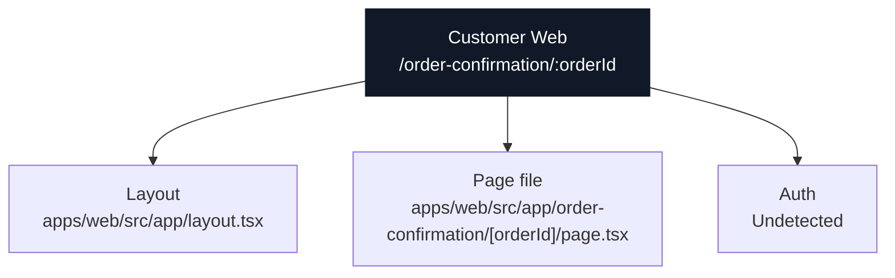

### Actual Page Information

| Field | Value |
| --- | --- |
| App | Customer Web |
| Domain | `ridendine.ca` |
| Route | `/order-confirmation/:orderId` |
| Status | `WIRED` |
| Auth | Undetected |
| Page file | [apps/web/src/app/order-confirmation/[orderId]/page.tsx](../../../../apps/web/src/app/order-confirmation/[orderId]/page.tsx) |
| Layout | [apps/web/src/app/layout.tsx](../../../../apps/web/src/app/layout.tsx) |
| Data source summary | Static/client component/undetected |

### Data And API Wiring

| Type | Details |
| --- | --- |
| DB tables/RPCs | None detected |
| Fetch/API calls | None detected |
| Shared packages | None detected |
| Components/imports | None detected |
| Environment vars | None detected |

### Navigation And Links

No outgoing page-navigation links detected.

### API Calls From This Page

No outgoing API/fetch calls detected.

### Incoming References

No incoming static references detected.

### Review Notes

- Static wiring scan did not flag this page, but runtime auth, DB data, and external services still need smoke/e2e proof.


---

## Customer Web: `/orders/:id/confirmation`

### Page Diagram

```mermaid
flowchart TB
  Page["Customer Web<br/>/orders/:id/confirmation"]
  Layout["Layout<br/>apps/web/src/app/layout.tsx"]
  File["Page file<br/>apps/web/src/app/orders/[id]/confirmation/page.tsx"]
  Auth["Auth<br/>Detected"]
  Page --> Layout
  Page --> File
  Page --> Auth
  Table0["DB table/RPC<br/>orders"]
  Page --> Table0
  Component0["Component/import<br/>@/components/layout/header"]
  Page --> Component0
  Component1["Component/import<br/>@/components/reviews/review-form"]
  Page --> Component1
  Component2["Component/import<br/>@/components/tracking/live-order-tracker"]
  Page --> Component2
  Component3["Component/import<br/>Button"]
  Page --> Component3
  Component4["Component/import<br/>Card"]
  Page --> Component4
  classDef page fill:#111827,stroke:#111827,color:#ffffff
  classDef data fill:#dcfce7,stroke:#16a34a,color:#172033
  classDef api fill:#dbeafe,stroke:#2563eb,color:#172033
  classDef warn fill:#fef3c7,stroke:#f59e0b,color:#172033
  class Page page
  class Table0 data
```

### Actual Page Information

| Field | Value |
| --- | --- |
| App | Customer Web |
| Domain | `ridendine.ca` |
| Route | `/orders/:id/confirmation` |
| Status | `WIRED` |
| Auth | Detected |
| Page file | [apps/web/src/app/orders/[id]/confirmation/page.tsx](../../../../apps/web/src/app/orders/[id]/confirmation/page.tsx) |
| Layout | [apps/web/src/app/layout.tsx](../../../../apps/web/src/app/layout.tsx) |
| Data source summary | table:orders, @ridendine/db, @ridendine/ui |

### Data And API Wiring

| Type | Details |
| --- | --- |
| DB tables/RPCs | `orders` |
| Fetch/API calls | None detected |
| Shared packages | @ridendine/db, @ridendine/ui |
| Components/imports | `@/components/layout/header`, `@/components/reviews/review-form`, `@/components/tracking/live-order-tracker`, `Button`, `Card` |
| Environment vars | None detected |

### Navigation And Links

| Status | Kind | Target | Resolved app | Resolved file | Notes |
| --- | --- | --- | --- | --- | --- |
| WORKING | redirect | `/auth/login` | Customer Web | [apps/web/src/app/auth/login/page.tsx](../../../../apps/web/src/app/auth/login/page.tsx) | redirect resolves to page /auth/login |
| WORKING | href | `/chefs` | Customer Web | [apps/web/src/app/chefs/page.tsx](../../../../apps/web/src/app/chefs/page.tsx) | href resolves to page /chefs |

### API Calls From This Page

No outgoing API/fetch calls detected.

### Incoming References

No incoming static references detected.

### Review Notes

- Static wiring scan did not flag this page, but runtime auth, DB data, and external services still need smoke/e2e proof.


---

## Customer Web: `/`

### Page Diagram

```mermaid
flowchart TB
  Page["Customer Web<br/>/"]
  Layout["Layout<br/>apps/web/src/app/layout.tsx"]
  File["Page file<br/>apps/web/src/app/page.tsx"]
  Auth["Auth<br/>Public"]
  Page --> Layout
  Page --> File
  Page --> Auth
  Table0["DB table/RPC<br/>chef_storefronts"]
  Page --> Table0
  Table1["DB table/RPC<br/>menu_items"]
  Page --> Table1
  Component0["Component/import<br/>@/components/home/featured-chefs"]
  Page --> Component0
  Component1["Component/import<br/>@/components/home/scroll-reveal-section"]
  Page --> Component1
  Component2["Component/import<br/>@/components/layout/header"]
  Page --> Component2
  Component3["Component/import<br/>Button"]
  Page --> Component3
  classDef page fill:#111827,stroke:#111827,color:#ffffff
  classDef data fill:#dcfce7,stroke:#16a34a,color:#172033
  classDef api fill:#dbeafe,stroke:#2563eb,color:#172033
  classDef warn fill:#fef3c7,stroke:#f59e0b,color:#172033
  class Page page
  class Table0,Table1 data
```

### Actual Page Information

| Field | Value |
| --- | --- |
| App | Customer Web |
| Domain | `ridendine.ca` |
| Route | `/` |
| Status | `WIRED` |
| Auth | Public |
| Page file | [apps/web/src/app/page.tsx](../../../../apps/web/src/app/page.tsx) |
| Layout | [apps/web/src/app/layout.tsx](../../../../apps/web/src/app/layout.tsx) |
| Data source summary | table:chef_storefronts, table:menu_items, @ridendine/db, @ridendine/ui |

### Data And API Wiring

| Type | Details |
| --- | --- |
| DB tables/RPCs | `chef_storefronts`, `menu_items` |
| Fetch/API calls | None detected |
| Shared packages | @ridendine/db, @ridendine/ui |
| Components/imports | `@/components/home/featured-chefs`, `@/components/home/scroll-reveal-section`, `@/components/layout/header`, `Button` |
| Environment vars | None detected |

### Navigation And Links

| Status | Kind | Target | Resolved app | Resolved file | Notes |
| --- | --- | --- | --- | --- | --- |
| WORKING | href | `/about` | Customer Web | [apps/web/src/app/about/page.tsx](../../../../apps/web/src/app/about/page.tsx) | href resolves to page /about |
| WORKING | href | `/account/orders` | Customer Web | [apps/web/src/app/account/orders/page.tsx](../../../../apps/web/src/app/account/orders/page.tsx) | href resolves to page /account/orders |
| WORKING | href | `/auth/signup?role=chef` | Customer Web | [apps/web/src/app/auth/signup/page.tsx](../../../../apps/web/src/app/auth/signup/page.tsx) | href resolves to page /auth/signup |
| WORKING | href | `/chef-resources` | Customer Web | [apps/web/src/app/chef-resources/page.tsx](../../../../apps/web/src/app/chef-resources/page.tsx) | href resolves to page /chef-resources |
| WORKING | href | `/chef-signup` | Customer Web | [apps/web/src/app/chef-signup/page.tsx](../../../../apps/web/src/app/chef-signup/page.tsx) | href resolves to page /chef-signup |
| WORKING | href | `/chefs` | Customer Web | [apps/web/src/app/chefs/page.tsx](../../../../apps/web/src/app/chefs/page.tsx) | href resolves to page /chefs |
| WORKING | href | `/contact` | Customer Web | [apps/web/src/app/contact/page.tsx](../../../../apps/web/src/app/contact/page.tsx) | href resolves to page /contact |
| WORKING | href | `/how-it-works` | Customer Web | [apps/web/src/app/how-it-works/page.tsx](../../../../apps/web/src/app/how-it-works/page.tsx) | href resolves to page /how-it-works |
| WORKING | href | `/privacy` | Customer Web | [apps/web/src/app/privacy/page.tsx](../../../../apps/web/src/app/privacy/page.tsx) | href resolves to page /privacy |
| WORKING | href | `/terms` | Customer Web | [apps/web/src/app/terms/page.tsx](../../../../apps/web/src/app/terms/page.tsx) | href resolves to page /terms |

### API Calls From This Page

No outgoing API/fetch calls detected.

### Incoming References

| Source app | Source file | Kind | Target | Status |
| --- | --- | --- | --- | --- |
| Customer Web | [apps/web/src/app/account/page.tsx](../../../../apps/web/src/app/account/page.tsx) | router.push | `/` | WORKING |
| Customer Web | [apps/web/src/app/chef-signup/page.tsx](../../../../apps/web/src/app/chef-signup/page.tsx) | href | `/` | WORKING |
| Customer Web | [apps/web/src/app/error.tsx](../../../../apps/web/src/app/error.tsx) | href | `/` | WORKING |
| Customer Web | [apps/web/src/app/not-found.tsx](../../../../apps/web/src/app/not-found.tsx) | href | `/` | WORKING |
| Customer Web | [apps/web/src/app/privacy/page.tsx](../../../../apps/web/src/app/privacy/page.tsx) | href | `/` | WORKING |
| Customer Web | [apps/web/src/app/terms/page.tsx](../../../../apps/web/src/app/terms/page.tsx) | href | `/` | WORKING |
| Customer Web | [apps/web/src/components/auth/auth-layout.tsx](../../../../apps/web/src/components/auth/auth-layout.tsx) | href | `/` | WORKING |
| Customer Web | [apps/web/src/components/layout/header.tsx](../../../../apps/web/src/components/layout/header.tsx) | href | `/` | WORKING |

### Review Notes

- Static wiring scan did not flag this page, but runtime auth, DB data, and external services still need smoke/e2e proof.


---

## Customer Web: `/privacy`

### Page Diagram

```mermaid
flowchart TB
  Page["Customer Web<br/>/privacy"]
  Layout["Layout<br/>apps/web/src/app/layout.tsx"]
  File["Page file<br/>apps/web/src/app/privacy/page.tsx"]
  Auth["Auth<br/>Public"]
  Page --> Layout
  Page --> File
  Page --> Auth
  Component0["Component/import<br/>@/components/layout/header"]
  Page --> Component0
  classDef page fill:#111827,stroke:#111827,color:#ffffff
  classDef data fill:#dcfce7,stroke:#16a34a,color:#172033
  classDef api fill:#dbeafe,stroke:#2563eb,color:#172033
  classDef warn fill:#fef3c7,stroke:#f59e0b,color:#172033
  class Page page
```

### Actual Page Information

| Field | Value |
| --- | --- |
| App | Customer Web |
| Domain | `ridendine.ca` |
| Route | `/privacy` |
| Status | `PARTIAL` |
| Auth | Public |
| Page file | [apps/web/src/app/privacy/page.tsx](../../../../apps/web/src/app/privacy/page.tsx) |
| Layout | [apps/web/src/app/layout.tsx](../../../../apps/web/src/app/layout.tsx) |
| Data source summary | Static/client component/undetected |

### Data And API Wiring

| Type | Details |
| --- | --- |
| DB tables/RPCs | None detected |
| Fetch/API calls | None detected |
| Shared packages | None detected |
| Components/imports | `@/components/layout/header` |
| Environment vars | None detected |

### Navigation And Links

| Status | Kind | Target | Resolved app | Resolved file | Notes |
| --- | --- | --- | --- | --- | --- |
| WORKING | href | `/` | Customer Web | [apps/web/src/app/page.tsx](../../../../apps/web/src/app/page.tsx) | href resolves to page / |

### API Calls From This Page

No outgoing API/fetch calls detected.

### Incoming References

| Source app | Source file | Kind | Target | Status |
| --- | --- | --- | --- | --- |
| Customer Web | [apps/web/src/app/account/settings/page.tsx](../../../../apps/web/src/app/account/settings/page.tsx) | href | `/privacy` | WORKING |
| Customer Web | [apps/web/src/app/auth/signup/page.tsx](../../../../apps/web/src/app/auth/signup/page.tsx) | href | `/privacy` | WORKING |
| Customer Web | [apps/web/src/app/page.tsx](../../../../apps/web/src/app/page.tsx) | href | `/privacy` | WORKING |

### Review Notes

- Page status is PARTIAL; review auth/data/API metadata and runtime behavior.


---

## Customer Web: `/terms`

### Page Diagram

```mermaid
flowchart TB
  Page["Customer Web<br/>/terms"]
  Layout["Layout<br/>apps/web/src/app/layout.tsx"]
  File["Page file<br/>apps/web/src/app/terms/page.tsx"]
  Auth["Auth<br/>Public"]
  Page --> Layout
  Page --> File
  Page --> Auth
  Component0["Component/import<br/>@/components/layout/header"]
  Page --> Component0
  classDef page fill:#111827,stroke:#111827,color:#ffffff
  classDef data fill:#dcfce7,stroke:#16a34a,color:#172033
  classDef api fill:#dbeafe,stroke:#2563eb,color:#172033
  classDef warn fill:#fef3c7,stroke:#f59e0b,color:#172033
  class Page page
```

### Actual Page Information

| Field | Value |
| --- | --- |
| App | Customer Web |
| Domain | `ridendine.ca` |
| Route | `/terms` |
| Status | `PARTIAL` |
| Auth | Public |
| Page file | [apps/web/src/app/terms/page.tsx](../../../../apps/web/src/app/terms/page.tsx) |
| Layout | [apps/web/src/app/layout.tsx](../../../../apps/web/src/app/layout.tsx) |
| Data source summary | Static/client component/undetected |

### Data And API Wiring

| Type | Details |
| --- | --- |
| DB tables/RPCs | None detected |
| Fetch/API calls | None detected |
| Shared packages | None detected |
| Components/imports | `@/components/layout/header` |
| Environment vars | None detected |

### Navigation And Links

| Status | Kind | Target | Resolved app | Resolved file | Notes |
| --- | --- | --- | --- | --- | --- |
| WORKING | href | `/` | Customer Web | [apps/web/src/app/page.tsx](../../../../apps/web/src/app/page.tsx) | href resolves to page / |

### API Calls From This Page

No outgoing API/fetch calls detected.

### Incoming References

| Source app | Source file | Kind | Target | Status |
| --- | --- | --- | --- | --- |
| Customer Web | [apps/web/src/app/account/settings/page.tsx](../../../../apps/web/src/app/account/settings/page.tsx) | href | `/terms` | WORKING |
| Customer Web | [apps/web/src/app/auth/signup/page.tsx](../../../../apps/web/src/app/auth/signup/page.tsx) | href | `/terms` | WORKING |
| Customer Web | [apps/web/src/app/page.tsx](../../../../apps/web/src/app/page.tsx) | href | `/terms` | WORKING |

### Review Notes

- Page status is PARTIAL; review auth/data/API metadata and runtime behavior.


---

## Ops Admin: `/auth/login`

### Page Diagram

```mermaid
flowchart TB
  Page["Ops Admin<br/>/auth/login"]
  Layout["Layout<br/>apps/ops-admin/src/app/layout.tsx"]
  File["Page file<br/>apps/ops-admin/src/app/auth/login/page.tsx"]
  Auth["Auth<br/>Public"]
  Page --> Layout
  Page --> File
  Page --> Auth
  Component0["Component/import<br/>Button"]
  Page --> Component0
  Component1["Component/import<br/>Card"]
  Page --> Component1
  Component2["Component/import<br/>Input"]
  Page --> Component2
  classDef page fill:#111827,stroke:#111827,color:#ffffff
  classDef data fill:#dcfce7,stroke:#16a34a,color:#172033
  classDef api fill:#dbeafe,stroke:#2563eb,color:#172033
  classDef warn fill:#fef3c7,stroke:#f59e0b,color:#172033
  class Page page
```

### Actual Page Information

| Field | Value |
| --- | --- |
| App | Ops Admin |
| Domain | `ops.ridendine.ca` |
| Route | `/auth/login` |
| Status | `PARTIAL` |
| Auth | Public |
| Page file | [apps/ops-admin/src/app/auth/login/page.tsx](../../../../apps/ops-admin/src/app/auth/login/page.tsx) |
| Layout | [apps/ops-admin/src/app/layout.tsx](../../../../apps/ops-admin/src/app/layout.tsx) |
| Data source summary | @ridendine/db, @ridendine/ui |

### Data And API Wiring

| Type | Details |
| --- | --- |
| DB tables/RPCs | None detected |
| Fetch/API calls | None detected |
| Shared packages | @ridendine/db, @ridendine/ui |
| Components/imports | `Button`, `Card`, `Input` |
| Environment vars | None detected |

### Navigation And Links

No outgoing page-navigation links detected.

### API Calls From This Page

No outgoing API/fetch calls detected.

### Incoming References

| Source app | Source file | Kind | Target | Status |
| --- | --- | --- | --- | --- |
| Ops Admin | [apps/ops-admin/src/app/dashboard/layout.tsx](../../../../apps/ops-admin/src/app/dashboard/layout.tsx) | redirect | `/auth/login?redirect=/dashboard` | WORKING |

### Review Notes

- Page status is PARTIAL; review auth/data/API metadata and runtime behavior.


---

## Ops Admin: `/dashboard/activity`

### Page Diagram

```mermaid
flowchart TB
  Page["Ops Admin<br/>/dashboard/activity"]
  Layout["Layout<br/>apps/ops-admin/src/app/dashboard/layout.tsx"]
  File["Page file<br/>apps/ops-admin/src/app/dashboard/activity/page.tsx"]
  Auth["Auth<br/>Undetected"]
  Page --> Layout
  Page --> File
  Page --> Auth
  Table0["DB table/RPC<br/>audit_logs"]
  Page --> Table0
  Table1["DB table/RPC<br/>ops_override_logs"]
  Page --> Table1
  Table2["DB table/RPC<br/>platform_users"]
  Page --> Table2
  Component0["Component/import<br/>@/components/DashboardLayout"]
  Page --> Component0
  Component1["Component/import<br/>Badge"]
  Page --> Component1
  Component2["Component/import<br/>Card"]
  Page --> Component2
  classDef page fill:#111827,stroke:#111827,color:#ffffff
  classDef data fill:#dcfce7,stroke:#16a34a,color:#172033
  classDef api fill:#dbeafe,stroke:#2563eb,color:#172033
  classDef warn fill:#fef3c7,stroke:#f59e0b,color:#172033
  class Page page
  class Table0,Table1,Table2 data
```

### Actual Page Information

| Field | Value |
| --- | --- |
| App | Ops Admin |
| Domain | `ops.ridendine.ca` |
| Route | `/dashboard/activity` |
| Status | `PARTIAL` |
| Auth | Undetected |
| Page file | [apps/ops-admin/src/app/dashboard/activity/page.tsx](../../../../apps/ops-admin/src/app/dashboard/activity/page.tsx) |
| Layout | [apps/ops-admin/src/app/dashboard/layout.tsx](../../../../apps/ops-admin/src/app/dashboard/layout.tsx) |
| Data source summary | table:audit_logs, table:ops_override_logs, table:platform_users, @ridendine/db, @ridendine/ui |

### Data And API Wiring

| Type | Details |
| --- | --- |
| DB tables/RPCs | `audit_logs`, `ops_override_logs`, `platform_users` |
| Fetch/API calls | None detected |
| Shared packages | @ridendine/db, @ridendine/ui |
| Components/imports | `@/components/DashboardLayout`, `Badge`, `Card` |
| Environment vars | None detected |

### Navigation And Links

No outgoing page-navigation links detected.

### API Calls From This Page

No outgoing API/fetch calls detected.

### Incoming References

No incoming static references detected.

### Review Notes

- Page status is PARTIAL; review auth/data/API metadata and runtime behavior.


---

## Ops Admin: `/dashboard/analytics`

### Page Diagram

```mermaid
flowchart TB
  Page["Ops Admin<br/>/dashboard/analytics"]
  Layout["Layout<br/>apps/ops-admin/src/app/dashboard/layout.tsx"]
  File["Page file<br/>apps/ops-admin/src/app/dashboard/analytics/page.tsx"]
  Auth["Auth<br/>Undetected"]
  Page --> Layout
  Page --> File
  Page --> Auth
  Table0["DB table/RPC<br/>driver_presence"]
  Page --> Table0
  Table1["DB table/RPC<br/>drivers"]
  Page --> Table1
  Table2["DB table/RPC<br/>orders"]
  Page --> Table2
  Component0["Component/import<br/>@/components/DashboardLayout"]
  Page --> Component0
  Component1["Component/import<br/>KpiTile"]
  Page --> Component1
  Component2["Component/import<br/>PageHeader"]
  Page --> Component2
  classDef page fill:#111827,stroke:#111827,color:#ffffff
  classDef data fill:#dcfce7,stroke:#16a34a,color:#172033
  classDef api fill:#dbeafe,stroke:#2563eb,color:#172033
  classDef warn fill:#fef3c7,stroke:#f59e0b,color:#172033
  class Page page
  class Table0,Table1,Table2 data
```

### Actual Page Information

| Field | Value |
| --- | --- |
| App | Ops Admin |
| Domain | `ops.ridendine.ca` |
| Route | `/dashboard/analytics` |
| Status | `PARTIAL` |
| Auth | Undetected |
| Page file | [apps/ops-admin/src/app/dashboard/analytics/page.tsx](../../../../apps/ops-admin/src/app/dashboard/analytics/page.tsx) |
| Layout | [apps/ops-admin/src/app/dashboard/layout.tsx](../../../../apps/ops-admin/src/app/dashboard/layout.tsx) |
| Data source summary | table:driver_presence, table:drivers, table:orders, @ridendine/db, @ridendine/ui |

### Data And API Wiring

| Type | Details |
| --- | --- |
| DB tables/RPCs | `driver_presence`, `drivers`, `orders` |
| Fetch/API calls | None detected |
| Shared packages | @ridendine/db, @ridendine/ui |
| Components/imports | `@/components/DashboardLayout`, `KpiTile`, `PageHeader` |
| Environment vars | None detected |

### Navigation And Links

No outgoing page-navigation links detected.

### API Calls From This Page

No outgoing API/fetch calls detected.

### Incoming References

No incoming static references detected.

### Review Notes

- Page status is PARTIAL; review auth/data/API metadata and runtime behavior.


---

## Ops Admin: `/dashboard/announcements`

### Page Diagram

```mermaid
flowchart TB
  Page["Ops Admin<br/>/dashboard/announcements"]
  Layout["Layout<br/>apps/ops-admin/src/app/dashboard/layout.tsx"]
  File["Page file<br/>apps/ops-admin/src/app/dashboard/announcements/page.tsx"]
  Auth["Auth<br/>Undetected"]
  Page --> Layout
  Page --> File
  Page --> Auth
  Api0["API/fetch<br/>/api/announcements"]
  Page --> Api0
  Component0["Component/import<br/>@/components/DashboardLayout"]
  Page --> Component0
  Component1["Component/import<br/>Button"]
  Page --> Component1
  Component2["Component/import<br/>Card"]
  Page --> Component2
  classDef page fill:#111827,stroke:#111827,color:#ffffff
  classDef data fill:#dcfce7,stroke:#16a34a,color:#172033
  classDef api fill:#dbeafe,stroke:#2563eb,color:#172033
  classDef warn fill:#fef3c7,stroke:#f59e0b,color:#172033
  class Page page
  class Api0 api
```

### Actual Page Information

| Field | Value |
| --- | --- |
| App | Ops Admin |
| Domain | `ops.ridendine.ca` |
| Route | `/dashboard/announcements` |
| Status | `PARTIAL` |
| Auth | Undetected |
| Page file | [apps/ops-admin/src/app/dashboard/announcements/page.tsx](../../../../apps/ops-admin/src/app/dashboard/announcements/page.tsx) |
| Layout | [apps/ops-admin/src/app/dashboard/layout.tsx](../../../../apps/ops-admin/src/app/dashboard/layout.tsx) |
| Data source summary | @ridendine/ui |

### Data And API Wiring

| Type | Details |
| --- | --- |
| DB tables/RPCs | None detected |
| Fetch/API calls | `/api/announcements` (POST) |
| Shared packages | @ridendine/ui |
| Components/imports | `@/components/DashboardLayout`, `Button`, `Card` |
| Environment vars | None detected |

### Navigation And Links

No outgoing page-navigation links detected.

### API Calls From This Page

| Status | Kind | Target | Resolved app | Resolved file | Notes |
| --- | --- | --- | --- | --- | --- |
| WORKING | fetch | `/api/announcements` | Ops Admin | [apps/ops-admin/src/app/api/announcements/route.ts](../../../../apps/ops-admin/src/app/api/announcements/route.ts) | fetch resolves to API /api/announcements |

### Incoming References

| Source app | Source file | Kind | Target | Status |
| --- | --- | --- | --- | --- |
| Ops Admin | [apps/ops-admin/src/app/dashboard/page.tsx](../../../../apps/ops-admin/src/app/dashboard/page.tsx) | href | `/dashboard/announcements` | WORKING |

### Review Notes

- Page status is PARTIAL; review auth/data/API metadata and runtime behavior.


---

## Ops Admin: `/dashboard/automation`

### Page Diagram

```mermaid
flowchart TB
  Page["Ops Admin<br/>/dashboard/automation"]
  Layout["Layout<br/>apps/ops-admin/src/app/dashboard/layout.tsx"]
  File["Page file<br/>apps/ops-admin/src/app/dashboard/automation/page.tsx"]
  Auth["Auth<br/>Undetected"]
  Page --> Layout
  Page --> File
  Page --> Auth
  Api0["API/fetch<br/>/api/engine/rules"]
  Page --> Api0
  Component0["Component/import<br/>@/components/DashboardLayout"]
  Page --> Component0
  Component1["Component/import<br/>Badge"]
  Page --> Component1
  Component2["Component/import<br/>Card"]
  Page --> Component2
  classDef page fill:#111827,stroke:#111827,color:#ffffff
  classDef data fill:#dcfce7,stroke:#16a34a,color:#172033
  classDef api fill:#dbeafe,stroke:#2563eb,color:#172033
  classDef warn fill:#fef3c7,stroke:#f59e0b,color:#172033
  class Page page
  class Api0 api
```

### Actual Page Information

| Field | Value |
| --- | --- |
| App | Ops Admin |
| Domain | `ops.ridendine.ca` |
| Route | `/dashboard/automation` |
| Status | `PARTIAL` |
| Auth | Undetected |
| Page file | [apps/ops-admin/src/app/dashboard/automation/page.tsx](../../../../apps/ops-admin/src/app/dashboard/automation/page.tsx) |
| Layout | [apps/ops-admin/src/app/dashboard/layout.tsx](../../../../apps/ops-admin/src/app/dashboard/layout.tsx) |
| Data source summary | @ridendine/ui |

### Data And API Wiring

| Type | Details |
| --- | --- |
| DB tables/RPCs | None detected |
| Fetch/API calls | `/api/engine/rules` (GET, PATCH) |
| Shared packages | @ridendine/ui |
| Components/imports | `@/components/DashboardLayout`, `Badge`, `Card` |
| Environment vars | None detected |

### Navigation And Links

No outgoing page-navigation links detected.

### API Calls From This Page

| Status | Kind | Target | Resolved app | Resolved file | Notes |
| --- | --- | --- | --- | --- | --- |
| WORKING | fetch | `/api/engine/rules` | Ops Admin | [apps/ops-admin/src/app/api/engine/rules/route.ts](../../../../apps/ops-admin/src/app/api/engine/rules/route.ts) | fetch resolves to API /api/engine/rules |

### Incoming References

No incoming static references detected.

### Review Notes

- Page status is PARTIAL; review auth/data/API metadata and runtime behavior.


---

## Ops Admin: `/dashboard/chefs/:id`

### Page Diagram

```mermaid
flowchart TB
  Page["Ops Admin<br/>/dashboard/chefs/:id"]
  Layout["Layout<br/>apps/ops-admin/src/app/dashboard/layout.tsx"]
  File["Page file<br/>apps/ops-admin/src/app/dashboard/chefs/[id]/page.tsx"]
  Auth["Auth<br/>Detected"]
  Page --> Layout
  Page --> File
  Page --> Auth
  Table0["DB table/RPC<br/>chef_delivery_zones"]
  Page --> Table0
  Component0["Component/import<br/>@/components/DashboardLayout"]
  Page --> Component0
  Component1["Component/import<br/>Badge"]
  Page --> Component1
  Component2["Component/import<br/>Card"]
  Page --> Component2
  classDef page fill:#111827,stroke:#111827,color:#ffffff
  classDef data fill:#dcfce7,stroke:#16a34a,color:#172033
  classDef api fill:#dbeafe,stroke:#2563eb,color:#172033
  classDef warn fill:#fef3c7,stroke:#f59e0b,color:#172033
  class Page page
  class Table0 data
```

### Actual Page Information

| Field | Value |
| --- | --- |
| App | Ops Admin |
| Domain | `ops.ridendine.ca` |
| Route | `/dashboard/chefs/:id` |
| Status | `WIRED` |
| Auth | Detected |
| Page file | [apps/ops-admin/src/app/dashboard/chefs/[id]/page.tsx](../../../../apps/ops-admin/src/app/dashboard/chefs/[id]/page.tsx) |
| Layout | [apps/ops-admin/src/app/dashboard/layout.tsx](../../../../apps/ops-admin/src/app/dashboard/layout.tsx) |
| Data source summary | table:chef_delivery_zones, @ridendine/db, @ridendine/ui |

### Data And API Wiring

| Type | Details |
| --- | --- |
| DB tables/RPCs | `chef_delivery_zones` |
| Fetch/API calls | None detected |
| Shared packages | @ridendine/db, @ridendine/ui |
| Components/imports | `@/components/DashboardLayout`, `Badge`, `Card` |
| Environment vars | None detected |

### Navigation And Links

| Status | Kind | Target | Resolved app | Resolved file | Notes |
| --- | --- | --- | --- | --- | --- |
| WORKING | href | `/dashboard/chefs` | Ops Admin | [apps/ops-admin/src/app/dashboard/chefs/page.tsx](../../../../apps/ops-admin/src/app/dashboard/chefs/page.tsx) | href resolves to page /dashboard/chefs |

### API Calls From This Page

No outgoing API/fetch calls detected.

### Incoming References

| Source app | Source file | Kind | Target | Status |
| --- | --- | --- | --- | --- |
| Ops Admin | [apps/ops-admin/src/app/dashboard/chefs/page.tsx](../../../../apps/ops-admin/src/app/dashboard/chefs/page.tsx) | href | `/dashboard/chefs/${row.id}` | WORKING_DYNAMIC |
| Ops Admin | [apps/ops-admin/src/app/dashboard/orders/[id]/page.tsx](../../../../apps/ops-admin/src/app/dashboard/orders/[id]/page.tsx) | href | `/dashboard/chefs/${order.storefront.chef?.id ??` | WORKING_DYNAMIC |

### Review Notes

- Static wiring scan did not flag this page, but runtime auth, DB data, and external services still need smoke/e2e proof.


---

## Ops Admin: `/dashboard/chefs/approvals`

### Page Diagram

```mermaid
flowchart TB
  Page["Ops Admin<br/>/dashboard/chefs/approvals"]
  Layout["Layout<br/>apps/ops-admin/src/app/dashboard/layout.tsx"]
  File["Page file<br/>apps/ops-admin/src/app/dashboard/chefs/approvals/page.tsx"]
  Auth["Auth<br/>Undetected"]
  Page --> Layout
  Page --> File
  Page --> Auth
  Api0["API/fetch<br/>/api/chefs?status=pending"]
  Page --> Api0
  Api1["API/fetch<br/>/api/chefs/${id}"]
  Page --> Api1
  Component0["Component/import<br/>@/components/DashboardLayout"]
  Page --> Component0
  Component1["Component/import<br/>Badge"]
  Page --> Component1
  Component2["Component/import<br/>Card"]
  Page --> Component2
  classDef page fill:#111827,stroke:#111827,color:#ffffff
  classDef data fill:#dcfce7,stroke:#16a34a,color:#172033
  classDef api fill:#dbeafe,stroke:#2563eb,color:#172033
  classDef warn fill:#fef3c7,stroke:#f59e0b,color:#172033
  class Page page
  class Api0,Api1 api
```

### Actual Page Information

| Field | Value |
| --- | --- |
| App | Ops Admin |
| Domain | `ops.ridendine.ca` |
| Route | `/dashboard/chefs/approvals` |
| Status | `PARTIAL` |
| Auth | Undetected |
| Page file | [apps/ops-admin/src/app/dashboard/chefs/approvals/page.tsx](../../../../apps/ops-admin/src/app/dashboard/chefs/approvals/page.tsx) |
| Layout | [apps/ops-admin/src/app/dashboard/layout.tsx](../../../../apps/ops-admin/src/app/dashboard/layout.tsx) |
| Data source summary | @ridendine/ui |

### Data And API Wiring

| Type | Details |
| --- | --- |
| DB tables/RPCs | None detected |
| Fetch/API calls | `/api/chefs?status=pending` (GET, POST)<br>`/api/chefs/${id}` (PATCH) |
| Shared packages | @ridendine/ui |
| Components/imports | `@/components/DashboardLayout`, `Badge`, `Card` |
| Environment vars | None detected |

### Navigation And Links

No outgoing page-navigation links detected.

### API Calls From This Page

| Status | Kind | Target | Resolved app | Resolved file | Notes |
| --- | --- | --- | --- | --- | --- |
| WORKING | fetch | `/api/chefs?status=pending` | Ops Admin | [apps/ops-admin/src/app/api/chefs/route.ts](../../../../apps/ops-admin/src/app/api/chefs/route.ts) | fetch resolves to API /api/chefs |
| WORKING_DYNAMIC | fetch | `/api/chefs/${id}` | Ops Admin | [apps/ops-admin/src/app/api/chefs/[id]/route.ts](../../../../apps/ops-admin/src/app/api/chefs/[id]/route.ts) | fetch resolves to API /api/chefs/:id |

### Incoming References

No incoming static references detected.

### Review Notes

- Page status is PARTIAL; review auth/data/API metadata and runtime behavior.


---

## Ops Admin: `/dashboard/chefs`

### Page Diagram

```mermaid
flowchart TB
  Page["Ops Admin<br/>/dashboard/chefs"]
  Layout["Layout<br/>apps/ops-admin/src/app/dashboard/layout.tsx"]
  File["Page file<br/>apps/ops-admin/src/app/dashboard/chefs/page.tsx"]
  Auth["Auth<br/>Undetected"]
  Page --> Layout
  Page --> File
  Page --> Auth
  Api0["API/fetch<br/>/api/export?type=chefs"]
  Page --> Api0
  Component0["Component/import<br/>@/components/DashboardLayout"]
  Page --> Component0
  Component1["Component/import<br/>Button"]
  Page --> Component1
  Component2["Component/import<br/>DataTable"]
  Page --> Component2
  Component3["Component/import<br/>EmptyState"]
  Page --> Component3
  Component4["Component/import<br/>Modal"]
  Page --> Component4
  Component5["Component/import<br/>PageHeader"]
  Page --> Component5
  classDef page fill:#111827,stroke:#111827,color:#ffffff
  classDef data fill:#dcfce7,stroke:#16a34a,color:#172033
  classDef api fill:#dbeafe,stroke:#2563eb,color:#172033
  classDef warn fill:#fef3c7,stroke:#f59e0b,color:#172033
  class Page page
  class Api0 api
```

### Actual Page Information

| Field | Value |
| --- | --- |
| App | Ops Admin |
| Domain | `ops.ridendine.ca` |
| Route | `/dashboard/chefs` |
| Status | `WIRED` |
| Auth | Undetected |
| Page file | [apps/ops-admin/src/app/dashboard/chefs/page.tsx](../../../../apps/ops-admin/src/app/dashboard/chefs/page.tsx) |
| Layout | [apps/ops-admin/src/app/dashboard/layout.tsx](../../../../apps/ops-admin/src/app/dashboard/layout.tsx) |
| Data source summary | @ridendine/ui |

### Data And API Wiring

| Type | Details |
| --- | --- |
| DB tables/RPCs | None detected |
| Fetch/API calls | `/api/export?type=chefs` (GET) |
| Shared packages | @ridendine/ui |
| Components/imports | `@/components/DashboardLayout`, `Button`, `DataTable`, `EmptyState`, `Modal`, `PageHeader`, `StatusBadge` |
| Environment vars | None detected |

### Navigation And Links

| Status | Kind | Target | Resolved app | Resolved file | Notes |
| --- | --- | --- | --- | --- | --- |
| WORKING_DYNAMIC | href | `/dashboard/chefs/${row.id}` | Ops Admin | [apps/ops-admin/src/app/dashboard/chefs/[id]/page.tsx](../../../../apps/ops-admin/src/app/dashboard/chefs/[id]/page.tsx) | href resolves to page /dashboard/chefs/:id |

### API Calls From This Page

| Status | Kind | Target | Resolved app | Resolved file | Notes |
| --- | --- | --- | --- | --- | --- |
| WORKING | href | `/api/export?type=chefs` | Ops Admin | [apps/ops-admin/src/app/api/export/route.ts](../../../../apps/ops-admin/src/app/api/export/route.ts) | href resolves to API /api/export |

### Incoming References

| Source app | Source file | Kind | Target | Status |
| --- | --- | --- | --- | --- |
| Ops Admin | [apps/ops-admin/src/app/dashboard/chefs/[id]/page.tsx](../../../../apps/ops-admin/src/app/dashboard/chefs/[id]/page.tsx) | href | `/dashboard/chefs` | WORKING |
| Ops Admin | [apps/ops-admin/src/app/dashboard/page.tsx](../../../../apps/ops-admin/src/app/dashboard/page.tsx) | href | `/dashboard/chefs` | WORKING |

### Review Notes

- Static wiring scan did not flag this page, but runtime auth, DB data, and external services still need smoke/e2e proof.


---

## Ops Admin: `/dashboard/customers/:id`

### Page Diagram

```mermaid
flowchart TB
  Page["Ops Admin<br/>/dashboard/customers/:id"]
  Layout["Layout<br/>apps/ops-admin/src/app/dashboard/layout.tsx"]
  File["Page file<br/>apps/ops-admin/src/app/dashboard/customers/[id]/page.tsx"]
  Auth["Auth<br/>Undetected"]
  Page --> Layout
  Page --> File
  Page --> Auth
  Component0["Component/import<br/>@/components/DashboardLayout"]
  Page --> Component0
  Component1["Component/import<br/>Badge"]
  Page --> Component1
  Component2["Component/import<br/>Card"]
  Page --> Component2
  classDef page fill:#111827,stroke:#111827,color:#ffffff
  classDef data fill:#dcfce7,stroke:#16a34a,color:#172033
  classDef api fill:#dbeafe,stroke:#2563eb,color:#172033
  classDef warn fill:#fef3c7,stroke:#f59e0b,color:#172033
  class Page page
```

### Actual Page Information

| Field | Value |
| --- | --- |
| App | Ops Admin |
| Domain | `ops.ridendine.ca` |
| Route | `/dashboard/customers/:id` |
| Status | `WIRED` |
| Auth | Undetected |
| Page file | [apps/ops-admin/src/app/dashboard/customers/[id]/page.tsx](../../../../apps/ops-admin/src/app/dashboard/customers/[id]/page.tsx) |
| Layout | [apps/ops-admin/src/app/dashboard/layout.tsx](../../../../apps/ops-admin/src/app/dashboard/layout.tsx) |
| Data source summary | @ridendine/db, @ridendine/ui |

### Data And API Wiring

| Type | Details |
| --- | --- |
| DB tables/RPCs | None detected |
| Fetch/API calls | None detected |
| Shared packages | @ridendine/db, @ridendine/ui |
| Components/imports | `@/components/DashboardLayout`, `Badge`, `Card` |
| Environment vars | None detected |

### Navigation And Links

| Status | Kind | Target | Resolved app | Resolved file | Notes |
| --- | --- | --- | --- | --- | --- |
| WORKING | href | `/dashboard/customers` | Ops Admin | [apps/ops-admin/src/app/dashboard/customers/page.tsx](../../../../apps/ops-admin/src/app/dashboard/customers/page.tsx) | href resolves to page /dashboard/customers |
| WORKING_DYNAMIC | href | `/dashboard/orders/${order.id}` | Ops Admin | [apps/ops-admin/src/app/dashboard/orders/[id]/page.tsx](../../../../apps/ops-admin/src/app/dashboard/orders/[id]/page.tsx) | href resolves to page /dashboard/orders/:id |
| WORKING | href | `/dashboard/support` | Ops Admin | [apps/ops-admin/src/app/dashboard/support/page.tsx](../../../../apps/ops-admin/src/app/dashboard/support/page.tsx) | href resolves to page /dashboard/support |

### API Calls From This Page

No outgoing API/fetch calls detected.

### Incoming References

| Source app | Source file | Kind | Target | Status |
| --- | --- | --- | --- | --- |
| Ops Admin | [apps/ops-admin/src/app/dashboard/customers/page.tsx](../../../../apps/ops-admin/src/app/dashboard/customers/page.tsx) | href | `/dashboard/customers/${row.id}` | WORKING_DYNAMIC |
| Ops Admin | [apps/ops-admin/src/app/dashboard/orders/[id]/page.tsx](../../../../apps/ops-admin/src/app/dashboard/orders/[id]/page.tsx) | href | `/dashboard/customers/${order.customer.id}` | WORKING_DYNAMIC |

### Review Notes

- Static wiring scan did not flag this page, but runtime auth, DB data, and external services still need smoke/e2e proof.


---

## Ops Admin: `/dashboard/customers`

### Page Diagram

```mermaid
flowchart TB
  Page["Ops Admin<br/>/dashboard/customers"]
  Layout["Layout<br/>apps/ops-admin/src/app/dashboard/layout.tsx"]
  File["Page file<br/>apps/ops-admin/src/app/dashboard/customers/page.tsx"]
  Auth["Auth<br/>Undetected"]
  Page --> Layout
  Page --> File
  Page --> Auth
  Api0["API/fetch<br/>/api/customers"]
  Page --> Api0
  Api1["API/fetch<br/>/api/export?type=customers"]
  Page --> Api1
  Component0["Component/import<br/>@/components/DashboardLayout"]
  Page --> Component0
  Component1["Component/import<br/>DataTable"]
  Page --> Component1
  Component2["Component/import<br/>EmptyState"]
  Page --> Component2
  Component3["Component/import<br/>PageHeader"]
  Page --> Component3
  classDef page fill:#111827,stroke:#111827,color:#ffffff
  classDef data fill:#dcfce7,stroke:#16a34a,color:#172033
  classDef api fill:#dbeafe,stroke:#2563eb,color:#172033
  classDef warn fill:#fef3c7,stroke:#f59e0b,color:#172033
  class Page page
  class Api0,Api1 api
```

### Actual Page Information

| Field | Value |
| --- | --- |
| App | Ops Admin |
| Domain | `ops.ridendine.ca` |
| Route | `/dashboard/customers` |
| Status | `PARTIAL` |
| Auth | Undetected |
| Page file | [apps/ops-admin/src/app/dashboard/customers/page.tsx](../../../../apps/ops-admin/src/app/dashboard/customers/page.tsx) |
| Layout | [apps/ops-admin/src/app/dashboard/layout.tsx](../../../../apps/ops-admin/src/app/dashboard/layout.tsx) |
| Data source summary | @ridendine/ui |

### Data And API Wiring

| Type | Details |
| --- | --- |
| DB tables/RPCs | None detected |
| Fetch/API calls | `/api/customers` (GET, POST)<br>`/api/export?type=customers` (GET) |
| Shared packages | @ridendine/ui |
| Components/imports | `@/components/DashboardLayout`, `DataTable`, `EmptyState`, `PageHeader` |
| Environment vars | None detected |

### Navigation And Links

| Status | Kind | Target | Resolved app | Resolved file | Notes |
| --- | --- | --- | --- | --- | --- |
| WORKING_DYNAMIC | href | `/dashboard/customers/${row.id}` | Ops Admin | [apps/ops-admin/src/app/dashboard/customers/[id]/page.tsx](../../../../apps/ops-admin/src/app/dashboard/customers/[id]/page.tsx) | href resolves to page /dashboard/customers/:id |

### API Calls From This Page

| Status | Kind | Target | Resolved app | Resolved file | Notes |
| --- | --- | --- | --- | --- | --- |
| WORKING | fetch | `/api/customers` | Ops Admin | [apps/ops-admin/src/app/api/customers/route.ts](../../../../apps/ops-admin/src/app/api/customers/route.ts) | fetch resolves to API /api/customers |
| WORKING | href | `/api/export?type=customers` | Ops Admin | [apps/ops-admin/src/app/api/export/route.ts](../../../../apps/ops-admin/src/app/api/export/route.ts) | href resolves to API /api/export |

### Incoming References

| Source app | Source file | Kind | Target | Status |
| --- | --- | --- | --- | --- |
| Ops Admin | [apps/ops-admin/src/app/dashboard/customers/[id]/page.tsx](../../../../apps/ops-admin/src/app/dashboard/customers/[id]/page.tsx) | href | `/dashboard/customers` | WORKING |

### Review Notes

- Page status is PARTIAL; review auth/data/API metadata and runtime behavior.


---

## Ops Admin: `/dashboard/deliveries/:id`

### Page Diagram

```mermaid
flowchart TB
  Page["Ops Admin<br/>/dashboard/deliveries/:id"]
  Layout["Layout<br/>apps/ops-admin/src/app/dashboard/layout.tsx"]
  File["Page file<br/>apps/ops-admin/src/app/dashboard/deliveries/[id]/page.tsx"]
  Auth["Auth<br/>Undetected"]
  Page --> Layout
  Page --> File
  Page --> Auth
  Component0["Component/import<br/>@/components/DashboardLayout"]
  Page --> Component0
  Component1["Component/import<br/>Badge"]
  Page --> Component1
  Component2["Component/import<br/>Card"]
  Page --> Component2
  classDef page fill:#111827,stroke:#111827,color:#ffffff
  classDef data fill:#dcfce7,stroke:#16a34a,color:#172033
  classDef api fill:#dbeafe,stroke:#2563eb,color:#172033
  classDef warn fill:#fef3c7,stroke:#f59e0b,color:#172033
  class Page page
```

### Actual Page Information

| Field | Value |
| --- | --- |
| App | Ops Admin |
| Domain | `ops.ridendine.ca` |
| Route | `/dashboard/deliveries/:id` |
| Status | `WIRED` |
| Auth | Undetected |
| Page file | [apps/ops-admin/src/app/dashboard/deliveries/[id]/page.tsx](../../../../apps/ops-admin/src/app/dashboard/deliveries/[id]/page.tsx) |
| Layout | [apps/ops-admin/src/app/dashboard/layout.tsx](../../../../apps/ops-admin/src/app/dashboard/layout.tsx) |
| Data source summary | @ridendine/db, @ridendine/ui |

### Data And API Wiring

| Type | Details |
| --- | --- |
| DB tables/RPCs | None detected |
| Fetch/API calls | None detected |
| Shared packages | @ridendine/db, @ridendine/ui |
| Components/imports | `@/components/DashboardLayout`, `Badge`, `Card` |
| Environment vars | None detected |

### Navigation And Links

| Status | Kind | Target | Resolved app | Resolved file | Notes |
| --- | --- | --- | --- | --- | --- |
| WORKING | href | `/dashboard/deliveries` | Ops Admin | [apps/ops-admin/src/app/dashboard/deliveries/page.tsx](../../../../apps/ops-admin/src/app/dashboard/deliveries/page.tsx) | href resolves to page /dashboard/deliveries |
| WORKING_DYNAMIC | href | `/dashboard/drivers/${detail.driver.id}` | Ops Admin | [apps/ops-admin/src/app/dashboard/drivers/[id]/page.tsx](../../../../apps/ops-admin/src/app/dashboard/drivers/[id]/page.tsx) | href resolves to page /dashboard/drivers/:id |
| WORKING_DYNAMIC | href | `/dashboard/orders/${detail.order.id}` | Ops Admin | [apps/ops-admin/src/app/dashboard/orders/[id]/page.tsx](../../../../apps/ops-admin/src/app/dashboard/orders/[id]/page.tsx) | href resolves to page /dashboard/orders/:id |

### API Calls From This Page

No outgoing API/fetch calls detected.

### Incoming References

| Source app | Source file | Kind | Target | Status |
| --- | --- | --- | --- | --- |
| Ops Admin | [apps/ops-admin/src/app/dashboard/deliveries/page.tsx](../../../../apps/ops-admin/src/app/dashboard/deliveries/page.tsx) | href | `/dashboard/deliveries/${item.deliveryId}` | WORKING_DYNAMIC |
| Ops Admin | [apps/ops-admin/src/app/dashboard/drivers/[id]/page.tsx](../../../../apps/ops-admin/src/app/dashboard/drivers/[id]/page.tsx) | href | `/dashboard/deliveries/${delivery.id}` | WORKING_DYNAMIC |
| Ops Admin | [apps/ops-admin/src/app/dashboard/orders/[id]/page.tsx](../../../../apps/ops-admin/src/app/dashboard/orders/[id]/page.tsx) | href | `/dashboard/deliveries/${order.delivery.id}` | WORKING_DYNAMIC |

### Review Notes

- Static wiring scan did not flag this page, but runtime auth, DB data, and external services still need smoke/e2e proof.


---

## Ops Admin: `/dashboard/deliveries`

### Page Diagram

```mermaid
flowchart TB
  Page["Ops Admin<br/>/dashboard/deliveries"]
  Layout["Layout<br/>apps/ops-admin/src/app/dashboard/layout.tsx"]
  File["Page file<br/>apps/ops-admin/src/app/dashboard/deliveries/page.tsx"]
  Auth["Auth<br/>Undetected"]
  Page --> Layout
  Page --> File
  Page --> Auth
  Component0["Component/import<br/>@/components/DashboardLayout"]
  Page --> Component0
  Component1["Component/import<br/>Badge"]
  Page --> Component1
  Component2["Component/import<br/>Card"]
  Page --> Component2
  classDef page fill:#111827,stroke:#111827,color:#ffffff
  classDef data fill:#dcfce7,stroke:#16a34a,color:#172033
  classDef api fill:#dbeafe,stroke:#2563eb,color:#172033
  classDef warn fill:#fef3c7,stroke:#f59e0b,color:#172033
  class Page page
```

### Actual Page Information

| Field | Value |
| --- | --- |
| App | Ops Admin |
| Domain | `ops.ridendine.ca` |
| Route | `/dashboard/deliveries` |
| Status | `PARTIAL` |
| Auth | Undetected |
| Page file | [apps/ops-admin/src/app/dashboard/deliveries/page.tsx](../../../../apps/ops-admin/src/app/dashboard/deliveries/page.tsx) |
| Layout | [apps/ops-admin/src/app/dashboard/layout.tsx](../../../../apps/ops-admin/src/app/dashboard/layout.tsx) |
| Data source summary | @ridendine/ui |

### Data And API Wiring

| Type | Details |
| --- | --- |
| DB tables/RPCs | None detected |
| Fetch/API calls | None detected |
| Shared packages | @ridendine/ui |
| Components/imports | `@/components/DashboardLayout`, `Badge`, `Card` |
| Environment vars | None detected |

### Navigation And Links

| Status | Kind | Target | Resolved app | Resolved file | Notes |
| --- | --- | --- | --- | --- | --- |
| WORKING | href | `/dashboard/deliveries?queue=${entry}` | Ops Admin | [apps/ops-admin/src/app/dashboard/deliveries/page.tsx](../../../../apps/ops-admin/src/app/dashboard/deliveries/page.tsx) | href resolves to page /dashboard/deliveries |
| WORKING | href | `/dashboard/deliveries?queue=${queue}&search=${encodeURIComponent(search)}&page=${Math.max(1, safePage - 1)}` | Ops Admin | [apps/ops-admin/src/app/dashboard/deliveries/page.tsx](../../../../apps/ops-admin/src/app/dashboard/deliveries/page.tsx) | href resolves to page /dashboard/deliveries |
| WORKING | href | `/dashboard/deliveries?queue=${queue}&search=${encodeURIComponent(search)}&page=${Math.min(totalPages, safePage + 1)}` | Ops Admin | [apps/ops-admin/src/app/dashboard/deliveries/page.tsx](../../../../apps/ops-admin/src/app/dashboard/deliveries/page.tsx) | href resolves to page /dashboard/deliveries |
| WORKING_DYNAMIC | href | `/dashboard/deliveries/${item.deliveryId}` | Ops Admin | [apps/ops-admin/src/app/dashboard/deliveries/[id]/page.tsx](../../../../apps/ops-admin/src/app/dashboard/deliveries/[id]/page.tsx) | href resolves to page /dashboard/deliveries/:id |

### API Calls From This Page

No outgoing API/fetch calls detected.

### Incoming References

| Source app | Source file | Kind | Target | Status |
| --- | --- | --- | --- | --- |
| Ops Admin | [apps/ops-admin/src/app/dashboard/deliveries/[id]/page.tsx](../../../../apps/ops-admin/src/app/dashboard/deliveries/[id]/page.tsx) | href | `/dashboard/deliveries` | WORKING |
| Ops Admin | [apps/ops-admin/src/app/dashboard/deliveries/page.tsx](../../../../apps/ops-admin/src/app/dashboard/deliveries/page.tsx) | href | `/dashboard/deliveries?queue=${entry}` | WORKING |
| Ops Admin | [apps/ops-admin/src/app/dashboard/deliveries/page.tsx](../../../../apps/ops-admin/src/app/dashboard/deliveries/page.tsx) | href | `/dashboard/deliveries?queue=${queue}&search=${encodeURIComponent(search)}&page=${Math.max(1, safePage - 1)}` | WORKING |
| Ops Admin | [apps/ops-admin/src/app/dashboard/deliveries/page.tsx](../../../../apps/ops-admin/src/app/dashboard/deliveries/page.tsx) | href | `/dashboard/deliveries?queue=${queue}&search=${encodeURIComponent(search)}&page=${Math.min(totalPages, safePage + 1)}` | WORKING |

### Review Notes

- Page status is PARTIAL; review auth/data/API metadata and runtime behavior.


---

## Ops Admin: `/dashboard/dispatch`

### Page Diagram

```mermaid
flowchart TB
  Page["Ops Admin<br/>/dashboard/dispatch"]
  Layout["Layout<br/>apps/ops-admin/src/app/dashboard/layout.tsx"]
  File["Page file<br/>apps/ops-admin/src/app/dashboard/dispatch/page.tsx"]
  Auth["Auth<br/>Undetected"]
  Page --> Layout
  Page --> File
  Page --> Auth
  Api0["API/fetch<br/>/api/engine/dispatch"]
  Page --> Api0
  Api1["API/fetch<br/>/api/engine/dispatch/offer-history"]
  Page --> Api1
  Component0["Component/import<br/>@/components/DashboardLayout"]
  Page --> Component0
  Component1["Component/import<br/>@/components/map/delivery-map"]
  Page --> Component1
  Component2["Component/import<br/>Button"]
  Page --> Component2
  Component3["Component/import<br/>Card"]
  Page --> Component3
  Component4["Component/import<br/>DataTable"]
  Page --> Component4
  Component5["Component/import<br/>EmptyState"]
  Page --> Component5
  classDef page fill:#111827,stroke:#111827,color:#ffffff
  classDef data fill:#dcfce7,stroke:#16a34a,color:#172033
  classDef api fill:#dbeafe,stroke:#2563eb,color:#172033
  classDef warn fill:#fef3c7,stroke:#f59e0b,color:#172033
  class Page page
  class Api0,Api1 api
```

### Actual Page Information

| Field | Value |
| --- | --- |
| App | Ops Admin |
| Domain | `ops.ridendine.ca` |
| Route | `/dashboard/dispatch` |
| Status | `PARTIAL` |
| Auth | Undetected |
| Page file | [apps/ops-admin/src/app/dashboard/dispatch/page.tsx](../../../../apps/ops-admin/src/app/dashboard/dispatch/page.tsx) |
| Layout | [apps/ops-admin/src/app/dashboard/layout.tsx](../../../../apps/ops-admin/src/app/dashboard/layout.tsx) |
| Data source summary | @ridendine/types, @ridendine/ui |

### Data And API Wiring

| Type | Details |
| --- | --- |
| DB tables/RPCs | None detected |
| Fetch/API calls | `/api/engine/dispatch` (GET, POST)<br>`/api/engine/dispatch/offer-history` (GET) |
| Shared packages | @ridendine/types, @ridendine/ui |
| Components/imports | `@/components/DashboardLayout`, `@/components/map/delivery-map`, `Button`, `Card`, `DataTable`, `EmptyState`, `Modal`, `PageHeader`, `StatusBadge` |
| Environment vars | None detected |

### Navigation And Links

| Status | Kind | Target | Resolved app | Resolved file | Notes |
| --- | --- | --- | --- | --- | --- |
| WORKING_DYNAMIC | href | `/dashboard/drivers/${item.topCandidates[0]!.driverId}` | Ops Admin | [apps/ops-admin/src/app/dashboard/drivers/[id]/page.tsx](../../../../apps/ops-admin/src/app/dashboard/drivers/[id]/page.tsx) | href resolves to page /dashboard/drivers/:id |

### API Calls From This Page

| Status | Kind | Target | Resolved app | Resolved file | Notes |
| --- | --- | --- | --- | --- | --- |
| WORKING | fetch | `/api/engine/dispatch` | Ops Admin | [apps/ops-admin/src/app/api/engine/dispatch/route.ts](../../../../apps/ops-admin/src/app/api/engine/dispatch/route.ts) | fetch resolves to API /api/engine/dispatch |
| WORKING | fetch | `/api/engine/dispatch/offer-history` | Ops Admin | [apps/ops-admin/src/app/api/engine/dispatch/offer-history/route.ts](../../../../apps/ops-admin/src/app/api/engine/dispatch/offer-history/route.ts) | fetch resolves to API /api/engine/dispatch/offer-history |

### Incoming References

| Source app | Source file | Kind | Target | Status |
| --- | --- | --- | --- | --- |
| Ops Admin | [apps/ops-admin/src/app/dashboard/page.tsx](../../../../apps/ops-admin/src/app/dashboard/page.tsx) | href | `/dashboard/dispatch` | WORKING |

### Review Notes

- Page status is PARTIAL; review auth/data/API metadata and runtime behavior.


---

## Ops Admin: `/dashboard/drivers/:id`

### Page Diagram

```mermaid
flowchart TB
  Page["Ops Admin<br/>/dashboard/drivers/:id"]
  Layout["Layout<br/>apps/ops-admin/src/app/dashboard/layout.tsx"]
  File["Page file<br/>apps/ops-admin/src/app/dashboard/drivers/[id]/page.tsx"]
  Auth["Auth<br/>Undetected"]
  Page --> Layout
  Page --> File
  Page --> Auth
  Component0["Component/import<br/>@/components/DashboardLayout"]
  Page --> Component0
  Component1["Component/import<br/>Badge"]
  Page --> Component1
  Component2["Component/import<br/>Card"]
  Page --> Component2
  classDef page fill:#111827,stroke:#111827,color:#ffffff
  classDef data fill:#dcfce7,stroke:#16a34a,color:#172033
  classDef api fill:#dbeafe,stroke:#2563eb,color:#172033
  classDef warn fill:#fef3c7,stroke:#f59e0b,color:#172033
  class Page page
```

### Actual Page Information

| Field | Value |
| --- | --- |
| App | Ops Admin |
| Domain | `ops.ridendine.ca` |
| Route | `/dashboard/drivers/:id` |
| Status | `WIRED` |
| Auth | Undetected |
| Page file | [apps/ops-admin/src/app/dashboard/drivers/[id]/page.tsx](../../../../apps/ops-admin/src/app/dashboard/drivers/[id]/page.tsx) |
| Layout | [apps/ops-admin/src/app/dashboard/layout.tsx](../../../../apps/ops-admin/src/app/dashboard/layout.tsx) |
| Data source summary | @ridendine/db, @ridendine/ui |

### Data And API Wiring

| Type | Details |
| --- | --- |
| DB tables/RPCs | None detected |
| Fetch/API calls | None detected |
| Shared packages | @ridendine/db, @ridendine/ui |
| Components/imports | `@/components/DashboardLayout`, `Badge`, `Card` |
| Environment vars | None detected |

### Navigation And Links

| Status | Kind | Target | Resolved app | Resolved file | Notes |
| --- | --- | --- | --- | --- | --- |
| WORKING_DYNAMIC | href | `/dashboard/deliveries/${delivery.id}` | Ops Admin | [apps/ops-admin/src/app/dashboard/deliveries/[id]/page.tsx](../../../../apps/ops-admin/src/app/dashboard/deliveries/[id]/page.tsx) | href resolves to page /dashboard/deliveries/:id |
| WORKING | href | `/dashboard/drivers` | Ops Admin | [apps/ops-admin/src/app/dashboard/drivers/page.tsx](../../../../apps/ops-admin/src/app/dashboard/drivers/page.tsx) | href resolves to page /dashboard/drivers |
| WORKING | href | `/dashboard/map` | Ops Admin | [apps/ops-admin/src/app/dashboard/map/page.tsx](../../../../apps/ops-admin/src/app/dashboard/map/page.tsx) | href resolves to page /dashboard/map |

### API Calls From This Page

No outgoing API/fetch calls detected.

### Incoming References

| Source app | Source file | Kind | Target | Status |
| --- | --- | --- | --- | --- |
| Ops Admin | [apps/ops-admin/src/app/dashboard/deliveries/[id]/page.tsx](../../../../apps/ops-admin/src/app/dashboard/deliveries/[id]/page.tsx) | href | `/dashboard/drivers/${detail.driver.id}` | WORKING_DYNAMIC |
| Ops Admin | [apps/ops-admin/src/app/dashboard/dispatch/page.tsx](../../../../apps/ops-admin/src/app/dashboard/dispatch/page.tsx) | href | `/dashboard/drivers/${item.topCandidates[0]!.driverId}` | WORKING_DYNAMIC |
| Ops Admin | [apps/ops-admin/src/app/dashboard/drivers/page.tsx](../../../../apps/ops-admin/src/app/dashboard/drivers/page.tsx) | href | `/dashboard/drivers/${row.id}` | WORKING_DYNAMIC |

### Review Notes

- Static wiring scan did not flag this page, but runtime auth, DB data, and external services still need smoke/e2e proof.


---

## Ops Admin: `/dashboard/drivers`

### Page Diagram

```mermaid
flowchart TB
  Page["Ops Admin<br/>/dashboard/drivers"]
  Layout["Layout<br/>apps/ops-admin/src/app/dashboard/layout.tsx"]
  File["Page file<br/>apps/ops-admin/src/app/dashboard/drivers/page.tsx"]
  Auth["Auth<br/>Undetected"]
  Page --> Layout
  Page --> File
  Page --> Auth
  Api0["API/fetch<br/>/api/export?type=drivers"]
  Page --> Api0
  Component0["Component/import<br/>@/components/DashboardLayout"]
  Page --> Component0
  Component1["Component/import<br/>Button"]
  Page --> Component1
  Component2["Component/import<br/>DataTable"]
  Page --> Component2
  Component3["Component/import<br/>EmptyState"]
  Page --> Component3
  Component4["Component/import<br/>Modal"]
  Page --> Component4
  Component5["Component/import<br/>PageHeader"]
  Page --> Component5
  classDef page fill:#111827,stroke:#111827,color:#ffffff
  classDef data fill:#dcfce7,stroke:#16a34a,color:#172033
  classDef api fill:#dbeafe,stroke:#2563eb,color:#172033
  classDef warn fill:#fef3c7,stroke:#f59e0b,color:#172033
  class Page page
  class Api0 api
```

### Actual Page Information

| Field | Value |
| --- | --- |
| App | Ops Admin |
| Domain | `ops.ridendine.ca` |
| Route | `/dashboard/drivers` |
| Status | `WIRED` |
| Auth | Undetected |
| Page file | [apps/ops-admin/src/app/dashboard/drivers/page.tsx](../../../../apps/ops-admin/src/app/dashboard/drivers/page.tsx) |
| Layout | [apps/ops-admin/src/app/dashboard/layout.tsx](../../../../apps/ops-admin/src/app/dashboard/layout.tsx) |
| Data source summary | @ridendine/ui |

### Data And API Wiring

| Type | Details |
| --- | --- |
| DB tables/RPCs | None detected |
| Fetch/API calls | `/api/export?type=drivers` (GET) |
| Shared packages | @ridendine/ui |
| Components/imports | `@/components/DashboardLayout`, `Button`, `DataTable`, `EmptyState`, `Modal`, `PageHeader`, `StatusBadge` |
| Environment vars | None detected |

### Navigation And Links

| Status | Kind | Target | Resolved app | Resolved file | Notes |
| --- | --- | --- | --- | --- | --- |
| WORKING_DYNAMIC | href | `/dashboard/drivers/${row.id}` | Ops Admin | [apps/ops-admin/src/app/dashboard/drivers/[id]/page.tsx](../../../../apps/ops-admin/src/app/dashboard/drivers/[id]/page.tsx) | href resolves to page /dashboard/drivers/:id |

### API Calls From This Page

| Status | Kind | Target | Resolved app | Resolved file | Notes |
| --- | --- | --- | --- | --- | --- |
| WORKING | href | `/api/export?type=drivers` | Ops Admin | [apps/ops-admin/src/app/api/export/route.ts](../../../../apps/ops-admin/src/app/api/export/route.ts) | href resolves to API /api/export |

### Incoming References

| Source app | Source file | Kind | Target | Status |
| --- | --- | --- | --- | --- |
| Ops Admin | [apps/ops-admin/src/app/dashboard/drivers/[id]/page.tsx](../../../../apps/ops-admin/src/app/dashboard/drivers/[id]/page.tsx) | href | `/dashboard/drivers` | WORKING |
| Ops Admin | [apps/ops-admin/src/app/dashboard/page.tsx](../../../../apps/ops-admin/src/app/dashboard/page.tsx) | href | `/dashboard/drivers` | WORKING |

### Review Notes

- Static wiring scan did not flag this page, but runtime auth, DB data, and external services still need smoke/e2e proof.


---

## Ops Admin: `/dashboard/finance/accounts/chefs/:id`

### Page Diagram

```mermaid
flowchart TB
  Page["Ops Admin<br/>/dashboard/finance/accounts/chefs/:id"]
  Layout["Layout<br/>apps/ops-admin/src/app/dashboard/layout.tsx"]
  File["Page file<br/>apps/ops-admin/src/app/dashboard/finance/accounts/chefs/[id]/page.tsx"]
  Auth["Auth<br/>Undetected"]
  Page --> Layout
  Page --> File
  Page --> Auth
  classDef page fill:#111827,stroke:#111827,color:#ffffff
  classDef data fill:#dcfce7,stroke:#16a34a,color:#172033
  classDef api fill:#dbeafe,stroke:#2563eb,color:#172033
  classDef warn fill:#fef3c7,stroke:#f59e0b,color:#172033
  class Page page
```

### Actual Page Information

| Field | Value |
| --- | --- |
| App | Ops Admin |
| Domain | `ops.ridendine.ca` |
| Route | `/dashboard/finance/accounts/chefs/:id` |
| Status | `MISSING` |
| Auth | Undetected |
| Page file | [apps/ops-admin/src/app/dashboard/finance/accounts/chefs/[id]/page.tsx](../../../../apps/ops-admin/src/app/dashboard/finance/accounts/chefs/[id]/page.tsx) |
| Layout | [apps/ops-admin/src/app/dashboard/layout.tsx](../../../../apps/ops-admin/src/app/dashboard/layout.tsx) |
| Data source summary | Static/client component/undetected |

### Data And API Wiring

| Type | Details |
| --- | --- |
| DB tables/RPCs | None detected |
| Fetch/API calls | None detected |
| Shared packages | None detected |
| Components/imports | None detected |
| Environment vars | None detected |

### Navigation And Links

No outgoing page-navigation links detected.

### API Calls From This Page

No outgoing API/fetch calls detected.

### Incoming References

| Source app | Source file | Kind | Target | Status |
| --- | --- | --- | --- | --- |
| Ops Admin | [apps/ops-admin/src/app/dashboard/finance/accounts/chefs/page.tsx](../../../../apps/ops-admin/src/app/dashboard/finance/accounts/chefs/page.tsx) | href | `/dashboard/finance/accounts/chefs/${id}` | WORKING_DYNAMIC |

### Review Notes

- Page status is MISSING; review auth/data/API metadata and runtime behavior.


---

## Ops Admin: `/dashboard/finance/accounts/chefs`

### Page Diagram

```mermaid
flowchart TB
  Page["Ops Admin<br/>/dashboard/finance/accounts/chefs"]
  Layout["Layout<br/>apps/ops-admin/src/app/dashboard/layout.tsx"]
  File["Page file<br/>apps/ops-admin/src/app/dashboard/finance/accounts/chefs/page.tsx"]
  Auth["Auth<br/>Undetected"]
  Page --> Layout
  Page --> File
  Page --> Auth
  Table0["DB table/RPC<br/>chef_storefronts"]
  Page --> Table0
  Table1["DB table/RPC<br/>platform_accounts"]
  Page --> Table1
  Component0["Component/import<br/>@/components/DashboardLayout"]
  Page --> Component0
  Component1["Component/import<br/>Badge"]
  Page --> Component1
  Component2["Component/import<br/>Card"]
  Page --> Component2
  classDef page fill:#111827,stroke:#111827,color:#ffffff
  classDef data fill:#dcfce7,stroke:#16a34a,color:#172033
  classDef api fill:#dbeafe,stroke:#2563eb,color:#172033
  classDef warn fill:#fef3c7,stroke:#f59e0b,color:#172033
  class Page page
  class Table0,Table1 data
```

### Actual Page Information

| Field | Value |
| --- | --- |
| App | Ops Admin |
| Domain | `ops.ridendine.ca` |
| Route | `/dashboard/finance/accounts/chefs` |
| Status | `PARTIAL` |
| Auth | Undetected |
| Page file | [apps/ops-admin/src/app/dashboard/finance/accounts/chefs/page.tsx](../../../../apps/ops-admin/src/app/dashboard/finance/accounts/chefs/page.tsx) |
| Layout | [apps/ops-admin/src/app/dashboard/layout.tsx](../../../../apps/ops-admin/src/app/dashboard/layout.tsx) |
| Data source summary | table:chef_storefronts, table:platform_accounts, @ridendine/db, @ridendine/ui |

### Data And API Wiring

| Type | Details |
| --- | --- |
| DB tables/RPCs | `chef_storefronts`, `platform_accounts` |
| Fetch/API calls | None detected |
| Shared packages | @ridendine/db, @ridendine/ui |
| Components/imports | `@/components/DashboardLayout`, `Badge`, `Card` |
| Environment vars | None detected |

### Navigation And Links

| Status | Kind | Target | Resolved app | Resolved file | Notes |
| --- | --- | --- | --- | --- | --- |
| WORKING_DYNAMIC | href | `/dashboard/finance/accounts/chefs/${id}` | Ops Admin | [apps/ops-admin/src/app/dashboard/finance/accounts/chefs/[id]/page.tsx](../../../../apps/ops-admin/src/app/dashboard/finance/accounts/chefs/[id]/page.tsx) | href resolves to page /dashboard/finance/accounts/chefs/:id |

### API Calls From This Page

No outgoing API/fetch calls detected.

### Incoming References

No incoming static references detected.

### Review Notes

- Page status is PARTIAL; review auth/data/API metadata and runtime behavior.


---

## Ops Admin: `/dashboard/finance/accounts/drivers/:id`

### Page Diagram

```mermaid
flowchart TB
  Page["Ops Admin<br/>/dashboard/finance/accounts/drivers/:id"]
  Layout["Layout<br/>apps/ops-admin/src/app/dashboard/layout.tsx"]
  File["Page file<br/>apps/ops-admin/src/app/dashboard/finance/accounts/drivers/[id]/page.tsx"]
  Auth["Auth<br/>Undetected"]
  Page --> Layout
  Page --> File
  Page --> Auth
  classDef page fill:#111827,stroke:#111827,color:#ffffff
  classDef data fill:#dcfce7,stroke:#16a34a,color:#172033
  classDef api fill:#dbeafe,stroke:#2563eb,color:#172033
  classDef warn fill:#fef3c7,stroke:#f59e0b,color:#172033
  class Page page
```

### Actual Page Information

| Field | Value |
| --- | --- |
| App | Ops Admin |
| Domain | `ops.ridendine.ca` |
| Route | `/dashboard/finance/accounts/drivers/:id` |
| Status | `MISSING` |
| Auth | Undetected |
| Page file | [apps/ops-admin/src/app/dashboard/finance/accounts/drivers/[id]/page.tsx](../../../../apps/ops-admin/src/app/dashboard/finance/accounts/drivers/[id]/page.tsx) |
| Layout | [apps/ops-admin/src/app/dashboard/layout.tsx](../../../../apps/ops-admin/src/app/dashboard/layout.tsx) |
| Data source summary | Static/client component/undetected |

### Data And API Wiring

| Type | Details |
| --- | --- |
| DB tables/RPCs | None detected |
| Fetch/API calls | None detected |
| Shared packages | None detected |
| Components/imports | None detected |
| Environment vars | None detected |

### Navigation And Links

No outgoing page-navigation links detected.

### API Calls From This Page

No outgoing API/fetch calls detected.

### Incoming References

| Source app | Source file | Kind | Target | Status |
| --- | --- | --- | --- | --- |
| Ops Admin | [apps/ops-admin/src/app/dashboard/finance/accounts/drivers/page.tsx](../../../../apps/ops-admin/src/app/dashboard/finance/accounts/drivers/page.tsx) | href | `/dashboard/finance/accounts/drivers/${id}` | WORKING_DYNAMIC |

### Review Notes

- Page status is MISSING; review auth/data/API metadata and runtime behavior.


---

## Ops Admin: `/dashboard/finance/accounts/drivers`

### Page Diagram

```mermaid
flowchart TB
  Page["Ops Admin<br/>/dashboard/finance/accounts/drivers"]
  Layout["Layout<br/>apps/ops-admin/src/app/dashboard/layout.tsx"]
  File["Page file<br/>apps/ops-admin/src/app/dashboard/finance/accounts/drivers/page.tsx"]
  Auth["Auth<br/>Undetected"]
  Page --> Layout
  Page --> File
  Page --> Auth
  Table0["DB table/RPC<br/>drivers"]
  Page --> Table0
  Table1["DB table/RPC<br/>platform_accounts"]
  Page --> Table1
  Component0["Component/import<br/>@/components/DashboardLayout"]
  Page --> Component0
  Component1["Component/import<br/>Badge"]
  Page --> Component1
  Component2["Component/import<br/>Card"]
  Page --> Component2
  classDef page fill:#111827,stroke:#111827,color:#ffffff
  classDef data fill:#dcfce7,stroke:#16a34a,color:#172033
  classDef api fill:#dbeafe,stroke:#2563eb,color:#172033
  classDef warn fill:#fef3c7,stroke:#f59e0b,color:#172033
  class Page page
  class Table0,Table1 data
```

### Actual Page Information

| Field | Value |
| --- | --- |
| App | Ops Admin |
| Domain | `ops.ridendine.ca` |
| Route | `/dashboard/finance/accounts/drivers` |
| Status | `PARTIAL` |
| Auth | Undetected |
| Page file | [apps/ops-admin/src/app/dashboard/finance/accounts/drivers/page.tsx](../../../../apps/ops-admin/src/app/dashboard/finance/accounts/drivers/page.tsx) |
| Layout | [apps/ops-admin/src/app/dashboard/layout.tsx](../../../../apps/ops-admin/src/app/dashboard/layout.tsx) |
| Data source summary | table:drivers, table:platform_accounts, @ridendine/db, @ridendine/ui |

### Data And API Wiring

| Type | Details |
| --- | --- |
| DB tables/RPCs | `drivers`, `platform_accounts` |
| Fetch/API calls | None detected |
| Shared packages | @ridendine/db, @ridendine/ui |
| Components/imports | `@/components/DashboardLayout`, `Badge`, `Card` |
| Environment vars | None detected |

### Navigation And Links

| Status | Kind | Target | Resolved app | Resolved file | Notes |
| --- | --- | --- | --- | --- | --- |
| WORKING_DYNAMIC | href | `/dashboard/finance/accounts/drivers/${id}` | Ops Admin | [apps/ops-admin/src/app/dashboard/finance/accounts/drivers/[id]/page.tsx](../../../../apps/ops-admin/src/app/dashboard/finance/accounts/drivers/[id]/page.tsx) | href resolves to page /dashboard/finance/accounts/drivers/:id |

### API Calls From This Page

No outgoing API/fetch calls detected.

### Incoming References

No incoming static references detected.

### Review Notes

- Page status is PARTIAL; review auth/data/API metadata and runtime behavior.


---

## Ops Admin: `/dashboard/finance/instant-payouts`

### Page Diagram

```mermaid
flowchart TB
  Page["Ops Admin<br/>/dashboard/finance/instant-payouts"]
  Layout["Layout<br/>apps/ops-admin/src/app/dashboard/layout.tsx"]
  File["Page file<br/>apps/ops-admin/src/app/dashboard/finance/instant-payouts/page.tsx"]
  Auth["Auth<br/>Undetected"]
  Page --> Layout
  Page --> File
  Page --> Auth
  Table0["DB table/RPC<br/>instant_payout_requests"]
  Page --> Table0
  Component0["Component/import<br/>@/components/DashboardLayout"]
  Page --> Component0
  Component1["Component/import<br/>Badge"]
  Page --> Component1
  Component2["Component/import<br/>Card"]
  Page --> Component2
  classDef page fill:#111827,stroke:#111827,color:#ffffff
  classDef data fill:#dcfce7,stroke:#16a34a,color:#172033
  classDef api fill:#dbeafe,stroke:#2563eb,color:#172033
  classDef warn fill:#fef3c7,stroke:#f59e0b,color:#172033
  class Page page
  class Table0 data
```

### Actual Page Information

| Field | Value |
| --- | --- |
| App | Ops Admin |
| Domain | `ops.ridendine.ca` |
| Route | `/dashboard/finance/instant-payouts` |
| Status | `PARTIAL` |
| Auth | Undetected |
| Page file | [apps/ops-admin/src/app/dashboard/finance/instant-payouts/page.tsx](../../../../apps/ops-admin/src/app/dashboard/finance/instant-payouts/page.tsx) |
| Layout | [apps/ops-admin/src/app/dashboard/layout.tsx](../../../../apps/ops-admin/src/app/dashboard/layout.tsx) |
| Data source summary | table:instant_payout_requests, @ridendine/db, @ridendine/ui |

### Data And API Wiring

| Type | Details |
| --- | --- |
| DB tables/RPCs | `instant_payout_requests` |
| Fetch/API calls | None detected |
| Shared packages | @ridendine/db, @ridendine/ui |
| Components/imports | `@/components/DashboardLayout`, `Badge`, `Card` |
| Environment vars | None detected |

### Navigation And Links

No outgoing page-navigation links detected.

### API Calls From This Page

No outgoing API/fetch calls detected.

### Incoming References

No incoming static references detected.

### Review Notes

- Page status is PARTIAL; review auth/data/API metadata and runtime behavior.


---

## Ops Admin: `/dashboard/finance`

### Page Diagram

```mermaid
flowchart TB
  Page["Ops Admin<br/>/dashboard/finance"]
  Layout["Layout<br/>apps/ops-admin/src/app/dashboard/layout.tsx"]
  File["Page file<br/>apps/ops-admin/src/app/dashboard/finance/page.tsx"]
  Auth["Auth<br/>Undetected"]
  Page --> Layout
  Page --> File
  Page --> Auth
  Api0["API/fetch<br/>/api/export?type=bank_payouts"]
  Page --> Api0
  Api1["API/fetch<br/>/api/export?type=ledger"]
  Page --> Api1
  Api2["API/fetch<br/>/api/export?type=orders"]
  Page --> Api2
  Component0["Component/import<br/>@/components/DashboardLayout"]
  Page --> Component0
  Component1["Component/import<br/>EmptyState"]
  Page --> Component1
  Component2["Component/import<br/>KpiTile"]
  Page --> Component2
  Component3["Component/import<br/>PageHeader"]
  Page --> Component3
  classDef page fill:#111827,stroke:#111827,color:#ffffff
  classDef data fill:#dcfce7,stroke:#16a34a,color:#172033
  classDef api fill:#dbeafe,stroke:#2563eb,color:#172033
  classDef warn fill:#fef3c7,stroke:#f59e0b,color:#172033
  class Page page
  class Api0,Api1,Api2 api
```

### Actual Page Information

| Field | Value |
| --- | --- |
| App | Ops Admin |
| Domain | `ops.ridendine.ca` |
| Route | `/dashboard/finance` |
| Status | `WIRED` |
| Auth | Undetected |
| Page file | [apps/ops-admin/src/app/dashboard/finance/page.tsx](../../../../apps/ops-admin/src/app/dashboard/finance/page.tsx) |
| Layout | [apps/ops-admin/src/app/dashboard/layout.tsx](../../../../apps/ops-admin/src/app/dashboard/layout.tsx) |
| Data source summary | @ridendine/ui |

### Data And API Wiring

| Type | Details |
| --- | --- |
| DB tables/RPCs | None detected |
| Fetch/API calls | `/api/export?type=bank_payouts` (GET)<br>`/api/export?type=ledger` (GET)<br>`/api/export?type=orders` (GET) |
| Shared packages | @ridendine/ui |
| Components/imports | `@/components/DashboardLayout`, `EmptyState`, `KpiTile`, `PageHeader` |
| Environment vars | None detected |

### Navigation And Links

No outgoing page-navigation links detected.

### API Calls From This Page

| Status | Kind | Target | Resolved app | Resolved file | Notes |
| --- | --- | --- | --- | --- | --- |
| WORKING | href | `/api/export?type=bank_payouts` | Ops Admin | [apps/ops-admin/src/app/api/export/route.ts](../../../../apps/ops-admin/src/app/api/export/route.ts) | href resolves to API /api/export |
| WORKING | href | `/api/export?type=ledger` | Ops Admin | [apps/ops-admin/src/app/api/export/route.ts](../../../../apps/ops-admin/src/app/api/export/route.ts) | href resolves to API /api/export |
| WORKING | href | `/api/export?type=orders` | Ops Admin | [apps/ops-admin/src/app/api/export/route.ts](../../../../apps/ops-admin/src/app/api/export/route.ts) | href resolves to API /api/export |

### Incoming References

| Source app | Source file | Kind | Target | Status |
| --- | --- | --- | --- | --- |
| Ops Admin | [apps/ops-admin/src/app/dashboard/page.tsx](../../../../apps/ops-admin/src/app/dashboard/page.tsx) | href | `/dashboard/finance` | WORKING |

### Review Notes

- Static wiring scan did not flag this page, but runtime auth, DB data, and external services still need smoke/e2e proof.


---

## Ops Admin: `/dashboard/finance/payouts/:runId`

### Page Diagram

```mermaid
flowchart TB
  Page["Ops Admin<br/>/dashboard/finance/payouts/:runId"]
  Layout["Layout<br/>apps/ops-admin/src/app/dashboard/layout.tsx"]
  File["Page file<br/>apps/ops-admin/src/app/dashboard/finance/payouts/[runId]/page.tsx"]
  Auth["Auth<br/>Undetected"]
  Page --> Layout
  Page --> File
  Page --> Auth
  Table0["DB table/RPC<br/>driver_payouts"]
  Page --> Table0
  Table1["DB table/RPC<br/>ledger_entries"]
  Page --> Table1
  Table2["DB table/RPC<br/>payout_runs"]
  Page --> Table2
  Component0["Component/import<br/>@/components/DashboardLayout"]
  Page --> Component0
  Component1["Component/import<br/>Badge"]
  Page --> Component1
  Component2["Component/import<br/>Card"]
  Page --> Component2
  classDef page fill:#111827,stroke:#111827,color:#ffffff
  classDef data fill:#dcfce7,stroke:#16a34a,color:#172033
  classDef api fill:#dbeafe,stroke:#2563eb,color:#172033
  classDef warn fill:#fef3c7,stroke:#f59e0b,color:#172033
  class Page page
  class Table0,Table1,Table2 data
```

### Actual Page Information

| Field | Value |
| --- | --- |
| App | Ops Admin |
| Domain | `ops.ridendine.ca` |
| Route | `/dashboard/finance/payouts/:runId` |
| Status | `PARTIAL` |
| Auth | Undetected |
| Page file | [apps/ops-admin/src/app/dashboard/finance/payouts/[runId]/page.tsx](../../../../apps/ops-admin/src/app/dashboard/finance/payouts/[runId]/page.tsx) |
| Layout | [apps/ops-admin/src/app/dashboard/layout.tsx](../../../../apps/ops-admin/src/app/dashboard/layout.tsx) |
| Data source summary | table:driver_payouts, table:ledger_entries, table:payout_runs, @ridendine/db, @ridendine/ui |

### Data And API Wiring

| Type | Details |
| --- | --- |
| DB tables/RPCs | `driver_payouts`, `ledger_entries`, `payout_runs` |
| Fetch/API calls | None detected |
| Shared packages | @ridendine/db, @ridendine/ui |
| Components/imports | `@/components/DashboardLayout`, `Badge`, `Card` |
| Environment vars | None detected |

### Navigation And Links

| Status | Kind | Target | Resolved app | Resolved file | Notes |
| --- | --- | --- | --- | --- | --- |
| WORKING | href | `/dashboard/finance/payouts` | Ops Admin | [apps/ops-admin/src/app/dashboard/finance/payouts/page.tsx](../../../../apps/ops-admin/src/app/dashboard/finance/payouts/page.tsx) | href resolves to page /dashboard/finance/payouts |

### API Calls From This Page

No outgoing API/fetch calls detected.

### Incoming References

| Source app | Source file | Kind | Target | Status |
| --- | --- | --- | --- | --- |
| Ops Admin | [apps/ops-admin/src/app/dashboard/finance/payouts/page.tsx](../../../../apps/ops-admin/src/app/dashboard/finance/payouts/page.tsx) | href | `/dashboard/finance/payouts/${run.id}` | WORKING_DYNAMIC |

### Review Notes

- Page status is PARTIAL; review auth/data/API metadata and runtime behavior.


---

## Ops Admin: `/dashboard/finance/payouts`

### Page Diagram

```mermaid
flowchart TB
  Page["Ops Admin<br/>/dashboard/finance/payouts"]
  Layout["Layout<br/>apps/ops-admin/src/app/dashboard/layout.tsx"]
  File["Page file<br/>apps/ops-admin/src/app/dashboard/finance/payouts/page.tsx"]
  Auth["Auth<br/>Undetected"]
  Page --> Layout
  Page --> File
  Page --> Auth
  Table0["DB table/RPC<br/>payout_runs"]
  Page --> Table0
  Component0["Component/import<br/>@/components/DashboardLayout"]
  Page --> Component0
  Component1["Component/import<br/>EmptyState"]
  Page --> Component1
  Component2["Component/import<br/>PageHeader"]
  Page --> Component2
  Component3["Component/import<br/>StatusBadge"]
  Page --> Component3
  classDef page fill:#111827,stroke:#111827,color:#ffffff
  classDef data fill:#dcfce7,stroke:#16a34a,color:#172033
  classDef api fill:#dbeafe,stroke:#2563eb,color:#172033
  classDef warn fill:#fef3c7,stroke:#f59e0b,color:#172033
  class Page page
  class Table0 data
```

### Actual Page Information

| Field | Value |
| --- | --- |
| App | Ops Admin |
| Domain | `ops.ridendine.ca` |
| Route | `/dashboard/finance/payouts` |
| Status | `PARTIAL` |
| Auth | Undetected |
| Page file | [apps/ops-admin/src/app/dashboard/finance/payouts/page.tsx](../../../../apps/ops-admin/src/app/dashboard/finance/payouts/page.tsx) |
| Layout | [apps/ops-admin/src/app/dashboard/layout.tsx](../../../../apps/ops-admin/src/app/dashboard/layout.tsx) |
| Data source summary | table:payout_runs, @ridendine/db, @ridendine/ui |

### Data And API Wiring

| Type | Details |
| --- | --- |
| DB tables/RPCs | `payout_runs` |
| Fetch/API calls | None detected |
| Shared packages | @ridendine/db, @ridendine/ui |
| Components/imports | `@/components/DashboardLayout`, `EmptyState`, `PageHeader`, `StatusBadge` |
| Environment vars | None detected |

### Navigation And Links

| Status | Kind | Target | Resolved app | Resolved file | Notes |
| --- | --- | --- | --- | --- | --- |
| WORKING_DYNAMIC | href | `/dashboard/finance/payouts/${run.id}` | Ops Admin | [apps/ops-admin/src/app/dashboard/finance/payouts/[runId]/page.tsx](../../../../apps/ops-admin/src/app/dashboard/finance/payouts/[runId]/page.tsx) | href resolves to page /dashboard/finance/payouts/:runId |

### API Calls From This Page

No outgoing API/fetch calls detected.

### Incoming References

| Source app | Source file | Kind | Target | Status |
| --- | --- | --- | --- | --- |
| Ops Admin | [apps/ops-admin/src/app/dashboard/finance/payouts/[runId]/page.tsx](../../../../apps/ops-admin/src/app/dashboard/finance/payouts/[runId]/page.tsx) | href | `/dashboard/finance/payouts` | WORKING |

### Review Notes

- Page status is PARTIAL; review auth/data/API metadata and runtime behavior.


---

## Ops Admin: `/dashboard/finance/reconciliation`

### Page Diagram

```mermaid
flowchart TB
  Page["Ops Admin<br/>/dashboard/finance/reconciliation"]
  Layout["Layout<br/>apps/ops-admin/src/app/dashboard/layout.tsx"]
  File["Page file<br/>apps/ops-admin/src/app/dashboard/finance/reconciliation/page.tsx"]
  Auth["Auth<br/>Undetected"]
  Page --> Layout
  Page --> File
  Page --> Auth
  Table0["DB table/RPC<br/>stripe_reconciliation"]
  Page --> Table0
  Component0["Component/import<br/>@/components/DashboardLayout"]
  Page --> Component0
  Component1["Component/import<br/>EmptyState"]
  Page --> Component1
  Component2["Component/import<br/>PageHeader"]
  Page --> Component2
  Component3["Component/import<br/>StatusBadge"]
  Page --> Component3
  classDef page fill:#111827,stroke:#111827,color:#ffffff
  classDef data fill:#dcfce7,stroke:#16a34a,color:#172033
  classDef api fill:#dbeafe,stroke:#2563eb,color:#172033
  classDef warn fill:#fef3c7,stroke:#f59e0b,color:#172033
  class Page page
  class Table0 data
```

### Actual Page Information

| Field | Value |
| --- | --- |
| App | Ops Admin |
| Domain | `ops.ridendine.ca` |
| Route | `/dashboard/finance/reconciliation` |
| Status | `PARTIAL` |
| Auth | Undetected |
| Page file | [apps/ops-admin/src/app/dashboard/finance/reconciliation/page.tsx](../../../../apps/ops-admin/src/app/dashboard/finance/reconciliation/page.tsx) |
| Layout | [apps/ops-admin/src/app/dashboard/layout.tsx](../../../../apps/ops-admin/src/app/dashboard/layout.tsx) |
| Data source summary | table:stripe_reconciliation, @ridendine/db, @ridendine/ui |

### Data And API Wiring

| Type | Details |
| --- | --- |
| DB tables/RPCs | `stripe_reconciliation` |
| Fetch/API calls | None detected |
| Shared packages | @ridendine/db, @ridendine/ui |
| Components/imports | `@/components/DashboardLayout`, `EmptyState`, `PageHeader`, `StatusBadge` |
| Environment vars | None detected |

### Navigation And Links

No outgoing page-navigation links detected.

### API Calls From This Page

No outgoing API/fetch calls detected.

### Incoming References

No incoming static references detected.

### Review Notes

- Page status is PARTIAL; review auth/data/API metadata and runtime behavior.


---

## Ops Admin: `/dashboard/finance/refunds`

### Page Diagram

```mermaid
flowchart TB
  Page["Ops Admin<br/>/dashboard/finance/refunds"]
  Layout["Layout<br/>apps/ops-admin/src/app/dashboard/layout.tsx"]
  File["Page file<br/>apps/ops-admin/src/app/dashboard/finance/refunds/page.tsx"]
  Auth["Auth<br/>Undetected"]
  Page --> Layout
  Page --> File
  Page --> Auth
  Component0["Component/import<br/>@/components/DashboardLayout"]
  Page --> Component0
  Component1["Component/import<br/>EmptyState"]
  Page --> Component1
  Component2["Component/import<br/>KpiTile"]
  Page --> Component2
  Component3["Component/import<br/>PageHeader"]
  Page --> Component3
  classDef page fill:#111827,stroke:#111827,color:#ffffff
  classDef data fill:#dcfce7,stroke:#16a34a,color:#172033
  classDef api fill:#dbeafe,stroke:#2563eb,color:#172033
  classDef warn fill:#fef3c7,stroke:#f59e0b,color:#172033
  class Page page
```

### Actual Page Information

| Field | Value |
| --- | --- |
| App | Ops Admin |
| Domain | `ops.ridendine.ca` |
| Route | `/dashboard/finance/refunds` |
| Status | `WIRED` |
| Auth | Undetected |
| Page file | [apps/ops-admin/src/app/dashboard/finance/refunds/page.tsx](../../../../apps/ops-admin/src/app/dashboard/finance/refunds/page.tsx) |
| Layout | [apps/ops-admin/src/app/dashboard/layout.tsx](../../../../apps/ops-admin/src/app/dashboard/layout.tsx) |
| Data source summary | @ridendine/ui |

### Data And API Wiring

| Type | Details |
| --- | --- |
| DB tables/RPCs | None detected |
| Fetch/API calls | None detected |
| Shared packages | @ridendine/ui |
| Components/imports | `@/components/DashboardLayout`, `EmptyState`, `KpiTile`, `PageHeader` |
| Environment vars | None detected |

### Navigation And Links

No outgoing page-navigation links detected.

### API Calls From This Page

No outgoing API/fetch calls detected.

### Incoming References

No incoming static references detected.

### Review Notes

- Static wiring scan did not flag this page, but runtime auth, DB data, and external services still need smoke/e2e proof.


---

## Ops Admin: `/dashboard/health`

### Page Diagram

```mermaid
flowchart TB
  Page["Ops Admin<br/>/dashboard/health"]
  Layout["Layout<br/>apps/ops-admin/src/app/dashboard/layout.tsx"]
  File["Page file<br/>apps/ops-admin/src/app/dashboard/health/page.tsx"]
  Auth["Auth<br/>Undetected"]
  Page --> Layout
  Page --> File
  Page --> Auth
  Api0["API/fetch<br/>${baseUrl}/api/health"]
  Page --> Api0
  Component0["Component/import<br/>@/components/DashboardLayout"]
  Page --> Component0
  Component1["Component/import<br/>Card"]
  Page --> Component1
  Gap0["UNKNOWN_DYNAMIC<br/>${baseUrl}/api/health"]
  Page -. review .-> Gap0
  classDef page fill:#111827,stroke:#111827,color:#ffffff
  classDef data fill:#dcfce7,stroke:#16a34a,color:#172033
  classDef api fill:#dbeafe,stroke:#2563eb,color:#172033
  classDef warn fill:#fef3c7,stroke:#f59e0b,color:#172033
  class Page page
  class Api0 api
  class Gap0 warn
```

### Actual Page Information

| Field | Value |
| --- | --- |
| App | Ops Admin |
| Domain | `ops.ridendine.ca` |
| Route | `/dashboard/health` |
| Status | `PARTIAL` |
| Auth | Undetected |
| Page file | [apps/ops-admin/src/app/dashboard/health/page.tsx](../../../../apps/ops-admin/src/app/dashboard/health/page.tsx) |
| Layout | [apps/ops-admin/src/app/dashboard/layout.tsx](../../../../apps/ops-admin/src/app/dashboard/layout.tsx) |
| Data source summary | @ridendine/ui |

### Data And API Wiring

| Type | Details |
| --- | --- |
| DB tables/RPCs | None detected |
| Fetch/API calls | `${baseUrl}/api/health` |
| Shared packages | @ridendine/ui |
| Components/imports | `@/components/DashboardLayout`, `Card` |
| Environment vars | `NEXT_PUBLIC_APP_URL`, `VERCEL_URL` |

### Navigation And Links

No outgoing page-navigation links detected.

### API Calls From This Page

| Status | Kind | Target | Resolved app | Resolved file | Notes |
| --- | --- | --- | --- | --- | --- |
| UNKNOWN_DYNAMIC | fetch | `${baseUrl}/api/health` | Ops Admin |  | Not an internal route path |

### Incoming References

No incoming static references detected.

### Review Notes

- Dynamic/unproven references: `${baseUrl}/api/health`.
- Page status is PARTIAL; review auth/data/API metadata and runtime behavior.


---

## Ops Admin: `/dashboard/integrations`

### Page Diagram

```mermaid
flowchart TB
  Page["Ops Admin<br/>/dashboard/integrations"]
  Layout["Layout<br/>apps/ops-admin/src/app/dashboard/layout.tsx"]
  File["Page file<br/>apps/ops-admin/src/app/dashboard/integrations/page.tsx"]
  Auth["Auth<br/>Undetected"]
  Page --> Layout
  Page --> File
  Page --> Auth
  Component0["Component/import<br/>@/components/DashboardLayout"]
  Page --> Component0
  Component1["Component/import<br/>Badge"]
  Page --> Component1
  Component2["Component/import<br/>Card"]
  Page --> Component2
  classDef page fill:#111827,stroke:#111827,color:#ffffff
  classDef data fill:#dcfce7,stroke:#16a34a,color:#172033
  classDef api fill:#dbeafe,stroke:#2563eb,color:#172033
  classDef warn fill:#fef3c7,stroke:#f59e0b,color:#172033
  class Page page
```

### Actual Page Information

| Field | Value |
| --- | --- |
| App | Ops Admin |
| Domain | `ops.ridendine.ca` |
| Route | `/dashboard/integrations` |
| Status | `WIRED` |
| Auth | Undetected |
| Page file | [apps/ops-admin/src/app/dashboard/integrations/page.tsx](../../../../apps/ops-admin/src/app/dashboard/integrations/page.tsx) |
| Layout | [apps/ops-admin/src/app/dashboard/layout.tsx](../../../../apps/ops-admin/src/app/dashboard/layout.tsx) |
| Data source summary | @ridendine/ui |

### Data And API Wiring

| Type | Details |
| --- | --- |
| DB tables/RPCs | None detected |
| Fetch/API calls | None detected |
| Shared packages | @ridendine/ui |
| Components/imports | `@/components/DashboardLayout`, `Badge`, `Card` |
| Environment vars | `ENGINE_PROCESSOR_TOKEN`, `NEXT_PUBLIC_SENTRY_DSN`, `NEXT_PUBLIC_SUPABASE_URL`, `RESEND_API_KEY`, `STRIPE_SECRET_KEY`, `STRIPE_WEBHOOK_SECRET` |

### Navigation And Links

No outgoing page-navigation links detected.

### API Calls From This Page

No outgoing API/fetch calls detected.

### Incoming References

No incoming static references detected.

### Review Notes

- Static wiring scan did not flag this page, but runtime auth, DB data, and external services still need smoke/e2e proof.


---

## Ops Admin: `/dashboard/map`

### Page Diagram

```mermaid
flowchart TB
  Page["Ops Admin<br/>/dashboard/map"]
  Layout["Layout<br/>apps/ops-admin/src/app/dashboard/layout.tsx"]
  File["Page file<br/>apps/ops-admin/src/app/dashboard/map/page.tsx"]
  Auth["Auth<br/>Undetected"]
  Page --> Layout
  Page --> File
  Page --> Auth
  Component0["Component/import<br/>@/components/DashboardLayout"]
  Page --> Component0
  Component1["Component/import<br/>Card"]
  Page --> Component1
  classDef page fill:#111827,stroke:#111827,color:#ffffff
  classDef data fill:#dcfce7,stroke:#16a34a,color:#172033
  classDef api fill:#dbeafe,stroke:#2563eb,color:#172033
  classDef warn fill:#fef3c7,stroke:#f59e0b,color:#172033
  class Page page
```

### Actual Page Information

| Field | Value |
| --- | --- |
| App | Ops Admin |
| Domain | `ops.ridendine.ca` |
| Route | `/dashboard/map` |
| Status | `WIRED` |
| Auth | Undetected |
| Page file | [apps/ops-admin/src/app/dashboard/map/page.tsx](../../../../apps/ops-admin/src/app/dashboard/map/page.tsx) |
| Layout | [apps/ops-admin/src/app/dashboard/layout.tsx](../../../../apps/ops-admin/src/app/dashboard/layout.tsx) |
| Data source summary | @ridendine/ui |

### Data And API Wiring

| Type | Details |
| --- | --- |
| DB tables/RPCs | None detected |
| Fetch/API calls | None detected |
| Shared packages | @ridendine/ui |
| Components/imports | `@/components/DashboardLayout`, `Card` |
| Environment vars | None detected |

### Navigation And Links

No outgoing page-navigation links detected.

### API Calls From This Page

No outgoing API/fetch calls detected.

### Incoming References

| Source app | Source file | Kind | Target | Status |
| --- | --- | --- | --- | --- |
| Ops Admin | [apps/ops-admin/src/app/dashboard/drivers/[id]/page.tsx](../../../../apps/ops-admin/src/app/dashboard/drivers/[id]/page.tsx) | href | `/dashboard/map` | WORKING |

### Review Notes

- Static wiring scan did not flag this page, but runtime auth, DB data, and external services still need smoke/e2e proof.


---

## Ops Admin: `/dashboard/orders/:id`

### Page Diagram

```mermaid
flowchart TB
  Page["Ops Admin<br/>/dashboard/orders/:id"]
  Layout["Layout<br/>apps/ops-admin/src/app/dashboard/layout.tsx"]
  File["Page file<br/>apps/ops-admin/src/app/dashboard/orders/[id]/page.tsx"]
  Auth["Auth<br/>Undetected"]
  Page --> Layout
  Page --> File
  Page --> Auth
  Table0["DB table/RPC<br/>order_exceptions"]
  Page --> Table0
  Component0["Component/import<br/>@/components/DashboardLayout"]
  Page --> Component0
  Component1["Component/import<br/>Badge"]
  Page --> Component1
  Component2["Component/import<br/>Card"]
  Page --> Component2
  classDef page fill:#111827,stroke:#111827,color:#ffffff
  classDef data fill:#dcfce7,stroke:#16a34a,color:#172033
  classDef api fill:#dbeafe,stroke:#2563eb,color:#172033
  classDef warn fill:#fef3c7,stroke:#f59e0b,color:#172033
  class Page page
  class Table0 data
```

### Actual Page Information

| Field | Value |
| --- | --- |
| App | Ops Admin |
| Domain | `ops.ridendine.ca` |
| Route | `/dashboard/orders/:id` |
| Status | `WIRED` |
| Auth | Undetected |
| Page file | [apps/ops-admin/src/app/dashboard/orders/[id]/page.tsx](../../../../apps/ops-admin/src/app/dashboard/orders/[id]/page.tsx) |
| Layout | [apps/ops-admin/src/app/dashboard/layout.tsx](../../../../apps/ops-admin/src/app/dashboard/layout.tsx) |
| Data source summary | table:order_exceptions, @ridendine/db, @ridendine/ui |

### Data And API Wiring

| Type | Details |
| --- | --- |
| DB tables/RPCs | `order_exceptions` |
| Fetch/API calls | None detected |
| Shared packages | @ridendine/db, @ridendine/ui |
| Components/imports | `@/components/DashboardLayout`, `Badge`, `Card` |
| Environment vars | None detected |

### Navigation And Links

| Status | Kind | Target | Resolved app | Resolved file | Notes |
| --- | --- | --- | --- | --- | --- |
| WORKING_DYNAMIC | href | `/dashboard/chefs/${order.storefront.chef?.id ??` | Ops Admin | [apps/ops-admin/src/app/dashboard/chefs/[id]/page.tsx](../../../../apps/ops-admin/src/app/dashboard/chefs/[id]/page.tsx) | href resolves to page /dashboard/chefs/:id |
| WORKING_DYNAMIC | href | `/dashboard/customers/${order.customer.id}` | Ops Admin | [apps/ops-admin/src/app/dashboard/customers/[id]/page.tsx](../../../../apps/ops-admin/src/app/dashboard/customers/[id]/page.tsx) | href resolves to page /dashboard/customers/:id |
| WORKING_DYNAMIC | href | `/dashboard/deliveries/${order.delivery.id}` | Ops Admin | [apps/ops-admin/src/app/dashboard/deliveries/[id]/page.tsx](../../../../apps/ops-admin/src/app/dashboard/deliveries/[id]/page.tsx) | href resolves to page /dashboard/deliveries/:id |
| WORKING | href | `/dashboard/orders` | Ops Admin | [apps/ops-admin/src/app/dashboard/orders/page.tsx](../../../../apps/ops-admin/src/app/dashboard/orders/page.tsx) | href resolves to page /dashboard/orders |

### API Calls From This Page

No outgoing API/fetch calls detected.

### Incoming References

| Source app | Source file | Kind | Target | Status |
| --- | --- | --- | --- | --- |
| Ops Admin | [apps/ops-admin/src/app/dashboard/_components/drivers-column.tsx](../../../../apps/ops-admin/src/app/dashboard/_components/drivers-column.tsx) | href | `/dashboard/orders/${d.currentDeliveryOrderId}` | WORKING_DYNAMIC |
| Ops Admin | [apps/ops-admin/src/app/dashboard/_components/orders-column.tsx](../../../../apps/ops-admin/src/app/dashboard/_components/orders-column.tsx) | href | `/dashboard/orders/${order.id}` | WORKING_DYNAMIC |
| Ops Admin | [apps/ops-admin/src/app/dashboard/customers/[id]/page.tsx](../../../../apps/ops-admin/src/app/dashboard/customers/[id]/page.tsx) | href | `/dashboard/orders/${order.id}` | WORKING_DYNAMIC |
| Ops Admin | [apps/ops-admin/src/app/dashboard/deliveries/[id]/page.tsx](../../../../apps/ops-admin/src/app/dashboard/deliveries/[id]/page.tsx) | href | `/dashboard/orders/${detail.order.id}` | WORKING_DYNAMIC |
| Ops Admin | [apps/ops-admin/src/app/dashboard/orders/page.tsx](../../../../apps/ops-admin/src/app/dashboard/orders/page.tsx) | href | `/dashboard/orders/${order.id}` | WORKING_DYNAMIC |
| Ops Admin | [apps/ops-admin/src/app/dashboard/support/page.tsx](../../../../apps/ops-admin/src/app/dashboard/support/page.tsx) | href | `/dashboard/orders/${ticket.order_id}` | WORKING_DYNAMIC |

### Review Notes

- Static wiring scan did not flag this page, but runtime auth, DB data, and external services still need smoke/e2e proof.


---

## Ops Admin: `/dashboard/orders`

### Page Diagram

```mermaid
flowchart TB
  Page["Ops Admin<br/>/dashboard/orders"]
  Layout["Layout<br/>apps/ops-admin/src/app/dashboard/layout.tsx"]
  File["Page file<br/>apps/ops-admin/src/app/dashboard/orders/page.tsx"]
  Auth["Auth<br/>Undetected"]
  Page --> Layout
  Page --> File
  Page --> Auth
  Api0["API/fetch<br/>/api/engine/orders/${orderId}"]
  Page --> Api0
  Api1["API/fetch<br/>/api/orders"]
  Page --> Api1
  Component0["Component/import<br/>@/components/DashboardLayout"]
  Page --> Component0
  Component1["Component/import<br/>Badge"]
  Page --> Component1
  Component2["Component/import<br/>Card"]
  Page --> Component2
  classDef page fill:#111827,stroke:#111827,color:#ffffff
  classDef data fill:#dcfce7,stroke:#16a34a,color:#172033
  classDef api fill:#dbeafe,stroke:#2563eb,color:#172033
  classDef warn fill:#fef3c7,stroke:#f59e0b,color:#172033
  class Page page
  class Api0,Api1 api
```

### Actual Page Information

| Field | Value |
| --- | --- |
| App | Ops Admin |
| Domain | `ops.ridendine.ca` |
| Route | `/dashboard/orders` |
| Status | `PARTIAL` |
| Auth | Undetected |
| Page file | [apps/ops-admin/src/app/dashboard/orders/page.tsx](../../../../apps/ops-admin/src/app/dashboard/orders/page.tsx) |
| Layout | [apps/ops-admin/src/app/dashboard/layout.tsx](../../../../apps/ops-admin/src/app/dashboard/layout.tsx) |
| Data source summary | @ridendine/ui |

### Data And API Wiring

| Type | Details |
| --- | --- |
| DB tables/RPCs | None detected |
| Fetch/API calls | `/api/engine/orders/${orderId}` (GET, PATCH)<br>`/api/orders` (GET) |
| Shared packages | @ridendine/ui |
| Components/imports | `@/components/DashboardLayout`, `Badge`, `Card` |
| Environment vars | None detected |

### Navigation And Links

| Status | Kind | Target | Resolved app | Resolved file | Notes |
| --- | --- | --- | --- | --- | --- |
| WORKING_DYNAMIC | href | `/dashboard/orders/${order.id}` | Ops Admin | [apps/ops-admin/src/app/dashboard/orders/[id]/page.tsx](../../../../apps/ops-admin/src/app/dashboard/orders/[id]/page.tsx) | href resolves to page /dashboard/orders/:id |

### API Calls From This Page

| Status | Kind | Target | Resolved app | Resolved file | Notes |
| --- | --- | --- | --- | --- | --- |
| WORKING_DYNAMIC | fetch | `/api/engine/orders/${orderId}` | Ops Admin | [apps/ops-admin/src/app/api/engine/orders/[id]/route.ts](../../../../apps/ops-admin/src/app/api/engine/orders/[id]/route.ts) | fetch resolves to API /api/engine/orders/:id |
| WORKING | fetch | `/api/orders` | Ops Admin | [apps/ops-admin/src/app/api/orders/route.ts](../../../../apps/ops-admin/src/app/api/orders/route.ts) | fetch resolves to API /api/orders |

### Incoming References

| Source app | Source file | Kind | Target | Status |
| --- | --- | --- | --- | --- |
| Ops Admin | [apps/ops-admin/src/app/dashboard/orders/[id]/page.tsx](../../../../apps/ops-admin/src/app/dashboard/orders/[id]/page.tsx) | href | `/dashboard/orders` | WORKING |

### Review Notes

- Page status is PARTIAL; review auth/data/API metadata and runtime behavior.


---

## Ops Admin: `/dashboard`

### Page Diagram

```mermaid
flowchart TB
  Page["Ops Admin<br/>/dashboard"]
  Layout["Layout<br/>apps/ops-admin/src/app/dashboard/layout.tsx"]
  File["Page file<br/>apps/ops-admin/src/app/dashboard/page.tsx"]
  Auth["Auth<br/>Detected"]
  Page --> Layout
  Page --> File
  Page --> Auth
  Table0["DB table/RPC<br/>deliveries"]
  Page --> Table0
  Table1["DB table/RPC<br/>driver_presence"]
  Page --> Table1
  Table2["DB table/RPC<br/>drivers"]
  Page --> Table2
  Table3["DB table/RPC<br/>orders"]
  Page --> Table3
  Component0["Component/import<br/>@/components/DashboardLayout"]
  Page --> Component0
  Component1["Component/import<br/>KpiTile"]
  Page --> Component1
  Component2["Component/import<br/>PageHeader"]
  Page --> Component2
  Component3["Component/import<br/>StatusBadge"]
  Page --> Component3
  classDef page fill:#111827,stroke:#111827,color:#ffffff
  classDef data fill:#dcfce7,stroke:#16a34a,color:#172033
  classDef api fill:#dbeafe,stroke:#2563eb,color:#172033
  classDef warn fill:#fef3c7,stroke:#f59e0b,color:#172033
  class Page page
  class Table0,Table1,Table2,Table3 data
```

### Actual Page Information

| Field | Value |
| --- | --- |
| App | Ops Admin |
| Domain | `ops.ridendine.ca` |
| Route | `/dashboard` |
| Status | `WIRED` |
| Auth | Detected |
| Page file | [apps/ops-admin/src/app/dashboard/page.tsx](../../../../apps/ops-admin/src/app/dashboard/page.tsx) |
| Layout | [apps/ops-admin/src/app/dashboard/layout.tsx](../../../../apps/ops-admin/src/app/dashboard/layout.tsx) |
| Data source summary | table:deliveries, table:driver_presence, table:drivers, table:orders, @ridendine/db, @ridendine/ui |

### Data And API Wiring

| Type | Details |
| --- | --- |
| DB tables/RPCs | `deliveries`, `driver_presence`, `drivers`, `orders` |
| Fetch/API calls | None detected |
| Shared packages | @ridendine/db, @ridendine/ui |
| Components/imports | `@/components/DashboardLayout`, `KpiTile`, `PageHeader`, `StatusBadge` |
| Environment vars | None detected |

### Navigation And Links

| Status | Kind | Target | Resolved app | Resolved file | Notes |
| --- | --- | --- | --- | --- | --- |
| WORKING | href | `/dashboard/announcements` | Ops Admin | [apps/ops-admin/src/app/dashboard/announcements/page.tsx](../../../../apps/ops-admin/src/app/dashboard/announcements/page.tsx) | href resolves to page /dashboard/announcements |
| WORKING | href | `/dashboard/chefs` | Ops Admin | [apps/ops-admin/src/app/dashboard/chefs/page.tsx](../../../../apps/ops-admin/src/app/dashboard/chefs/page.tsx) | href resolves to page /dashboard/chefs |
| WORKING | href | `/dashboard/dispatch` | Ops Admin | [apps/ops-admin/src/app/dashboard/dispatch/page.tsx](../../../../apps/ops-admin/src/app/dashboard/dispatch/page.tsx) | href resolves to page /dashboard/dispatch |
| WORKING | href | `/dashboard/drivers` | Ops Admin | [apps/ops-admin/src/app/dashboard/drivers/page.tsx](../../../../apps/ops-admin/src/app/dashboard/drivers/page.tsx) | href resolves to page /dashboard/drivers |
| WORKING | href | `/dashboard/finance` | Ops Admin | [apps/ops-admin/src/app/dashboard/finance/page.tsx](../../../../apps/ops-admin/src/app/dashboard/finance/page.tsx) | href resolves to page /dashboard/finance |

### API Calls From This Page

No outgoing API/fetch calls detected.

### Incoming References

| Source app | Source file | Kind | Target | Status |
| --- | --- | --- | --- | --- |
| Ops Admin | [apps/ops-admin/src/app/error.tsx](../../../../apps/ops-admin/src/app/error.tsx) | href | `/dashboard` | WORKING |
| Ops Admin | [apps/ops-admin/src/app/page.tsx](../../../../apps/ops-admin/src/app/page.tsx) | redirect | `/dashboard` | WORKING |

### Review Notes

- Static wiring scan did not flag this page, but runtime auth, DB data, and external services still need smoke/e2e proof.


---

## Ops Admin: `/dashboard/promos`

### Page Diagram

```mermaid
flowchart TB
  Page["Ops Admin<br/>/dashboard/promos"]
  Layout["Layout<br/>apps/ops-admin/src/app/dashboard/layout.tsx"]
  File["Page file<br/>apps/ops-admin/src/app/dashboard/promos/page.tsx"]
  Auth["Auth<br/>Undetected"]
  Page --> Layout
  Page --> File
  Page --> Auth
  Component0["Component/import<br/>@/components/DashboardLayout"]
  Page --> Component0
  Component1["Component/import<br/>Badge"]
  Page --> Component1
  Component2["Component/import<br/>Button"]
  Page --> Component2
  Component3["Component/import<br/>Card"]
  Page --> Component3
  Component4["Component/import<br/>Input"]
  Page --> Component4
  classDef page fill:#111827,stroke:#111827,color:#ffffff
  classDef data fill:#dcfce7,stroke:#16a34a,color:#172033
  classDef api fill:#dbeafe,stroke:#2563eb,color:#172033
  classDef warn fill:#fef3c7,stroke:#f59e0b,color:#172033
  class Page page
```

### Actual Page Information

| Field | Value |
| --- | --- |
| App | Ops Admin |
| Domain | `ops.ridendine.ca` |
| Route | `/dashboard/promos` |
| Status | `PARTIAL` |
| Auth | Undetected |
| Page file | [apps/ops-admin/src/app/dashboard/promos/page.tsx](../../../../apps/ops-admin/src/app/dashboard/promos/page.tsx) |
| Layout | [apps/ops-admin/src/app/dashboard/layout.tsx](../../../../apps/ops-admin/src/app/dashboard/layout.tsx) |
| Data source summary | @ridendine/ui |

### Data And API Wiring

| Type | Details |
| --- | --- |
| DB tables/RPCs | None detected |
| Fetch/API calls | None detected |
| Shared packages | @ridendine/ui |
| Components/imports | `@/components/DashboardLayout`, `Badge`, `Button`, `Card`, `Input` |
| Environment vars | None detected |

### Navigation And Links

No outgoing page-navigation links detected.

### API Calls From This Page

No outgoing API/fetch calls detected.

### Incoming References

No incoming static references detected.

### Review Notes

- Page status is PARTIAL; review auth/data/API metadata and runtime behavior.


---

## Ops Admin: `/dashboard/reports`

### Page Diagram

```mermaid
flowchart TB
  Page["Ops Admin<br/>/dashboard/reports"]
  Layout["Layout<br/>apps/ops-admin/src/app/dashboard/layout.tsx"]
  File["Page file<br/>apps/ops-admin/src/app/dashboard/reports/page.tsx"]
  Auth["Auth<br/>Undetected"]
  Page --> Layout
  Page --> File
  Page --> Auth
  Api0["API/fetch<br/>/api/export?type=orders&start=${startDate}&end=${endDate}"]
  Page --> Api0
  Component0["Component/import<br/>@/components/DashboardLayout"]
  Page --> Component0
  Component1["Component/import<br/>Button"]
  Page --> Component1
  Component2["Component/import<br/>Card"]
  Page --> Component2
  classDef page fill:#111827,stroke:#111827,color:#ffffff
  classDef data fill:#dcfce7,stroke:#16a34a,color:#172033
  classDef api fill:#dbeafe,stroke:#2563eb,color:#172033
  classDef warn fill:#fef3c7,stroke:#f59e0b,color:#172033
  class Page page
  class Api0 api
```

### Actual Page Information

| Field | Value |
| --- | --- |
| App | Ops Admin |
| Domain | `ops.ridendine.ca` |
| Route | `/dashboard/reports` |
| Status | `WIRED` |
| Auth | Undetected |
| Page file | [apps/ops-admin/src/app/dashboard/reports/page.tsx](../../../../apps/ops-admin/src/app/dashboard/reports/page.tsx) |
| Layout | [apps/ops-admin/src/app/dashboard/layout.tsx](../../../../apps/ops-admin/src/app/dashboard/layout.tsx) |
| Data source summary | @ridendine/ui |

### Data And API Wiring

| Type | Details |
| --- | --- |
| DB tables/RPCs | None detected |
| Fetch/API calls | `/api/export?type=orders&start=${startDate}&end=${endDate}` (GET) |
| Shared packages | @ridendine/ui |
| Components/imports | `@/components/DashboardLayout`, `Button`, `Card` |
| Environment vars | None detected |

### Navigation And Links

No outgoing page-navigation links detected.

### API Calls From This Page

| Status | Kind | Target | Resolved app | Resolved file | Notes |
| --- | --- | --- | --- | --- | --- |
| WORKING | href | `/api/export?type=orders&start=${startDate}&end=${endDate}` | Ops Admin | [apps/ops-admin/src/app/api/export/route.ts](../../../../apps/ops-admin/src/app/api/export/route.ts) | href resolves to API /api/export |

### Incoming References

No incoming static references detected.

### Review Notes

- Static wiring scan did not flag this page, but runtime auth, DB data, and external services still need smoke/e2e proof.


---

## Ops Admin: `/dashboard/settings`

### Page Diagram

```mermaid
flowchart TB
  Page["Ops Admin<br/>/dashboard/settings"]
  Layout["Layout<br/>apps/ops-admin/src/app/dashboard/layout.tsx"]
  File["Page file<br/>apps/ops-admin/src/app/dashboard/settings/page.tsx"]
  Auth["Auth<br/>Undetected"]
  Page --> Layout
  Page --> File
  Page --> Auth
  Component0["Component/import<br/>@/components/DashboardLayout"]
  Page --> Component0
  Component1["Component/import<br/>Badge"]
  Page --> Component1
  Component2["Component/import<br/>Card"]
  Page --> Component2
  classDef page fill:#111827,stroke:#111827,color:#ffffff
  classDef data fill:#dcfce7,stroke:#16a34a,color:#172033
  classDef api fill:#dbeafe,stroke:#2563eb,color:#172033
  classDef warn fill:#fef3c7,stroke:#f59e0b,color:#172033
  class Page page
```

### Actual Page Information

| Field | Value |
| --- | --- |
| App | Ops Admin |
| Domain | `ops.ridendine.ca` |
| Route | `/dashboard/settings` |
| Status | `WIRED` |
| Auth | Undetected |
| Page file | [apps/ops-admin/src/app/dashboard/settings/page.tsx](../../../../apps/ops-admin/src/app/dashboard/settings/page.tsx) |
| Layout | [apps/ops-admin/src/app/dashboard/layout.tsx](../../../../apps/ops-admin/src/app/dashboard/layout.tsx) |
| Data source summary | @ridendine/ui |

### Data And API Wiring

| Type | Details |
| --- | --- |
| DB tables/RPCs | None detected |
| Fetch/API calls | None detected |
| Shared packages | @ridendine/ui |
| Components/imports | `@/components/DashboardLayout`, `Badge`, `Card` |
| Environment vars | None detected |

### Navigation And Links

No outgoing page-navigation links detected.

### API Calls From This Page

No outgoing API/fetch calls detected.

### Incoming References

| Source app | Source file | Kind | Target | Status |
| --- | --- | --- | --- | --- |
| Ops Admin | [apps/ops-admin/src/app/dashboard/_components/control-center.tsx](../../../../apps/ops-admin/src/app/dashboard/_components/control-center.tsx) | href | `/dashboard/settings` | WORKING |
| Ops Admin | [apps/ops-admin/src/app/dashboard/_components/ops-readiness.tsx](../../../../apps/ops-admin/src/app/dashboard/_components/ops-readiness.tsx) | href | `/dashboard/settings` | WORKING |

### Review Notes

- Static wiring scan did not flag this page, but runtime auth, DB data, and external services still need smoke/e2e proof.


---

## Ops Admin: `/dashboard/support`

### Page Diagram

```mermaid
flowchart TB
  Page["Ops Admin<br/>/dashboard/support"]
  Layout["Layout<br/>apps/ops-admin/src/app/dashboard/layout.tsx"]
  File["Page file<br/>apps/ops-admin/src/app/dashboard/support/page.tsx"]
  Auth["Auth<br/>Undetected"]
  Page --> Layout
  Page --> File
  Page --> Auth
  Component0["Component/import<br/>@/components/DashboardLayout"]
  Page --> Component0
  Component1["Component/import<br/>Badge"]
  Page --> Component1
  Component2["Component/import<br/>Card"]
  Page --> Component2
  classDef page fill:#111827,stroke:#111827,color:#ffffff
  classDef data fill:#dcfce7,stroke:#16a34a,color:#172033
  classDef api fill:#dbeafe,stroke:#2563eb,color:#172033
  classDef warn fill:#fef3c7,stroke:#f59e0b,color:#172033
  class Page page
```

### Actual Page Information

| Field | Value |
| --- | --- |
| App | Ops Admin |
| Domain | `ops.ridendine.ca` |
| Route | `/dashboard/support` |
| Status | `PARTIAL` |
| Auth | Undetected |
| Page file | [apps/ops-admin/src/app/dashboard/support/page.tsx](../../../../apps/ops-admin/src/app/dashboard/support/page.tsx) |
| Layout | [apps/ops-admin/src/app/dashboard/layout.tsx](../../../../apps/ops-admin/src/app/dashboard/layout.tsx) |
| Data source summary | @ridendine/db, @ridendine/ui |

### Data And API Wiring

| Type | Details |
| --- | --- |
| DB tables/RPCs | None detected |
| Fetch/API calls | None detected |
| Shared packages | @ridendine/db, @ridendine/ui |
| Components/imports | `@/components/DashboardLayout`, `Badge`, `Card` |
| Environment vars | None detected |

### Navigation And Links

| Status | Kind | Target | Resolved app | Resolved file | Notes |
| --- | --- | --- | --- | --- | --- |
| WORKING_DYNAMIC | href | `/dashboard/orders/${ticket.order_id}` | Ops Admin | [apps/ops-admin/src/app/dashboard/orders/[id]/page.tsx](../../../../apps/ops-admin/src/app/dashboard/orders/[id]/page.tsx) | href resolves to page /dashboard/orders/:id |
| WORKING | href | `/dashboard/support?status=${statusFilter}&search=${encodeURIComponent(search)}&page=${Math.max(1, safePage - 1)}` | Ops Admin | [apps/ops-admin/src/app/dashboard/support/page.tsx](../../../../apps/ops-admin/src/app/dashboard/support/page.tsx) | href resolves to page /dashboard/support |
| WORKING | href | `/dashboard/support?status=${statusFilter}&search=${encodeURIComponent(search)}&page=${Math.min(totalPages, safePage + 1)}` | Ops Admin | [apps/ops-admin/src/app/dashboard/support/page.tsx](../../../../apps/ops-admin/src/app/dashboard/support/page.tsx) | href resolves to page /dashboard/support |

### API Calls From This Page

No outgoing API/fetch calls detected.

### Incoming References

| Source app | Source file | Kind | Target | Status |
| --- | --- | --- | --- | --- |
| Ops Admin | [apps/ops-admin/src/app/dashboard/customers/[id]/page.tsx](../../../../apps/ops-admin/src/app/dashboard/customers/[id]/page.tsx) | href | `/dashboard/support` | WORKING |
| Ops Admin | [apps/ops-admin/src/app/dashboard/support/page.tsx](../../../../apps/ops-admin/src/app/dashboard/support/page.tsx) | href | `/dashboard/support?status=${statusFilter}&search=${encodeURIComponent(search)}&page=${Math.max(1, safePage - 1)}` | WORKING |
| Ops Admin | [apps/ops-admin/src/app/dashboard/support/page.tsx](../../../../apps/ops-admin/src/app/dashboard/support/page.tsx) | href | `/dashboard/support?status=${statusFilter}&search=${encodeURIComponent(search)}&page=${Math.min(totalPages, safePage + 1)}` | WORKING |
| Ops Admin | [apps/ops-admin/src/components/ops-alerts.tsx](../../../../apps/ops-admin/src/components/ops-alerts.tsx) | href | `/dashboard/support` | WORKING |

### Review Notes

- Page status is PARTIAL; review auth/data/API metadata and runtime behavior.


---

## Ops Admin: `/dashboard/team`

### Page Diagram

```mermaid
flowchart TB
  Page["Ops Admin<br/>/dashboard/team"]
  Layout["Layout<br/>apps/ops-admin/src/app/dashboard/layout.tsx"]
  File["Page file<br/>apps/ops-admin/src/app/dashboard/team/page.tsx"]
  Auth["Auth<br/>Undetected"]
  Page --> Layout
  Page --> File
  Page --> Auth
  Component0["Component/import<br/>@/components/DashboardLayout"]
  Page --> Component0
  Component1["Component/import<br/>Badge"]
  Page --> Component1
  Component2["Component/import<br/>Button"]
  Page --> Component2
  Component3["Component/import<br/>Card"]
  Page --> Component3
  Component4["Component/import<br/>Input"]
  Page --> Component4
  classDef page fill:#111827,stroke:#111827,color:#ffffff
  classDef data fill:#dcfce7,stroke:#16a34a,color:#172033
  classDef api fill:#dbeafe,stroke:#2563eb,color:#172033
  classDef warn fill:#fef3c7,stroke:#f59e0b,color:#172033
  class Page page
```

### Actual Page Information

| Field | Value |
| --- | --- |
| App | Ops Admin |
| Domain | `ops.ridendine.ca` |
| Route | `/dashboard/team` |
| Status | `PARTIAL` |
| Auth | Undetected |
| Page file | [apps/ops-admin/src/app/dashboard/team/page.tsx](../../../../apps/ops-admin/src/app/dashboard/team/page.tsx) |
| Layout | [apps/ops-admin/src/app/dashboard/layout.tsx](../../../../apps/ops-admin/src/app/dashboard/layout.tsx) |
| Data source summary | @ridendine/ui |

### Data And API Wiring

| Type | Details |
| --- | --- |
| DB tables/RPCs | None detected |
| Fetch/API calls | None detected |
| Shared packages | @ridendine/ui |
| Components/imports | `@/components/DashboardLayout`, `Badge`, `Button`, `Card`, `Input` |
| Environment vars | None detected |

### Navigation And Links

No outgoing page-navigation links detected.

### API Calls From This Page

No outgoing API/fetch calls detected.

### Incoming References

No incoming static references detected.

### Review Notes

- Page status is PARTIAL; review auth/data/API metadata and runtime behavior.


---

## Ops Admin: `/internal/command-center`

### Page Diagram

```mermaid
flowchart TB
  Page["Ops Admin<br/>/internal/command-center"]
  Layout["Layout<br/>apps/ops-admin/src/app/layout.tsx"]
  File["Page file<br/>apps/ops-admin/src/app/internal/command-center/page.tsx"]
  Auth["Auth<br/>Undetected"]
  Page --> Layout
  Page --> File
  Page --> Auth
  classDef page fill:#111827,stroke:#111827,color:#ffffff
  classDef data fill:#dcfce7,stroke:#16a34a,color:#172033
  classDef api fill:#dbeafe,stroke:#2563eb,color:#172033
  classDef warn fill:#fef3c7,stroke:#f59e0b,color:#172033
  class Page page
```

### Actual Page Information

| Field | Value |
| --- | --- |
| App | Ops Admin |
| Domain | `ops.ridendine.ca` |
| Route | `/internal/command-center` |
| Status | `WIRED` |
| Auth | Undetected |
| Page file | [apps/ops-admin/src/app/internal/command-center/page.tsx](../../../../apps/ops-admin/src/app/internal/command-center/page.tsx) |
| Layout | [apps/ops-admin/src/app/layout.tsx](../../../../apps/ops-admin/src/app/layout.tsx) |
| Data source summary | Static/client component/undetected |

### Data And API Wiring

| Type | Details |
| --- | --- |
| DB tables/RPCs | None detected |
| Fetch/API calls | None detected |
| Shared packages | None detected |
| Components/imports | None detected |
| Environment vars | `INTERNAL_COMMAND_CENTER_ENABLED`, `NODE_ENV`, `VERCEL_ENV` |

### Navigation And Links

No outgoing page-navigation links detected.

### API Calls From This Page

No outgoing API/fetch calls detected.

### Incoming References

No incoming static references detected.

### Review Notes

- Static wiring scan did not flag this page, but runtime auth, DB data, and external services still need smoke/e2e proof.


---

## Ops Admin: `/`

### Page Diagram

```mermaid
flowchart TB
  Page["Ops Admin<br/>/"]
  Layout["Layout<br/>apps/ops-admin/src/app/layout.tsx"]
  File["Page file<br/>apps/ops-admin/src/app/page.tsx"]
  Auth["Auth<br/>Public"]
  Page --> Layout
  Page --> File
  Page --> Auth
  classDef page fill:#111827,stroke:#111827,color:#ffffff
  classDef data fill:#dcfce7,stroke:#16a34a,color:#172033
  classDef api fill:#dbeafe,stroke:#2563eb,color:#172033
  classDef warn fill:#fef3c7,stroke:#f59e0b,color:#172033
  class Page page
```

### Actual Page Information

| Field | Value |
| --- | --- |
| App | Ops Admin |
| Domain | `ops.ridendine.ca` |
| Route | `/` |
| Status | `WIRED` |
| Auth | Public |
| Page file | [apps/ops-admin/src/app/page.tsx](../../../../apps/ops-admin/src/app/page.tsx) |
| Layout | [apps/ops-admin/src/app/layout.tsx](../../../../apps/ops-admin/src/app/layout.tsx) |
| Data source summary | Static/client component/undetected |

### Data And API Wiring

| Type | Details |
| --- | --- |
| DB tables/RPCs | None detected |
| Fetch/API calls | None detected |
| Shared packages | None detected |
| Components/imports | None detected |
| Environment vars | None detected |

### Navigation And Links

| Status | Kind | Target | Resolved app | Resolved file | Notes |
| --- | --- | --- | --- | --- | --- |
| WORKING | redirect | `/dashboard` | Ops Admin | [apps/ops-admin/src/app/dashboard/page.tsx](../../../../apps/ops-admin/src/app/dashboard/page.tsx) | redirect resolves to page /dashboard |

### API Calls From This Page

No outgoing API/fetch calls detected.

### Incoming References

No incoming static references detected.

### Review Notes

- Static wiring scan did not flag this page, but runtime auth, DB data, and external services still need smoke/e2e proof.


---

## Chef Admin: `/auth/login`

### Page Diagram

```mermaid
flowchart TB
  Page["Chef Admin<br/>/auth/login"]
  Layout["Layout<br/>apps/chef-admin/src/app/auth/layout.tsx"]
  File["Page file<br/>apps/chef-admin/src/app/auth/login/page.tsx"]
  Auth["Auth<br/>Public"]
  Page --> Layout
  Page --> File
  Page --> Auth
  Component0["Component/import<br/>Button"]
  Page --> Component0
  Component1["Component/import<br/>Input"]
  Page --> Component1
  Gap0["BROKEN<br/>/auth/forgot-password"]
  Page -. review .-> Gap0
  classDef page fill:#111827,stroke:#111827,color:#ffffff
  classDef data fill:#dcfce7,stroke:#16a34a,color:#172033
  classDef api fill:#dbeafe,stroke:#2563eb,color:#172033
  classDef warn fill:#fef3c7,stroke:#f59e0b,color:#172033
  class Page page
  class Gap0 warn
```

### Actual Page Information

| Field | Value |
| --- | --- |
| App | Chef Admin |
| Domain | `chef.ridendine.ca` |
| Route | `/auth/login` |
| Status | `PARTIAL` |
| Auth | Public |
| Page file | [apps/chef-admin/src/app/auth/login/page.tsx](../../../../apps/chef-admin/src/app/auth/login/page.tsx) |
| Layout | [apps/chef-admin/src/app/auth/layout.tsx](../../../../apps/chef-admin/src/app/auth/layout.tsx) |
| Data source summary | @ridendine/auth, @ridendine/ui |

### Data And API Wiring

| Type | Details |
| --- | --- |
| DB tables/RPCs | None detected |
| Fetch/API calls | None detected |
| Shared packages | @ridendine/auth, @ridendine/ui |
| Components/imports | `Button`, `Input` |
| Environment vars | None detected |

### Navigation And Links

| Status | Kind | Target | Resolved app | Resolved file | Notes |
| --- | --- | --- | --- | --- | --- |
| BROKEN | href | `/auth/forgot-password` | Chef Admin |  | No matching page route file detected |
| WORKING | href | `/auth/signup` | Chef Admin | [apps/chef-admin/src/app/auth/signup/page.tsx](../../../../apps/chef-admin/src/app/auth/signup/page.tsx) | href resolves to page /auth/signup |

### API Calls From This Page

No outgoing API/fetch calls detected.

### Incoming References

| Source app | Source file | Kind | Target | Status |
| --- | --- | --- | --- | --- |
| Chef Admin | [apps/chef-admin/src/app/auth/signup/page.tsx](../../../../apps/chef-admin/src/app/auth/signup/page.tsx) | href | `/auth/login` | WORKING |
| Chef Admin | [apps/chef-admin/src/app/auth/signup/page.tsx](../../../../apps/chef-admin/src/app/auth/signup/page.tsx) | router.push | `/auth/login?signup=success` | WORKING |
| Chef Admin | [apps/chef-admin/src/app/dashboard/storefront/page.tsx](../../../../apps/chef-admin/src/app/dashboard/storefront/page.tsx) | href | `/auth/login` | WORKING |
| Chef Admin | [apps/chef-admin/src/components/layout/header.tsx](../../../../apps/chef-admin/src/components/layout/header.tsx) | router.push | `/auth/login` | WORKING |

### Review Notes

- Broken static references: `/auth/forgot-password`.
- Page status is PARTIAL; review auth/data/API metadata and runtime behavior.


---

## Chef Admin: `/auth/signup`

### Page Diagram

```mermaid
flowchart TB
  Page["Chef Admin<br/>/auth/signup"]
  Layout["Layout<br/>apps/chef-admin/src/app/auth/layout.tsx"]
  File["Page file<br/>apps/chef-admin/src/app/auth/signup/page.tsx"]
  Auth["Auth<br/>Public"]
  Page --> Layout
  Page --> File
  Page --> Auth
  Api0["API/fetch<br/>/api/auth/signup"]
  Page --> Api0
  Component0["Component/import<br/>Button"]
  Page --> Component0
  Component1["Component/import<br/>Input"]
  Page --> Component1
  Component2["Component/import<br/>PasswordStrength"]
  Page --> Component2
  Gap0["BROKEN<br/>/privacy"]
  Page -. review .-> Gap0
  Gap1["BROKEN<br/>/terms"]
  Page -. review .-> Gap1
  classDef page fill:#111827,stroke:#111827,color:#ffffff
  classDef data fill:#dcfce7,stroke:#16a34a,color:#172033
  classDef api fill:#dbeafe,stroke:#2563eb,color:#172033
  classDef warn fill:#fef3c7,stroke:#f59e0b,color:#172033
  class Page page
  class Api0 api
  class Gap0,Gap1 warn
```

### Actual Page Information

| Field | Value |
| --- | --- |
| App | Chef Admin |
| Domain | `chef.ridendine.ca` |
| Route | `/auth/signup` |
| Status | `PARTIAL` |
| Auth | Public |
| Page file | [apps/chef-admin/src/app/auth/signup/page.tsx](../../../../apps/chef-admin/src/app/auth/signup/page.tsx) |
| Layout | [apps/chef-admin/src/app/auth/layout.tsx](../../../../apps/chef-admin/src/app/auth/layout.tsx) |
| Data source summary | @ridendine/ui |

### Data And API Wiring

| Type | Details |
| --- | --- |
| DB tables/RPCs | None detected |
| Fetch/API calls | `/api/auth/signup` (POST) |
| Shared packages | @ridendine/ui |
| Components/imports | `Button`, `Input`, `PasswordStrength` |
| Environment vars | None detected |

### Navigation And Links

| Status | Kind | Target | Resolved app | Resolved file | Notes |
| --- | --- | --- | --- | --- | --- |
| WORKING | href | `/auth/login` | Chef Admin | [apps/chef-admin/src/app/auth/login/page.tsx](../../../../apps/chef-admin/src/app/auth/login/page.tsx) | href resolves to page /auth/login |
| WORKING | router.push | `/auth/login?signup=success` | Chef Admin | [apps/chef-admin/src/app/auth/login/page.tsx](../../../../apps/chef-admin/src/app/auth/login/page.tsx) | router.push resolves to page /auth/login |
| WORKING | router.push | `/dashboard/storefront` | Chef Admin | [apps/chef-admin/src/app/dashboard/storefront/page.tsx](../../../../apps/chef-admin/src/app/dashboard/storefront/page.tsx) | router.push resolves to page /dashboard/storefront |
| BROKEN | href | `/privacy` | Chef Admin |  | No matching page route file detected |
| BROKEN | href | `/terms` | Chef Admin |  | No matching page route file detected |

### API Calls From This Page

| Status | Kind | Target | Resolved app | Resolved file | Notes |
| --- | --- | --- | --- | --- | --- |
| WORKING | fetch | `/api/auth/signup` | Chef Admin | [apps/chef-admin/src/app/api/auth/signup/route.ts](../../../../apps/chef-admin/src/app/api/auth/signup/route.ts) | fetch resolves to API /api/auth/signup |

### Incoming References

| Source app | Source file | Kind | Target | Status |
| --- | --- | --- | --- | --- |
| Chef Admin | [apps/chef-admin/src/app/auth/login/page.tsx](../../../../apps/chef-admin/src/app/auth/login/page.tsx) | href | `/auth/signup` | WORKING |

### Review Notes

- Broken static references: `/privacy`, `/terms`.
- Page status is PARTIAL; review auth/data/API metadata and runtime behavior.


---

## Chef Admin: `/dashboard/analytics`

### Page Diagram

```mermaid
flowchart TB
  Page["Chef Admin<br/>/dashboard/analytics"]
  Layout["Layout<br/>apps/chef-admin/src/app/dashboard/layout.tsx"]
  File["Page file<br/>apps/chef-admin/src/app/dashboard/analytics/page.tsx"]
  Auth["Auth<br/>Undetected"]
  Page --> Layout
  Page --> File
  Page --> Auth
  Api0["API/fetch<br/>/api/analytics?period=${p}"]
  Page --> Api0
  Component0["Component/import<br/>Card"]
  Page --> Component0
  classDef page fill:#111827,stroke:#111827,color:#ffffff
  classDef data fill:#dcfce7,stroke:#16a34a,color:#172033
  classDef api fill:#dbeafe,stroke:#2563eb,color:#172033
  classDef warn fill:#fef3c7,stroke:#f59e0b,color:#172033
  class Page page
  class Api0 api
```

### Actual Page Information

| Field | Value |
| --- | --- |
| App | Chef Admin |
| Domain | `chef.ridendine.ca` |
| Route | `/dashboard/analytics` |
| Status | `PARTIAL` |
| Auth | Undetected |
| Page file | [apps/chef-admin/src/app/dashboard/analytics/page.tsx](../../../../apps/chef-admin/src/app/dashboard/analytics/page.tsx) |
| Layout | [apps/chef-admin/src/app/dashboard/layout.tsx](../../../../apps/chef-admin/src/app/dashboard/layout.tsx) |
| Data source summary | @ridendine/ui |

### Data And API Wiring

| Type | Details |
| --- | --- |
| DB tables/RPCs | None detected |
| Fetch/API calls | `/api/analytics?period=${p}` (GET) |
| Shared packages | @ridendine/ui |
| Components/imports | `Card` |
| Environment vars | None detected |

### Navigation And Links

No outgoing page-navigation links detected.

### API Calls From This Page

| Status | Kind | Target | Resolved app | Resolved file | Notes |
| --- | --- | --- | --- | --- | --- |
| WORKING | fetch | `/api/analytics?period=${p}` | Chef Admin | [apps/chef-admin/src/app/api/analytics/route.ts](../../../../apps/chef-admin/src/app/api/analytics/route.ts) | fetch resolves to API /api/analytics |

### Incoming References

No incoming static references detected.

### Review Notes

- Page status is PARTIAL; review auth/data/API metadata and runtime behavior.


---

## Chef Admin: `/dashboard/availability`

### Page Diagram

```mermaid
flowchart TB
  Page["Chef Admin<br/>/dashboard/availability"]
  Layout["Layout<br/>apps/chef-admin/src/app/dashboard/layout.tsx"]
  File["Page file<br/>apps/chef-admin/src/app/dashboard/availability/page.tsx"]
  Auth["Auth<br/>Undetected"]
  Page --> Layout
  Page --> File
  Page --> Auth
  Component0["Component/import<br/>@/components/availability/weekly-availability-form"]
  Page --> Component0
  classDef page fill:#111827,stroke:#111827,color:#ffffff
  classDef data fill:#dcfce7,stroke:#16a34a,color:#172033
  classDef api fill:#dbeafe,stroke:#2563eb,color:#172033
  classDef warn fill:#fef3c7,stroke:#f59e0b,color:#172033
  class Page page
```

### Actual Page Information

| Field | Value |
| --- | --- |
| App | Chef Admin |
| Domain | `chef.ridendine.ca` |
| Route | `/dashboard/availability` |
| Status | `WIRED` |
| Auth | Undetected |
| Page file | [apps/chef-admin/src/app/dashboard/availability/page.tsx](../../../../apps/chef-admin/src/app/dashboard/availability/page.tsx) |
| Layout | [apps/chef-admin/src/app/dashboard/layout.tsx](../../../../apps/chef-admin/src/app/dashboard/layout.tsx) |
| Data source summary | Static/client component/undetected |

### Data And API Wiring

| Type | Details |
| --- | --- |
| DB tables/RPCs | None detected |
| Fetch/API calls | None detected |
| Shared packages | None detected |
| Components/imports | `@/components/availability/weekly-availability-form` |
| Environment vars | None detected |

### Navigation And Links

No outgoing page-navigation links detected.

### API Calls From This Page

No outgoing API/fetch calls detected.

### Incoming References

| Source app | Source file | Kind | Target | Status |
| --- | --- | --- | --- | --- |
| Chef Admin | [apps/chef-admin/src/app/dashboard/page.tsx](../../../../apps/chef-admin/src/app/dashboard/page.tsx) | href | `/dashboard/availability` | WORKING |

### Review Notes

- Static wiring scan did not flag this page, but runtime auth, DB data, and external services still need smoke/e2e proof.


---

## Chef Admin: `/dashboard/menu`

### Page Diagram

```mermaid
flowchart TB
  Page["Chef Admin<br/>/dashboard/menu"]
  Layout["Layout<br/>apps/chef-admin/src/app/dashboard/layout.tsx"]
  File["Page file<br/>apps/chef-admin/src/app/dashboard/menu/page.tsx"]
  Auth["Auth<br/>Detected"]
  Page --> Layout
  Page --> File
  Page --> Auth
  Table0["DB table/RPC<br/>chef_profiles"]
  Page --> Table0
  Component0["Component/import<br/>@/components/menu/menu-list"]
  Page --> Component0
  classDef page fill:#111827,stroke:#111827,color:#ffffff
  classDef data fill:#dcfce7,stroke:#16a34a,color:#172033
  classDef api fill:#dbeafe,stroke:#2563eb,color:#172033
  classDef warn fill:#fef3c7,stroke:#f59e0b,color:#172033
  class Page page
  class Table0 data
```

### Actual Page Information

| Field | Value |
| --- | --- |
| App | Chef Admin |
| Domain | `chef.ridendine.ca` |
| Route | `/dashboard/menu` |
| Status | `WIRED` |
| Auth | Detected |
| Page file | [apps/chef-admin/src/app/dashboard/menu/page.tsx](../../../../apps/chef-admin/src/app/dashboard/menu/page.tsx) |
| Layout | [apps/chef-admin/src/app/dashboard/layout.tsx](../../../../apps/chef-admin/src/app/dashboard/layout.tsx) |
| Data source summary | table:chef_profiles, @ridendine/db |

### Data And API Wiring

| Type | Details |
| --- | --- |
| DB tables/RPCs | `chef_profiles` |
| Fetch/API calls | None detected |
| Shared packages | @ridendine/db |
| Components/imports | `@/components/menu/menu-list` |
| Environment vars | None detected |

### Navigation And Links

No outgoing page-navigation links detected.

### API Calls From This Page

No outgoing API/fetch calls detected.

### Incoming References

| Source app | Source file | Kind | Target | Status |
| --- | --- | --- | --- | --- |
| Chef Admin | [apps/chef-admin/src/app/dashboard/page.tsx](../../../../apps/chef-admin/src/app/dashboard/page.tsx) | href | `/dashboard/menu` | WORKING |

### Review Notes

- Static wiring scan did not flag this page, but runtime auth, DB data, and external services still need smoke/e2e proof.


---

## Chef Admin: `/dashboard/orders/:id`

### Page Diagram

```mermaid
flowchart TB
  Page["Chef Admin<br/>/dashboard/orders/:id"]
  Layout["Layout<br/>apps/chef-admin/src/app/dashboard/layout.tsx"]
  File["Page file<br/>apps/chef-admin/src/app/dashboard/orders/[id]/page.tsx"]
  Auth["Auth<br/>Detected"]
  Page --> Layout
  Page --> File
  Page --> Auth
  Table0["DB table/RPC<br/>chef_profiles"]
  Page --> Table0
  Table1["DB table/RPC<br/>chef_storefronts"]
  Page --> Table1
  Table2["DB table/RPC<br/>orders"]
  Page --> Table2
  Component0["Component/import<br/>Badge"]
  Page --> Component0
  Component1["Component/import<br/>Card"]
  Page --> Component1
  classDef page fill:#111827,stroke:#111827,color:#ffffff
  classDef data fill:#dcfce7,stroke:#16a34a,color:#172033
  classDef api fill:#dbeafe,stroke:#2563eb,color:#172033
  classDef warn fill:#fef3c7,stroke:#f59e0b,color:#172033
  class Page page
  class Table0,Table1,Table2 data
```

### Actual Page Information

| Field | Value |
| --- | --- |
| App | Chef Admin |
| Domain | `chef.ridendine.ca` |
| Route | `/dashboard/orders/:id` |
| Status | `WIRED` |
| Auth | Detected |
| Page file | [apps/chef-admin/src/app/dashboard/orders/[id]/page.tsx](../../../../apps/chef-admin/src/app/dashboard/orders/[id]/page.tsx) |
| Layout | [apps/chef-admin/src/app/dashboard/layout.tsx](../../../../apps/chef-admin/src/app/dashboard/layout.tsx) |
| Data source summary | table:chef_profiles, table:chef_storefronts, table:orders, @ridendine/db, @ridendine/ui |

### Data And API Wiring

| Type | Details |
| --- | --- |
| DB tables/RPCs | `chef_profiles`, `chef_storefronts`, `orders` |
| Fetch/API calls | None detected |
| Shared packages | @ridendine/db, @ridendine/ui |
| Components/imports | `Badge`, `Card` |
| Environment vars | None detected |

### Navigation And Links

| Status | Kind | Target | Resolved app | Resolved file | Notes |
| --- | --- | --- | --- | --- | --- |
| WORKING | href | `/dashboard/orders` | Chef Admin | [apps/chef-admin/src/app/dashboard/orders/page.tsx](../../../../apps/chef-admin/src/app/dashboard/orders/page.tsx) | href resolves to page /dashboard/orders |

### API Calls From This Page

No outgoing API/fetch calls detected.

### Incoming References

| Source app | Source file | Kind | Target | Status |
| --- | --- | --- | --- | --- |
| Chef Admin | [apps/chef-admin/src/components/orders/orders-list.tsx](../../../../apps/chef-admin/src/components/orders/orders-list.tsx) | href | `/dashboard/orders/${order.id}` | WORKING_DYNAMIC |

### Review Notes

- Static wiring scan did not flag this page, but runtime auth, DB data, and external services still need smoke/e2e proof.


---

## Chef Admin: `/dashboard/orders`

### Page Diagram

```mermaid
flowchart TB
  Page["Chef Admin<br/>/dashboard/orders"]
  Layout["Layout<br/>apps/chef-admin/src/app/dashboard/layout.tsx"]
  File["Page file<br/>apps/chef-admin/src/app/dashboard/orders/page.tsx"]
  Auth["Auth<br/>Detected"]
  Page --> Layout
  Page --> File
  Page --> Auth
  Table0["DB table/RPC<br/>chef_profiles"]
  Page --> Table0
  Table1["DB table/RPC<br/>orders"]
  Page --> Table1
  Component0["Component/import<br/>@/components/orders/orders-list"]
  Page --> Component0
  classDef page fill:#111827,stroke:#111827,color:#ffffff
  classDef data fill:#dcfce7,stroke:#16a34a,color:#172033
  classDef api fill:#dbeafe,stroke:#2563eb,color:#172033
  classDef warn fill:#fef3c7,stroke:#f59e0b,color:#172033
  class Page page
  class Table0,Table1 data
```

### Actual Page Information

| Field | Value |
| --- | --- |
| App | Chef Admin |
| Domain | `chef.ridendine.ca` |
| Route | `/dashboard/orders` |
| Status | `WIRED` |
| Auth | Detected |
| Page file | [apps/chef-admin/src/app/dashboard/orders/page.tsx](../../../../apps/chef-admin/src/app/dashboard/orders/page.tsx) |
| Layout | [apps/chef-admin/src/app/dashboard/layout.tsx](../../../../apps/chef-admin/src/app/dashboard/layout.tsx) |
| Data source summary | table:chef_profiles, table:orders, @ridendine/db |

### Data And API Wiring

| Type | Details |
| --- | --- |
| DB tables/RPCs | `chef_profiles`, `orders` |
| Fetch/API calls | None detected |
| Shared packages | @ridendine/db |
| Components/imports | `@/components/orders/orders-list` |
| Environment vars | None detected |

### Navigation And Links

No outgoing page-navigation links detected.

### API Calls From This Page

No outgoing API/fetch calls detected.

### Incoming References

| Source app | Source file | Kind | Target | Status |
| --- | --- | --- | --- | --- |
| Chef Admin | [apps/chef-admin/src/app/dashboard/orders/[id]/page.tsx](../../../../apps/chef-admin/src/app/dashboard/orders/[id]/page.tsx) | href | `/dashboard/orders` | WORKING |
| Chef Admin | [apps/chef-admin/src/app/dashboard/page.tsx](../../../../apps/chef-admin/src/app/dashboard/page.tsx) | href | `/dashboard/orders` | WORKING |

### Review Notes

- Static wiring scan did not flag this page, but runtime auth, DB data, and external services still need smoke/e2e proof.


---

## Chef Admin: `/dashboard`

### Page Diagram

```mermaid
flowchart TB
  Page["Chef Admin<br/>/dashboard"]
  Layout["Layout<br/>apps/chef-admin/src/app/dashboard/layout.tsx"]
  File["Page file<br/>apps/chef-admin/src/app/dashboard/page.tsx"]
  Auth["Auth<br/>Detected"]
  Page --> Layout
  Page --> File
  Page --> Auth
  Table0["DB table/RPC<br/>chef_availability"]
  Page --> Table0
  Table1["DB table/RPC<br/>chef_payout_accounts"]
  Page --> Table1
  Table2["DB table/RPC<br/>chef_profiles"]
  Page --> Table2
  Table3["DB table/RPC<br/>customers"]
  Page --> Table3
  Gap0["UNKNOWN_DYNAMIC<br/>/chefs/${storefront.slug}"]
  Page -. review .-> Gap0
  classDef page fill:#111827,stroke:#111827,color:#ffffff
  classDef data fill:#dcfce7,stroke:#16a34a,color:#172033
  classDef api fill:#dbeafe,stroke:#2563eb,color:#172033
  classDef warn fill:#fef3c7,stroke:#f59e0b,color:#172033
  class Page page
  class Table0,Table1,Table2,Table3 data
  class Gap0 warn
```

### Actual Page Information

| Field | Value |
| --- | --- |
| App | Chef Admin |
| Domain | `chef.ridendine.ca` |
| Route | `/dashboard` |
| Status | `WIRED` |
| Auth | Detected |
| Page file | [apps/chef-admin/src/app/dashboard/page.tsx](../../../../apps/chef-admin/src/app/dashboard/page.tsx) |
| Layout | [apps/chef-admin/src/app/dashboard/layout.tsx](../../../../apps/chef-admin/src/app/dashboard/layout.tsx) |
| Data source summary | table:chef_availability, table:chef_payout_accounts, table:chef_profiles, table:customers, @ridendine/db |

### Data And API Wiring

| Type | Details |
| --- | --- |
| DB tables/RPCs | `chef_availability`, `chef_payout_accounts`, `chef_profiles`, `customers` |
| Fetch/API calls | None detected |
| Shared packages | @ridendine/db |
| Components/imports | None detected |
| Environment vars | None detected |

### Navigation And Links

| Status | Kind | Target | Resolved app | Resolved file | Notes |
| --- | --- | --- | --- | --- | --- |
| UNKNOWN_DYNAMIC | href | `/chefs/${storefront.slug}` | Chef Admin |  | No matching page route file detected |
| WORKING | href | `/dashboard/availability` | Chef Admin | [apps/chef-admin/src/app/dashboard/availability/page.tsx](../../../../apps/chef-admin/src/app/dashboard/availability/page.tsx) | href resolves to page /dashboard/availability |
| WORKING | href | `/dashboard/menu` | Chef Admin | [apps/chef-admin/src/app/dashboard/menu/page.tsx](../../../../apps/chef-admin/src/app/dashboard/menu/page.tsx) | href resolves to page /dashboard/menu |
| WORKING | href | `/dashboard/orders` | Chef Admin | [apps/chef-admin/src/app/dashboard/orders/page.tsx](../../../../apps/chef-admin/src/app/dashboard/orders/page.tsx) | href resolves to page /dashboard/orders |
| WORKING | href | `/dashboard/storefront` | Chef Admin | [apps/chef-admin/src/app/dashboard/storefront/page.tsx](../../../../apps/chef-admin/src/app/dashboard/storefront/page.tsx) | href resolves to page /dashboard/storefront |

### API Calls From This Page

No outgoing API/fetch calls detected.

### Incoming References

| Source app | Source file | Kind | Target | Status |
| --- | --- | --- | --- | --- |
| Chef Admin | [apps/chef-admin/src/app/error.tsx](../../../../apps/chef-admin/src/app/error.tsx) | href | `/dashboard` | WORKING |
| Chef Admin | [apps/chef-admin/src/app/page.tsx](../../../../apps/chef-admin/src/app/page.tsx) | redirect | `/dashboard` | WORKING |

### Review Notes

- Dynamic/unproven references: `/chefs/${storefront.slug}`.


---

## Chef Admin: `/dashboard/payouts`

### Page Diagram

```mermaid
flowchart TB
  Page["Chef Admin<br/>/dashboard/payouts"]
  Layout["Layout<br/>apps/chef-admin/src/app/dashboard/layout.tsx"]
  File["Page file<br/>apps/chef-admin/src/app/dashboard/payouts/page.tsx"]
  Auth["Auth<br/>Detected"]
  Page --> Layout
  Page --> File
  Page --> Auth
  Table0["DB table/RPC<br/>chef_payout_accounts"]
  Page --> Table0
  Table1["DB table/RPC<br/>chef_payouts"]
  Page --> Table1
  Table2["DB table/RPC<br/>chef_profiles"]
  Page --> Table2
  Table3["DB table/RPC<br/>chef_storefronts"]
  Page --> Table3
  Table4["DB table/RPC<br/>orders"]
  Page --> Table4
  Api0["API/fetch<br/>/api/payouts/request"]
  Page --> Api0
  Api1["API/fetch<br/>/api/payouts/setup"]
  Page --> Api1
  Component0["Component/import<br/>Badge"]
  Page --> Component0
  Component1["Component/import<br/>Button"]
  Page --> Component1
  Component2["Component/import<br/>Card"]
  Page --> Component2
  classDef page fill:#111827,stroke:#111827,color:#ffffff
  classDef data fill:#dcfce7,stroke:#16a34a,color:#172033
  classDef api fill:#dbeafe,stroke:#2563eb,color:#172033
  classDef warn fill:#fef3c7,stroke:#f59e0b,color:#172033
  class Page page
  class Table0,Table1,Table2,Table3,Table4 data
  class Api0,Api1 api
```

### Actual Page Information

| Field | Value |
| --- | --- |
| App | Chef Admin |
| Domain | `chef.ridendine.ca` |
| Route | `/dashboard/payouts` |
| Status | `WIRED` |
| Auth | Detected |
| Page file | [apps/chef-admin/src/app/dashboard/payouts/page.tsx](../../../../apps/chef-admin/src/app/dashboard/payouts/page.tsx) |
| Layout | [apps/chef-admin/src/app/dashboard/layout.tsx](../../../../apps/chef-admin/src/app/dashboard/layout.tsx) |
| Data source summary | table:chef_payout_accounts, table:chef_payouts, table:chef_profiles, table:chef_storefronts, table:orders, @ridendine/db, @ridendine/ui |

### Data And API Wiring

| Type | Details |
| --- | --- |
| DB tables/RPCs | `chef_payout_accounts`, `chef_payouts`, `chef_profiles`, `chef_storefronts`, `orders` |
| Fetch/API calls | `/api/payouts/request` (POST)<br>`/api/payouts/setup` (POST) |
| Shared packages | @ridendine/db, @ridendine/ui |
| Components/imports | `Badge`, `Button`, `Card` |
| Environment vars | None detected |

### Navigation And Links

No outgoing page-navigation links detected.

### API Calls From This Page

| Status | Kind | Target | Resolved app | Resolved file | Notes |
| --- | --- | --- | --- | --- | --- |
| WORKING | fetch | `/api/payouts/request` | Chef Admin | [apps/chef-admin/src/app/api/payouts/request/route.ts](../../../../apps/chef-admin/src/app/api/payouts/request/route.ts) | fetch resolves to API /api/payouts/request |
| WORKING | fetch | `/api/payouts/setup` | Chef Admin | [apps/chef-admin/src/app/api/payouts/setup/route.ts](../../../../apps/chef-admin/src/app/api/payouts/setup/route.ts) | fetch resolves to API /api/payouts/setup |

### Incoming References

No incoming static references detected.

### Review Notes

- Static wiring scan did not flag this page, but runtime auth, DB data, and external services still need smoke/e2e proof.


---

## Chef Admin: `/dashboard/reviews`

### Page Diagram

```mermaid
flowchart TB
  Page["Chef Admin<br/>/dashboard/reviews"]
  Layout["Layout<br/>apps/chef-admin/src/app/dashboard/layout.tsx"]
  File["Page file<br/>apps/chef-admin/src/app/dashboard/reviews/page.tsx"]
  Auth["Auth<br/>Detected"]
  Page --> Layout
  Page --> File
  Page --> Auth
  Table0["DB table/RPC<br/>chef_profiles"]
  Page --> Table0
  Table1["DB table/RPC<br/>chef_storefronts"]
  Page --> Table1
  Table2["DB table/RPC<br/>reviews"]
  Page --> Table2
  Component0["Component/import<br/>Badge"]
  Page --> Component0
  Component1["Component/import<br/>Button"]
  Page --> Component1
  Component2["Component/import<br/>Card"]
  Page --> Component2
  classDef page fill:#111827,stroke:#111827,color:#ffffff
  classDef data fill:#dcfce7,stroke:#16a34a,color:#172033
  classDef api fill:#dbeafe,stroke:#2563eb,color:#172033
  classDef warn fill:#fef3c7,stroke:#f59e0b,color:#172033
  class Page page
  class Table0,Table1,Table2 data
```

### Actual Page Information

| Field | Value |
| --- | --- |
| App | Chef Admin |
| Domain | `chef.ridendine.ca` |
| Route | `/dashboard/reviews` |
| Status | `PARTIAL` |
| Auth | Detected |
| Page file | [apps/chef-admin/src/app/dashboard/reviews/page.tsx](../../../../apps/chef-admin/src/app/dashboard/reviews/page.tsx) |
| Layout | [apps/chef-admin/src/app/dashboard/layout.tsx](../../../../apps/chef-admin/src/app/dashboard/layout.tsx) |
| Data source summary | table:chef_profiles, table:chef_storefronts, table:reviews, @ridendine/db, @ridendine/ui |

### Data And API Wiring

| Type | Details |
| --- | --- |
| DB tables/RPCs | `chef_profiles`, `chef_storefronts`, `reviews` |
| Fetch/API calls | None detected |
| Shared packages | @ridendine/db, @ridendine/ui |
| Components/imports | `Badge`, `Button`, `Card` |
| Environment vars | None detected |

### Navigation And Links

No outgoing page-navigation links detected.

### API Calls From This Page

No outgoing API/fetch calls detected.

### Incoming References

No incoming static references detected.

### Review Notes

- Page status is PARTIAL; review auth/data/API metadata and runtime behavior.


---

## Chef Admin: `/dashboard/settings`

### Page Diagram

```mermaid
flowchart TB
  Page["Chef Admin<br/>/dashboard/settings"]
  Layout["Layout<br/>apps/chef-admin/src/app/dashboard/layout.tsx"]
  File["Page file<br/>apps/chef-admin/src/app/dashboard/settings/page.tsx"]
  Auth["Auth<br/>Detected"]
  Page --> Layout
  Page --> File
  Page --> Auth
  Component0["Component/import<br/>@/components/profile/profile-form"]
  Page --> Component0
  Component1["Component/import<br/>@/components/settings/notification-preferences"]
  Page --> Component1
  classDef page fill:#111827,stroke:#111827,color:#ffffff
  classDef data fill:#dcfce7,stroke:#16a34a,color:#172033
  classDef api fill:#dbeafe,stroke:#2563eb,color:#172033
  classDef warn fill:#fef3c7,stroke:#f59e0b,color:#172033
  class Page page
```

### Actual Page Information

| Field | Value |
| --- | --- |
| App | Chef Admin |
| Domain | `chef.ridendine.ca` |
| Route | `/dashboard/settings` |
| Status | `WIRED` |
| Auth | Detected |
| Page file | [apps/chef-admin/src/app/dashboard/settings/page.tsx](../../../../apps/chef-admin/src/app/dashboard/settings/page.tsx) |
| Layout | [apps/chef-admin/src/app/dashboard/layout.tsx](../../../../apps/chef-admin/src/app/dashboard/layout.tsx) |
| Data source summary | @ridendine/db |

### Data And API Wiring

| Type | Details |
| --- | --- |
| DB tables/RPCs | None detected |
| Fetch/API calls | None detected |
| Shared packages | @ridendine/db |
| Components/imports | `@/components/profile/profile-form`, `@/components/settings/notification-preferences` |
| Environment vars | None detected |

### Navigation And Links

No outgoing page-navigation links detected.

### API Calls From This Page

No outgoing API/fetch calls detected.

### Incoming References

No incoming static references detected.

### Review Notes

- Static wiring scan did not flag this page, but runtime auth, DB data, and external services still need smoke/e2e proof.


---

## Chef Admin: `/dashboard/storefront`

### Page Diagram

```mermaid
flowchart TB
  Page["Chef Admin<br/>/dashboard/storefront"]
  Layout["Layout<br/>apps/chef-admin/src/app/dashboard/layout.tsx"]
  File["Page file<br/>apps/chef-admin/src/app/dashboard/storefront/page.tsx"]
  Auth["Auth<br/>Detected"]
  Page --> Layout
  Page --> File
  Page --> Auth
  Table0["DB table/RPC<br/>chef_profiles"]
  Page --> Table0
  Component0["Component/import<br/>@/components/storefront/storefront-form"]
  Page --> Component0
  Component1["Component/import<br/>@/components/storefront/storefront-setup-form"]
  Page --> Component1
  Component2["Component/import<br/>EmptyState"]
  Page --> Component2
  Gap0["BROKEN<br/>/dashboard/storefront/setup"]
  Page -. review .-> Gap0
  classDef page fill:#111827,stroke:#111827,color:#ffffff
  classDef data fill:#dcfce7,stroke:#16a34a,color:#172033
  classDef api fill:#dbeafe,stroke:#2563eb,color:#172033
  classDef warn fill:#fef3c7,stroke:#f59e0b,color:#172033
  class Page page
  class Table0 data
  class Gap0 warn
```

### Actual Page Information

| Field | Value |
| --- | --- |
| App | Chef Admin |
| Domain | `chef.ridendine.ca` |
| Route | `/dashboard/storefront` |
| Status | `WIRED` |
| Auth | Detected |
| Page file | [apps/chef-admin/src/app/dashboard/storefront/page.tsx](../../../../apps/chef-admin/src/app/dashboard/storefront/page.tsx) |
| Layout | [apps/chef-admin/src/app/dashboard/layout.tsx](../../../../apps/chef-admin/src/app/dashboard/layout.tsx) |
| Data source summary | table:chef_profiles, @ridendine/db, @ridendine/ui |

### Data And API Wiring

| Type | Details |
| --- | --- |
| DB tables/RPCs | `chef_profiles` |
| Fetch/API calls | None detected |
| Shared packages | @ridendine/db, @ridendine/ui |
| Components/imports | `@/components/storefront/storefront-form`, `@/components/storefront/storefront-setup-form`, `EmptyState` |
| Environment vars | None detected |

### Navigation And Links

| Status | Kind | Target | Resolved app | Resolved file | Notes |
| --- | --- | --- | --- | --- | --- |
| WORKING | href | `/auth/login` | Chef Admin | [apps/chef-admin/src/app/auth/login/page.tsx](../../../../apps/chef-admin/src/app/auth/login/page.tsx) | href resolves to page /auth/login |
| BROKEN | href | `/dashboard/storefront/setup` | Chef Admin |  | No matching page route file detected |

### API Calls From This Page

No outgoing API/fetch calls detected.

### Incoming References

| Source app | Source file | Kind | Target | Status |
| --- | --- | --- | --- | --- |
| Chef Admin | [apps/chef-admin/src/app/auth/signup/page.tsx](../../../../apps/chef-admin/src/app/auth/signup/page.tsx) | router.push | `/dashboard/storefront` | WORKING |
| Chef Admin | [apps/chef-admin/src/app/dashboard/page.tsx](../../../../apps/chef-admin/src/app/dashboard/page.tsx) | href | `/dashboard/storefront` | WORKING |

### Review Notes

- Broken static references: `/dashboard/storefront/setup`.


---

## Chef Admin: `/`

### Page Diagram

```mermaid
flowchart TB
  Page["Chef Admin<br/>/"]
  Layout["Layout<br/>apps/chef-admin/src/app/layout.tsx"]
  File["Page file<br/>apps/chef-admin/src/app/page.tsx"]
  Auth["Auth<br/>Public"]
  Page --> Layout
  Page --> File
  Page --> Auth
  classDef page fill:#111827,stroke:#111827,color:#ffffff
  classDef data fill:#dcfce7,stroke:#16a34a,color:#172033
  classDef api fill:#dbeafe,stroke:#2563eb,color:#172033
  classDef warn fill:#fef3c7,stroke:#f59e0b,color:#172033
  class Page page
```

### Actual Page Information

| Field | Value |
| --- | --- |
| App | Chef Admin |
| Domain | `chef.ridendine.ca` |
| Route | `/` |
| Status | `WIRED` |
| Auth | Public |
| Page file | [apps/chef-admin/src/app/page.tsx](../../../../apps/chef-admin/src/app/page.tsx) |
| Layout | [apps/chef-admin/src/app/layout.tsx](../../../../apps/chef-admin/src/app/layout.tsx) |
| Data source summary | Static/client component/undetected |

### Data And API Wiring

| Type | Details |
| --- | --- |
| DB tables/RPCs | None detected |
| Fetch/API calls | None detected |
| Shared packages | None detected |
| Components/imports | None detected |
| Environment vars | None detected |

### Navigation And Links

| Status | Kind | Target | Resolved app | Resolved file | Notes |
| --- | --- | --- | --- | --- | --- |
| WORKING | redirect | `/dashboard` | Chef Admin | [apps/chef-admin/src/app/dashboard/page.tsx](../../../../apps/chef-admin/src/app/dashboard/page.tsx) | redirect resolves to page /dashboard |

### API Calls From This Page

No outgoing API/fetch calls detected.

### Incoming References

| Source app | Source file | Kind | Target | Status |
| --- | --- | --- | --- | --- |
| Chef Admin | [apps/chef-admin/src/components/auth/auth-layout.tsx](../../../../apps/chef-admin/src/components/auth/auth-layout.tsx) | href | `/` | WORKING |
| Chef Admin | [apps/chef-admin/src/components/layout/sidebar.tsx](../../../../apps/chef-admin/src/components/layout/sidebar.tsx) | href | `/` | WORKING |

### Review Notes

- Static wiring scan did not flag this page, but runtime auth, DB data, and external services still need smoke/e2e proof.


---

## Driver App: `/auth/login`

### Page Diagram

```mermaid
flowchart TB
  Page["Driver App<br/>/auth/login"]
  Layout["Layout<br/>apps/driver-app/src/app/layout.tsx"]
  File["Page file<br/>apps/driver-app/src/app/auth/login/page.tsx"]
  Auth["Auth<br/>Public"]
  Page --> Layout
  Page --> File
  Page --> Auth
  Api0["API/fetch<br/>/api/auth/login"]
  Page --> Api0
  Component0["Component/import<br/>Button"]
  Page --> Component0
  classDef page fill:#111827,stroke:#111827,color:#ffffff
  classDef data fill:#dcfce7,stroke:#16a34a,color:#172033
  classDef api fill:#dbeafe,stroke:#2563eb,color:#172033
  classDef warn fill:#fef3c7,stroke:#f59e0b,color:#172033
  class Page page
  class Api0 api
```

### Actual Page Information

| Field | Value |
| --- | --- |
| App | Driver App |
| Domain | `driver.ridendine.ca` |
| Route | `/auth/login` |
| Status | `PARTIAL` |
| Auth | Public |
| Page file | [apps/driver-app/src/app/auth/login/page.tsx](../../../../apps/driver-app/src/app/auth/login/page.tsx) |
| Layout | [apps/driver-app/src/app/layout.tsx](../../../../apps/driver-app/src/app/layout.tsx) |
| Data source summary | @ridendine/ui |

### Data And API Wiring

| Type | Details |
| --- | --- |
| DB tables/RPCs | None detected |
| Fetch/API calls | `/api/auth/login` (POST) |
| Shared packages | @ridendine/ui |
| Components/imports | `Button` |
| Environment vars | None detected |

### Navigation And Links

| Status | Kind | Target | Resolved app | Resolved file | Notes |
| --- | --- | --- | --- | --- | --- |
| WORKING | href | `/auth/signup` | Driver App | [apps/driver-app/src/app/auth/signup/page.tsx](../../../../apps/driver-app/src/app/auth/signup/page.tsx) | href resolves to page /auth/signup |

### API Calls From This Page

| Status | Kind | Target | Resolved app | Resolved file | Notes |
| --- | --- | --- | --- | --- | --- |
| WORKING | fetch | `/api/auth/login` | Driver App | [apps/driver-app/src/app/api/auth/login/route.ts](../../../../apps/driver-app/src/app/api/auth/login/route.ts) | fetch resolves to API /api/auth/login |

### Incoming References

| Source app | Source file | Kind | Target | Status |
| --- | --- | --- | --- | --- |
| Driver App | [apps/driver-app/src/app/auth/signup/page.tsx](../../../../apps/driver-app/src/app/auth/signup/page.tsx) | href | `/auth/login` | WORKING |
| Driver App | [apps/driver-app/src/app/delivery/[id]/page.tsx](../../../../apps/driver-app/src/app/delivery/[id]/page.tsx) | redirect | `/auth/login` | WORKING |
| Driver App | [apps/driver-app/src/app/page.tsx](../../../../apps/driver-app/src/app/page.tsx) | redirect | `/auth/login` | WORKING |

### Review Notes

- Page status is PARTIAL; review auth/data/API metadata and runtime behavior.


---

## Driver App: `/auth/signup`

### Page Diagram

```mermaid
flowchart TB
  Page["Driver App<br/>/auth/signup"]
  Layout["Layout<br/>apps/driver-app/src/app/layout.tsx"]
  File["Page file<br/>apps/driver-app/src/app/auth/signup/page.tsx"]
  Auth["Auth<br/>Public"]
  Page --> Layout
  Page --> File
  Page --> Auth
  Api0["API/fetch<br/>/api/auth/signup"]
  Page --> Api0
  Component0["Component/import<br/>Button"]
  Page --> Component0
  Component1["Component/import<br/>Input"]
  Page --> Component1
  Component2["Component/import<br/>PasswordStrength"]
  Page --> Component2
  Gap0["BROKEN<br/>/privacy"]
  Page -. review .-> Gap0
  Gap1["BROKEN<br/>/terms"]
  Page -. review .-> Gap1
  classDef page fill:#111827,stroke:#111827,color:#ffffff
  classDef data fill:#dcfce7,stroke:#16a34a,color:#172033
  classDef api fill:#dbeafe,stroke:#2563eb,color:#172033
  classDef warn fill:#fef3c7,stroke:#f59e0b,color:#172033
  class Page page
  class Api0 api
  class Gap0,Gap1 warn
```

### Actual Page Information

| Field | Value |
| --- | --- |
| App | Driver App |
| Domain | `driver.ridendine.ca` |
| Route | `/auth/signup` |
| Status | `PARTIAL` |
| Auth | Public |
| Page file | [apps/driver-app/src/app/auth/signup/page.tsx](../../../../apps/driver-app/src/app/auth/signup/page.tsx) |
| Layout | [apps/driver-app/src/app/layout.tsx](../../../../apps/driver-app/src/app/layout.tsx) |
| Data source summary | @ridendine/ui |

### Data And API Wiring

| Type | Details |
| --- | --- |
| DB tables/RPCs | None detected |
| Fetch/API calls | `/api/auth/signup` (POST) |
| Shared packages | @ridendine/ui |
| Components/imports | `Button`, `Input`, `PasswordStrength` |
| Environment vars | None detected |

### Navigation And Links

| Status | Kind | Target | Resolved app | Resolved file | Notes |
| --- | --- | --- | --- | --- | --- |
| WORKING | href | `/auth/login` | Driver App | [apps/driver-app/src/app/auth/login/page.tsx](../../../../apps/driver-app/src/app/auth/login/page.tsx) | href resolves to page /auth/login |
| BROKEN | href | `/privacy` | Driver App |  | No matching page route file detected |
| BROKEN | href | `/terms` | Driver App |  | No matching page route file detected |

### API Calls From This Page

| Status | Kind | Target | Resolved app | Resolved file | Notes |
| --- | --- | --- | --- | --- | --- |
| WORKING | fetch | `/api/auth/signup` | Driver App | [apps/driver-app/src/app/api/auth/signup/route.ts](../../../../apps/driver-app/src/app/api/auth/signup/route.ts) | fetch resolves to API /api/auth/signup |

### Incoming References

| Source app | Source file | Kind | Target | Status |
| --- | --- | --- | --- | --- |
| Driver App | [apps/driver-app/src/app/auth/login/page.tsx](../../../../apps/driver-app/src/app/auth/login/page.tsx) | href | `/auth/signup` | WORKING |

### Review Notes

- Broken static references: `/privacy`, `/terms`.
- Page status is PARTIAL; review auth/data/API metadata and runtime behavior.


---

## Driver App: `/delivery/:id`

### Page Diagram

```mermaid
flowchart TB
  Page["Driver App<br/>/delivery/:id"]
  Layout["Layout<br/>apps/driver-app/src/app/layout.tsx"]
  File["Page file<br/>apps/driver-app/src/app/delivery/[id]/page.tsx"]
  Auth["Auth<br/>Detected"]
  Page --> Layout
  Page --> File
  Page --> Auth
  Table0["DB table/RPC<br/>assignment_attempts"]
  Page --> Table0
  Table1["DB table/RPC<br/>orders"]
  Page --> Table1
  classDef page fill:#111827,stroke:#111827,color:#ffffff
  classDef data fill:#dcfce7,stroke:#16a34a,color:#172033
  classDef api fill:#dbeafe,stroke:#2563eb,color:#172033
  classDef warn fill:#fef3c7,stroke:#f59e0b,color:#172033
  class Page page
  class Table0,Table1 data
```

### Actual Page Information

| Field | Value |
| --- | --- |
| App | Driver App |
| Domain | `driver.ridendine.ca` |
| Route | `/delivery/:id` |
| Status | `WIRED` |
| Auth | Detected |
| Page file | [apps/driver-app/src/app/delivery/[id]/page.tsx](../../../../apps/driver-app/src/app/delivery/[id]/page.tsx) |
| Layout | [apps/driver-app/src/app/layout.tsx](../../../../apps/driver-app/src/app/layout.tsx) |
| Data source summary | table:assignment_attempts, table:orders, @ridendine/db |

### Data And API Wiring

| Type | Details |
| --- | --- |
| DB tables/RPCs | `assignment_attempts`, `orders` |
| Fetch/API calls | None detected |
| Shared packages | @ridendine/db |
| Components/imports | None detected |
| Environment vars | None detected |

### Navigation And Links

| Status | Kind | Target | Resolved app | Resolved file | Notes |
| --- | --- | --- | --- | --- | --- |
| WORKING | redirect | `/auth/login` | Driver App | [apps/driver-app/src/app/auth/login/page.tsx](../../../../apps/driver-app/src/app/auth/login/page.tsx) | redirect resolves to page /auth/login |

### API Calls From This Page

No outgoing API/fetch calls detected.

### Incoming References

| Source app | Source file | Kind | Target | Status |
| --- | --- | --- | --- | --- |
| Driver App | [apps/driver-app/src/app/components/DriverDashboard.tsx](../../../../apps/driver-app/src/app/components/DriverDashboard.tsx) | href | `/delivery/${currentDelivery.id}` | WORKING_DYNAMIC |
| Driver App | [apps/driver-app/src/components/offer-alert.tsx](../../../../apps/driver-app/src/components/offer-alert.tsx) | window.location | `/delivery/${offer.deliveryId}` | WORKING_DYNAMIC |

### Review Notes

- Static wiring scan did not flag this page, but runtime auth, DB data, and external services still need smoke/e2e proof.


---

## Driver App: `/earnings`

### Page Diagram

```mermaid
flowchart TB
  Page["Driver App<br/>/earnings"]
  Layout["Layout<br/>apps/driver-app/src/app/layout.tsx"]
  File["Page file<br/>apps/driver-app/src/app/earnings/page.tsx"]
  Auth["Auth<br/>Detected"]
  Page --> Layout
  Page --> File
  Page --> Auth
  Table0["DB table/RPC<br/>platform_accounts"]
  Page --> Table0
  classDef page fill:#111827,stroke:#111827,color:#ffffff
  classDef data fill:#dcfce7,stroke:#16a34a,color:#172033
  classDef api fill:#dbeafe,stroke:#2563eb,color:#172033
  classDef warn fill:#fef3c7,stroke:#f59e0b,color:#172033
  class Page page
  class Table0 data
```

### Actual Page Information

| Field | Value |
| --- | --- |
| App | Driver App |
| Domain | `driver.ridendine.ca` |
| Route | `/earnings` |
| Status | `WIRED` |
| Auth | Detected |
| Page file | [apps/driver-app/src/app/earnings/page.tsx](../../../../apps/driver-app/src/app/earnings/page.tsx) |
| Layout | [apps/driver-app/src/app/layout.tsx](../../../../apps/driver-app/src/app/layout.tsx) |
| Data source summary | table:platform_accounts, @ridendine/db |

### Data And API Wiring

| Type | Details |
| --- | --- |
| DB tables/RPCs | `platform_accounts` |
| Fetch/API calls | None detected |
| Shared packages | @ridendine/db |
| Components/imports | None detected |
| Environment vars | None detected |

### Navigation And Links

No outgoing page-navigation links detected.

### API Calls From This Page

No outgoing API/fetch calls detected.

### Incoming References

| Source app | Source file | Kind | Target | Status |
| --- | --- | --- | --- | --- |
| Driver App | [apps/driver-app/src/app/components/DriverDashboard.tsx](../../../../apps/driver-app/src/app/components/DriverDashboard.tsx) | href | `/earnings` | WORKING |
| Driver App | [apps/driver-app/src/app/settings/settings-client.tsx](../../../../apps/driver-app/src/app/settings/settings-client.tsx) | href | `/earnings` | WORKING |

### Review Notes

- Static wiring scan did not flag this page, but runtime auth, DB data, and external services still need smoke/e2e proof.


---

## Driver App: `/history`

### Page Diagram

```mermaid
flowchart TB
  Page["Driver App<br/>/history"]
  Layout["Layout<br/>apps/driver-app/src/app/layout.tsx"]
  File["Page file<br/>apps/driver-app/src/app/history/page.tsx"]
  Auth["Auth<br/>Detected"]
  Page --> Layout
  Page --> File
  Page --> Auth
  classDef page fill:#111827,stroke:#111827,color:#ffffff
  classDef data fill:#dcfce7,stroke:#16a34a,color:#172033
  classDef api fill:#dbeafe,stroke:#2563eb,color:#172033
  classDef warn fill:#fef3c7,stroke:#f59e0b,color:#172033
  class Page page
```

### Actual Page Information

| Field | Value |
| --- | --- |
| App | Driver App |
| Domain | `driver.ridendine.ca` |
| Route | `/history` |
| Status | `WIRED` |
| Auth | Detected |
| Page file | [apps/driver-app/src/app/history/page.tsx](../../../../apps/driver-app/src/app/history/page.tsx) |
| Layout | [apps/driver-app/src/app/layout.tsx](../../../../apps/driver-app/src/app/layout.tsx) |
| Data source summary | @ridendine/db |

### Data And API Wiring

| Type | Details |
| --- | --- |
| DB tables/RPCs | None detected |
| Fetch/API calls | None detected |
| Shared packages | @ridendine/db |
| Components/imports | None detected |
| Environment vars | None detected |

### Navigation And Links

No outgoing page-navigation links detected.

### API Calls From This Page

No outgoing API/fetch calls detected.

### Incoming References

| Source app | Source file | Kind | Target | Status |
| --- | --- | --- | --- | --- |
| Driver App | [apps/driver-app/src/app/components/DriverDashboard.tsx](../../../../apps/driver-app/src/app/components/DriverDashboard.tsx) | href | `/history` | WORKING |

### Review Notes

- Static wiring scan did not flag this page, but runtime auth, DB data, and external services still need smoke/e2e proof.


---

## Driver App: `/`

### Page Diagram

```mermaid
flowchart TB
  Page["Driver App<br/>/"]
  Layout["Layout<br/>apps/driver-app/src/app/layout.tsx"]
  File["Page file<br/>apps/driver-app/src/app/page.tsx"]
  Auth["Auth<br/>Detected"]
  Page --> Layout
  Page --> File
  Page --> Auth
  Component0["Component/import<br/>ErrorState"]
  Page --> Component0
  classDef page fill:#111827,stroke:#111827,color:#ffffff
  classDef data fill:#dcfce7,stroke:#16a34a,color:#172033
  classDef api fill:#dbeafe,stroke:#2563eb,color:#172033
  classDef warn fill:#fef3c7,stroke:#f59e0b,color:#172033
  class Page page
```

### Actual Page Information

| Field | Value |
| --- | --- |
| App | Driver App |
| Domain | `driver.ridendine.ca` |
| Route | `/` |
| Status | `WIRED` |
| Auth | Detected |
| Page file | [apps/driver-app/src/app/page.tsx](../../../../apps/driver-app/src/app/page.tsx) |
| Layout | [apps/driver-app/src/app/layout.tsx](../../../../apps/driver-app/src/app/layout.tsx) |
| Data source summary | @ridendine/db, @ridendine/ui |

### Data And API Wiring

| Type | Details |
| --- | --- |
| DB tables/RPCs | None detected |
| Fetch/API calls | None detected |
| Shared packages | @ridendine/db, @ridendine/ui |
| Components/imports | `ErrorState` |
| Environment vars | None detected |

### Navigation And Links

| Status | Kind | Target | Resolved app | Resolved file | Notes |
| --- | --- | --- | --- | --- | --- |
| WORKING | redirect | `/auth/login` | Driver App | [apps/driver-app/src/app/auth/login/page.tsx](../../../../apps/driver-app/src/app/auth/login/page.tsx) | redirect resolves to page /auth/login |

### API Calls From This Page

No outgoing API/fetch calls detected.

### Incoming References

| Source app | Source file | Kind | Target | Status |
| --- | --- | --- | --- | --- |
| Driver App | [apps/driver-app/src/app/delivery/[id]/components/DeliveryDetail.tsx](../../../../apps/driver-app/src/app/delivery/[id]/components/DeliveryDetail.tsx) | router.push | `/` | WORKING |
| Driver App | [apps/driver-app/src/app/error.tsx](../../../../apps/driver-app/src/app/error.tsx) | href | `/` | WORKING |
| Driver App | [apps/driver-app/src/app/profile/components/ProfileView.tsx](../../../../apps/driver-app/src/app/profile/components/ProfileView.tsx) | router.push | `/` | WORKING |
| Driver App | [apps/driver-app/src/app/settings/settings-client.tsx](../../../../apps/driver-app/src/app/settings/settings-client.tsx) | href | `/` | WORKING |

### Review Notes

- Static wiring scan did not flag this page, but runtime auth, DB data, and external services still need smoke/e2e proof.


---

## Driver App: `/profile`

### Page Diagram

```mermaid
flowchart TB
  Page["Driver App<br/>/profile"]
  Layout["Layout<br/>apps/driver-app/src/app/layout.tsx"]
  File["Page file<br/>apps/driver-app/src/app/profile/page.tsx"]
  Auth["Auth<br/>Detected"]
  Page --> Layout
  Page --> File
  Page --> Auth
  classDef page fill:#111827,stroke:#111827,color:#ffffff
  classDef data fill:#dcfce7,stroke:#16a34a,color:#172033
  classDef api fill:#dbeafe,stroke:#2563eb,color:#172033
  classDef warn fill:#fef3c7,stroke:#f59e0b,color:#172033
  class Page page
```

### Actual Page Information

| Field | Value |
| --- | --- |
| App | Driver App |
| Domain | `driver.ridendine.ca` |
| Route | `/profile` |
| Status | `WIRED` |
| Auth | Detected |
| Page file | [apps/driver-app/src/app/profile/page.tsx](../../../../apps/driver-app/src/app/profile/page.tsx) |
| Layout | [apps/driver-app/src/app/layout.tsx](../../../../apps/driver-app/src/app/layout.tsx) |
| Data source summary | @ridendine/db |

### Data And API Wiring

| Type | Details |
| --- | --- |
| DB tables/RPCs | None detected |
| Fetch/API calls | None detected |
| Shared packages | @ridendine/db |
| Components/imports | None detected |
| Environment vars | None detected |

### Navigation And Links

No outgoing page-navigation links detected.

### API Calls From This Page

No outgoing API/fetch calls detected.

### Incoming References

| Source app | Source file | Kind | Target | Status |
| --- | --- | --- | --- | --- |
| Driver App | [apps/driver-app/src/app/settings/settings-client.tsx](../../../../apps/driver-app/src/app/settings/settings-client.tsx) | href | `/profile` | WORKING |

### Review Notes

- Static wiring scan did not flag this page, but runtime auth, DB data, and external services still need smoke/e2e proof.


---

## Driver App: `/settings`

### Page Diagram

```mermaid
flowchart TB
  Page["Driver App<br/>/settings"]
  Layout["Layout<br/>apps/driver-app/src/app/layout.tsx"]
  File["Page file<br/>apps/driver-app/src/app/settings/page.tsx"]
  Auth["Auth<br/>Detected"]
  Page --> Layout
  Page --> File
  Page --> Auth
  Table0["DB table/RPC<br/>platform_accounts"]
  Page --> Table0
  classDef page fill:#111827,stroke:#111827,color:#ffffff
  classDef data fill:#dcfce7,stroke:#16a34a,color:#172033
  classDef api fill:#dbeafe,stroke:#2563eb,color:#172033
  classDef warn fill:#fef3c7,stroke:#f59e0b,color:#172033
  class Page page
  class Table0 data
```

### Actual Page Information

| Field | Value |
| --- | --- |
| App | Driver App |
| Domain | `driver.ridendine.ca` |
| Route | `/settings` |
| Status | `WIRED` |
| Auth | Detected |
| Page file | [apps/driver-app/src/app/settings/page.tsx](../../../../apps/driver-app/src/app/settings/page.tsx) |
| Layout | [apps/driver-app/src/app/layout.tsx](../../../../apps/driver-app/src/app/layout.tsx) |
| Data source summary | table:platform_accounts, @ridendine/db |

### Data And API Wiring

| Type | Details |
| --- | --- |
| DB tables/RPCs | `platform_accounts` |
| Fetch/API calls | None detected |
| Shared packages | @ridendine/db |
| Components/imports | None detected |
| Environment vars | None detected |

### Navigation And Links

No outgoing page-navigation links detected.

### API Calls From This Page

No outgoing API/fetch calls detected.

### Incoming References

| Source app | Source file | Kind | Target | Status |
| --- | --- | --- | --- | --- |
| Driver App | [apps/driver-app/src/app/earnings/components/EarningsView.tsx](../../../../apps/driver-app/src/app/earnings/components/EarningsView.tsx) | href | `/settings` | WORKING |
| Driver App | [apps/driver-app/src/app/profile/components/ProfileView.tsx](../../../../apps/driver-app/src/app/profile/components/ProfileView.tsx) | href | `/settings` | WORKING |

### Review Notes

- Static wiring scan did not flag this page, but runtime auth, DB data, and external services still need smoke/e2e proof.
