# Chef Admin Page Document

Domain: `chef.ridendine.ca`

Purpose: Chef storefront management, menu, availability, orders, kitchen operations, analytics, payouts, profile, and reviews.

## Chef Admin: `/auth/forgot-password`

### Page Diagram

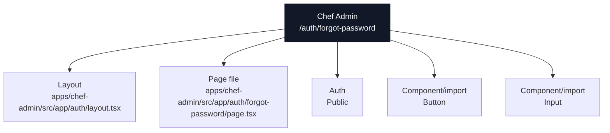

### Actual Page Information

| Field | Value |
| --- | --- |
| App | Chef Admin |
| Domain | `chef.ridendine.ca` |
| Route | `/auth/forgot-password` |
| Status | `PARTIAL` |
| Auth | Public |
| Page file | [apps/chef-admin/src/app/auth/forgot-password/page.tsx](../../../../apps/chef-admin/src/app/auth/forgot-password/page.tsx) |
| Layout | [apps/chef-admin/src/app/auth/layout.tsx](../../../../apps/chef-admin/src/app/auth/layout.tsx) |
| Data source summary | @ridendine/auth, @ridendine/ui |

### Data And API Wiring

| Type | Details |
| --- | --- |
| DB tables/RPCs | None detected |
| Fetch/API calls | None detected |
| Shared packages | @ridendine/auth, @ridendine/ui |
| Components/imports | `Button`, `Input` |
| Environment vars | None detected |

### Navigation And Links

| Status | Kind | Target | Resolved app | Resolved file | Notes |
| --- | --- | --- | --- | --- | --- |
| WORKING | href | `/auth/login` | Chef Admin | [apps/chef-admin/src/app/auth/login/page.tsx](../../../../apps/chef-admin/src/app/auth/login/page.tsx) | href resolves to page /auth/login |

### API Calls From This Page

No outgoing API/fetch calls detected.

### Incoming References

| Source app | Source file | Kind | Target | Status |
| --- | --- | --- | --- | --- |
| Chef Admin | [apps/chef-admin/src/app/auth/login/page.tsx](../../../../apps/chef-admin/src/app/auth/login/page.tsx) | href | `/auth/forgot-password` | WORKING |

### Review Notes

- Page status is PARTIAL; review auth/data/API metadata and runtime behavior.

---

## Chef Admin: `/auth/login`

### Page Diagram

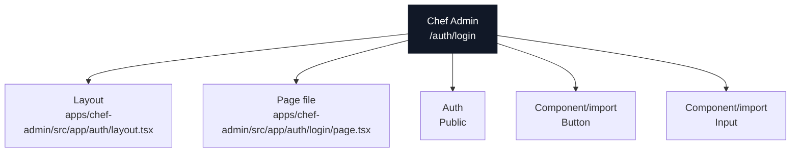

### Actual Page Information

| Field | Value |
| --- | --- |
| App | Chef Admin |
| Domain | `chef.ridendine.ca` |
| Route | `/auth/login` |
| Status | `PARTIAL` |
| Auth | Public |
| Page file | [apps/chef-admin/src/app/auth/login/page.tsx](../../../../apps/chef-admin/src/app/auth/login/page.tsx) |
| Layout | [apps/chef-admin/src/app/auth/layout.tsx](../../../../apps/chef-admin/src/app/auth/layout.tsx) |
| Data source summary | @ridendine/auth, @ridendine/ui |

### Data And API Wiring

| Type | Details |
| --- | --- |
| DB tables/RPCs | None detected |
| Fetch/API calls | None detected |
| Shared packages | @ridendine/auth, @ridendine/ui |
| Components/imports | `Button`, `Input` |
| Environment vars | None detected |

### Navigation And Links

| Status | Kind | Target | Resolved app | Resolved file | Notes |
| --- | --- | --- | --- | --- | --- |
| WORKING | href | `/auth/forgot-password` | Chef Admin | [apps/chef-admin/src/app/auth/forgot-password/page.tsx](../../../../apps/chef-admin/src/app/auth/forgot-password/page.tsx) | href resolves to page /auth/forgot-password |
| WORKING | href | `/auth/signup` | Chef Admin | [apps/chef-admin/src/app/auth/signup/page.tsx](../../../../apps/chef-admin/src/app/auth/signup/page.tsx) | href resolves to page /auth/signup |

### API Calls From This Page

No outgoing API/fetch calls detected.

### Incoming References

| Source app | Source file | Kind | Target | Status |
| --- | --- | --- | --- | --- |
| Chef Admin | [apps/chef-admin/src/app/auth/forgot-password/page.tsx](../../../../apps/chef-admin/src/app/auth/forgot-password/page.tsx) | href | `/auth/login` | WORKING |
| Chef Admin | [apps/chef-admin/src/app/auth/signup/page.tsx](../../../../apps/chef-admin/src/app/auth/signup/page.tsx) | href | `/auth/login` | WORKING |
| Chef Admin | [apps/chef-admin/src/app/auth/signup/page.tsx](../../../../apps/chef-admin/src/app/auth/signup/page.tsx) | router.push | `/auth/login?signup=success` | WORKING |
| Chef Admin | [apps/chef-admin/src/app/dashboard/storefront/page.tsx](../../../../apps/chef-admin/src/app/dashboard/storefront/page.tsx) | href | `/auth/login` | WORKING |
| Chef Admin | [apps/chef-admin/src/app/dashboard/storefront/setup/page.tsx](../../../../apps/chef-admin/src/app/dashboard/storefront/setup/page.tsx) | href | `/auth/login?redirect=/dashboard/storefront/setup` | WORKING |
| Chef Admin | [apps/chef-admin/src/components/layout/header.tsx](../../../../apps/chef-admin/src/components/layout/header.tsx) | router.push | `/auth/login` | WORKING |

### Review Notes

- Page status is PARTIAL; review auth/data/API metadata and runtime behavior.

---

## Chef Admin: `/auth/signup`

### Page Diagram

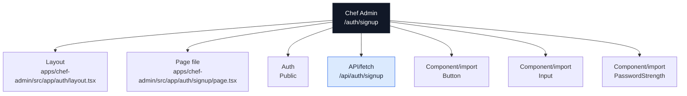

### Actual Page Information

| Field | Value |
| --- | --- |
| App | Chef Admin |
| Domain | `chef.ridendine.ca` |
| Route | `/auth/signup` |
| Status | `PARTIAL` |
| Auth | Public |
| Page file | [apps/chef-admin/src/app/auth/signup/page.tsx](../../../../apps/chef-admin/src/app/auth/signup/page.tsx) |
| Layout | [apps/chef-admin/src/app/auth/layout.tsx](../../../../apps/chef-admin/src/app/auth/layout.tsx) |
| Data source summary | @ridendine/ui |

### Data And API Wiring

| Type | Details |
| --- | --- |
| DB tables/RPCs | None detected |
| Fetch/API calls | `/api/auth/signup` (POST) |
| Shared packages | @ridendine/ui |
| Components/imports | `Button`, `Input`, `PasswordStrength` |
| Environment vars | None detected |

### Navigation And Links

| Status | Kind | Target | Resolved app | Resolved file | Notes |
| --- | --- | --- | --- | --- | --- |
| WORKING | href | `/auth/login` | Chef Admin | [apps/chef-admin/src/app/auth/login/page.tsx](../../../../apps/chef-admin/src/app/auth/login/page.tsx) | href resolves to page /auth/login |
| WORKING | router.push | `/auth/login?signup=success` | Chef Admin | [apps/chef-admin/src/app/auth/login/page.tsx](../../../../apps/chef-admin/src/app/auth/login/page.tsx) | router.push resolves to page /auth/login |
| WORKING | router.push | `/dashboard/storefront` | Chef Admin | [apps/chef-admin/src/app/dashboard/storefront/page.tsx](../../../../apps/chef-admin/src/app/dashboard/storefront/page.tsx) | router.push resolves to page /dashboard/storefront |
| WORKING | href | `/privacy` | Chef Admin | [apps/chef-admin/src/app/privacy/page.tsx](../../../../apps/chef-admin/src/app/privacy/page.tsx) | href resolves to page /privacy |
| WORKING | href | `/terms` | Chef Admin | [apps/chef-admin/src/app/terms/page.tsx](../../../../apps/chef-admin/src/app/terms/page.tsx) | href resolves to page /terms |

### API Calls From This Page

| Status | Kind | Target | Resolved app | Resolved file | Notes |
| --- | --- | --- | --- | --- | --- |
| WORKING | fetch | `/api/auth/signup` | Chef Admin | [apps/chef-admin/src/app/api/auth/signup/route.ts](../../../../apps/chef-admin/src/app/api/auth/signup/route.ts) | fetch resolves to API /api/auth/signup |

### Incoming References

| Source app | Source file | Kind | Target | Status |
| --- | --- | --- | --- | --- |
| Chef Admin | [apps/chef-admin/src/app/auth/login/page.tsx](../../../../apps/chef-admin/src/app/auth/login/page.tsx) | href | `/auth/signup` | WORKING |
| Chef Admin | [apps/chef-admin/src/app/dashboard/storefront/setup/page.tsx](../../../../apps/chef-admin/src/app/dashboard/storefront/setup/page.tsx) | href | `/auth/signup` | WORKING |
| Chef Admin | [apps/chef-admin/src/app/privacy/page.tsx](../../../../apps/chef-admin/src/app/privacy/page.tsx) | href | `/auth/signup` | WORKING |
| Chef Admin | [apps/chef-admin/src/app/terms/page.tsx](../../../../apps/chef-admin/src/app/terms/page.tsx) | href | `/auth/signup` | WORKING |

### Review Notes

- Page status is PARTIAL; review auth/data/API metadata and runtime behavior.

---

## Chef Admin: `/dashboard/analytics`

### Page Diagram

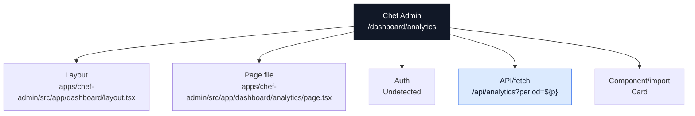

### Actual Page Information

| Field | Value |
| --- | --- |
| App | Chef Admin |
| Domain | `chef.ridendine.ca` |
| Route | `/dashboard/analytics` |
| Status | `PARTIAL` |
| Auth | Undetected |
| Page file | [apps/chef-admin/src/app/dashboard/analytics/page.tsx](../../../../apps/chef-admin/src/app/dashboard/analytics/page.tsx) |
| Layout | [apps/chef-admin/src/app/dashboard/layout.tsx](../../../../apps/chef-admin/src/app/dashboard/layout.tsx) |
| Data source summary | @ridendine/ui |

### Data And API Wiring

| Type | Details |
| --- | --- |
| DB tables/RPCs | None detected |
| Fetch/API calls | `/api/analytics?period=${p}` (GET) |
| Shared packages | @ridendine/ui |
| Components/imports | `Card` |
| Environment vars | None detected |

### Navigation And Links

No outgoing page-navigation links detected.

### API Calls From This Page

| Status | Kind | Target | Resolved app | Resolved file | Notes |
| --- | --- | --- | --- | --- | --- |
| WORKING | fetch | `/api/analytics?period=${p}` | Chef Admin | [apps/chef-admin/src/app/api/analytics/route.ts](../../../../apps/chef-admin/src/app/api/analytics/route.ts) | fetch resolves to API /api/analytics |

### Incoming References

No incoming static references detected.

### Review Notes

- Page status is PARTIAL; review auth/data/API metadata and runtime behavior.

---

## Chef Admin: `/dashboard/availability`

### Page Diagram

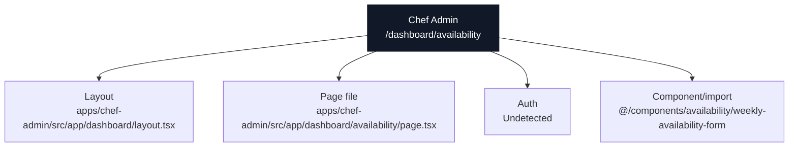

### Actual Page Information

| Field | Value |
| --- | --- |
| App | Chef Admin |
| Domain | `chef.ridendine.ca` |
| Route | `/dashboard/availability` |
| Status | `WIRED` |
| Auth | Undetected |
| Page file | [apps/chef-admin/src/app/dashboard/availability/page.tsx](../../../../apps/chef-admin/src/app/dashboard/availability/page.tsx) |
| Layout | [apps/chef-admin/src/app/dashboard/layout.tsx](../../../../apps/chef-admin/src/app/dashboard/layout.tsx) |
| Data source summary | Static/client component/undetected |

### Data And API Wiring

| Type | Details |
| --- | --- |
| DB tables/RPCs | None detected |
| Fetch/API calls | None detected |
| Shared packages | None detected |
| Components/imports | `@/components/availability/weekly-availability-form` |
| Environment vars | None detected |

### Navigation And Links

No outgoing page-navigation links detected.

### API Calls From This Page

No outgoing API/fetch calls detected.

### Incoming References

| Source app | Source file | Kind | Target | Status |
| --- | --- | --- | --- | --- |
| Chef Admin | [apps/chef-admin/src/app/dashboard/page.tsx](../../../../apps/chef-admin/src/app/dashboard/page.tsx) | href | `/dashboard/availability` | WORKING |

### Review Notes

- Static wiring scan did not flag this page, but runtime auth, DB data, and external services still need smoke/e2e proof.

---

## Chef Admin: `/dashboard/menu`

### Page Diagram

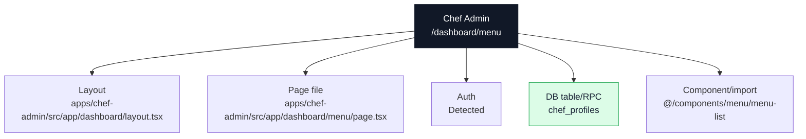

### Actual Page Information

| Field | Value |
| --- | --- |
| App | Chef Admin |
| Domain | `chef.ridendine.ca` |
| Route | `/dashboard/menu` |
| Status | `WIRED` |
| Auth | Detected |
| Page file | [apps/chef-admin/src/app/dashboard/menu/page.tsx](../../../../apps/chef-admin/src/app/dashboard/menu/page.tsx) |
| Layout | [apps/chef-admin/src/app/dashboard/layout.tsx](../../../../apps/chef-admin/src/app/dashboard/layout.tsx) |
| Data source summary | table:chef_profiles, @ridendine/db |

### Data And API Wiring

| Type | Details |
| --- | --- |
| DB tables/RPCs | `chef_profiles` |
| Fetch/API calls | None detected |
| Shared packages | @ridendine/db |
| Components/imports | `@/components/menu/menu-list` |
| Environment vars | None detected |

### Navigation And Links

No outgoing page-navigation links detected.

### API Calls From This Page

No outgoing API/fetch calls detected.

### Incoming References

| Source app | Source file | Kind | Target | Status |
| --- | --- | --- | --- | --- |
| Chef Admin | [apps/chef-admin/src/app/dashboard/page.tsx](../../../../apps/chef-admin/src/app/dashboard/page.tsx) | href | `/dashboard/menu` | WORKING |

### Review Notes

- Static wiring scan did not flag this page, but runtime auth, DB data, and external services still need smoke/e2e proof.

---

## Chef Admin: `/dashboard/orders/:id`

### Page Diagram

### Actual Page Information

| Field | Value |
| --- | --- |
| App | Chef Admin |
| Domain | `chef.ridendine.ca` |
| Route | `/dashboard/orders/:id` |
| Status | `WIRED` |
| Auth | Detected |
| Page file | [apps/chef-admin/src/app/dashboard/orders/[id]/page.tsx](../../../../apps/chef-admin/src/app/dashboard/orders/[id]/page.tsx) |
| Layout | [apps/chef-admin/src/app/dashboard/layout.tsx](../../../../apps/chef-admin/src/app/dashboard/layout.tsx) |
| Data source summary | table:chef_profiles, table:chef_storefronts, table:orders, @ridendine/db, @ridendine/ui |

### Data And API Wiring

| Type | Details |
| --- | --- |
| DB tables/RPCs | `chef_profiles`, `chef_storefronts`, `orders` |
| Fetch/API calls | None detected |
| Shared packages | @ridendine/db, @ridendine/ui |
| Components/imports | `Badge`, `Card` |
| Environment vars | None detected |

### Navigation And Links

| Status | Kind | Target | Resolved app | Resolved file | Notes |
| --- | --- | --- | --- | --- | --- |
| WORKING | href | `/dashboard/orders` | Chef Admin | [apps/chef-admin/src/app/dashboard/orders/page.tsx](../../../../apps/chef-admin/src/app/dashboard/orders/page.tsx) | href resolves to page /dashboard/orders |

### API Calls From This Page

No outgoing API/fetch calls detected.

### Incoming References

| Source app | Source file | Kind | Target | Status |
| --- | --- | --- | --- | --- |
| Chef Admin | [apps/chef-admin/src/components/orders/orders-list.tsx](../../../../apps/chef-admin/src/components/orders/orders-list.tsx) | href | `/dashboard/orders/${order.id}` | WORKING_DYNAMIC |

### Review Notes

- Static wiring scan did not flag this page, but runtime auth, DB data, and external services still need smoke/e2e proof.

---

## Chef Admin: `/dashboard/orders`

### Page Diagram

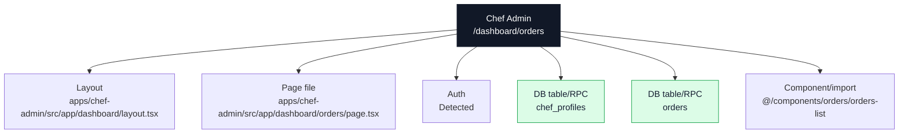

### Actual Page Information

| Field | Value |
| --- | --- |
| App | Chef Admin |
| Domain | `chef.ridendine.ca` |
| Route | `/dashboard/orders` |
| Status | `WIRED` |
| Auth | Detected |
| Page file | [apps/chef-admin/src/app/dashboard/orders/page.tsx](../../../../apps/chef-admin/src/app/dashboard/orders/page.tsx) |
| Layout | [apps/chef-admin/src/app/dashboard/layout.tsx](../../../../apps/chef-admin/src/app/dashboard/layout.tsx) |
| Data source summary | table:chef_profiles, table:orders, @ridendine/db |

### Data And API Wiring

| Type | Details |
| --- | --- |
| DB tables/RPCs | `chef_profiles`, `orders` |
| Fetch/API calls | None detected |
| Shared packages | @ridendine/db |
| Components/imports | `@/components/orders/orders-list` |
| Environment vars | None detected |

### Navigation And Links

No outgoing page-navigation links detected.

### API Calls From This Page

No outgoing API/fetch calls detected.

### Incoming References

| Source app | Source file | Kind | Target | Status |
| --- | --- | --- | --- | --- |
| Chef Admin | [apps/chef-admin/src/app/dashboard/orders/[id]/page.tsx](../../../../apps/chef-admin/src/app/dashboard/orders/[id]/page.tsx) | href | `/dashboard/orders` | WORKING |
| Chef Admin | [apps/chef-admin/src/app/dashboard/page.tsx](../../../../apps/chef-admin/src/app/dashboard/page.tsx) | href | `/dashboard/orders` | WORKING |

### Review Notes

- Static wiring scan did not flag this page, but runtime auth, DB data, and external services still need smoke/e2e proof.

---

## Chef Admin: `/dashboard`

### Page Diagram

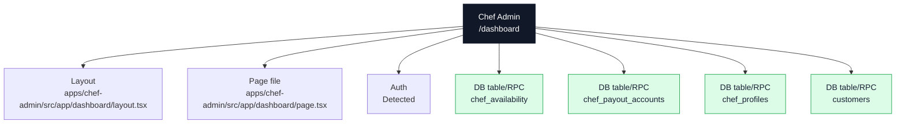

### Actual Page Information

| Field | Value |
| --- | --- |
| App | Chef Admin |
| Domain | `chef.ridendine.ca` |
| Route | `/dashboard` |
| Status | `WIRED` |
| Auth | Detected |
| Page file | [apps/chef-admin/src/app/dashboard/page.tsx](../../../../apps/chef-admin/src/app/dashboard/page.tsx) |
| Layout | [apps/chef-admin/src/app/dashboard/layout.tsx](../../../../apps/chef-admin/src/app/dashboard/layout.tsx) |
| Data source summary | table:chef_availability, table:chef_payout_accounts, table:chef_profiles, table:customers, @ridendine/db |

### Data And API Wiring

| Type | Details |
| --- | --- |
| DB tables/RPCs | `chef_availability`, `chef_payout_accounts`, `chef_profiles`, `customers` |
| Fetch/API calls | None detected |
| Shared packages | @ridendine/db |
| Components/imports | None detected |
| Environment vars | None detected |

### Navigation And Links

| Status | Kind | Target | Resolved app | Resolved file | Notes |
| --- | --- | --- | --- | --- | --- |
| WORKING | href | `/dashboard/availability` | Chef Admin | [apps/chef-admin/src/app/dashboard/availability/page.tsx](../../../../apps/chef-admin/src/app/dashboard/availability/page.tsx) | href resolves to page /dashboard/availability |
| WORKING | href | `/dashboard/menu` | Chef Admin | [apps/chef-admin/src/app/dashboard/menu/page.tsx](../../../../apps/chef-admin/src/app/dashboard/menu/page.tsx) | href resolves to page /dashboard/menu |
| WORKING | href | `/dashboard/orders` | Chef Admin | [apps/chef-admin/src/app/dashboard/orders/page.tsx](../../../../apps/chef-admin/src/app/dashboard/orders/page.tsx) | href resolves to page /dashboard/orders |
| WORKING | href | `/dashboard/storefront` | Chef Admin | [apps/chef-admin/src/app/dashboard/storefront/page.tsx](../../../../apps/chef-admin/src/app/dashboard/storefront/page.tsx) | href resolves to page /dashboard/storefront |
| WORKING_DYNAMIC | href | `https://ridendine.ca/chefs/${storefront.slug}` | Customer Web | [apps/web/src/app/chefs/[slug]/page.tsx](../../../../apps/web/src/app/chefs/[slug]/page.tsx) | href resolves to page /chefs/:slug |

### API Calls From This Page

No outgoing API/fetch calls detected.

### Incoming References

| Source app | Source file | Kind | Target | Status |
| --- | --- | --- | --- | --- |
| Chef Admin | [apps/chef-admin/src/app/error.tsx](../../../../apps/chef-admin/src/app/error.tsx) | href | `/dashboard` | WORKING |
| Chef Admin | [apps/chef-admin/src/app/page.tsx](../../../../apps/chef-admin/src/app/page.tsx) | redirect | `/dashboard` | WORKING |
| Chef Admin | [apps/chef-admin/src/components/layout/header.tsx](../../../../apps/chef-admin/src/components/layout/header.tsx) | href | `/dashboard` | WORKING |
| Chef Admin | [apps/chef-admin/src/components/layout/sidebar.tsx](../../../../apps/chef-admin/src/components/layout/sidebar.tsx) | href | `/dashboard` | WORKING |

### Review Notes

- Static wiring scan did not flag this page, but runtime auth, DB data, and external services still need smoke/e2e proof.

---

## Chef Admin: `/dashboard/payouts`

### Page Diagram

```mermaid
flowchart TB
  Page["Chef Admin<br/>/dashboard/payouts"]
  Layout["Layout<br/>apps/chef-admin/src/app/dashboard/layout.tsx"]
  File["Page file<br/>apps/chef-admin/src/app/dashboard/payouts/page.tsx"]
  Auth["Auth<br/>Detected"]
  Page --> Layout
  Page --> File
  Page --> Auth
  Table0["DB table/RPC<br/>chef_payout_accounts"]
  Page --> Table0
  Table1["DB table/RPC<br/>chef_payouts"]
  Page --> Table1
  Table2["DB table/RPC<br/>chef_profiles"]
  Page --> Table2
  Table3["DB table/RPC<br/>chef_storefronts"]
  Page --> Table3
  Table4["DB table/RPC<br/>orders"]
  Page --> Table4
  Api0["API/fetch<br/>/api/payouts/request"]
  Page --> Api0
  Api1["API/fetch<br/>/api/payouts/setup"]
  Page --> Api1
  Component0["Component/import<br/>Badge"]
  Page --> Component0
  Component1["Component/import<br/>Button"]
  Page --> Component1
  Component2["Component/import<br/>Card"]
  Page --> Component2
  classDef page fill:#111827,stroke:#111827,color:#ffffff
  classDef data fill:#dcfce7,stroke:#16a34a,color:#172033
  classDef api fill:#dbeafe,stroke:#2563eb,color:#172033
  classDef warn fill:#fef3c7,stroke:#f59e0b,color:#172033
  class Page page
  class Table0,Table1,Table2,Table3,Table4 data
  class Api0,Api1 api
```

### Actual Page Information

| Field | Value |
| --- | --- |
| App | Chef Admin |
| Domain | `chef.ridendine.ca` |
| Route | `/dashboard/payouts` |
| Status | `WIRED` |
| Auth | Detected |
| Page file | [apps/chef-admin/src/app/dashboard/payouts/page.tsx](../../../../apps/chef-admin/src/app/dashboard/payouts/page.tsx) |
| Layout | [apps/chef-admin/src/app/dashboard/layout.tsx](../../../../apps/chef-admin/src/app/dashboard/layout.tsx) |
| Data source summary | table:chef_payout_accounts, table:chef_payouts, table:chef_profiles, table:chef_storefronts, table:orders, @ridendine/db, @ridendine/ui |

### Data And API Wiring

| Type | Details |
| --- | --- |
| DB tables/RPCs | `chef_payout_accounts`, `chef_payouts`, `chef_profiles`, `chef_storefronts`, `orders` |
| Fetch/API calls | `/api/payouts/request` (POST) `/api/payouts/setup` (POST) |
| Shared packages | @ridendine/db, @ridendine/ui |
| Components/imports | `Badge`, `Button`, `Card` |
| Environment vars | None detected |

### Navigation And Links

No outgoing page-navigation links detected.

### API Calls From This Page

| Status | Kind | Target | Resolved app | Resolved file | Notes |
| --- | --- | --- | --- | --- | --- |
| WORKING | fetch | `/api/payouts/request` | Chef Admin | [apps/chef-admin/src/app/api/payouts/request/route.ts](../../../../apps/chef-admin/src/app/api/payouts/request/route.ts) | fetch resolves to API /api/payouts/request |
| WORKING | fetch | `/api/payouts/setup` | Chef Admin | [apps/chef-admin/src/app/api/payouts/setup/route.ts](../../../../apps/chef-admin/src/app/api/payouts/setup/route.ts) | fetch resolves to API /api/payouts/setup |

### Incoming References

No incoming static references detected.

### Review Notes

- Static wiring scan did not flag this page, but runtime auth, DB data, and external services still need smoke/e2e proof.

---

## Chef Admin: `/dashboard/reviews`

### Page Diagram

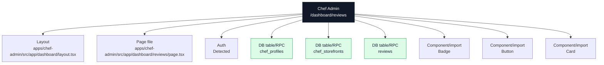

### Actual Page Information

| Field | Value |
| --- | --- |
| App | Chef Admin |
| Domain | `chef.ridendine.ca` |
| Route | `/dashboard/reviews` |
| Status | `PARTIAL` |
| Auth | Detected |
| Page file | [apps/chef-admin/src/app/dashboard/reviews/page.tsx](../../../../apps/chef-admin/src/app/dashboard/reviews/page.tsx) |
| Layout | [apps/chef-admin/src/app/dashboard/layout.tsx](../../../../apps/chef-admin/src/app/dashboard/layout.tsx) |
| Data source summary | table:chef_profiles, table:chef_storefronts, table:reviews, @ridendine/db, @ridendine/ui |

### Data And API Wiring

| Type | Details |
| --- | --- |
| DB tables/RPCs | `chef_profiles`, `chef_storefronts`, `reviews` |
| Fetch/API calls | None detected |
| Shared packages | @ridendine/db, @ridendine/ui |
| Components/imports | `Badge`, `Button`, `Card` |
| Environment vars | None detected |

### Navigation And Links

No outgoing page-navigation links detected.

### API Calls From This Page

No outgoing API/fetch calls detected.

### Incoming References

No incoming static references detected.

### Review Notes

- Page status is PARTIAL; review auth/data/API metadata and runtime behavior.

---

## Chef Admin: `/dashboard/settings`

### Page Diagram

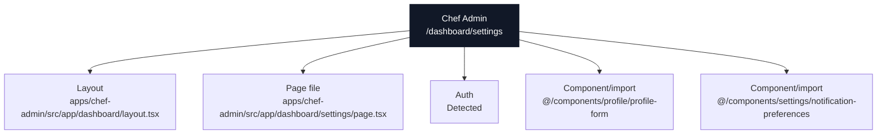

### Actual Page Information

| Field | Value |
| --- | --- |
| App | Chef Admin |
| Domain | `chef.ridendine.ca` |
| Route | `/dashboard/settings` |
| Status | `WIRED` |
| Auth | Detected |
| Page file | [apps/chef-admin/src/app/dashboard/settings/page.tsx](../../../../apps/chef-admin/src/app/dashboard/settings/page.tsx) |
| Layout | [apps/chef-admin/src/app/dashboard/layout.tsx](../../../../apps/chef-admin/src/app/dashboard/layout.tsx) |
| Data source summary | @ridendine/db |

### Data And API Wiring

| Type | Details |
| --- | --- |
| DB tables/RPCs | None detected |
| Fetch/API calls | None detected |
| Shared packages | @ridendine/db |
| Components/imports | `@/components/profile/profile-form`, `@/components/settings/notification-preferences` |
| Environment vars | None detected |

### Navigation And Links

No outgoing page-navigation links detected.

### API Calls From This Page

No outgoing API/fetch calls detected.

### Incoming References

No incoming static references detected.

### Review Notes

- Static wiring scan did not flag this page, but runtime auth, DB data, and external services still need smoke/e2e proof.

---

## Chef Admin: `/dashboard/storefront`

### Page Diagram

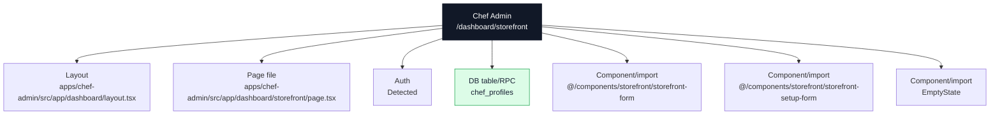

### Actual Page Information

| Field | Value |
| --- | --- |
| App | Chef Admin |
| Domain | `chef.ridendine.ca` |
| Route | `/dashboard/storefront` |
| Status | `WIRED` |
| Auth | Detected |
| Page file | [apps/chef-admin/src/app/dashboard/storefront/page.tsx](../../../../apps/chef-admin/src/app/dashboard/storefront/page.tsx) |
| Layout | [apps/chef-admin/src/app/dashboard/layout.tsx](../../../../apps/chef-admin/src/app/dashboard/layout.tsx) |
| Data source summary | table:chef_profiles, @ridendine/db, @ridendine/ui |

### Data And API Wiring

| Type | Details |
| --- | --- |
| DB tables/RPCs | `chef_profiles` |
| Fetch/API calls | None detected |
| Shared packages | @ridendine/db, @ridendine/ui |
| Components/imports | `@/components/storefront/storefront-form`, `@/components/storefront/storefront-setup-form`, `EmptyState` |
| Environment vars | None detected |

### Navigation And Links

| Status | Kind | Target | Resolved app | Resolved file | Notes |
| --- | --- | --- | --- | --- | --- |
| WORKING | href | `/auth/login` | Chef Admin | [apps/chef-admin/src/app/auth/login/page.tsx](../../../../apps/chef-admin/src/app/auth/login/page.tsx) | href resolves to page /auth/login |
| WORKING | href | `/dashboard/storefront/setup` | Chef Admin | [apps/chef-admin/src/app/dashboard/storefront/setup/page.tsx](../../../../apps/chef-admin/src/app/dashboard/storefront/setup/page.tsx) | href resolves to page /dashboard/storefront/setup |

### API Calls From This Page

No outgoing API/fetch calls detected.

### Incoming References

| Source app | Source file | Kind | Target | Status |
| --- | --- | --- | --- | --- |
| Chef Admin | [apps/chef-admin/src/app/auth/signup/page.tsx](../../../../apps/chef-admin/src/app/auth/signup/page.tsx) | router.push | `/dashboard/storefront` | WORKING |
| Chef Admin | [apps/chef-admin/src/app/dashboard/page.tsx](../../../../apps/chef-admin/src/app/dashboard/page.tsx) | href | `/dashboard/storefront` | WORKING |
| Chef Admin | [apps/chef-admin/src/app/dashboard/storefront/setup/page.tsx](../../../../apps/chef-admin/src/app/dashboard/storefront/setup/page.tsx) | redirect | `/dashboard/storefront` | WORKING |

### Review Notes

- Static wiring scan did not flag this page, but runtime auth, DB data, and external services still need smoke/e2e proof.

---

## Chef Admin: `/dashboard/storefront/setup`

### Page Diagram

### Actual Page Information

| Field | Value |
| --- | --- |
| App | Chef Admin |
| Domain | `chef.ridendine.ca` |
| Route | `/dashboard/storefront/setup` |
| Status | `WIRED` |
| Auth | Detected |
| Page file | [apps/chef-admin/src/app/dashboard/storefront/setup/page.tsx](../../../../apps/chef-admin/src/app/dashboard/storefront/setup/page.tsx) |
| Layout | [apps/chef-admin/src/app/dashboard/layout.tsx](../../../../apps/chef-admin/src/app/dashboard/layout.tsx) |
| Data source summary | table:chef_profiles, @ridendine/db, @ridendine/ui |

### Data And API Wiring

| Type | Details |
| --- | --- |
| DB tables/RPCs | `chef_profiles` |
| Fetch/API calls | None detected |
| Shared packages | @ridendine/db, @ridendine/ui |
| Components/imports | `@/components/storefront/storefront-setup-form`, `EmptyState` |
| Environment vars | None detected |

### Navigation And Links

| Status | Kind | Target | Resolved app | Resolved file | Notes |
| --- | --- | --- | --- | --- | --- |
| WORKING | href | `/auth/login?redirect=/dashboard/storefront/setup` | Chef Admin | [apps/chef-admin/src/app/auth/login/page.tsx](../../../../apps/chef-admin/src/app/auth/login/page.tsx) | href resolves to page /auth/login |
| WORKING | href | `/auth/signup` | Chef Admin | [apps/chef-admin/src/app/auth/signup/page.tsx](../../../../apps/chef-admin/src/app/auth/signup/page.tsx) | href resolves to page /auth/signup |
| WORKING | redirect | `/dashboard/storefront` | Chef Admin | [apps/chef-admin/src/app/dashboard/storefront/page.tsx](../../../../apps/chef-admin/src/app/dashboard/storefront/page.tsx) | redirect resolves to page /dashboard/storefront |

### API Calls From This Page

No outgoing API/fetch calls detected.

### Incoming References

| Source app | Source file | Kind | Target | Status |
| --- | --- | --- | --- | --- |
| Chef Admin | [apps/chef-admin/src/app/dashboard/storefront/page.tsx](../../../../apps/chef-admin/src/app/dashboard/storefront/page.tsx) | href | `/dashboard/storefront/setup` | WORKING |

### Review Notes

- Static wiring scan did not flag this page, but runtime auth, DB data, and external services still need smoke/e2e proof.

---

## Chef Admin: `/`

### Page Diagram

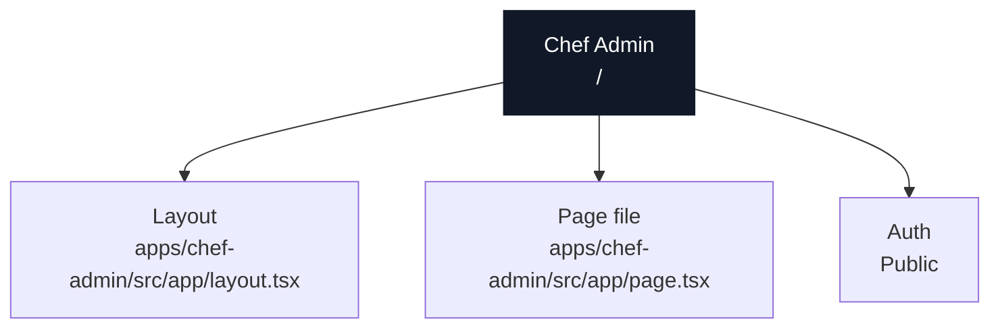

### Actual Page Information

| Field | Value |
| --- | --- |
| App | Chef Admin |
| Domain | `chef.ridendine.ca` |
| Route | `/` |
| Status | `WIRED` |
| Auth | Public |
| Page file | [apps/chef-admin/src/app/page.tsx](../../../../apps/chef-admin/src/app/page.tsx) |
| Layout | [apps/chef-admin/src/app/layout.tsx](../../../../apps/chef-admin/src/app/layout.tsx) |
| Data source summary | Static/client component/undetected |

### Data And API Wiring

| Type | Details |
| --- | --- |
| DB tables/RPCs | None detected |
| Fetch/API calls | None detected |
| Shared packages | None detected |
| Components/imports | None detected |
| Environment vars | None detected |

### Navigation And Links

| Status | Kind | Target | Resolved app | Resolved file | Notes |
| --- | --- | --- | --- | --- | --- |
| WORKING | redirect | `/dashboard` | Chef Admin | [apps/chef-admin/src/app/dashboard/page.tsx](../../../../apps/chef-admin/src/app/dashboard/page.tsx) | redirect resolves to page /dashboard |

### API Calls From This Page

No outgoing API/fetch calls detected.

### Incoming References

| Source app | Source file | Kind | Target | Status |
| --- | --- | --- | --- | --- |
| Chef Admin | [apps/chef-admin/src/components/auth/auth-layout.tsx](../../../../apps/chef-admin/src/components/auth/auth-layout.tsx) | href | `/` | WORKING |
| Chef Admin | [apps/chef-admin/src/components/layout/sidebar.tsx](../../../../apps/chef-admin/src/components/layout/sidebar.tsx) | href | `/` | WORKING |

### Review Notes

- Static wiring scan did not flag this page, but runtime auth, DB data, and external services still need smoke/e2e proof.

---

## Chef Admin: `/privacy`

### Page Diagram

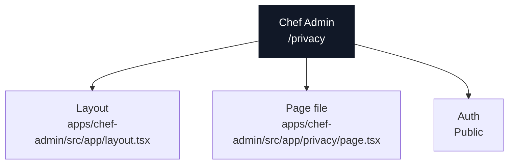

### Actual Page Information

| Field | Value |
| --- | --- |
| App | Chef Admin |
| Domain | `chef.ridendine.ca` |
| Route | `/privacy` |
| Status | `WIRED` |
| Auth | Public |
| Page file | [apps/chef-admin/src/app/privacy/page.tsx](../../../../apps/chef-admin/src/app/privacy/page.tsx) |
| Layout | [apps/chef-admin/src/app/layout.tsx](../../../../apps/chef-admin/src/app/layout.tsx) |
| Data source summary | Static/client component/undetected |

### Data And API Wiring

| Type | Details |
| --- | --- |
| DB tables/RPCs | None detected |
| Fetch/API calls | None detected |
| Shared packages | None detected |
| Components/imports | None detected |
| Environment vars | None detected |

### Navigation And Links

| Status | Kind | Target | Resolved app | Resolved file | Notes |
| --- | --- | --- | --- | --- | --- |
| WORKING | href | `/auth/signup` | Chef Admin | [apps/chef-admin/src/app/auth/signup/page.tsx](../../../../apps/chef-admin/src/app/auth/signup/page.tsx) | href resolves to page /auth/signup |
| WORKING | href | `https://ridendine.ca/privacy` | Customer Web | [apps/web/src/app/privacy/page.tsx](../../../../apps/web/src/app/privacy/page.tsx) | href resolves to page /privacy |

### API Calls From This Page

No outgoing API/fetch calls detected.

### Incoming References

| Source app | Source file | Kind | Target | Status |
| --- | --- | --- | --- | --- |
| Chef Admin | [apps/chef-admin/src/app/auth/signup/page.tsx](../../../../apps/chef-admin/src/app/auth/signup/page.tsx) | href | `/privacy` | WORKING |

### Review Notes

- Static wiring scan did not flag this page, but runtime auth, DB data, and external services still need smoke/e2e proof.

---

## Chef Admin: `/terms`

### Page Diagram

### Actual Page Information

| Field | Value |
| --- | --- |
| App | Chef Admin |
| Domain | `chef.ridendine.ca` |
| Route | `/terms` |
| Status | `WIRED` |
| Auth | Public |
| Page file | [apps/chef-admin/src/app/terms/page.tsx](../../../../apps/chef-admin/src/app/terms/page.tsx) |
| Layout | [apps/chef-admin/src/app/layout.tsx](../../../../apps/chef-admin/src/app/layout.tsx) |
| Data source summary | Static/client component/undetected |

### Data And API Wiring

| Type | Details |
| --- | --- |
| DB tables/RPCs | None detected |
| Fetch/API calls | None detected |
| Shared packages | None detected |
| Components/imports | None detected |
| Environment vars | None detected |

### Navigation And Links

| Status | Kind | Target | Resolved app | Resolved file | Notes |
| --- | --- | --- | --- | --- | --- |
| WORKING | href | `/auth/signup` | Chef Admin | [apps/chef-admin/src/app/auth/signup/page.tsx](../../../../apps/chef-admin/src/app/auth/signup/page.tsx) | href resolves to page /auth/signup |
| WORKING | href | `https://ridendine.ca/terms` | Customer Web | [apps/web/src/app/terms/page.tsx](../../../../apps/web/src/app/terms/page.tsx) | href resolves to page /terms |

### API Calls From This Page

No outgoing API/fetch calls detected.

### Incoming References

| Source app | Source file | Kind | Target | Status |
| --- | --- | --- | --- | --- |
| Chef Admin | [apps/chef-admin/src/app/auth/signup/page.tsx](../../../../apps/chef-admin/src/app/auth/signup/page.tsx) | href | `/terms` | WORKING |

### Review Notes

- Static wiring scan did not flag this page, but runtime auth, DB data, and external services still need smoke/e2e proof.
