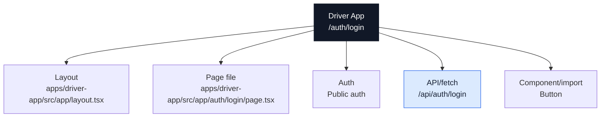
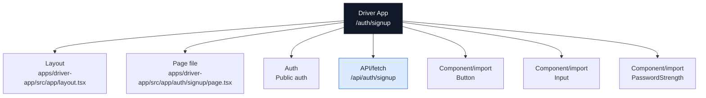
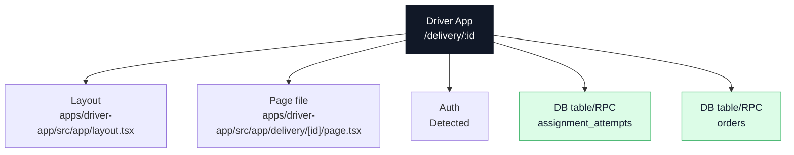
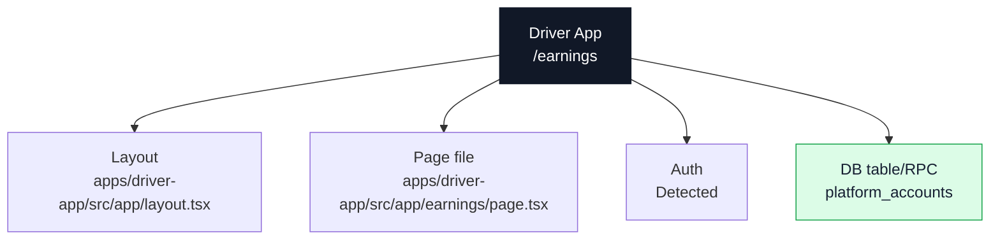
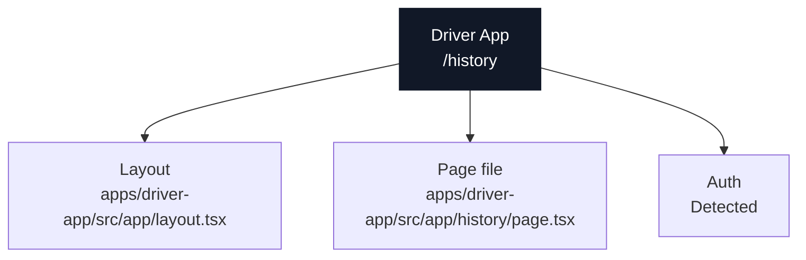
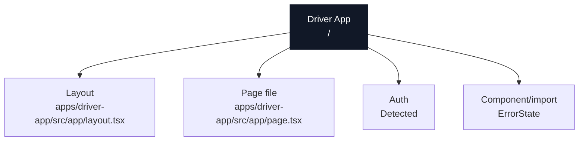
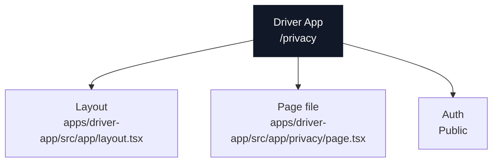
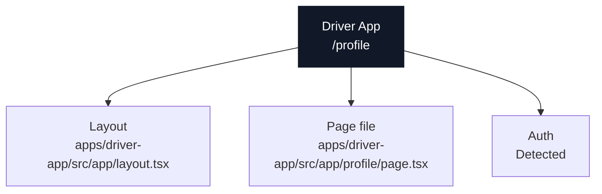
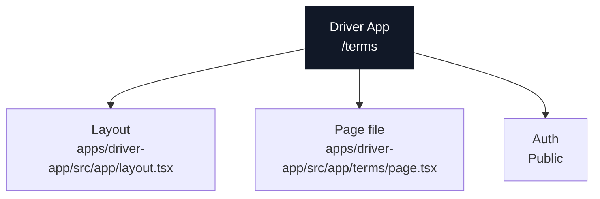

# Driver App Page Document

Domain: `driver.ridendine.ca`

Purpose: Driver onboarding, presence, delivery offers, active deliveries, location updates, history, earnings, and payout setup.

## Driver App: `/auth/login`

### Page Diagram

### Actual Page Information

| Field | Value |
| --- | --- |
| App | Driver App |
| Domain | `driver.ridendine.ca` |
| Route | `/auth/login` |
| Status | `WIRED` |
| Auth | Public auth |
| Page file | [apps/driver-app/src/app/auth/login/page.tsx](../../../../apps/driver-app/src/app/auth/login/page.tsx) |
| Layout | [apps/driver-app/src/app/layout.tsx](../../../../apps/driver-app/src/app/layout.tsx) |
| Data source summary | Public driver login surface wired to app-owned login API |

### Data And API Wiring

| Type | Details |
| --- | --- |
| DB tables/RPCs | None detected |
| Fetch/API calls | `/api/auth/login` (POST) |
| Shared packages | @ridendine/ui |
| Components/imports | `Button` |
| Environment vars | None detected |

### Navigation And Links

| Status | Kind | Target | Resolved app | Resolved file | Notes |
| --- | --- | --- | --- | --- | --- |
| WORKING | href | `/auth/signup` | Driver App | [apps/driver-app/src/app/auth/signup/page.tsx](../../../../apps/driver-app/src/app/auth/signup/page.tsx) | href resolves to page /auth/signup |

### API Calls From This Page

| Status | Kind | Target | Resolved app | Resolved file | Notes |
| --- | --- | --- | --- | --- | --- |
| WORKING | fetch | `/api/auth/login` | Driver App | [apps/driver-app/src/app/api/auth/login/route.ts](../../../../apps/driver-app/src/app/api/auth/login/route.ts) | fetch resolves to API /api/auth/login |

### Incoming References

| Source app | Source file | Kind | Target | Status |
| --- | --- | --- | --- | --- |
| Driver App | [apps/driver-app/src/app/auth/signup/page.tsx](../../../../apps/driver-app/src/app/auth/signup/page.tsx) | href | `/auth/login` | WORKING |
| Driver App | [apps/driver-app/src/app/auth/signup/page.tsx](../../../../apps/driver-app/src/app/auth/signup/page.tsx) | router.push | `/auth/login?signup=success` | WORKING |
| Driver App | [apps/driver-app/src/app/components/DriverDashboard.tsx](../../../../apps/driver-app/src/app/components/DriverDashboard.tsx) | router.push | `/auth/login` | WORKING |
| Driver App | [apps/driver-app/src/app/delivery/[id]/page.tsx](../../../../apps/driver-app/src/app/delivery/[id]/page.tsx) | redirect | `/auth/login` | WORKING |
| Driver App | [apps/driver-app/src/app/page.tsx](../../../../apps/driver-app/src/app/page.tsx) | redirect | `/auth/login` | WORKING |

### Review Notes

- Static wiring scan did not flag this page, but runtime auth, DB data, and external services still need smoke/e2e proof.

---

## Driver App: `/auth/signup`

### Page Diagram

### Actual Page Information

| Field | Value |
| --- | --- |
| App | Driver App |
| Domain | `driver.ridendine.ca` |
| Route | `/auth/signup` |
| Status | `WIRED` |
| Auth | Public auth |
| Page file | [apps/driver-app/src/app/auth/signup/page.tsx](../../../../apps/driver-app/src/app/auth/signup/page.tsx) |
| Layout | [apps/driver-app/src/app/layout.tsx](../../../../apps/driver-app/src/app/layout.tsx) |
| Data source summary | Public driver signup surface wired to driver signup API |

### Data And API Wiring

| Type | Details |
| --- | --- |
| DB tables/RPCs | None detected |
| Fetch/API calls | `/api/auth/signup` (POST) |
| Shared packages | @ridendine/ui |
| Components/imports | `Button`, `Input`, `PasswordStrength` |
| Environment vars | None detected |

### Navigation And Links

| Status | Kind | Target | Resolved app | Resolved file | Notes |
| --- | --- | --- | --- | --- | --- |
| WORKING | router.push | `/` | Driver App | [apps/driver-app/src/app/page.tsx](../../../../apps/driver-app/src/app/page.tsx) | router.push resolves to page / |
| WORKING | href | `/auth/login` | Driver App | [apps/driver-app/src/app/auth/login/page.tsx](../../../../apps/driver-app/src/app/auth/login/page.tsx) | href resolves to page /auth/login |
| WORKING | router.push | `/auth/login?signup=success` | Driver App | [apps/driver-app/src/app/auth/login/page.tsx](../../../../apps/driver-app/src/app/auth/login/page.tsx) | router.push resolves to page /auth/login |
| WORKING | href | `/privacy` | Driver App | [apps/driver-app/src/app/privacy/page.tsx](../../../../apps/driver-app/src/app/privacy/page.tsx) | href resolves to page /privacy |
| WORKING | href | `/terms` | Driver App | [apps/driver-app/src/app/terms/page.tsx](../../../../apps/driver-app/src/app/terms/page.tsx) | href resolves to page /terms |

### API Calls From This Page

| Status | Kind | Target | Resolved app | Resolved file | Notes |
| --- | --- | --- | --- | --- | --- |
| WORKING | fetch | `/api/auth/signup` | Driver App | [apps/driver-app/src/app/api/auth/signup/route.ts](../../../../apps/driver-app/src/app/api/auth/signup/route.ts) | fetch resolves to API /api/auth/signup |

### Incoming References

| Source app | Source file | Kind | Target | Status |
| --- | --- | --- | --- | --- |
| Driver App | [apps/driver-app/src/app/auth/login/page.tsx](../../../../apps/driver-app/src/app/auth/login/page.tsx) | href | `/auth/signup` | WORKING |
| Driver App | [apps/driver-app/src/app/privacy/page.tsx](../../../../apps/driver-app/src/app/privacy/page.tsx) | href | `/auth/signup` | WORKING |
| Driver App | [apps/driver-app/src/app/terms/page.tsx](../../../../apps/driver-app/src/app/terms/page.tsx) | href | `/auth/signup` | WORKING |

### Review Notes

- Static wiring scan did not flag this page, but runtime auth, DB data, and external services still need smoke/e2e proof.

---

## Driver App: `/delivery/:id`

### Page Diagram

### Actual Page Information

| Field | Value |
| --- | --- |
| App | Driver App |
| Domain | `driver.ridendine.ca` |
| Route | `/delivery/:id` |
| Status | `WIRED` |
| Auth | Detected |
| Page file | [apps/driver-app/src/app/delivery/[id]/page.tsx](../../../../apps/driver-app/src/app/delivery/[id]/page.tsx) |
| Layout | [apps/driver-app/src/app/layout.tsx](../../../../apps/driver-app/src/app/layout.tsx) |
| Data source summary | table:assignment_attempts, table:orders, @ridendine/db |

### Data And API Wiring

| Type | Details |
| --- | --- |
| DB tables/RPCs | `assignment_attempts`, `orders` |
| Fetch/API calls | None detected |
| Shared packages | @ridendine/db |
| Components/imports | None detected |
| Environment vars | None detected |

### Navigation And Links

| Status | Kind | Target | Resolved app | Resolved file | Notes |
| --- | --- | --- | --- | --- | --- |
| WORKING | redirect | `/auth/login` | Driver App | [apps/driver-app/src/app/auth/login/page.tsx](../../../../apps/driver-app/src/app/auth/login/page.tsx) | redirect resolves to page /auth/login |

### API Calls From This Page

No outgoing API/fetch calls detected.

### Incoming References

| Source app | Source file | Kind | Target | Status |
| --- | --- | --- | --- | --- |
| Driver App | [apps/driver-app/src/app/components/DriverDashboard.tsx](../../../../apps/driver-app/src/app/components/DriverDashboard.tsx) | href | `/delivery/${currentDelivery.id}` | WORKING_DYNAMIC |
| Driver App | [apps/driver-app/src/components/offer-alert.tsx](../../../../apps/driver-app/src/components/offer-alert.tsx) | window.location | `/delivery/${offer.deliveryId}` | WORKING_DYNAMIC |

### Review Notes

- Static wiring scan did not flag this page, but runtime auth, DB data, and external services still need smoke/e2e proof.

---

## Driver App: `/earnings`

### Page Diagram

### Actual Page Information

| Field | Value |
| --- | --- |
| App | Driver App |
| Domain | `driver.ridendine.ca` |
| Route | `/earnings` |
| Status | `WIRED` |
| Auth | Detected |
| Page file | [apps/driver-app/src/app/earnings/page.tsx](../../../../apps/driver-app/src/app/earnings/page.tsx) |
| Layout | [apps/driver-app/src/app/layout.tsx](../../../../apps/driver-app/src/app/layout.tsx) |
| Data source summary | table:platform_accounts, @ridendine/db |

### Data And API Wiring

| Type | Details |
| --- | --- |
| DB tables/RPCs | `platform_accounts` |
| Fetch/API calls | None detected |
| Shared packages | @ridendine/db |
| Components/imports | None detected |
| Environment vars | None detected |

### Navigation And Links

No outgoing page-navigation links detected.

### API Calls From This Page

No outgoing API/fetch calls detected.

### Incoming References

| Source app | Source file | Kind | Target | Status |
| --- | --- | --- | --- | --- |
| Driver App | [apps/driver-app/src/app/components/DriverDashboard.tsx](../../../../apps/driver-app/src/app/components/DriverDashboard.tsx) | href | `/earnings` | WORKING |
| Driver App | [apps/driver-app/src/app/settings/settings-client.tsx](../../../../apps/driver-app/src/app/settings/settings-client.tsx) | href | `/earnings` | WORKING |

### Review Notes

- Static wiring scan did not flag this page, but runtime auth, DB data, and external services still need smoke/e2e proof.

---

## Driver App: `/history`

### Page Diagram

### Actual Page Information

| Field | Value |
| --- | --- |
| App | Driver App |
| Domain | `driver.ridendine.ca` |
| Route | `/history` |
| Status | `WIRED` |
| Auth | Detected |
| Page file | [apps/driver-app/src/app/history/page.tsx](../../../../apps/driver-app/src/app/history/page.tsx) |
| Layout | [apps/driver-app/src/app/layout.tsx](../../../../apps/driver-app/src/app/layout.tsx) |
| Data source summary | @ridendine/db |

### Data And API Wiring

| Type | Details |
| --- | --- |
| DB tables/RPCs | None detected |
| Fetch/API calls | None detected |
| Shared packages | @ridendine/db |
| Components/imports | None detected |
| Environment vars | None detected |

### Navigation And Links

No outgoing page-navigation links detected.

### API Calls From This Page

No outgoing API/fetch calls detected.

### Incoming References

| Source app | Source file | Kind | Target | Status |
| --- | --- | --- | --- | --- |
| Driver App | [apps/driver-app/src/app/components/DriverDashboard.tsx](../../../../apps/driver-app/src/app/components/DriverDashboard.tsx) | href | `/history` | WORKING |

### Review Notes

- Static wiring scan did not flag this page, but runtime auth, DB data, and external services still need smoke/e2e proof.

---

## Driver App: `/`

### Page Diagram

### Actual Page Information

| Field | Value |
| --- | --- |
| App | Driver App |
| Domain | `driver.ridendine.ca` |
| Route | `/` |
| Status | `WIRED` |
| Auth | Detected |
| Page file | [apps/driver-app/src/app/page.tsx](../../../../apps/driver-app/src/app/page.tsx) |
| Layout | [apps/driver-app/src/app/layout.tsx](../../../../apps/driver-app/src/app/layout.tsx) |
| Data source summary | @ridendine/db, @ridendine/ui |

### Data And API Wiring

| Type | Details |
| --- | --- |
| DB tables/RPCs | None detected |
| Fetch/API calls | None detected |
| Shared packages | @ridendine/db, @ridendine/ui |
| Components/imports | `ErrorState` |
| Environment vars | None detected |

### Navigation And Links

| Status | Kind | Target | Resolved app | Resolved file | Notes |
| --- | --- | --- | --- | --- | --- |
| WORKING | redirect | `/auth/login` | Driver App | [apps/driver-app/src/app/auth/login/page.tsx](../../../../apps/driver-app/src/app/auth/login/page.tsx) | redirect resolves to page /auth/login |

### API Calls From This Page

No outgoing API/fetch calls detected.

### Incoming References

| Source app | Source file | Kind | Target | Status |
| --- | --- | --- | --- | --- |
| Driver App | [apps/driver-app/src/app/auth/signup/page.tsx](../../../../apps/driver-app/src/app/auth/signup/page.tsx) | router.push | `/` | WORKING |
| Driver App | [apps/driver-app/src/app/delivery/[id]/components/DeliveryDetail.tsx](../../../../apps/driver-app/src/app/delivery/[id]/components/DeliveryDetail.tsx) | router.push | `/` | WORKING |
| Driver App | [apps/driver-app/src/app/error.tsx](../../../../apps/driver-app/src/app/error.tsx) | href | `/` | WORKING |
| Driver App | [apps/driver-app/src/app/profile/components/ProfileView.tsx](../../../../apps/driver-app/src/app/profile/components/ProfileView.tsx) | router.push | `/` | WORKING |
| Driver App | [apps/driver-app/src/app/settings/settings-client.tsx](../../../../apps/driver-app/src/app/settings/settings-client.tsx) | href | `/` | WORKING |

### Review Notes

- Static wiring scan did not flag this page, but runtime auth, DB data, and external services still need smoke/e2e proof.

---

## Driver App: `/privacy`

### Page Diagram

### Actual Page Information

| Field | Value |
| --- | --- |
| App | Driver App |
| Domain | `driver.ridendine.ca` |
| Route | `/privacy` |
| Status | `WIRED` |
| Auth | Public |
| Page file | [apps/driver-app/src/app/privacy/page.tsx](../../../../apps/driver-app/src/app/privacy/page.tsx) |
| Layout | [apps/driver-app/src/app/layout.tsx](../../../../apps/driver-app/src/app/layout.tsx) |
| Data source summary | Static/client component/undetected |

### Data And API Wiring

| Type | Details |
| --- | --- |
| DB tables/RPCs | None detected |
| Fetch/API calls | None detected |
| Shared packages | None detected |
| Components/imports | None detected |
| Environment vars | None detected |

### Navigation And Links

| Status | Kind | Target | Resolved app | Resolved file | Notes |
| --- | --- | --- | --- | --- | --- |
| WORKING | href | `/auth/signup` | Driver App | [apps/driver-app/src/app/auth/signup/page.tsx](../../../../apps/driver-app/src/app/auth/signup/page.tsx) | href resolves to page /auth/signup |
| WORKING | href | `https://ridendine.ca/privacy` | Customer Web | [apps/web/src/app/privacy/page.tsx](../../../../apps/web/src/app/privacy/page.tsx) | href resolves to page /privacy |

### API Calls From This Page

No outgoing API/fetch calls detected.

### Incoming References

| Source app | Source file | Kind | Target | Status |
| --- | --- | --- | --- | --- |
| Driver App | [apps/driver-app/src/app/auth/signup/page.tsx](../../../../apps/driver-app/src/app/auth/signup/page.tsx) | href | `/privacy` | WORKING |

### Review Notes

- Static wiring scan did not flag this page, but runtime auth, DB data, and external services still need smoke/e2e proof.

---

## Driver App: `/profile`

### Page Diagram

### Actual Page Information

| Field | Value |
| --- | --- |
| App | Driver App |
| Domain | `driver.ridendine.ca` |
| Route | `/profile` |
| Status | `WIRED` |
| Auth | Detected |
| Page file | [apps/driver-app/src/app/profile/page.tsx](../../../../apps/driver-app/src/app/profile/page.tsx) |
| Layout | [apps/driver-app/src/app/layout.tsx](../../../../apps/driver-app/src/app/layout.tsx) |
| Data source summary | @ridendine/db |

### Data And API Wiring

| Type | Details |
| --- | --- |
| DB tables/RPCs | None detected |
| Fetch/API calls | None detected |
| Shared packages | @ridendine/db |
| Components/imports | None detected |
| Environment vars | None detected |

### Navigation And Links

No outgoing page-navigation links detected.

### API Calls From This Page

No outgoing API/fetch calls detected.

### Incoming References

| Source app | Source file | Kind | Target | Status |
| --- | --- | --- | --- | --- |
| Driver App | [apps/driver-app/src/app/settings/settings-client.tsx](../../../../apps/driver-app/src/app/settings/settings-client.tsx) | href | `/profile` | WORKING |

### Review Notes

- Static wiring scan did not flag this page, but runtime auth, DB data, and external services still need smoke/e2e proof.

---

## Driver App: `/settings`

### Page Diagram

### Actual Page Information

| Field | Value |
| --- | --- |
| App | Driver App |
| Domain | `driver.ridendine.ca` |
| Route | `/settings` |
| Status | `WIRED` |
| Auth | Detected |
| Page file | [apps/driver-app/src/app/settings/page.tsx](../../../../apps/driver-app/src/app/settings/page.tsx) |
| Layout | [apps/driver-app/src/app/layout.tsx](../../../../apps/driver-app/src/app/layout.tsx) |
| Data source summary | table:platform_accounts, @ridendine/db |

### Data And API Wiring

| Type | Details |
| --- | --- |
| DB tables/RPCs | `platform_accounts` |
| Fetch/API calls | None detected |
| Shared packages | @ridendine/db |
| Components/imports | None detected |
| Environment vars | None detected |

### Navigation And Links

No outgoing page-navigation links detected.

### API Calls From This Page

No outgoing API/fetch calls detected.

### Incoming References

| Source app | Source file | Kind | Target | Status |
| --- | --- | --- | --- | --- |
| Driver App | [apps/driver-app/src/app/earnings/components/EarningsView.tsx](../../../../apps/driver-app/src/app/earnings/components/EarningsView.tsx) | href | `/settings` | WORKING |
| Driver App | [apps/driver-app/src/app/profile/components/ProfileView.tsx](../../../../apps/driver-app/src/app/profile/components/ProfileView.tsx) | href | `/settings` | WORKING |

### Review Notes

- Static wiring scan did not flag this page, but runtime auth, DB data, and external services still need smoke/e2e proof.

---

## Driver App: `/terms`

### Page Diagram

### Actual Page Information

| Field | Value |
| --- | --- |
| App | Driver App |
| Domain | `driver.ridendine.ca` |
| Route | `/terms` |
| Status | `WIRED` |
| Auth | Public |
| Page file | [apps/driver-app/src/app/terms/page.tsx](../../../../apps/driver-app/src/app/terms/page.tsx) |
| Layout | [apps/driver-app/src/app/layout.tsx](../../../../apps/driver-app/src/app/layout.tsx) |
| Data source summary | Static/client component/undetected |

### Data And API Wiring

| Type | Details |
| --- | --- |
| DB tables/RPCs | None detected |
| Fetch/API calls | None detected |
| Shared packages | None detected |
| Components/imports | None detected |
| Environment vars | None detected |

### Navigation And Links

| Status | Kind | Target | Resolved app | Resolved file | Notes |
| --- | --- | --- | --- | --- | --- |
| WORKING | href | `/auth/signup` | Driver App | [apps/driver-app/src/app/auth/signup/page.tsx](../../../../apps/driver-app/src/app/auth/signup/page.tsx) | href resolves to page /auth/signup |
| WORKING | href | `https://ridendine.ca/terms` | Customer Web | [apps/web/src/app/terms/page.tsx](../../../../apps/web/src/app/terms/page.tsx) | href resolves to page /terms |

### API Calls From This Page

No outgoing API/fetch calls detected.

### Incoming References

| Source app | Source file | Kind | Target | Status |
| --- | --- | --- | --- | --- |
| Driver App | [apps/driver-app/src/app/auth/signup/page.tsx](../../../../apps/driver-app/src/app/auth/signup/page.tsx) | href | `/terms` | WORKING |

### Review Notes

- Static wiring scan did not flag this page, but runtime auth, DB data, and external services still need smoke/e2e proof.
