# Ops Admin Page Document

Domain: `ops.ridendine.ca`

Purpose: Control plane for operations, customers, chefs, drivers, dispatch, finance, payouts, reconciliation, support, and system health.

## Ops Admin: `/auth/login`

### Page Diagram

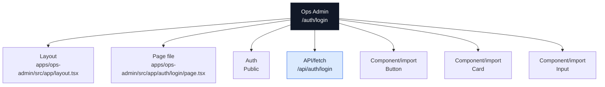

### Actual Page Information

| Field | Value |
| --- | --- |
| App | Ops Admin |
| Domain | `ops.ridendine.ca` |
| Route | `/auth/login` |
| Status | `PARTIAL` |
| Auth | Public |
| Page file | [apps/ops-admin/src/app/auth/login/page.tsx](../../../../apps/ops-admin/src/app/auth/login/page.tsx) |
| Layout | [apps/ops-admin/src/app/layout.tsx](../../../../apps/ops-admin/src/app/layout.tsx) |
| Data source summary | @ridendine/ui |

### Data And API Wiring

| Type | Details |
| --- | --- |
| DB tables/RPCs | None detected |
| Fetch/API calls | `/api/auth/login` (POST) |
| Shared packages | @ridendine/ui |
| Components/imports | `Button`, `Card`, `Input` |
| Environment vars | None detected |

### Navigation And Links

No outgoing page-navigation links detected.

### API Calls From This Page

| Status | Kind | Target | Resolved app | Resolved file | Notes |
| --- | --- | --- | --- | --- | --- |
| WORKING | fetch | `/api/auth/login` | Ops Admin | [apps/ops-admin/src/app/api/auth/login/route.ts](../../../../apps/ops-admin/src/app/api/auth/login/route.ts) | fetch resolves to API /api/auth/login |

### Incoming References

| Source app | Source file | Kind | Target | Status |
| --- | --- | --- | --- | --- |
| Ops Admin | [apps/ops-admin/src/app/dashboard/layout.tsx](../../../../apps/ops-admin/src/app/dashboard/layout.tsx) | redirect | `/auth/login?redirect=/dashboard` | WORKING |
| Ops Admin | [apps/ops-admin/src/components/DashboardLayout.tsx](../../../../apps/ops-admin/src/components/DashboardLayout.tsx) | router.push | `/auth/login` | WORKING |

### Review Notes

- Page status is PARTIAL; review auth/data/API metadata and runtime behavior.


---

## Ops Admin: `/dashboard/activity`

### Page Diagram

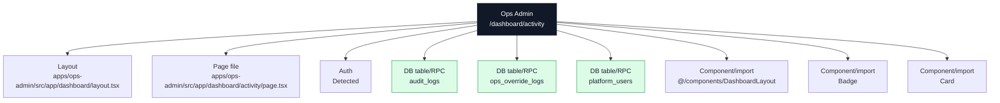

### Actual Page Information

| Field | Value |
| --- | --- |
| App | Ops Admin |
| Domain | `ops.ridendine.ca` |
| Route | `/dashboard/activity` |
| Status | `WIRED` |
| Auth | Detected |
| Page file | [apps/ops-admin/src/app/dashboard/activity/page.tsx](../../../../apps/ops-admin/src/app/dashboard/activity/page.tsx) |
| Layout | [apps/ops-admin/src/app/dashboard/layout.tsx](../../../../apps/ops-admin/src/app/dashboard/layout.tsx) |
| Data source summary | table:audit_logs, table:ops_override_logs, table:platform_users, @ridendine/db, @ridendine/ui |

### Data And API Wiring

| Type | Details |
| --- | --- |
| DB tables/RPCs | `audit_logs`, `ops_override_logs`, `platform_users` |
| Fetch/API calls | None detected |
| Shared packages | @ridendine/db, @ridendine/ui |
| Components/imports | `@/components/DashboardLayout`, `Badge`, `Card` |
| Environment vars | None detected |

### Navigation And Links

No outgoing page-navigation links detected.

### API Calls From This Page

No outgoing API/fetch calls detected.

### Incoming References

No incoming static references detected.

### Review Notes

- Static wiring scan did not flag this page, but runtime auth, DB data, and external services still need smoke/e2e proof.


---

## Ops Admin: `/dashboard/analytics`

### Page Diagram

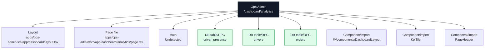

### Actual Page Information

| Field | Value |
| --- | --- |
| App | Ops Admin |
| Domain | `ops.ridendine.ca` |
| Route | `/dashboard/analytics` |
| Status | `PARTIAL` |
| Auth | Undetected |
| Page file | [apps/ops-admin/src/app/dashboard/analytics/page.tsx](../../../../apps/ops-admin/src/app/dashboard/analytics/page.tsx) |
| Layout | [apps/ops-admin/src/app/dashboard/layout.tsx](../../../../apps/ops-admin/src/app/dashboard/layout.tsx) |
| Data source summary | table:driver_presence, table:drivers, table:orders, @ridendine/db, @ridendine/ui |

### Data And API Wiring

| Type | Details |
| --- | --- |
| DB tables/RPCs | `driver_presence`, `drivers`, `orders` |
| Fetch/API calls | None detected |
| Shared packages | @ridendine/db, @ridendine/ui |
| Components/imports | `@/components/DashboardLayout`, `KpiTile`, `PageHeader` |
| Environment vars | None detected |

### Navigation And Links

No outgoing page-navigation links detected.

### API Calls From This Page

No outgoing API/fetch calls detected.

### Incoming References

No incoming static references detected.

### Review Notes

- Page status is PARTIAL; review auth/data/API metadata and runtime behavior.


---

## Ops Admin: `/dashboard/announcements`

### Page Diagram

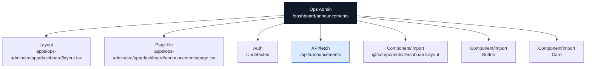

### Actual Page Information

| Field | Value |
| --- | --- |
| App | Ops Admin |
| Domain | `ops.ridendine.ca` |
| Route | `/dashboard/announcements` |
| Status | `PARTIAL` |
| Auth | Undetected |
| Page file | [apps/ops-admin/src/app/dashboard/announcements/page.tsx](../../../../apps/ops-admin/src/app/dashboard/announcements/page.tsx) |
| Layout | [apps/ops-admin/src/app/dashboard/layout.tsx](../../../../apps/ops-admin/src/app/dashboard/layout.tsx) |
| Data source summary | @ridendine/ui |

### Data And API Wiring

| Type | Details |
| --- | --- |
| DB tables/RPCs | None detected |
| Fetch/API calls | `/api/announcements` (POST) |
| Shared packages | @ridendine/ui |
| Components/imports | `@/components/DashboardLayout`, `Button`, `Card` |
| Environment vars | None detected |

### Navigation And Links

No outgoing page-navigation links detected.

### API Calls From This Page

| Status | Kind | Target | Resolved app | Resolved file | Notes |
| --- | --- | --- | --- | --- | --- |
| WORKING | fetch | `/api/announcements` | Ops Admin | [apps/ops-admin/src/app/api/announcements/route.ts](../../../../apps/ops-admin/src/app/api/announcements/route.ts) | fetch resolves to API /api/announcements |

### Incoming References

| Source app | Source file | Kind | Target | Status |
| --- | --- | --- | --- | --- |
| Ops Admin | [apps/ops-admin/src/app/dashboard/page.tsx](../../../../apps/ops-admin/src/app/dashboard/page.tsx) | href | `/dashboard/announcements` | WORKING |

### Review Notes

- Page status is PARTIAL; review auth/data/API metadata and runtime behavior.


---

## Ops Admin: `/dashboard/automation`

### Page Diagram

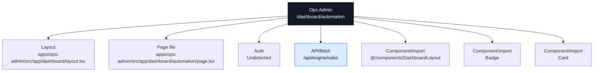

### Actual Page Information

| Field | Value |
| --- | --- |
| App | Ops Admin |
| Domain | `ops.ridendine.ca` |
| Route | `/dashboard/automation` |
| Status | `PARTIAL` |
| Auth | Undetected |
| Page file | [apps/ops-admin/src/app/dashboard/automation/page.tsx](../../../../apps/ops-admin/src/app/dashboard/automation/page.tsx) |
| Layout | [apps/ops-admin/src/app/dashboard/layout.tsx](../../../../apps/ops-admin/src/app/dashboard/layout.tsx) |
| Data source summary | @ridendine/ui |

### Data And API Wiring

| Type | Details |
| --- | --- |
| DB tables/RPCs | None detected |
| Fetch/API calls | `/api/engine/rules` (GET, PATCH) |
| Shared packages | @ridendine/ui |
| Components/imports | `@/components/DashboardLayout`, `Badge`, `Card` |
| Environment vars | None detected |

### Navigation And Links

No outgoing page-navigation links detected.

### API Calls From This Page

| Status | Kind | Target | Resolved app | Resolved file | Notes |
| --- | --- | --- | --- | --- | --- |
| WORKING | fetch | `/api/engine/rules` | Ops Admin | [apps/ops-admin/src/app/api/engine/rules/route.ts](../../../../apps/ops-admin/src/app/api/engine/rules/route.ts) | fetch resolves to API /api/engine/rules |

### Incoming References

No incoming static references detected.

### Review Notes

- Page status is PARTIAL; review auth/data/API metadata and runtime behavior.


---

## Ops Admin: `/dashboard/chefs/:id`

### Page Diagram


### Actual Page Information

| Field | Value |
| --- | --- |
| App | Ops Admin |
| Domain | `ops.ridendine.ca` |
| Route | `/dashboard/chefs/:id` |
| Status | `WIRED` |
| Auth | Detected |
| Page file | [apps/ops-admin/src/app/dashboard/chefs/[id]/page.tsx](../../../../apps/ops-admin/src/app/dashboard/chefs/[id]/page.tsx) |
| Layout | [apps/ops-admin/src/app/dashboard/layout.tsx](../../../../apps/ops-admin/src/app/dashboard/layout.tsx) |
| Data source summary | table:chef_delivery_zones, table:chef_documents, @ridendine/db, @ridendine/ui |

### Data And API Wiring

| Type | Details |
| --- | --- |
| DB tables/RPCs | `chef_delivery_zones`, `chef_documents` |
| Fetch/API calls | None detected |
| Shared packages | @ridendine/db, @ridendine/ui |
| Components/imports | `@/components/DashboardLayout`, `Badge`, `Card` |
| Environment vars | None detected |

### Navigation And Links

| Status | Kind | Target | Resolved app | Resolved file | Notes |
| --- | --- | --- | --- | --- | --- |
| WORKING | href | `/dashboard/chefs` | Ops Admin | [apps/ops-admin/src/app/dashboard/chefs/page.tsx](../../../../apps/ops-admin/src/app/dashboard/chefs/page.tsx) | href resolves to page /dashboard/chefs |

### API Calls From This Page

No outgoing API/fetch calls detected.

### Incoming References

| Source app | Source file | Kind | Target | Status |
| --- | --- | --- | --- | --- |
| Ops Admin | [apps/ops-admin/src/app/dashboard/chefs/approvals/page.tsx](../../../../apps/ops-admin/src/app/dashboard/chefs/approvals/page.tsx) | href | `/dashboard/chefs/${chef.id}` | WORKING_DYNAMIC |
| Ops Admin | [apps/ops-admin/src/app/dashboard/chefs/page.tsx](../../../../apps/ops-admin/src/app/dashboard/chefs/page.tsx) | href | `/dashboard/chefs/${row.id}` | WORKING_DYNAMIC |
| Ops Admin | [apps/ops-admin/src/app/dashboard/orders/[id]/page.tsx](../../../../apps/ops-admin/src/app/dashboard/orders/[id]/page.tsx) | href | `/dashboard/chefs/${order.storefront.chef?.id ??` | WORKING_DYNAMIC |

### Review Notes

- Static wiring scan did not flag this page, but runtime auth, DB data, and external services still need smoke/e2e proof.


---

## Ops Admin: `/dashboard/chefs/approvals`

### Page Diagram

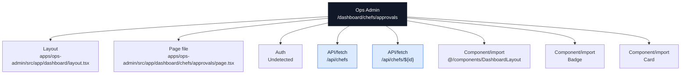

### Actual Page Information

| Field | Value |
| --- | --- |
| App | Ops Admin |
| Domain | `ops.ridendine.ca` |
| Route | `/dashboard/chefs/approvals` |
| Status | `PARTIAL` |
| Auth | Undetected |
| Page file | [apps/ops-admin/src/app/dashboard/chefs/approvals/page.tsx](../../../../apps/ops-admin/src/app/dashboard/chefs/approvals/page.tsx) |
| Layout | [apps/ops-admin/src/app/dashboard/layout.tsx](../../../../apps/ops-admin/src/app/dashboard/layout.tsx) |
| Data source summary | @ridendine/ui |

### Data And API Wiring

| Type | Details |
| --- | --- |
| DB tables/RPCs | None detected |
| Fetch/API calls | `/api/chefs` (GET, POST)<br>`/api/chefs/${id}` (PATCH) |
| Shared packages | @ridendine/ui |
| Components/imports | `@/components/DashboardLayout`, `Badge`, `Card` |
| Environment vars | None detected |

### Navigation And Links

| Status | Kind | Target | Resolved app | Resolved file | Notes |
| --- | --- | --- | --- | --- | --- |
| WORKING | href | `/dashboard/chefs` | Ops Admin | [apps/ops-admin/src/app/dashboard/chefs/page.tsx](../../../../apps/ops-admin/src/app/dashboard/chefs/page.tsx) | href resolves to page /dashboard/chefs |
| WORKING_DYNAMIC | href | `/dashboard/chefs/${chef.id}` | Ops Admin | [apps/ops-admin/src/app/dashboard/chefs/[id]/page.tsx](../../../../apps/ops-admin/src/app/dashboard/chefs/[id]/page.tsx) | href resolves to page /dashboard/chefs/:id |

### API Calls From This Page

| Status | Kind | Target | Resolved app | Resolved file | Notes |
| --- | --- | --- | --- | --- | --- |
| WORKING | fetch | `/api/chefs` | Ops Admin | [apps/ops-admin/src/app/api/chefs/route.ts](../../../../apps/ops-admin/src/app/api/chefs/route.ts) | fetch resolves to API /api/chefs |
| WORKING_DYNAMIC | fetch | `/api/chefs/${id}` | Ops Admin | [apps/ops-admin/src/app/api/chefs/[id]/route.ts](../../../../apps/ops-admin/src/app/api/chefs/[id]/route.ts) | fetch resolves to API /api/chefs/:id |

### Incoming References

No incoming static references detected.

### Review Notes

- Page status is PARTIAL; review auth/data/API metadata and runtime behavior.


---

## Ops Admin: `/dashboard/chefs`

### Page Diagram

```mermaid
flowchart TB
  Page["Ops Admin<br/>/dashboard/chefs"]
  Layout["Layout<br/>apps/ops-admin/src/app/dashboard/layout.tsx"]
  File["Page file<br/>apps/ops-admin/src/app/dashboard/chefs/page.tsx"]
  Auth["Auth<br/>Undetected"]
  Page --> Layout
  Page --> File
  Page --> Auth
  Api0["API/fetch<br/>/api/export?type=chefs"]
  Page --> Api0
  Component0["Component/import<br/>@/components/DashboardLayout"]
  Page --> Component0
  Component1["Component/import<br/>Button"]
  Page --> Component1
  Component2["Component/import<br/>DataTable"]
  Page --> Component2
  Component3["Component/import<br/>EmptyState"]
  Page --> Component3
  Component4["Component/import<br/>Modal"]
  Page --> Component4
  Component5["Component/import<br/>PageHeader"]
  Page --> Component5
  classDef page fill:#111827,stroke:#111827,color:#ffffff
  classDef data fill:#dcfce7,stroke:#16a34a,color:#172033
  classDef api fill:#dbeafe,stroke:#2563eb,color:#172033
  classDef warn fill:#fef3c7,stroke:#f59e0b,color:#172033
  class Page page
  class Api0 api
```

### Actual Page Information

| Field | Value |
| --- | --- |
| App | Ops Admin |
| Domain | `ops.ridendine.ca` |
| Route | `/dashboard/chefs` |
| Status | `WIRED` |
| Auth | Undetected |
| Page file | [apps/ops-admin/src/app/dashboard/chefs/page.tsx](../../../../apps/ops-admin/src/app/dashboard/chefs/page.tsx) |
| Layout | [apps/ops-admin/src/app/dashboard/layout.tsx](../../../../apps/ops-admin/src/app/dashboard/layout.tsx) |
| Data source summary | @ridendine/ui |

### Data And API Wiring

| Type | Details |
| --- | --- |
| DB tables/RPCs | None detected |
| Fetch/API calls | `/api/export?type=chefs` (GET) |
| Shared packages | @ridendine/ui |
| Components/imports | `@/components/DashboardLayout`, `Button`, `DataTable`, `EmptyState`, `Modal`, `PageHeader`, `StatusBadge` |
| Environment vars | None detected |

### Navigation And Links

| Status | Kind | Target | Resolved app | Resolved file | Notes |
| --- | --- | --- | --- | --- | --- |
| WORKING_DYNAMIC | href | `/dashboard/chefs/${row.id}` | Ops Admin | [apps/ops-admin/src/app/dashboard/chefs/[id]/page.tsx](../../../../apps/ops-admin/src/app/dashboard/chefs/[id]/page.tsx) | href resolves to page /dashboard/chefs/:id |

### API Calls From This Page

| Status | Kind | Target | Resolved app | Resolved file | Notes |
| --- | --- | --- | --- | --- | --- |
| WORKING | href | `/api/export?type=chefs` | Ops Admin | [apps/ops-admin/src/app/api/export/route.ts](../../../../apps/ops-admin/src/app/api/export/route.ts) | href resolves to API /api/export |

### Incoming References

| Source app | Source file | Kind | Target | Status |
| --- | --- | --- | --- | --- |
| Ops Admin | [apps/ops-admin/src/app/dashboard/chefs/[id]/page.tsx](../../../../apps/ops-admin/src/app/dashboard/chefs/[id]/page.tsx) | href | `/dashboard/chefs` | WORKING |
| Ops Admin | [apps/ops-admin/src/app/dashboard/chefs/approvals/page.tsx](../../../../apps/ops-admin/src/app/dashboard/chefs/approvals/page.tsx) | href | `/dashboard/chefs` | WORKING |
| Ops Admin | [apps/ops-admin/src/app/dashboard/page.tsx](../../../../apps/ops-admin/src/app/dashboard/page.tsx) | href | `/dashboard/chefs` | WORKING |

### Review Notes

- Static wiring scan did not flag this page, but runtime auth, DB data, and external services still need smoke/e2e proof.


---

## Ops Admin: `/dashboard/compliance`

### Page Diagram

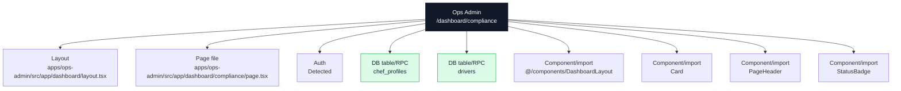

### Actual Page Information

| Field | Value |
| --- | --- |
| App | Ops Admin |
| Domain | `ops.ridendine.ca` |
| Route | `/dashboard/compliance` |
| Status | `WIRED` |
| Auth | Detected |
| Page file | [apps/ops-admin/src/app/dashboard/compliance/page.tsx](../../../../apps/ops-admin/src/app/dashboard/compliance/page.tsx) |
| Layout | [apps/ops-admin/src/app/dashboard/layout.tsx](../../../../apps/ops-admin/src/app/dashboard/layout.tsx) |
| Data source summary | table:chef_profiles, table:drivers, @ridendine/db, @ridendine/ui |

### Data And API Wiring

| Type | Details |
| --- | --- |
| DB tables/RPCs | `chef_profiles`, `drivers` |
| Fetch/API calls | None detected |
| Shared packages | @ridendine/db, @ridendine/ui |
| Components/imports | `@/components/DashboardLayout`, `Card`, `PageHeader`, `StatusBadge` |
| Environment vars | None detected |

### Navigation And Links

No outgoing page-navigation links detected.

### API Calls From This Page

No outgoing API/fetch calls detected.

### Incoming References

No incoming static references detected.

### Review Notes

- Static wiring scan did not flag this page, but runtime auth, DB data, and external services still need smoke/e2e proof.


---

## Ops Admin: `/dashboard/customers/:id`

### Page Diagram

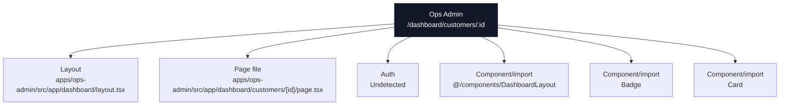

### Actual Page Information

| Field | Value |
| --- | --- |
| App | Ops Admin |
| Domain | `ops.ridendine.ca` |
| Route | `/dashboard/customers/:id` |
| Status | `WIRED` |
| Auth | Undetected |
| Page file | [apps/ops-admin/src/app/dashboard/customers/[id]/page.tsx](../../../../apps/ops-admin/src/app/dashboard/customers/[id]/page.tsx) |
| Layout | [apps/ops-admin/src/app/dashboard/layout.tsx](../../../../apps/ops-admin/src/app/dashboard/layout.tsx) |
| Data source summary | @ridendine/db, @ridendine/ui |

### Data And API Wiring

| Type | Details |
| --- | --- |
| DB tables/RPCs | None detected |
| Fetch/API calls | None detected |
| Shared packages | @ridendine/db, @ridendine/ui |
| Components/imports | `@/components/DashboardLayout`, `Badge`, `Card` |
| Environment vars | None detected |

### Navigation And Links

| Status | Kind | Target | Resolved app | Resolved file | Notes |
| --- | --- | --- | --- | --- | --- |
| WORKING | href | `/dashboard/customers` | Ops Admin | [apps/ops-admin/src/app/dashboard/customers/page.tsx](../../../../apps/ops-admin/src/app/dashboard/customers/page.tsx) | href resolves to page /dashboard/customers |
| WORKING_DYNAMIC | href | `/dashboard/orders/${order.id}` | Ops Admin | [apps/ops-admin/src/app/dashboard/orders/[id]/page.tsx](../../../../apps/ops-admin/src/app/dashboard/orders/[id]/page.tsx) | href resolves to page /dashboard/orders/:id |
| WORKING | href | `/dashboard/support` | Ops Admin | [apps/ops-admin/src/app/dashboard/support/page.tsx](../../../../apps/ops-admin/src/app/dashboard/support/page.tsx) | href resolves to page /dashboard/support |

### API Calls From This Page

No outgoing API/fetch calls detected.

### Incoming References

| Source app | Source file | Kind | Target | Status |
| --- | --- | --- | --- | --- |
| Ops Admin | [apps/ops-admin/src/app/dashboard/customers/page.tsx](../../../../apps/ops-admin/src/app/dashboard/customers/page.tsx) | href | `/dashboard/customers/${row.id}` | WORKING_DYNAMIC |
| Ops Admin | [apps/ops-admin/src/app/dashboard/orders/[id]/page.tsx](../../../../apps/ops-admin/src/app/dashboard/orders/[id]/page.tsx) | href | `/dashboard/customers/${order.customer.id}` | WORKING_DYNAMIC |

### Review Notes

- Static wiring scan did not flag this page, but runtime auth, DB data, and external services still need smoke/e2e proof.


---

## Ops Admin: `/dashboard/customers`

### Page Diagram

```mermaid
flowchart TB
  Page["Ops Admin<br/>/dashboard/customers"]
  Layout["Layout<br/>apps/ops-admin/src/app/dashboard/layout.tsx"]
  File["Page file<br/>apps/ops-admin/src/app/dashboard/customers/page.tsx"]
  Auth["Auth<br/>Undetected"]
  Page --> Layout
  Page --> File
  Page --> Auth
  Api0["API/fetch<br/>/api/customers"]
  Page --> Api0
  Api1["API/fetch<br/>/api/export?type=customers"]
  Page --> Api1
  Component0["Component/import<br/>@/components/DashboardLayout"]
  Page --> Component0
  Component1["Component/import<br/>DataTable"]
  Page --> Component1
  Component2["Component/import<br/>EmptyState"]
  Page --> Component2
  Component3["Component/import<br/>PageHeader"]
  Page --> Component3
  classDef page fill:#111827,stroke:#111827,color:#ffffff
  classDef data fill:#dcfce7,stroke:#16a34a,color:#172033
  classDef api fill:#dbeafe,stroke:#2563eb,color:#172033
  classDef warn fill:#fef3c7,stroke:#f59e0b,color:#172033
  class Page page
  class Api0,Api1 api
```

### Actual Page Information

| Field | Value |
| --- | --- |
| App | Ops Admin |
| Domain | `ops.ridendine.ca` |
| Route | `/dashboard/customers` |
| Status | `PARTIAL` |
| Auth | Undetected |
| Page file | [apps/ops-admin/src/app/dashboard/customers/page.tsx](../../../../apps/ops-admin/src/app/dashboard/customers/page.tsx) |
| Layout | [apps/ops-admin/src/app/dashboard/layout.tsx](../../../../apps/ops-admin/src/app/dashboard/layout.tsx) |
| Data source summary | @ridendine/ui |

### Data And API Wiring

| Type | Details |
| --- | --- |
| DB tables/RPCs | None detected |
| Fetch/API calls | `/api/customers` (GET, POST)<br>`/api/export?type=customers` (GET) |
| Shared packages | @ridendine/ui |
| Components/imports | `@/components/DashboardLayout`, `DataTable`, `EmptyState`, `PageHeader` |
| Environment vars | None detected |

### Navigation And Links

| Status | Kind | Target | Resolved app | Resolved file | Notes |
| --- | --- | --- | --- | --- | --- |
| WORKING_DYNAMIC | href | `/dashboard/customers/${row.id}` | Ops Admin | [apps/ops-admin/src/app/dashboard/customers/[id]/page.tsx](../../../../apps/ops-admin/src/app/dashboard/customers/[id]/page.tsx) | href resolves to page /dashboard/customers/:id |

### API Calls From This Page

| Status | Kind | Target | Resolved app | Resolved file | Notes |
| --- | --- | --- | --- | --- | --- |
| WORKING | fetch | `/api/customers` | Ops Admin | [apps/ops-admin/src/app/api/customers/route.ts](../../../../apps/ops-admin/src/app/api/customers/route.ts) | fetch resolves to API /api/customers |
| WORKING | href | `/api/export?type=customers` | Ops Admin | [apps/ops-admin/src/app/api/export/route.ts](../../../../apps/ops-admin/src/app/api/export/route.ts) | href resolves to API /api/export |

### Incoming References

| Source app | Source file | Kind | Target | Status |
| --- | --- | --- | --- | --- |
| Ops Admin | [apps/ops-admin/src/app/dashboard/customers/[id]/page.tsx](../../../../apps/ops-admin/src/app/dashboard/customers/[id]/page.tsx) | href | `/dashboard/customers` | WORKING |

### Review Notes

- Page status is PARTIAL; review auth/data/API metadata and runtime behavior.


---

## Ops Admin: `/dashboard/deliveries/:id`

### Page Diagram


### Actual Page Information

| Field | Value |
| --- | --- |
| App | Ops Admin |
| Domain | `ops.ridendine.ca` |
| Route | `/dashboard/deliveries/:id` |
| Status | `WIRED` |
| Auth | Undetected |
| Page file | [apps/ops-admin/src/app/dashboard/deliveries/[id]/page.tsx](../../../../apps/ops-admin/src/app/dashboard/deliveries/[id]/page.tsx) |
| Layout | [apps/ops-admin/src/app/dashboard/layout.tsx](../../../../apps/ops-admin/src/app/dashboard/layout.tsx) |
| Data source summary | @ridendine/db, @ridendine/ui |

### Data And API Wiring

| Type | Details |
| --- | --- |
| DB tables/RPCs | None detected |
| Fetch/API calls | None detected |
| Shared packages | @ridendine/db, @ridendine/ui |
| Components/imports | `@/components/DashboardLayout`, `Badge`, `Card` |
| Environment vars | None detected |

### Navigation And Links

| Status | Kind | Target | Resolved app | Resolved file | Notes |
| --- | --- | --- | --- | --- | --- |
| WORKING | href | `/dashboard/deliveries` | Ops Admin | [apps/ops-admin/src/app/dashboard/deliveries/page.tsx](../../../../apps/ops-admin/src/app/dashboard/deliveries/page.tsx) | href resolves to page /dashboard/deliveries |
| WORKING_DYNAMIC | href | `/dashboard/drivers/${detail.driver.id}` | Ops Admin | [apps/ops-admin/src/app/dashboard/drivers/[id]/page.tsx](../../../../apps/ops-admin/src/app/dashboard/drivers/[id]/page.tsx) | href resolves to page /dashboard/drivers/:id |
| WORKING_DYNAMIC | href | `/dashboard/orders/${detail.order.id}` | Ops Admin | [apps/ops-admin/src/app/dashboard/orders/[id]/page.tsx](../../../../apps/ops-admin/src/app/dashboard/orders/[id]/page.tsx) | href resolves to page /dashboard/orders/:id |

### API Calls From This Page

No outgoing API/fetch calls detected.

### Incoming References

| Source app | Source file | Kind | Target | Status |
| --- | --- | --- | --- | --- |
| Ops Admin | [apps/ops-admin/src/app/dashboard/deliveries/page.tsx](../../../../apps/ops-admin/src/app/dashboard/deliveries/page.tsx) | href | `/dashboard/deliveries/${item.deliveryId}` | WORKING_DYNAMIC |
| Ops Admin | [apps/ops-admin/src/app/dashboard/drivers/[id]/page.tsx](../../../../apps/ops-admin/src/app/dashboard/drivers/[id]/page.tsx) | href | `/dashboard/deliveries/${delivery.id}` | WORKING_DYNAMIC |
| Ops Admin | [apps/ops-admin/src/app/dashboard/orders/[id]/page.tsx](../../../../apps/ops-admin/src/app/dashboard/orders/[id]/page.tsx) | href | `/dashboard/deliveries/${order.delivery.id}` | WORKING_DYNAMIC |

### Review Notes

- Static wiring scan did not flag this page, but runtime auth, DB data, and external services still need smoke/e2e proof.


---

## Ops Admin: `/dashboard/deliveries`

### Page Diagram

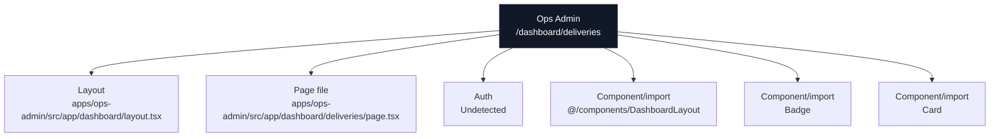

### Actual Page Information

| Field | Value |
| --- | --- |
| App | Ops Admin |
| Domain | `ops.ridendine.ca` |
| Route | `/dashboard/deliveries` |
| Status | `PARTIAL` |
| Auth | Undetected |
| Page file | [apps/ops-admin/src/app/dashboard/deliveries/page.tsx](../../../../apps/ops-admin/src/app/dashboard/deliveries/page.tsx) |
| Layout | [apps/ops-admin/src/app/dashboard/layout.tsx](../../../../apps/ops-admin/src/app/dashboard/layout.tsx) |
| Data source summary | @ridendine/ui |

### Data And API Wiring

| Type | Details |
| --- | --- |
| DB tables/RPCs | None detected |
| Fetch/API calls | None detected |
| Shared packages | @ridendine/ui |
| Components/imports | `@/components/DashboardLayout`, `Badge`, `Card` |
| Environment vars | None detected |

### Navigation And Links

| Status | Kind | Target | Resolved app | Resolved file | Notes |
| --- | --- | --- | --- | --- | --- |
| WORKING | href | `/dashboard/deliveries?queue=${entry}` | Ops Admin | [apps/ops-admin/src/app/dashboard/deliveries/page.tsx](../../../../apps/ops-admin/src/app/dashboard/deliveries/page.tsx) | href resolves to page /dashboard/deliveries |
| WORKING | href | `/dashboard/deliveries?queue=${queue}&search=${encodeURIComponent(search)}&page=${Math.max(1, safePage - 1)}` | Ops Admin | [apps/ops-admin/src/app/dashboard/deliveries/page.tsx](../../../../apps/ops-admin/src/app/dashboard/deliveries/page.tsx) | href resolves to page /dashboard/deliveries |
| WORKING | href | `/dashboard/deliveries?queue=${queue}&search=${encodeURIComponent(search)}&page=${Math.min(totalPages, safePage + 1)}` | Ops Admin | [apps/ops-admin/src/app/dashboard/deliveries/page.tsx](../../../../apps/ops-admin/src/app/dashboard/deliveries/page.tsx) | href resolves to page /dashboard/deliveries |
| WORKING_DYNAMIC | href | `/dashboard/deliveries/${item.deliveryId}` | Ops Admin | [apps/ops-admin/src/app/dashboard/deliveries/[id]/page.tsx](../../../../apps/ops-admin/src/app/dashboard/deliveries/[id]/page.tsx) | href resolves to page /dashboard/deliveries/:id |

### API Calls From This Page

No outgoing API/fetch calls detected.

### Incoming References

| Source app | Source file | Kind | Target | Status |
| --- | --- | --- | --- | --- |
| Ops Admin | [apps/ops-admin/src/app/dashboard/deliveries/[id]/page.tsx](../../../../apps/ops-admin/src/app/dashboard/deliveries/[id]/page.tsx) | href | `/dashboard/deliveries` | WORKING |
| Ops Admin | [apps/ops-admin/src/app/dashboard/deliveries/page.tsx](../../../../apps/ops-admin/src/app/dashboard/deliveries/page.tsx) | href | `/dashboard/deliveries?queue=${entry}` | WORKING |
| Ops Admin | [apps/ops-admin/src/app/dashboard/deliveries/page.tsx](../../../../apps/ops-admin/src/app/dashboard/deliveries/page.tsx) | href | `/dashboard/deliveries?queue=${queue}&search=${encodeURIComponent(search)}&page=${Math.max(1, safePage - 1)}` | WORKING |
| Ops Admin | [apps/ops-admin/src/app/dashboard/deliveries/page.tsx](../../../../apps/ops-admin/src/app/dashboard/deliveries/page.tsx) | href | `/dashboard/deliveries?queue=${queue}&search=${encodeURIComponent(search)}&page=${Math.min(totalPages, safePage + 1)}` | WORKING |

### Review Notes

- Page status is PARTIAL; review auth/data/API metadata and runtime behavior.


---

## Ops Admin: `/dashboard/dispatch`

### Page Diagram

```mermaid
flowchart TB
  Page["Ops Admin<br/>/dashboard/dispatch"]
  Layout["Layout<br/>apps/ops-admin/src/app/dashboard/layout.tsx"]
  File["Page file<br/>apps/ops-admin/src/app/dashboard/dispatch/page.tsx"]
  Auth["Auth<br/>Undetected"]
  Page --> Layout
  Page --> File
  Page --> Auth
  Api0["API/fetch<br/>/api/engine/dispatch"]
  Page --> Api0
  Api1["API/fetch<br/>/api/engine/dispatch/offer-history"]
  Page --> Api1
  Component0["Component/import<br/>@/components/DashboardLayout"]
  Page --> Component0
  Component1["Component/import<br/>@/components/map/delivery-map"]
  Page --> Component1
  Component2["Component/import<br/>Button"]
  Page --> Component2
  Component3["Component/import<br/>Card"]
  Page --> Component3
  Component4["Component/import<br/>DataTable"]
  Page --> Component4
  Component5["Component/import<br/>EmptyState"]
  Page --> Component5
  classDef page fill:#111827,stroke:#111827,color:#ffffff
  classDef data fill:#dcfce7,stroke:#16a34a,color:#172033
  classDef api fill:#dbeafe,stroke:#2563eb,color:#172033
  classDef warn fill:#fef3c7,stroke:#f59e0b,color:#172033
  class Page page
  class Api0,Api1 api
```

### Actual Page Information

| Field | Value |
| --- | --- |
| App | Ops Admin |
| Domain | `ops.ridendine.ca` |
| Route | `/dashboard/dispatch` |
| Status | `PARTIAL` |
| Auth | Undetected |
| Page file | [apps/ops-admin/src/app/dashboard/dispatch/page.tsx](../../../../apps/ops-admin/src/app/dashboard/dispatch/page.tsx) |
| Layout | [apps/ops-admin/src/app/dashboard/layout.tsx](../../../../apps/ops-admin/src/app/dashboard/layout.tsx) |
| Data source summary | @ridendine/types, @ridendine/ui |

### Data And API Wiring

| Type | Details |
| --- | --- |
| DB tables/RPCs | None detected |
| Fetch/API calls | `/api/engine/dispatch` (GET, POST)<br>`/api/engine/dispatch/offer-history` (GET) |
| Shared packages | @ridendine/types, @ridendine/ui |
| Components/imports | `@/components/DashboardLayout`, `@/components/map/delivery-map`, `Button`, `Card`, `DataTable`, `EmptyState`, `Modal`, `PageHeader`, `StatusBadge` |
| Environment vars | None detected |

### Navigation And Links

| Status | Kind | Target | Resolved app | Resolved file | Notes |
| --- | --- | --- | --- | --- | --- |
| WORKING_DYNAMIC | href | `/dashboard/drivers/${item.topCandidates[0]!.driverId}` | Ops Admin | [apps/ops-admin/src/app/dashboard/drivers/[id]/page.tsx](../../../../apps/ops-admin/src/app/dashboard/drivers/[id]/page.tsx) | href resolves to page /dashboard/drivers/:id |

### API Calls From This Page

| Status | Kind | Target | Resolved app | Resolved file | Notes |
| --- | --- | --- | --- | --- | --- |
| WORKING | fetch | `/api/engine/dispatch` | Ops Admin | [apps/ops-admin/src/app/api/engine/dispatch/route.ts](../../../../apps/ops-admin/src/app/api/engine/dispatch/route.ts) | fetch resolves to API /api/engine/dispatch |
| WORKING | fetch | `/api/engine/dispatch/offer-history` | Ops Admin | [apps/ops-admin/src/app/api/engine/dispatch/offer-history/route.ts](../../../../apps/ops-admin/src/app/api/engine/dispatch/offer-history/route.ts) | fetch resolves to API /api/engine/dispatch/offer-history |

### Incoming References

| Source app | Source file | Kind | Target | Status |
| --- | --- | --- | --- | --- |
| Ops Admin | [apps/ops-admin/src/app/dashboard/page.tsx](../../../../apps/ops-admin/src/app/dashboard/page.tsx) | href | `/dashboard/dispatch` | WORKING |

### Review Notes

- Page status is PARTIAL; review auth/data/API metadata and runtime behavior.


---

## Ops Admin: `/dashboard/drivers/:id`

### Page Diagram

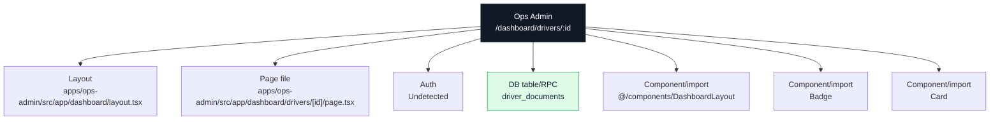

### Actual Page Information

| Field | Value |
| --- | --- |
| App | Ops Admin |
| Domain | `ops.ridendine.ca` |
| Route | `/dashboard/drivers/:id` |
| Status | `WIRED` |
| Auth | Undetected |
| Page file | [apps/ops-admin/src/app/dashboard/drivers/[id]/page.tsx](../../../../apps/ops-admin/src/app/dashboard/drivers/[id]/page.tsx) |
| Layout | [apps/ops-admin/src/app/dashboard/layout.tsx](../../../../apps/ops-admin/src/app/dashboard/layout.tsx) |
| Data source summary | table:driver_documents, @ridendine/db, @ridendine/ui |

### Data And API Wiring

| Type | Details |
| --- | --- |
| DB tables/RPCs | `driver_documents` |
| Fetch/API calls | None detected |
| Shared packages | @ridendine/db, @ridendine/ui |
| Components/imports | `@/components/DashboardLayout`, `Badge`, `Card` |
| Environment vars | None detected |

### Navigation And Links

| Status | Kind | Target | Resolved app | Resolved file | Notes |
| --- | --- | --- | --- | --- | --- |
| WORKING_DYNAMIC | href | `/dashboard/deliveries/${delivery.id}` | Ops Admin | [apps/ops-admin/src/app/dashboard/deliveries/[id]/page.tsx](../../../../apps/ops-admin/src/app/dashboard/deliveries/[id]/page.tsx) | href resolves to page /dashboard/deliveries/:id |
| WORKING | href | `/dashboard/drivers` | Ops Admin | [apps/ops-admin/src/app/dashboard/drivers/page.tsx](../../../../apps/ops-admin/src/app/dashboard/drivers/page.tsx) | href resolves to page /dashboard/drivers |
| WORKING | href | `/dashboard/map` | Ops Admin | [apps/ops-admin/src/app/dashboard/map/page.tsx](../../../../apps/ops-admin/src/app/dashboard/map/page.tsx) | href resolves to page /dashboard/map |

### API Calls From This Page

No outgoing API/fetch calls detected.

### Incoming References

| Source app | Source file | Kind | Target | Status |
| --- | --- | --- | --- | --- |
| Ops Admin | [apps/ops-admin/src/app/dashboard/deliveries/[id]/page.tsx](../../../../apps/ops-admin/src/app/dashboard/deliveries/[id]/page.tsx) | href | `/dashboard/drivers/${detail.driver.id}` | WORKING_DYNAMIC |
| Ops Admin | [apps/ops-admin/src/app/dashboard/dispatch/page.tsx](../../../../apps/ops-admin/src/app/dashboard/dispatch/page.tsx) | href | `/dashboard/drivers/${item.topCandidates[0]!.driverId}` | WORKING_DYNAMIC |
| Ops Admin | [apps/ops-admin/src/app/dashboard/drivers/page.tsx](../../../../apps/ops-admin/src/app/dashboard/drivers/page.tsx) | href | `/dashboard/drivers/${row.id}` | WORKING_DYNAMIC |

### Review Notes

- Static wiring scan did not flag this page, but runtime auth, DB data, and external services still need smoke/e2e proof.


---

## Ops Admin: `/dashboard/drivers`

### Page Diagram

```mermaid
flowchart TB
  Page["Ops Admin<br/>/dashboard/drivers"]
  Layout["Layout<br/>apps/ops-admin/src/app/dashboard/layout.tsx"]
  File["Page file<br/>apps/ops-admin/src/app/dashboard/drivers/page.tsx"]
  Auth["Auth<br/>Undetected"]
  Page --> Layout
  Page --> File
  Page --> Auth
  Api0["API/fetch<br/>/api/export?type=drivers"]
  Page --> Api0
  Component0["Component/import<br/>@/components/DashboardLayout"]
  Page --> Component0
  Component1["Component/import<br/>Button"]
  Page --> Component1
  Component2["Component/import<br/>DataTable"]
  Page --> Component2
  Component3["Component/import<br/>EmptyState"]
  Page --> Component3
  Component4["Component/import<br/>Modal"]
  Page --> Component4
  Component5["Component/import<br/>PageHeader"]
  Page --> Component5
  classDef page fill:#111827,stroke:#111827,color:#ffffff
  classDef data fill:#dcfce7,stroke:#16a34a,color:#172033
  classDef api fill:#dbeafe,stroke:#2563eb,color:#172033
  classDef warn fill:#fef3c7,stroke:#f59e0b,color:#172033
  class Page page
  class Api0 api
```

### Actual Page Information

| Field | Value |
| --- | --- |
| App | Ops Admin |
| Domain | `ops.ridendine.ca` |
| Route | `/dashboard/drivers` |
| Status | `WIRED` |
| Auth | Undetected |
| Page file | [apps/ops-admin/src/app/dashboard/drivers/page.tsx](../../../../apps/ops-admin/src/app/dashboard/drivers/page.tsx) |
| Layout | [apps/ops-admin/src/app/dashboard/layout.tsx](../../../../apps/ops-admin/src/app/dashboard/layout.tsx) |
| Data source summary | @ridendine/ui |

### Data And API Wiring

| Type | Details |
| --- | --- |
| DB tables/RPCs | None detected |
| Fetch/API calls | `/api/export?type=drivers` (GET) |
| Shared packages | @ridendine/ui |
| Components/imports | `@/components/DashboardLayout`, `Button`, `DataTable`, `EmptyState`, `Modal`, `PageHeader`, `StatusBadge` |
| Environment vars | None detected |

### Navigation And Links

| Status | Kind | Target | Resolved app | Resolved file | Notes |
| --- | --- | --- | --- | --- | --- |
| WORKING_DYNAMIC | href | `/dashboard/drivers/${row.id}` | Ops Admin | [apps/ops-admin/src/app/dashboard/drivers/[id]/page.tsx](../../../../apps/ops-admin/src/app/dashboard/drivers/[id]/page.tsx) | href resolves to page /dashboard/drivers/:id |

### API Calls From This Page

| Status | Kind | Target | Resolved app | Resolved file | Notes |
| --- | --- | --- | --- | --- | --- |
| WORKING | href | `/api/export?type=drivers` | Ops Admin | [apps/ops-admin/src/app/api/export/route.ts](../../../../apps/ops-admin/src/app/api/export/route.ts) | href resolves to API /api/export |

### Incoming References

| Source app | Source file | Kind | Target | Status |
| --- | --- | --- | --- | --- |
| Ops Admin | [apps/ops-admin/src/app/dashboard/drivers/[id]/page.tsx](../../../../apps/ops-admin/src/app/dashboard/drivers/[id]/page.tsx) | href | `/dashboard/drivers` | WORKING |
| Ops Admin | [apps/ops-admin/src/app/dashboard/page.tsx](../../../../apps/ops-admin/src/app/dashboard/page.tsx) | href | `/dashboard/drivers` | WORKING |

### Review Notes

- Static wiring scan did not flag this page, but runtime auth, DB data, and external services still need smoke/e2e proof.


---

## Ops Admin: `/dashboard/exceptions`

### Page Diagram

```mermaid
flowchart TB
  Page["Ops Admin<br/>/dashboard/exceptions"]
  Layout["Layout<br/>apps/ops-admin/src/app/dashboard/layout.tsx"]
  File["Page file<br/>apps/ops-admin/src/app/dashboard/exceptions/page.tsx"]
  Auth["Auth<br/>Detected"]
  Page --> Layout
  Page --> File
  Page --> Auth
  Table0["DB table/RPC<br/>order_exceptions"]
  Page --> Table0
  Table1["DB table/RPC<br/>support_tickets"]
  Page --> Table1
  Table2["DB table/RPC<br/>system_alerts"]
  Page --> Table2
  Component0["Component/import<br/>@/components/DashboardLayout"]
  Page --> Component0
  Component1["Component/import<br/>Card"]
  Page --> Component1
  Component2["Component/import<br/>PageHeader"]
  Page --> Component2
  Component3["Component/import<br/>StatusBadge"]
  Page --> Component3
  classDef page fill:#111827,stroke:#111827,color:#ffffff
  classDef data fill:#dcfce7,stroke:#16a34a,color:#172033
  classDef api fill:#dbeafe,stroke:#2563eb,color:#172033
  classDef warn fill:#fef3c7,stroke:#f59e0b,color:#172033
  class Page page
  class Table0,Table1,Table2 data
```

### Actual Page Information

| Field | Value |
| --- | --- |
| App | Ops Admin |
| Domain | `ops.ridendine.ca` |
| Route | `/dashboard/exceptions` |
| Status | `WIRED` |
| Auth | Detected |
| Page file | [apps/ops-admin/src/app/dashboard/exceptions/page.tsx](../../../../apps/ops-admin/src/app/dashboard/exceptions/page.tsx) |
| Layout | [apps/ops-admin/src/app/dashboard/layout.tsx](../../../../apps/ops-admin/src/app/dashboard/layout.tsx) |
| Data source summary | table:order_exceptions, table:support_tickets, table:system_alerts, @ridendine/db, @ridendine/ui |

### Data And API Wiring

| Type | Details |
| --- | --- |
| DB tables/RPCs | `order_exceptions`, `support_tickets`, `system_alerts` |
| Fetch/API calls | None detected |
| Shared packages | @ridendine/db, @ridendine/ui |
| Components/imports | `@/components/DashboardLayout`, `Card`, `PageHeader`, `StatusBadge` |
| Environment vars | None detected |

### Navigation And Links

| Status | Kind | Target | Resolved app | Resolved file | Notes |
| --- | --- | --- | --- | --- | --- |
| WORKING | href | `/dashboard/exceptions?filter=${filter.key}` | Ops Admin | [apps/ops-admin/src/app/dashboard/exceptions/page.tsx](../../../../apps/ops-admin/src/app/dashboard/exceptions/page.tsx) | href resolves to page /dashboard/exceptions |
| WORKING | href | `/dashboard/support` | Ops Admin | [apps/ops-admin/src/app/dashboard/support/page.tsx](../../../../apps/ops-admin/src/app/dashboard/support/page.tsx) | href resolves to page /dashboard/support |

### API Calls From This Page

No outgoing API/fetch calls detected.

### Incoming References

| Source app | Source file | Kind | Target | Status |
| --- | --- | --- | --- | --- |
| Ops Admin | [apps/ops-admin/src/app/dashboard/exceptions/page.tsx](../../../../apps/ops-admin/src/app/dashboard/exceptions/page.tsx) | href | `/dashboard/exceptions?filter=${filter.key}` | WORKING |

### Review Notes

- Static wiring scan did not flag this page, but runtime auth, DB data, and external services still need smoke/e2e proof.


---

## Ops Admin: `/dashboard/finance/accounts/chefs/:id`

### Page Diagram

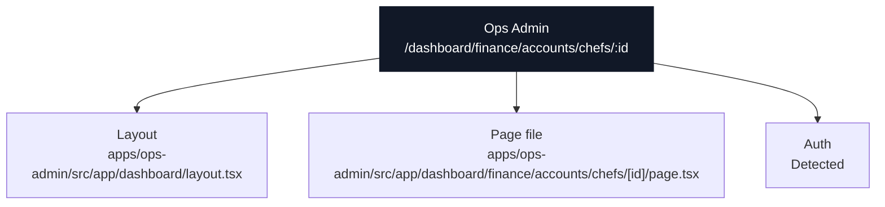

### Actual Page Information

| Field | Value |
| --- | --- |
| App | Ops Admin |
| Domain | `ops.ridendine.ca` |
| Route | `/dashboard/finance/accounts/chefs/:id` |
| Status | `WIRED` |
| Auth | Detected |
| Page file | [apps/ops-admin/src/app/dashboard/finance/accounts/chefs/[id]/page.tsx](../../../../apps/ops-admin/src/app/dashboard/finance/accounts/chefs/[id]/page.tsx) |
| Layout | [apps/ops-admin/src/app/dashboard/layout.tsx](../../../../apps/ops-admin/src/app/dashboard/layout.tsx) |
| Data source summary | Static/client component/undetected |

### Data And API Wiring

| Type | Details |
| --- | --- |
| DB tables/RPCs | None detected |
| Fetch/API calls | None detected |
| Shared packages | None detected |
| Components/imports | None detected |
| Environment vars | None detected |

### Navigation And Links

No outgoing page-navigation links detected.

### API Calls From This Page

No outgoing API/fetch calls detected.

### Incoming References

| Source app | Source file | Kind | Target | Status |
| --- | --- | --- | --- | --- |
| Ops Admin | [apps/ops-admin/src/app/dashboard/finance/accounts/chefs/page.tsx](../../../../apps/ops-admin/src/app/dashboard/finance/accounts/chefs/page.tsx) | href | `/dashboard/finance/accounts/chefs/${id}` | WORKING_DYNAMIC |

### Review Notes

- Static wiring scan did not flag this page, but runtime auth, DB data, and external services still need smoke/e2e proof.


---

## Ops Admin: `/dashboard/finance/accounts/chefs`

### Page Diagram

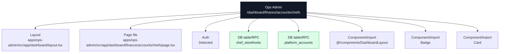

### Actual Page Information

| Field | Value |
| --- | --- |
| App | Ops Admin |
| Domain | `ops.ridendine.ca` |
| Route | `/dashboard/finance/accounts/chefs` |
| Status | `WIRED` |
| Auth | Detected |
| Page file | [apps/ops-admin/src/app/dashboard/finance/accounts/chefs/page.tsx](../../../../apps/ops-admin/src/app/dashboard/finance/accounts/chefs/page.tsx) |
| Layout | [apps/ops-admin/src/app/dashboard/layout.tsx](../../../../apps/ops-admin/src/app/dashboard/layout.tsx) |
| Data source summary | table:chef_storefronts, table:platform_accounts, @ridendine/db, @ridendine/ui |

### Data And API Wiring

| Type | Details |
| --- | --- |
| DB tables/RPCs | `chef_storefronts`, `platform_accounts` |
| Fetch/API calls | None detected |
| Shared packages | @ridendine/db, @ridendine/ui |
| Components/imports | `@/components/DashboardLayout`, `Badge`, `Card` |
| Environment vars | None detected |

### Navigation And Links

| Status | Kind | Target | Resolved app | Resolved file | Notes |
| --- | --- | --- | --- | --- | --- |
| WORKING_DYNAMIC | href | `/dashboard/finance/accounts/chefs/${id}` | Ops Admin | [apps/ops-admin/src/app/dashboard/finance/accounts/chefs/[id]/page.tsx](../../../../apps/ops-admin/src/app/dashboard/finance/accounts/chefs/[id]/page.tsx) | href resolves to page /dashboard/finance/accounts/chefs/:id |

### API Calls From This Page

No outgoing API/fetch calls detected.

### Incoming References

No incoming static references detected.

### Review Notes

- Static wiring scan did not flag this page, but runtime auth, DB data, and external services still need smoke/e2e proof.


---

## Ops Admin: `/dashboard/finance/accounts/drivers/:id`

### Page Diagram

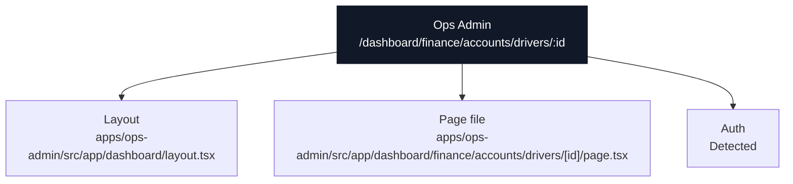

### Actual Page Information

| Field | Value |
| --- | --- |
| App | Ops Admin |
| Domain | `ops.ridendine.ca` |
| Route | `/dashboard/finance/accounts/drivers/:id` |
| Status | `WIRED` |
| Auth | Detected |
| Page file | [apps/ops-admin/src/app/dashboard/finance/accounts/drivers/[id]/page.tsx](../../../../apps/ops-admin/src/app/dashboard/finance/accounts/drivers/[id]/page.tsx) |
| Layout | [apps/ops-admin/src/app/dashboard/layout.tsx](../../../../apps/ops-admin/src/app/dashboard/layout.tsx) |
| Data source summary | Static/client component/undetected |

### Data And API Wiring

| Type | Details |
| --- | --- |
| DB tables/RPCs | None detected |
| Fetch/API calls | None detected |
| Shared packages | None detected |
| Components/imports | None detected |
| Environment vars | None detected |

### Navigation And Links

No outgoing page-navigation links detected.

### API Calls From This Page

No outgoing API/fetch calls detected.

### Incoming References

| Source app | Source file | Kind | Target | Status |
| --- | --- | --- | --- | --- |
| Ops Admin | [apps/ops-admin/src/app/dashboard/finance/accounts/drivers/page.tsx](../../../../apps/ops-admin/src/app/dashboard/finance/accounts/drivers/page.tsx) | href | `/dashboard/finance/accounts/drivers/${id}` | WORKING_DYNAMIC |

### Review Notes

- Static wiring scan did not flag this page, but runtime auth, DB data, and external services still need smoke/e2e proof.


---

## Ops Admin: `/dashboard/finance/accounts/drivers`

### Page Diagram

```mermaid
flowchart TB
  Page["Ops Admin<br/>/dashboard/finance/accounts/drivers"]
  Layout["Layout<br/>apps/ops-admin/src/app/dashboard/layout.tsx"]
  File["Page file<br/>apps/ops-admin/src/app/dashboard/finance/accounts/drivers/page.tsx"]
  Auth["Auth<br/>Detected"]
  Page --> Layout
  Page --> File
  Page --> Auth
  Table0["DB table/RPC<br/>drivers"]
  Page --> Table0
  Table1["DB table/RPC<br/>platform_accounts"]
  Page --> Table1
  Component0["Component/import<br/>@/components/DashboardLayout"]
  Page --> Component0
  Component1["Component/import<br/>Badge"]
  Page --> Component1
  Component2["Component/import<br/>Card"]
  Page --> Component2
  classDef page fill:#111827,stroke:#111827,color:#ffffff
  classDef data fill:#dcfce7,stroke:#16a34a,color:#172033
  classDef api fill:#dbeafe,stroke:#2563eb,color:#172033
  classDef warn fill:#fef3c7,stroke:#f59e0b,color:#172033
  class Page page
  class Table0,Table1 data
```

### Actual Page Information

| Field | Value |
| --- | --- |
| App | Ops Admin |
| Domain | `ops.ridendine.ca` |
| Route | `/dashboard/finance/accounts/drivers` |
| Status | `WIRED` |
| Auth | Detected |
| Page file | [apps/ops-admin/src/app/dashboard/finance/accounts/drivers/page.tsx](../../../../apps/ops-admin/src/app/dashboard/finance/accounts/drivers/page.tsx) |
| Layout | [apps/ops-admin/src/app/dashboard/layout.tsx](../../../../apps/ops-admin/src/app/dashboard/layout.tsx) |
| Data source summary | table:drivers, table:platform_accounts, @ridendine/db, @ridendine/ui |

### Data And API Wiring

| Type | Details |
| --- | --- |
| DB tables/RPCs | `drivers`, `platform_accounts` |
| Fetch/API calls | None detected |
| Shared packages | @ridendine/db, @ridendine/ui |
| Components/imports | `@/components/DashboardLayout`, `Badge`, `Card` |
| Environment vars | None detected |

### Navigation And Links

| Status | Kind | Target | Resolved app | Resolved file | Notes |
| --- | --- | --- | --- | --- | --- |
| WORKING_DYNAMIC | href | `/dashboard/finance/accounts/drivers/${id}` | Ops Admin | [apps/ops-admin/src/app/dashboard/finance/accounts/drivers/[id]/page.tsx](../../../../apps/ops-admin/src/app/dashboard/finance/accounts/drivers/[id]/page.tsx) | href resolves to page /dashboard/finance/accounts/drivers/:id |

### API Calls From This Page

No outgoing API/fetch calls detected.

### Incoming References

No incoming static references detected.

### Review Notes

- Static wiring scan did not flag this page, but runtime auth, DB data, and external services still need smoke/e2e proof.


---

## Ops Admin: `/dashboard/finance/instant-payouts`

### Page Diagram

```mermaid
flowchart TB
  Page["Ops Admin<br/>/dashboard/finance/instant-payouts"]
  Layout["Layout<br/>apps/ops-admin/src/app/dashboard/layout.tsx"]
  File["Page file<br/>apps/ops-admin/src/app/dashboard/finance/instant-payouts/page.tsx"]
  Auth["Auth<br/>Detected"]
  Page --> Layout
  Page --> File
  Page --> Auth
  Table0["DB table/RPC<br/>instant_payout_requests"]
  Page --> Table0
  Component0["Component/import<br/>@/components/DashboardLayout"]
  Page --> Component0
  Component1["Component/import<br/>Badge"]
  Page --> Component1
  Component2["Component/import<br/>Card"]
  Page --> Component2
  classDef page fill:#111827,stroke:#111827,color:#ffffff
  classDef data fill:#dcfce7,stroke:#16a34a,color:#172033
  classDef api fill:#dbeafe,stroke:#2563eb,color:#172033
  classDef warn fill:#fef3c7,stroke:#f59e0b,color:#172033
  class Page page
  class Table0 data
```

### Actual Page Information

| Field | Value |
| --- | --- |
| App | Ops Admin |
| Domain | `ops.ridendine.ca` |
| Route | `/dashboard/finance/instant-payouts` |
| Status | `WIRED` |
| Auth | Detected |
| Page file | [apps/ops-admin/src/app/dashboard/finance/instant-payouts/page.tsx](../../../../apps/ops-admin/src/app/dashboard/finance/instant-payouts/page.tsx) |
| Layout | [apps/ops-admin/src/app/dashboard/layout.tsx](../../../../apps/ops-admin/src/app/dashboard/layout.tsx) |
| Data source summary | table:instant_payout_requests, @ridendine/db, @ridendine/ui |

### Data And API Wiring

| Type | Details |
| --- | --- |
| DB tables/RPCs | `instant_payout_requests` |
| Fetch/API calls | None detected |
| Shared packages | @ridendine/db, @ridendine/ui |
| Components/imports | `@/components/DashboardLayout`, `Badge`, `Card` |
| Environment vars | None detected |

### Navigation And Links

No outgoing page-navigation links detected.

### API Calls From This Page

No outgoing API/fetch calls detected.

### Incoming References

No incoming static references detected.

### Review Notes

- Static wiring scan did not flag this page, but runtime auth, DB data, and external services still need smoke/e2e proof.


---

## Ops Admin: `/dashboard/finance`

### Page Diagram

```mermaid
flowchart TB
  Page["Ops Admin<br/>/dashboard/finance"]
  Layout["Layout<br/>apps/ops-admin/src/app/dashboard/layout.tsx"]
  File["Page file<br/>apps/ops-admin/src/app/dashboard/finance/page.tsx"]
  Auth["Auth<br/>Detected"]
  Page --> Layout
  Page --> File
  Page --> Auth
  Api0["API/fetch<br/>/api/export?type=bank_payouts"]
  Page --> Api0
  Api1["API/fetch<br/>/api/export?type=ledger"]
  Page --> Api1
  Api2["API/fetch<br/>/api/export?type=orders"]
  Page --> Api2
  Component0["Component/import<br/>@/components/DashboardLayout"]
  Page --> Component0
  Component1["Component/import<br/>EmptyState"]
  Page --> Component1
  Component2["Component/import<br/>KpiTile"]
  Page --> Component2
  Component3["Component/import<br/>PageHeader"]
  Page --> Component3
  classDef page fill:#111827,stroke:#111827,color:#ffffff
  classDef data fill:#dcfce7,stroke:#16a34a,color:#172033
  classDef api fill:#dbeafe,stroke:#2563eb,color:#172033
  classDef warn fill:#fef3c7,stroke:#f59e0b,color:#172033
  class Page page
  class Api0,Api1,Api2 api
```

### Actual Page Information

| Field | Value |
| --- | --- |
| App | Ops Admin |
| Domain | `ops.ridendine.ca` |
| Route | `/dashboard/finance` |
| Status | `WIRED` |
| Auth | Detected |
| Page file | [apps/ops-admin/src/app/dashboard/finance/page.tsx](../../../../apps/ops-admin/src/app/dashboard/finance/page.tsx) |
| Layout | [apps/ops-admin/src/app/dashboard/layout.tsx](../../../../apps/ops-admin/src/app/dashboard/layout.tsx) |
| Data source summary | @ridendine/ui |

### Data And API Wiring

| Type | Details |
| --- | --- |
| DB tables/RPCs | None detected |
| Fetch/API calls | `/api/export?type=bank_payouts` (GET)<br>`/api/export?type=ledger` (GET)<br>`/api/export?type=orders` (GET) |
| Shared packages | @ridendine/ui |
| Components/imports | `@/components/DashboardLayout`, `EmptyState`, `KpiTile`, `PageHeader` |
| Environment vars | None detected |

### Navigation And Links

No outgoing page-navigation links detected.

### API Calls From This Page

| Status | Kind | Target | Resolved app | Resolved file | Notes |
| --- | --- | --- | --- | --- | --- |
| WORKING | href | `/api/export?type=bank_payouts` | Ops Admin | [apps/ops-admin/src/app/api/export/route.ts](../../../../apps/ops-admin/src/app/api/export/route.ts) | href resolves to API /api/export |
| WORKING | href | `/api/export?type=ledger` | Ops Admin | [apps/ops-admin/src/app/api/export/route.ts](../../../../apps/ops-admin/src/app/api/export/route.ts) | href resolves to API /api/export |
| WORKING | href | `/api/export?type=orders` | Ops Admin | [apps/ops-admin/src/app/api/export/route.ts](../../../../apps/ops-admin/src/app/api/export/route.ts) | href resolves to API /api/export |

### Incoming References

| Source app | Source file | Kind | Target | Status |
| --- | --- | --- | --- | --- |
| Ops Admin | [apps/ops-admin/src/app/dashboard/page.tsx](../../../../apps/ops-admin/src/app/dashboard/page.tsx) | href | `/dashboard/finance` | WORKING |

### Review Notes

- Static wiring scan did not flag this page, but runtime auth, DB data, and external services still need smoke/e2e proof.


---

## Ops Admin: `/dashboard/finance/payouts/:runId`

### Page Diagram

```mermaid
flowchart TB
  Page["Ops Admin<br/>/dashboard/finance/payouts/:runId"]
  Layout["Layout<br/>apps/ops-admin/src/app/dashboard/layout.tsx"]
  File["Page file<br/>apps/ops-admin/src/app/dashboard/finance/payouts/[runId]/page.tsx"]
  Auth["Auth<br/>Detected"]
  Page --> Layout
  Page --> File
  Page --> Auth
  Table0["DB table/RPC<br/>driver_payouts"]
  Page --> Table0
  Table1["DB table/RPC<br/>ledger_entries"]
  Page --> Table1
  Table2["DB table/RPC<br/>payout_runs"]
  Page --> Table2
  Component0["Component/import<br/>@/components/DashboardLayout"]
  Page --> Component0
  Component1["Component/import<br/>Badge"]
  Page --> Component1
  Component2["Component/import<br/>Card"]
  Page --> Component2
  classDef page fill:#111827,stroke:#111827,color:#ffffff
  classDef data fill:#dcfce7,stroke:#16a34a,color:#172033
  classDef api fill:#dbeafe,stroke:#2563eb,color:#172033
  classDef warn fill:#fef3c7,stroke:#f59e0b,color:#172033
  class Page page
  class Table0,Table1,Table2 data
```

### Actual Page Information

| Field | Value |
| --- | --- |
| App | Ops Admin |
| Domain | `ops.ridendine.ca` |
| Route | `/dashboard/finance/payouts/:runId` |
| Status | `WIRED` |
| Auth | Detected |
| Page file | [apps/ops-admin/src/app/dashboard/finance/payouts/[runId]/page.tsx](../../../../apps/ops-admin/src/app/dashboard/finance/payouts/[runId]/page.tsx) |
| Layout | [apps/ops-admin/src/app/dashboard/layout.tsx](../../../../apps/ops-admin/src/app/dashboard/layout.tsx) |
| Data source summary | table:driver_payouts, table:ledger_entries, table:payout_runs, @ridendine/db, @ridendine/ui |

### Data And API Wiring

| Type | Details |
| --- | --- |
| DB tables/RPCs | `driver_payouts`, `ledger_entries`, `payout_runs` |
| Fetch/API calls | None detected |
| Shared packages | @ridendine/db, @ridendine/ui |
| Components/imports | `@/components/DashboardLayout`, `Badge`, `Card` |
| Environment vars | None detected |

### Navigation And Links

| Status | Kind | Target | Resolved app | Resolved file | Notes |
| --- | --- | --- | --- | --- | --- |
| WORKING | href | `/dashboard/finance/payouts` | Ops Admin | [apps/ops-admin/src/app/dashboard/finance/payouts/page.tsx](../../../../apps/ops-admin/src/app/dashboard/finance/payouts/page.tsx) | href resolves to page /dashboard/finance/payouts |

### API Calls From This Page

No outgoing API/fetch calls detected.

### Incoming References

| Source app | Source file | Kind | Target | Status |
| --- | --- | --- | --- | --- |
| Ops Admin | [apps/ops-admin/src/app/dashboard/finance/payouts/page.tsx](../../../../apps/ops-admin/src/app/dashboard/finance/payouts/page.tsx) | href | `/dashboard/finance/payouts/${run.id}` | WORKING_DYNAMIC |

### Review Notes

- Static wiring scan did not flag this page, but runtime auth, DB data, and external services still need smoke/e2e proof.


---

## Ops Admin: `/dashboard/finance/payouts`

### Page Diagram

```mermaid
flowchart TB
  Page["Ops Admin<br/>/dashboard/finance/payouts"]
  Layout["Layout<br/>apps/ops-admin/src/app/dashboard/layout.tsx"]
  File["Page file<br/>apps/ops-admin/src/app/dashboard/finance/payouts/page.tsx"]
  Auth["Auth<br/>Detected"]
  Page --> Layout
  Page --> File
  Page --> Auth
  Table0["DB table/RPC<br/>payout_runs"]
  Page --> Table0
  Component0["Component/import<br/>@/components/DashboardLayout"]
  Page --> Component0
  Component1["Component/import<br/>EmptyState"]
  Page --> Component1
  Component2["Component/import<br/>PageHeader"]
  Page --> Component2
  Component3["Component/import<br/>StatusBadge"]
  Page --> Component3
  classDef page fill:#111827,stroke:#111827,color:#ffffff
  classDef data fill:#dcfce7,stroke:#16a34a,color:#172033
  classDef api fill:#dbeafe,stroke:#2563eb,color:#172033
  classDef warn fill:#fef3c7,stroke:#f59e0b,color:#172033
  class Page page
  class Table0 data
```

### Actual Page Information

| Field | Value |
| --- | --- |
| App | Ops Admin |
| Domain | `ops.ridendine.ca` |
| Route | `/dashboard/finance/payouts` |
| Status | `WIRED` |
| Auth | Detected |
| Page file | [apps/ops-admin/src/app/dashboard/finance/payouts/page.tsx](../../../../apps/ops-admin/src/app/dashboard/finance/payouts/page.tsx) |
| Layout | [apps/ops-admin/src/app/dashboard/layout.tsx](../../../../apps/ops-admin/src/app/dashboard/layout.tsx) |
| Data source summary | table:payout_runs, @ridendine/db, @ridendine/ui |

### Data And API Wiring

| Type | Details |
| --- | --- |
| DB tables/RPCs | `payout_runs` |
| Fetch/API calls | None detected |
| Shared packages | @ridendine/db, @ridendine/ui |
| Components/imports | `@/components/DashboardLayout`, `EmptyState`, `PageHeader`, `StatusBadge` |
| Environment vars | None detected |

### Navigation And Links

| Status | Kind | Target | Resolved app | Resolved file | Notes |
| --- | --- | --- | --- | --- | --- |
| WORKING_DYNAMIC | href | `/dashboard/finance/payouts/${run.id}` | Ops Admin | [apps/ops-admin/src/app/dashboard/finance/payouts/[runId]/page.tsx](../../../../apps/ops-admin/src/app/dashboard/finance/payouts/[runId]/page.tsx) | href resolves to page /dashboard/finance/payouts/:runId |

### API Calls From This Page

No outgoing API/fetch calls detected.

### Incoming References

| Source app | Source file | Kind | Target | Status |
| --- | --- | --- | --- | --- |
| Ops Admin | [apps/ops-admin/src/app/dashboard/finance/payouts/[runId]/page.tsx](../../../../apps/ops-admin/src/app/dashboard/finance/payouts/[runId]/page.tsx) | href | `/dashboard/finance/payouts` | WORKING |

### Review Notes

- Static wiring scan did not flag this page, but runtime auth, DB data, and external services still need smoke/e2e proof.


---

## Ops Admin: `/dashboard/finance/reconciliation`

### Page Diagram

```mermaid
flowchart TB
  Page["Ops Admin<br/>/dashboard/finance/reconciliation"]
  Layout["Layout<br/>apps/ops-admin/src/app/dashboard/layout.tsx"]
  File["Page file<br/>apps/ops-admin/src/app/dashboard/finance/reconciliation/page.tsx"]
  Auth["Auth<br/>Detected"]
  Page --> Layout
  Page --> File
  Page --> Auth
  Table0["DB table/RPC<br/>stripe_reconciliation"]
  Page --> Table0
  Component0["Component/import<br/>@/components/DashboardLayout"]
  Page --> Component0
  Component1["Component/import<br/>EmptyState"]
  Page --> Component1
  Component2["Component/import<br/>PageHeader"]
  Page --> Component2
  Component3["Component/import<br/>StatusBadge"]
  Page --> Component3
  classDef page fill:#111827,stroke:#111827,color:#ffffff
  classDef data fill:#dcfce7,stroke:#16a34a,color:#172033
  classDef api fill:#dbeafe,stroke:#2563eb,color:#172033
  classDef warn fill:#fef3c7,stroke:#f59e0b,color:#172033
  class Page page
  class Table0 data
```

### Actual Page Information

| Field | Value |
| --- | --- |
| App | Ops Admin |
| Domain | `ops.ridendine.ca` |
| Route | `/dashboard/finance/reconciliation` |
| Status | `WIRED` |
| Auth | Detected |
| Page file | [apps/ops-admin/src/app/dashboard/finance/reconciliation/page.tsx](../../../../apps/ops-admin/src/app/dashboard/finance/reconciliation/page.tsx) |
| Layout | [apps/ops-admin/src/app/dashboard/layout.tsx](../../../../apps/ops-admin/src/app/dashboard/layout.tsx) |
| Data source summary | table:stripe_reconciliation, @ridendine/db, @ridendine/ui |

### Data And API Wiring

| Type | Details |
| --- | --- |
| DB tables/RPCs | `stripe_reconciliation` |
| Fetch/API calls | None detected |
| Shared packages | @ridendine/db, @ridendine/ui |
| Components/imports | `@/components/DashboardLayout`, `EmptyState`, `PageHeader`, `StatusBadge` |
| Environment vars | None detected |

### Navigation And Links

No outgoing page-navigation links detected.

### API Calls From This Page

No outgoing API/fetch calls detected.

### Incoming References

No incoming static references detected.

### Review Notes

- Static wiring scan did not flag this page, but runtime auth, DB data, and external services still need smoke/e2e proof.


---

## Ops Admin: `/dashboard/finance/refunds`

### Page Diagram

```mermaid
flowchart TB
  Page["Ops Admin<br/>/dashboard/finance/refunds"]
  Layout["Layout<br/>apps/ops-admin/src/app/dashboard/layout.tsx"]
  File["Page file<br/>apps/ops-admin/src/app/dashboard/finance/refunds/page.tsx"]
  Auth["Auth<br/>Detected"]
  Page --> Layout
  Page --> File
  Page --> Auth
  Component0["Component/import<br/>@/components/DashboardLayout"]
  Page --> Component0
  Component1["Component/import<br/>EmptyState"]
  Page --> Component1
  Component2["Component/import<br/>KpiTile"]
  Page --> Component2
  Component3["Component/import<br/>PageHeader"]
  Page --> Component3
  classDef page fill:#111827,stroke:#111827,color:#ffffff
  classDef data fill:#dcfce7,stroke:#16a34a,color:#172033
  classDef api fill:#dbeafe,stroke:#2563eb,color:#172033
  classDef warn fill:#fef3c7,stroke:#f59e0b,color:#172033
  class Page page
```

### Actual Page Information

| Field | Value |
| --- | --- |
| App | Ops Admin |
| Domain | `ops.ridendine.ca` |
| Route | `/dashboard/finance/refunds` |
| Status | `WIRED` |
| Auth | Detected |
| Page file | [apps/ops-admin/src/app/dashboard/finance/refunds/page.tsx](../../../../apps/ops-admin/src/app/dashboard/finance/refunds/page.tsx) |
| Layout | [apps/ops-admin/src/app/dashboard/layout.tsx](../../../../apps/ops-admin/src/app/dashboard/layout.tsx) |
| Data source summary | @ridendine/ui |

### Data And API Wiring

| Type | Details |
| --- | --- |
| DB tables/RPCs | None detected |
| Fetch/API calls | None detected |
| Shared packages | @ridendine/ui |
| Components/imports | `@/components/DashboardLayout`, `EmptyState`, `KpiTile`, `PageHeader` |
| Environment vars | None detected |

### Navigation And Links

No outgoing page-navigation links detected.

### API Calls From This Page

No outgoing API/fetch calls detected.

### Incoming References

No incoming static references detected.

### Review Notes

- Static wiring scan did not flag this page, but runtime auth, DB data, and external services still need smoke/e2e proof.


---

## Ops Admin: `/dashboard/health`

### Page Diagram

```mermaid
flowchart TB
  Page["Ops Admin<br/>/dashboard/health"]
  Layout["Layout<br/>apps/ops-admin/src/app/dashboard/layout.tsx"]
  File["Page file<br/>apps/ops-admin/src/app/dashboard/health/page.tsx"]
  Auth["Auth<br/>Detected"]
  Page --> Layout
  Page --> File
  Page --> Auth
  Api0["API/fetch<br/>${baseUrl}/api/engine/health"]
  Page --> Api0
  Api1["API/fetch<br/>${baseUrl}/api/health"]
  Page --> Api1
  Component0["Component/import<br/>@/components/DashboardLayout"]
  Page --> Component0
  Component1["Component/import<br/>Card"]
  Page --> Component1
  Gap0["UNKNOWN_DYNAMIC<br/>${baseUrl}/api/engine/health"]
  Page -. review .-> Gap0
  Gap1["UNKNOWN_DYNAMIC<br/>${baseUrl}/api/health"]
  Page -. review .-> Gap1
  classDef page fill:#111827,stroke:#111827,color:#ffffff
  classDef data fill:#dcfce7,stroke:#16a34a,color:#172033
  classDef api fill:#dbeafe,stroke:#2563eb,color:#172033
  classDef warn fill:#fef3c7,stroke:#f59e0b,color:#172033
  class Page page
  class Api0,Api1 api
  class Gap0,Gap1 warn
```

### Actual Page Information

| Field | Value |
| --- | --- |
| App | Ops Admin |
| Domain | `ops.ridendine.ca` |
| Route | `/dashboard/health` |
| Status | `WIRED` |
| Auth | Detected |
| Page file | [apps/ops-admin/src/app/dashboard/health/page.tsx](../../../../apps/ops-admin/src/app/dashboard/health/page.tsx) |
| Layout | [apps/ops-admin/src/app/dashboard/layout.tsx](../../../../apps/ops-admin/src/app/dashboard/layout.tsx) |
| Data source summary | @ridendine/ui |

### Data And API Wiring

| Type | Details |
| --- | --- |
| DB tables/RPCs | None detected |
| Fetch/API calls | `${baseUrl}/api/engine/health`<br>`${baseUrl}/api/health` |
| Shared packages | @ridendine/ui |
| Components/imports | `@/components/DashboardLayout`, `Card` |
| Environment vars | `NEXT_PUBLIC_APP_URL`, `VERCEL_URL` |

### Navigation And Links

No outgoing page-navigation links detected.

### API Calls From This Page

| Status | Kind | Target | Resolved app | Resolved file | Notes |
| --- | --- | --- | --- | --- | --- |
| UNKNOWN_DYNAMIC | fetch | `${baseUrl}/api/engine/health` | Ops Admin |  | Not an internal route path |
| UNKNOWN_DYNAMIC | fetch | `${baseUrl}/api/health` | Ops Admin |  | Not an internal route path |

### Incoming References

No incoming static references detected.

### Review Notes

- Dynamic/unproven references: `${baseUrl}/api/engine/health`, `${baseUrl}/api/health`.


---

## Ops Admin: `/dashboard/integrations`

### Page Diagram

```mermaid
flowchart TB
  Page["Ops Admin<br/>/dashboard/integrations"]
  Layout["Layout<br/>apps/ops-admin/src/app/dashboard/layout.tsx"]
  File["Page file<br/>apps/ops-admin/src/app/dashboard/integrations/page.tsx"]
  Auth["Auth<br/>Detected"]
  Page --> Layout
  Page --> File
  Page --> Auth
  Component0["Component/import<br/>@/components/DashboardLayout"]
  Page --> Component0
  Component1["Component/import<br/>Badge"]
  Page --> Component1
  Component2["Component/import<br/>Card"]
  Page --> Component2
  classDef page fill:#111827,stroke:#111827,color:#ffffff
  classDef data fill:#dcfce7,stroke:#16a34a,color:#172033
  classDef api fill:#dbeafe,stroke:#2563eb,color:#172033
  classDef warn fill:#fef3c7,stroke:#f59e0b,color:#172033
  class Page page
```

### Actual Page Information

| Field | Value |
| --- | --- |
| App | Ops Admin |
| Domain | `ops.ridendine.ca` |
| Route | `/dashboard/integrations` |
| Status | `WIRED` |
| Auth | Detected |
| Page file | [apps/ops-admin/src/app/dashboard/integrations/page.tsx](../../../../apps/ops-admin/src/app/dashboard/integrations/page.tsx) |
| Layout | [apps/ops-admin/src/app/dashboard/layout.tsx](../../../../apps/ops-admin/src/app/dashboard/layout.tsx) |
| Data source summary | @ridendine/ui |

### Data And API Wiring

| Type | Details |
| --- | --- |
| DB tables/RPCs | None detected |
| Fetch/API calls | None detected |
| Shared packages | @ridendine/ui |
| Components/imports | `@/components/DashboardLayout`, `Badge`, `Card` |
| Environment vars | `ENGINE_PROCESSOR_TOKEN`, `NEXT_PUBLIC_SENTRY_DSN`, `NEXT_PUBLIC_SUPABASE_URL`, `RESEND_API_KEY`, `STRIPE_SECRET_KEY`, `STRIPE_WEBHOOK_SECRET` |

### Navigation And Links

No outgoing page-navigation links detected.

### API Calls From This Page

No outgoing API/fetch calls detected.

### Incoming References

No incoming static references detected.

### Review Notes

- Static wiring scan did not flag this page, but runtime auth, DB data, and external services still need smoke/e2e proof.


---

## Ops Admin: `/dashboard/map`

### Page Diagram

```mermaid
flowchart TB
  Page["Ops Admin<br/>/dashboard/map"]
  Layout["Layout<br/>apps/ops-admin/src/app/dashboard/layout.tsx"]
  File["Page file<br/>apps/ops-admin/src/app/dashboard/map/page.tsx"]
  Auth["Auth<br/>Undetected"]
  Page --> Layout
  Page --> File
  Page --> Auth
  Component0["Component/import<br/>@/components/DashboardLayout"]
  Page --> Component0
  Component1["Component/import<br/>Card"]
  Page --> Component1
  classDef page fill:#111827,stroke:#111827,color:#ffffff
  classDef data fill:#dcfce7,stroke:#16a34a,color:#172033
  classDef api fill:#dbeafe,stroke:#2563eb,color:#172033
  classDef warn fill:#fef3c7,stroke:#f59e0b,color:#172033
  class Page page
```

### Actual Page Information

| Field | Value |
| --- | --- |
| App | Ops Admin |
| Domain | `ops.ridendine.ca` |
| Route | `/dashboard/map` |
| Status | `WIRED` |
| Auth | Undetected |
| Page file | [apps/ops-admin/src/app/dashboard/map/page.tsx](../../../../apps/ops-admin/src/app/dashboard/map/page.tsx) |
| Layout | [apps/ops-admin/src/app/dashboard/layout.tsx](../../../../apps/ops-admin/src/app/dashboard/layout.tsx) |
| Data source summary | @ridendine/ui |

### Data And API Wiring

| Type | Details |
| --- | --- |
| DB tables/RPCs | None detected |
| Fetch/API calls | None detected |
| Shared packages | @ridendine/ui |
| Components/imports | `@/components/DashboardLayout`, `Card` |
| Environment vars | None detected |

### Navigation And Links

No outgoing page-navigation links detected.

### API Calls From This Page

No outgoing API/fetch calls detected.

### Incoming References

| Source app | Source file | Kind | Target | Status |
| --- | --- | --- | --- | --- |
| Ops Admin | [apps/ops-admin/src/app/dashboard/drivers/[id]/page.tsx](../../../../apps/ops-admin/src/app/dashboard/drivers/[id]/page.tsx) | href | `/dashboard/map` | WORKING |

### Review Notes

- Static wiring scan did not flag this page, but runtime auth, DB data, and external services still need smoke/e2e proof.


---

## Ops Admin: `/dashboard/orders/:id`

### Page Diagram

```mermaid
flowchart TB
  Page["Ops Admin<br/>/dashboard/orders/:id"]
  Layout["Layout<br/>apps/ops-admin/src/app/dashboard/layout.tsx"]
  File["Page file<br/>apps/ops-admin/src/app/dashboard/orders/[id]/page.tsx"]
  Auth["Auth<br/>Detected"]
  Page --> Layout
  Page --> File
  Page --> Auth
  Table0["DB table/RPC<br/>order_exceptions"]
  Page --> Table0
  Component0["Component/import<br/>@/components/DashboardLayout"]
  Page --> Component0
  Component1["Component/import<br/>Badge"]
  Page --> Component1
  Component2["Component/import<br/>Card"]
  Page --> Component2
  classDef page fill:#111827,stroke:#111827,color:#ffffff
  classDef data fill:#dcfce7,stroke:#16a34a,color:#172033
  classDef api fill:#dbeafe,stroke:#2563eb,color:#172033
  classDef warn fill:#fef3c7,stroke:#f59e0b,color:#172033
  class Page page
  class Table0 data
```

### Actual Page Information

| Field | Value |
| --- | --- |
| App | Ops Admin |
| Domain | `ops.ridendine.ca` |
| Route | `/dashboard/orders/:id` |
| Status | `WIRED` |
| Auth | Detected |
| Page file | [apps/ops-admin/src/app/dashboard/orders/[id]/page.tsx](../../../../apps/ops-admin/src/app/dashboard/orders/[id]/page.tsx) |
| Layout | [apps/ops-admin/src/app/dashboard/layout.tsx](../../../../apps/ops-admin/src/app/dashboard/layout.tsx) |
| Data source summary | table:order_exceptions, @ridendine/db, @ridendine/ui |

### Data And API Wiring

| Type | Details |
| --- | --- |
| DB tables/RPCs | `order_exceptions` |
| Fetch/API calls | None detected |
| Shared packages | @ridendine/db, @ridendine/ui |
| Components/imports | `@/components/DashboardLayout`, `Badge`, `Card` |
| Environment vars | None detected |

### Navigation And Links

| Status | Kind | Target | Resolved app | Resolved file | Notes |
| --- | --- | --- | --- | --- | --- |
| WORKING_DYNAMIC | href | `/dashboard/chefs/${order.storefront.chef?.id ??` | Ops Admin | [apps/ops-admin/src/app/dashboard/chefs/[id]/page.tsx](../../../../apps/ops-admin/src/app/dashboard/chefs/[id]/page.tsx) | href resolves to page /dashboard/chefs/:id |
| WORKING_DYNAMIC | href | `/dashboard/customers/${order.customer.id}` | Ops Admin | [apps/ops-admin/src/app/dashboard/customers/[id]/page.tsx](../../../../apps/ops-admin/src/app/dashboard/customers/[id]/page.tsx) | href resolves to page /dashboard/customers/:id |
| WORKING_DYNAMIC | href | `/dashboard/deliveries/${order.delivery.id}` | Ops Admin | [apps/ops-admin/src/app/dashboard/deliveries/[id]/page.tsx](../../../../apps/ops-admin/src/app/dashboard/deliveries/[id]/page.tsx) | href resolves to page /dashboard/deliveries/:id |
| WORKING | href | `/dashboard/orders` | Ops Admin | [apps/ops-admin/src/app/dashboard/orders/page.tsx](../../../../apps/ops-admin/src/app/dashboard/orders/page.tsx) | href resolves to page /dashboard/orders |

### API Calls From This Page

No outgoing API/fetch calls detected.

### Incoming References

| Source app | Source file | Kind | Target | Status |
| --- | --- | --- | --- | --- |
| Ops Admin | [apps/ops-admin/src/app/dashboard/_components/drivers-column.tsx](../../../../apps/ops-admin/src/app/dashboard/_components/drivers-column.tsx) | href | `/dashboard/orders/${d.currentDeliveryOrderId}` | WORKING_DYNAMIC |
| Ops Admin | [apps/ops-admin/src/app/dashboard/_components/orders-column.tsx](../../../../apps/ops-admin/src/app/dashboard/_components/orders-column.tsx) | href | `/dashboard/orders/${order.id}` | WORKING_DYNAMIC |
| Ops Admin | [apps/ops-admin/src/app/dashboard/customers/[id]/page.tsx](../../../../apps/ops-admin/src/app/dashboard/customers/[id]/page.tsx) | href | `/dashboard/orders/${order.id}` | WORKING_DYNAMIC |
| Ops Admin | [apps/ops-admin/src/app/dashboard/deliveries/[id]/page.tsx](../../../../apps/ops-admin/src/app/dashboard/deliveries/[id]/page.tsx) | href | `/dashboard/orders/${detail.order.id}` | WORKING_DYNAMIC |
| Ops Admin | [apps/ops-admin/src/app/dashboard/orders/page.tsx](../../../../apps/ops-admin/src/app/dashboard/orders/page.tsx) | href | `/dashboard/orders/${order.id}` | WORKING_DYNAMIC |
| Ops Admin | [apps/ops-admin/src/app/dashboard/support/page.tsx](../../../../apps/ops-admin/src/app/dashboard/support/page.tsx) | href | `/dashboard/orders/${ticket.order_id}` | WORKING_DYNAMIC |

### Review Notes

- Static wiring scan did not flag this page, but runtime auth, DB data, and external services still need smoke/e2e proof.


---

## Ops Admin: `/dashboard/orders`

### Page Diagram

```mermaid
flowchart TB
  Page["Ops Admin<br/>/dashboard/orders"]
  Layout["Layout<br/>apps/ops-admin/src/app/dashboard/layout.tsx"]
  File["Page file<br/>apps/ops-admin/src/app/dashboard/orders/page.tsx"]
  Auth["Auth<br/>Undetected"]
  Page --> Layout
  Page --> File
  Page --> Auth
  Api0["API/fetch<br/>/api/engine/orders/${orderId}"]
  Page --> Api0
  Api1["API/fetch<br/>/api/orders"]
  Page --> Api1
  Component0["Component/import<br/>@/components/DashboardLayout"]
  Page --> Component0
  Component1["Component/import<br/>Badge"]
  Page --> Component1
  Component2["Component/import<br/>Card"]
  Page --> Component2
  classDef page fill:#111827,stroke:#111827,color:#ffffff
  classDef data fill:#dcfce7,stroke:#16a34a,color:#172033
  classDef api fill:#dbeafe,stroke:#2563eb,color:#172033
  classDef warn fill:#fef3c7,stroke:#f59e0b,color:#172033
  class Page page
  class Api0,Api1 api
```

### Actual Page Information

| Field | Value |
| --- | --- |
| App | Ops Admin |
| Domain | `ops.ridendine.ca` |
| Route | `/dashboard/orders` |
| Status | `PARTIAL` |
| Auth | Undetected |
| Page file | [apps/ops-admin/src/app/dashboard/orders/page.tsx](../../../../apps/ops-admin/src/app/dashboard/orders/page.tsx) |
| Layout | [apps/ops-admin/src/app/dashboard/layout.tsx](../../../../apps/ops-admin/src/app/dashboard/layout.tsx) |
| Data source summary | @ridendine/ui |

### Data And API Wiring

| Type | Details |
| --- | --- |
| DB tables/RPCs | None detected |
| Fetch/API calls | `/api/engine/orders/${orderId}` (GET, PATCH)<br>`/api/orders` (GET) |
| Shared packages | @ridendine/ui |
| Components/imports | `@/components/DashboardLayout`, `Badge`, `Card` |
| Environment vars | None detected |

### Navigation And Links

| Status | Kind | Target | Resolved app | Resolved file | Notes |
| --- | --- | --- | --- | --- | --- |
| WORKING_DYNAMIC | href | `/dashboard/orders/${order.id}` | Ops Admin | [apps/ops-admin/src/app/dashboard/orders/[id]/page.tsx](../../../../apps/ops-admin/src/app/dashboard/orders/[id]/page.tsx) | href resolves to page /dashboard/orders/:id |

### API Calls From This Page

| Status | Kind | Target | Resolved app | Resolved file | Notes |
| --- | --- | --- | --- | --- | --- |
| WORKING_DYNAMIC | fetch | `/api/engine/orders/${orderId}` | Ops Admin | [apps/ops-admin/src/app/api/engine/orders/[id]/route.ts](../../../../apps/ops-admin/src/app/api/engine/orders/[id]/route.ts) | fetch resolves to API /api/engine/orders/:id |
| WORKING | fetch | `/api/orders` | Ops Admin | [apps/ops-admin/src/app/api/orders/route.ts](../../../../apps/ops-admin/src/app/api/orders/route.ts) | fetch resolves to API /api/orders |

### Incoming References

| Source app | Source file | Kind | Target | Status |
| --- | --- | --- | --- | --- |
| Ops Admin | [apps/ops-admin/src/app/dashboard/orders/[id]/page.tsx](../../../../apps/ops-admin/src/app/dashboard/orders/[id]/page.tsx) | href | `/dashboard/orders` | WORKING |

### Review Notes

- Page status is PARTIAL; review auth/data/API metadata and runtime behavior.


---

## Ops Admin: `/dashboard`

### Page Diagram

```mermaid
flowchart TB
  Page["Ops Admin<br/>/dashboard"]
  Layout["Layout<br/>apps/ops-admin/src/app/dashboard/layout.tsx"]
  File["Page file<br/>apps/ops-admin/src/app/dashboard/page.tsx"]
  Auth["Auth<br/>Detected"]
  Page --> Layout
  Page --> File
  Page --> Auth
  Table0["DB table/RPC<br/>deliveries"]
  Page --> Table0
  Table1["DB table/RPC<br/>driver_presence"]
  Page --> Table1
  Table2["DB table/RPC<br/>drivers"]
  Page --> Table2
  Table3["DB table/RPC<br/>orders"]
  Page --> Table3
  Component0["Component/import<br/>@/components/DashboardLayout"]
  Page --> Component0
  Component1["Component/import<br/>KpiTile"]
  Page --> Component1
  Component2["Component/import<br/>PageHeader"]
  Page --> Component2
  Component3["Component/import<br/>StatusBadge"]
  Page --> Component3
  classDef page fill:#111827,stroke:#111827,color:#ffffff
  classDef data fill:#dcfce7,stroke:#16a34a,color:#172033
  classDef api fill:#dbeafe,stroke:#2563eb,color:#172033
  classDef warn fill:#fef3c7,stroke:#f59e0b,color:#172033
  class Page page
  class Table0,Table1,Table2,Table3 data
```

### Actual Page Information

| Field | Value |
| --- | --- |
| App | Ops Admin |
| Domain | `ops.ridendine.ca` |
| Route | `/dashboard` |
| Status | `WIRED` |
| Auth | Detected |
| Page file | [apps/ops-admin/src/app/dashboard/page.tsx](../../../../apps/ops-admin/src/app/dashboard/page.tsx) |
| Layout | [apps/ops-admin/src/app/dashboard/layout.tsx](../../../../apps/ops-admin/src/app/dashboard/layout.tsx) |
| Data source summary | table:deliveries, table:driver_presence, table:drivers, table:orders, @ridendine/db, @ridendine/ui |

### Data And API Wiring

| Type | Details |
| --- | --- |
| DB tables/RPCs | `deliveries`, `driver_presence`, `drivers`, `orders` |
| Fetch/API calls | None detected |
| Shared packages | @ridendine/db, @ridendine/ui |
| Components/imports | `@/components/DashboardLayout`, `KpiTile`, `PageHeader`, `StatusBadge` |
| Environment vars | None detected |

### Navigation And Links

| Status | Kind | Target | Resolved app | Resolved file | Notes |
| --- | --- | --- | --- | --- | --- |
| WORKING | href | `/dashboard/announcements` | Ops Admin | [apps/ops-admin/src/app/dashboard/announcements/page.tsx](../../../../apps/ops-admin/src/app/dashboard/announcements/page.tsx) | href resolves to page /dashboard/announcements |
| WORKING | href | `/dashboard/chefs` | Ops Admin | [apps/ops-admin/src/app/dashboard/chefs/page.tsx](../../../../apps/ops-admin/src/app/dashboard/chefs/page.tsx) | href resolves to page /dashboard/chefs |
| WORKING | href | `/dashboard/dispatch` | Ops Admin | [apps/ops-admin/src/app/dashboard/dispatch/page.tsx](../../../../apps/ops-admin/src/app/dashboard/dispatch/page.tsx) | href resolves to page /dashboard/dispatch |
| WORKING | href | `/dashboard/drivers` | Ops Admin | [apps/ops-admin/src/app/dashboard/drivers/page.tsx](../../../../apps/ops-admin/src/app/dashboard/drivers/page.tsx) | href resolves to page /dashboard/drivers |
| WORKING | href | `/dashboard/finance` | Ops Admin | [apps/ops-admin/src/app/dashboard/finance/page.tsx](../../../../apps/ops-admin/src/app/dashboard/finance/page.tsx) | href resolves to page /dashboard/finance |

### API Calls From This Page

No outgoing API/fetch calls detected.

### Incoming References

| Source app | Source file | Kind | Target | Status |
| --- | --- | --- | --- | --- |
| Ops Admin | [apps/ops-admin/src/app/error.tsx](../../../../apps/ops-admin/src/app/error.tsx) | href | `/dashboard` | WORKING |
| Ops Admin | [apps/ops-admin/src/app/page.tsx](../../../../apps/ops-admin/src/app/page.tsx) | redirect | `/dashboard` | WORKING |
| Ops Admin | [apps/ops-admin/src/components/DashboardLayout.tsx](../../../../apps/ops-admin/src/components/DashboardLayout.tsx) | href | `/dashboard` | WORKING |

### Review Notes

- Static wiring scan did not flag this page, but runtime auth, DB data, and external services still need smoke/e2e proof.


---

## Ops Admin: `/dashboard/promos`

### Page Diagram

```mermaid
flowchart TB
  Page["Ops Admin<br/>/dashboard/promos"]
  Layout["Layout<br/>apps/ops-admin/src/app/dashboard/layout.tsx"]
  File["Page file<br/>apps/ops-admin/src/app/dashboard/promos/page.tsx"]
  Auth["Auth<br/>Undetected"]
  Page --> Layout
  Page --> File
  Page --> Auth
  Component0["Component/import<br/>@/components/DashboardLayout"]
  Page --> Component0
  Component1["Component/import<br/>Badge"]
  Page --> Component1
  Component2["Component/import<br/>Button"]
  Page --> Component2
  Component3["Component/import<br/>Card"]
  Page --> Component3
  Component4["Component/import<br/>Input"]
  Page --> Component4
  classDef page fill:#111827,stroke:#111827,color:#ffffff
  classDef data fill:#dcfce7,stroke:#16a34a,color:#172033
  classDef api fill:#dbeafe,stroke:#2563eb,color:#172033
  classDef warn fill:#fef3c7,stroke:#f59e0b,color:#172033
  class Page page
```

### Actual Page Information

| Field | Value |
| --- | --- |
| App | Ops Admin |
| Domain | `ops.ridendine.ca` |
| Route | `/dashboard/promos` |
| Status | `PARTIAL` |
| Auth | Undetected |
| Page file | [apps/ops-admin/src/app/dashboard/promos/page.tsx](../../../../apps/ops-admin/src/app/dashboard/promos/page.tsx) |
| Layout | [apps/ops-admin/src/app/dashboard/layout.tsx](../../../../apps/ops-admin/src/app/dashboard/layout.tsx) |
| Data source summary | @ridendine/ui |

### Data And API Wiring

| Type | Details |
| --- | --- |
| DB tables/RPCs | None detected |
| Fetch/API calls | None detected |
| Shared packages | @ridendine/ui |
| Components/imports | `@/components/DashboardLayout`, `Badge`, `Button`, `Card`, `Input` |
| Environment vars | None detected |

### Navigation And Links

No outgoing page-navigation links detected.

### API Calls From This Page

No outgoing API/fetch calls detected.

### Incoming References

No incoming static references detected.

### Review Notes

- Page status is PARTIAL; review auth/data/API metadata and runtime behavior.


---

## Ops Admin: `/dashboard/reports`

### Page Diagram

```mermaid
flowchart TB
  Page["Ops Admin<br/>/dashboard/reports"]
  Layout["Layout<br/>apps/ops-admin/src/app/dashboard/layout.tsx"]
  File["Page file<br/>apps/ops-admin/src/app/dashboard/reports/page.tsx"]
  Auth["Auth<br/>Undetected"]
  Page --> Layout
  Page --> File
  Page --> Auth
  Api0["API/fetch<br/>/api/export?type=orders&start=${startDate}&end=${endDate}"]
  Page --> Api0
  Component0["Component/import<br/>@/components/DashboardLayout"]
  Page --> Component0
  Component1["Component/import<br/>Button"]
  Page --> Component1
  Component2["Component/import<br/>Card"]
  Page --> Component2
  classDef page fill:#111827,stroke:#111827,color:#ffffff
  classDef data fill:#dcfce7,stroke:#16a34a,color:#172033
  classDef api fill:#dbeafe,stroke:#2563eb,color:#172033
  classDef warn fill:#fef3c7,stroke:#f59e0b,color:#172033
  class Page page
  class Api0 api
```

### Actual Page Information

| Field | Value |
| --- | --- |
| App | Ops Admin |
| Domain | `ops.ridendine.ca` |
| Route | `/dashboard/reports` |
| Status | `WIRED` |
| Auth | Undetected |
| Page file | [apps/ops-admin/src/app/dashboard/reports/page.tsx](../../../../apps/ops-admin/src/app/dashboard/reports/page.tsx) |
| Layout | [apps/ops-admin/src/app/dashboard/layout.tsx](../../../../apps/ops-admin/src/app/dashboard/layout.tsx) |
| Data source summary | @ridendine/ui |

### Data And API Wiring

| Type | Details |
| --- | --- |
| DB tables/RPCs | None detected |
| Fetch/API calls | `/api/export?type=orders&start=${startDate}&end=${endDate}` (GET) |
| Shared packages | @ridendine/ui |
| Components/imports | `@/components/DashboardLayout`, `Button`, `Card` |
| Environment vars | None detected |

### Navigation And Links

No outgoing page-navigation links detected.

### API Calls From This Page

| Status | Kind | Target | Resolved app | Resolved file | Notes |
| --- | --- | --- | --- | --- | --- |
| WORKING | href | `/api/export?type=orders&start=${startDate}&end=${endDate}` | Ops Admin | [apps/ops-admin/src/app/api/export/route.ts](../../../../apps/ops-admin/src/app/api/export/route.ts) | href resolves to API /api/export |

### Incoming References

No incoming static references detected.

### Review Notes

- Static wiring scan did not flag this page, but runtime auth, DB data, and external services still need smoke/e2e proof.


---

## Ops Admin: `/dashboard/settings`

### Page Diagram

```mermaid
flowchart TB
  Page["Ops Admin<br/>/dashboard/settings"]
  Layout["Layout<br/>apps/ops-admin/src/app/dashboard/layout.tsx"]
  File["Page file<br/>apps/ops-admin/src/app/dashboard/settings/page.tsx"]
  Auth["Auth<br/>Detected"]
  Page --> Layout
  Page --> File
  Page --> Auth
  Component0["Component/import<br/>@/components/DashboardLayout"]
  Page --> Component0
  Component1["Component/import<br/>Badge"]
  Page --> Component1
  Component2["Component/import<br/>Card"]
  Page --> Component2
  classDef page fill:#111827,stroke:#111827,color:#ffffff
  classDef data fill:#dcfce7,stroke:#16a34a,color:#172033
  classDef api fill:#dbeafe,stroke:#2563eb,color:#172033
  classDef warn fill:#fef3c7,stroke:#f59e0b,color:#172033
  class Page page
```

### Actual Page Information

| Field | Value |
| --- | --- |
| App | Ops Admin |
| Domain | `ops.ridendine.ca` |
| Route | `/dashboard/settings` |
| Status | `WIRED` |
| Auth | Detected |
| Page file | [apps/ops-admin/src/app/dashboard/settings/page.tsx](../../../../apps/ops-admin/src/app/dashboard/settings/page.tsx) |
| Layout | [apps/ops-admin/src/app/dashboard/layout.tsx](../../../../apps/ops-admin/src/app/dashboard/layout.tsx) |
| Data source summary | @ridendine/ui |

### Data And API Wiring

| Type | Details |
| --- | --- |
| DB tables/RPCs | None detected |
| Fetch/API calls | None detected |
| Shared packages | @ridendine/ui |
| Components/imports | `@/components/DashboardLayout`, `Badge`, `Card` |
| Environment vars | None detected |

### Navigation And Links

No outgoing page-navigation links detected.

### API Calls From This Page

No outgoing API/fetch calls detected.

### Incoming References

| Source app | Source file | Kind | Target | Status |
| --- | --- | --- | --- | --- |
| Ops Admin | [apps/ops-admin/src/app/dashboard/_components/control-center.tsx](../../../../apps/ops-admin/src/app/dashboard/_components/control-center.tsx) | href | `/dashboard/settings` | WORKING |
| Ops Admin | [apps/ops-admin/src/app/dashboard/_components/ops-readiness.tsx](../../../../apps/ops-admin/src/app/dashboard/_components/ops-readiness.tsx) | href | `/dashboard/settings` | WORKING |

### Review Notes

- Static wiring scan did not flag this page, but runtime auth, DB data, and external services still need smoke/e2e proof.


---

## Ops Admin: `/dashboard/support`

### Page Diagram

```mermaid
flowchart TB
  Page["Ops Admin<br/>/dashboard/support"]
  Layout["Layout<br/>apps/ops-admin/src/app/dashboard/layout.tsx"]
  File["Page file<br/>apps/ops-admin/src/app/dashboard/support/page.tsx"]
  Auth["Auth<br/>Detected"]
  Page --> Layout
  Page --> File
  Page --> Auth
  Component0["Component/import<br/>@/components/DashboardLayout"]
  Page --> Component0
  Component1["Component/import<br/>Badge"]
  Page --> Component1
  Component2["Component/import<br/>Card"]
  Page --> Component2
  classDef page fill:#111827,stroke:#111827,color:#ffffff
  classDef data fill:#dcfce7,stroke:#16a34a,color:#172033
  classDef api fill:#dbeafe,stroke:#2563eb,color:#172033
  classDef warn fill:#fef3c7,stroke:#f59e0b,color:#172033
  class Page page
```

### Actual Page Information

| Field | Value |
| --- | --- |
| App | Ops Admin |
| Domain | `ops.ridendine.ca` |
| Route | `/dashboard/support` |
| Status | `PARTIAL` |
| Auth | Detected |
| Page file | [apps/ops-admin/src/app/dashboard/support/page.tsx](../../../../apps/ops-admin/src/app/dashboard/support/page.tsx) |
| Layout | [apps/ops-admin/src/app/dashboard/layout.tsx](../../../../apps/ops-admin/src/app/dashboard/layout.tsx) |
| Data source summary | @ridendine/db, @ridendine/ui |

### Data And API Wiring

| Type | Details |
| --- | --- |
| DB tables/RPCs | None detected |
| Fetch/API calls | None detected |
| Shared packages | @ridendine/db, @ridendine/ui |
| Components/imports | `@/components/DashboardLayout`, `Badge`, `Card` |
| Environment vars | None detected |

### Navigation And Links

| Status | Kind | Target | Resolved app | Resolved file | Notes |
| --- | --- | --- | --- | --- | --- |
| WORKING_DYNAMIC | href | `/dashboard/orders/${ticket.order_id}` | Ops Admin | [apps/ops-admin/src/app/dashboard/orders/[id]/page.tsx](../../../../apps/ops-admin/src/app/dashboard/orders/[id]/page.tsx) | href resolves to page /dashboard/orders/:id |
| WORKING | href | `/dashboard/support?status=${statusFilter}&search=${encodeURIComponent(search)}&page=${Math.max(1, safePage - 1)}` | Ops Admin | [apps/ops-admin/src/app/dashboard/support/page.tsx](../../../../apps/ops-admin/src/app/dashboard/support/page.tsx) | href resolves to page /dashboard/support |
| WORKING | href | `/dashboard/support?status=${statusFilter}&search=${encodeURIComponent(search)}&page=${Math.min(totalPages, safePage + 1)}` | Ops Admin | [apps/ops-admin/src/app/dashboard/support/page.tsx](../../../../apps/ops-admin/src/app/dashboard/support/page.tsx) | href resolves to page /dashboard/support |

### API Calls From This Page

No outgoing API/fetch calls detected.

### Incoming References

| Source app | Source file | Kind | Target | Status |
| --- | --- | --- | --- | --- |
| Ops Admin | [apps/ops-admin/src/app/dashboard/customers/[id]/page.tsx](../../../../apps/ops-admin/src/app/dashboard/customers/[id]/page.tsx) | href | `/dashboard/support` | WORKING |
| Ops Admin | [apps/ops-admin/src/app/dashboard/exceptions/page.tsx](../../../../apps/ops-admin/src/app/dashboard/exceptions/page.tsx) | href | `/dashboard/support` | WORKING |
| Ops Admin | [apps/ops-admin/src/app/dashboard/support/page.tsx](../../../../apps/ops-admin/src/app/dashboard/support/page.tsx) | href | `/dashboard/support?status=${statusFilter}&search=${encodeURIComponent(search)}&page=${Math.max(1, safePage - 1)}` | WORKING |
| Ops Admin | [apps/ops-admin/src/app/dashboard/support/page.tsx](../../../../apps/ops-admin/src/app/dashboard/support/page.tsx) | href | `/dashboard/support?status=${statusFilter}&search=${encodeURIComponent(search)}&page=${Math.min(totalPages, safePage + 1)}` | WORKING |
| Ops Admin | [apps/ops-admin/src/components/ops-alerts.tsx](../../../../apps/ops-admin/src/components/ops-alerts.tsx) | href | `/dashboard/support` | WORKING |

### Review Notes

- Page status is PARTIAL; review auth/data/API metadata and runtime behavior.


---

## Ops Admin: `/dashboard/team`

### Page Diagram

```mermaid
flowchart TB
  Page["Ops Admin<br/>/dashboard/team"]
  Layout["Layout<br/>apps/ops-admin/src/app/dashboard/layout.tsx"]
  File["Page file<br/>apps/ops-admin/src/app/dashboard/team/page.tsx"]
  Auth["Auth<br/>Undetected"]
  Page --> Layout
  Page --> File
  Page --> Auth
  Component0["Component/import<br/>@/components/DashboardLayout"]
  Page --> Component0
  Component1["Component/import<br/>Badge"]
  Page --> Component1
  Component2["Component/import<br/>Button"]
  Page --> Component2
  Component3["Component/import<br/>Card"]
  Page --> Component3
  Component4["Component/import<br/>Input"]
  Page --> Component4
  classDef page fill:#111827,stroke:#111827,color:#ffffff
  classDef data fill:#dcfce7,stroke:#16a34a,color:#172033
  classDef api fill:#dbeafe,stroke:#2563eb,color:#172033
  classDef warn fill:#fef3c7,stroke:#f59e0b,color:#172033
  class Page page
```

### Actual Page Information

| Field | Value |
| --- | --- |
| App | Ops Admin |
| Domain | `ops.ridendine.ca` |
| Route | `/dashboard/team` |
| Status | `PARTIAL` |
| Auth | Undetected |
| Page file | [apps/ops-admin/src/app/dashboard/team/page.tsx](../../../../apps/ops-admin/src/app/dashboard/team/page.tsx) |
| Layout | [apps/ops-admin/src/app/dashboard/layout.tsx](../../../../apps/ops-admin/src/app/dashboard/layout.tsx) |
| Data source summary | @ridendine/ui |

### Data And API Wiring

| Type | Details |
| --- | --- |
| DB tables/RPCs | None detected |
| Fetch/API calls | None detected |
| Shared packages | @ridendine/ui |
| Components/imports | `@/components/DashboardLayout`, `Badge`, `Button`, `Card`, `Input` |
| Environment vars | None detected |

### Navigation And Links

No outgoing page-navigation links detected.

### API Calls From This Page

No outgoing API/fetch calls detected.

### Incoming References

No incoming static references detected.

### Review Notes

- Page status is PARTIAL; review auth/data/API metadata and runtime behavior.


---

## Ops Admin: `/internal/command-center`

### Page Diagram

```mermaid
flowchart TB
  Page["Ops Admin<br/>/internal/command-center"]
  Layout["Layout<br/>apps/ops-admin/src/app/layout.tsx"]
  File["Page file<br/>apps/ops-admin/src/app/internal/command-center/page.tsx"]
  Auth["Auth<br/>Undetected"]
  Page --> Layout
  Page --> File
  Page --> Auth
  classDef page fill:#111827,stroke:#111827,color:#ffffff
  classDef data fill:#dcfce7,stroke:#16a34a,color:#172033
  classDef api fill:#dbeafe,stroke:#2563eb,color:#172033
  classDef warn fill:#fef3c7,stroke:#f59e0b,color:#172033
  class Page page
```

### Actual Page Information

| Field | Value |
| --- | --- |
| App | Ops Admin |
| Domain | `ops.ridendine.ca` |
| Route | `/internal/command-center` |
| Status | `WIRED` |
| Auth | Undetected |
| Page file | [apps/ops-admin/src/app/internal/command-center/page.tsx](../../../../apps/ops-admin/src/app/internal/command-center/page.tsx) |
| Layout | [apps/ops-admin/src/app/layout.tsx](../../../../apps/ops-admin/src/app/layout.tsx) |
| Data source summary | Static/client component/undetected |

### Data And API Wiring

| Type | Details |
| --- | --- |
| DB tables/RPCs | None detected |
| Fetch/API calls | None detected |
| Shared packages | None detected |
| Components/imports | None detected |
| Environment vars | `INTERNAL_COMMAND_CENTER_ENABLED`, `NODE_ENV`, `VERCEL_ENV` |

### Navigation And Links

No outgoing page-navigation links detected.

### API Calls From This Page

No outgoing API/fetch calls detected.

### Incoming References

No incoming static references detected.

### Review Notes

- Static wiring scan did not flag this page, but runtime auth, DB data, and external services still need smoke/e2e proof.


---

## Ops Admin: `/`

### Page Diagram

```mermaid
flowchart TB
  Page["Ops Admin<br/>/"]
  Layout["Layout<br/>apps/ops-admin/src/app/layout.tsx"]
  File["Page file<br/>apps/ops-admin/src/app/page.tsx"]
  Auth["Auth<br/>Public"]
  Page --> Layout
  Page --> File
  Page --> Auth
  classDef page fill:#111827,stroke:#111827,color:#ffffff
  classDef data fill:#dcfce7,stroke:#16a34a,color:#172033
  classDef api fill:#dbeafe,stroke:#2563eb,color:#172033
  classDef warn fill:#fef3c7,stroke:#f59e0b,color:#172033
  class Page page
```

### Actual Page Information

| Field | Value |
| --- | --- |
| App | Ops Admin |
| Domain | `ops.ridendine.ca` |
| Route | `/` |
| Status | `WIRED` |
| Auth | Public |
| Page file | [apps/ops-admin/src/app/page.tsx](../../../../apps/ops-admin/src/app/page.tsx) |
| Layout | [apps/ops-admin/src/app/layout.tsx](../../../../apps/ops-admin/src/app/layout.tsx) |
| Data source summary | Static/client component/undetected |

### Data And API Wiring

| Type | Details |
| --- | --- |
| DB tables/RPCs | None detected |
| Fetch/API calls | None detected |
| Shared packages | None detected |
| Components/imports | None detected |
| Environment vars | None detected |

### Navigation And Links

| Status | Kind | Target | Resolved app | Resolved file | Notes |
| --- | --- | --- | --- | --- | --- |
| WORKING | redirect | `/dashboard` | Ops Admin | [apps/ops-admin/src/app/dashboard/page.tsx](../../../../apps/ops-admin/src/app/dashboard/page.tsx) | redirect resolves to page /dashboard |

### API Calls From This Page

No outgoing API/fetch calls detected.

### Incoming References

No incoming static references detected.

### Review Notes

- Static wiring scan did not flag this page, but runtime auth, DB data, and external services still need smoke/e2e proof.
