# Customer Web Page Document

Domain: `ridendine.ca`

Purpose: Customer-facing marketplace, chef discovery, cart, checkout, account, support, loyalty, and order tracking.

## Customer Web: `/about`

### Page Diagram

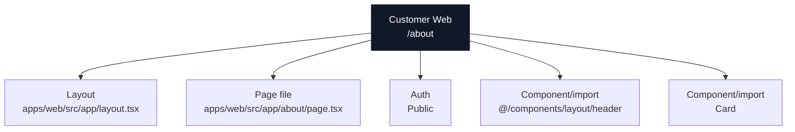

### Actual Page Information

| Field | Value |
| --- | --- |
| App | Customer Web |
| Domain | `ridendine.ca` |
| Route | `/about` |
| Status | `WIRED` |
| Auth | Public |
| Page file | [apps/web/src/app/about/page.tsx](../../../../apps/web/src/app/about/page.tsx) |
| Layout | [apps/web/src/app/layout.tsx](../../../../apps/web/src/app/layout.tsx) |
| Data source summary | @ridendine/ui |

### Data And API Wiring

| Type | Details |
| --- | --- |
| DB tables/RPCs | None detected |
| Fetch/API calls | None detected |
| Shared packages | @ridendine/ui |
| Components/imports | `@/components/layout/header`, `Card` |
| Environment vars | None detected |

### Navigation And Links

| Status | Kind | Target | Resolved app | Resolved file | Notes |
| --- | --- | --- | --- | --- | --- |
| WORKING | href | `/chef-signup` | Customer Web | [apps/web/src/app/chef-signup/page.tsx](../../../../apps/web/src/app/chef-signup/page.tsx) | href resolves to page /chef-signup |
| WORKING | href | `/chefs` | Customer Web | [apps/web/src/app/chefs/page.tsx](../../../../apps/web/src/app/chefs/page.tsx) | href resolves to page /chefs |

### API Calls From This Page

No outgoing API/fetch calls detected.

### Incoming References

| Source app | Source file | Kind | Target | Status |
| --- | --- | --- | --- | --- |
| Customer Web | [apps/web/src/app/not-found.tsx](../../../../apps/web/src/app/not-found.tsx) | href | `/about` | WORKING |
| Customer Web | [apps/web/src/app/page.tsx](../../../../apps/web/src/app/page.tsx) | href | `/about` | WORKING |
| Customer Web | [apps/web/src/components/layout/header.tsx](../../../../apps/web/src/components/layout/header.tsx) | href | `/about` | WORKING |

### Review Notes

- Static wiring scan did not flag this page, but runtime auth, DB data, and external services still need smoke/e2e proof.


---

## Customer Web: `/account/addresses`

### Page Diagram

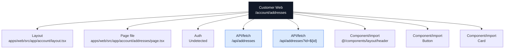

### Actual Page Information

| Field | Value |
| --- | --- |
| App | Customer Web |
| Domain | `ridendine.ca` |
| Route | `/account/addresses` |
| Status | `PARTIAL` |
| Auth | Undetected |
| Page file | [apps/web/src/app/account/addresses/page.tsx](../../../../apps/web/src/app/account/addresses/page.tsx) |
| Layout | [apps/web/src/app/account/layout.tsx](../../../../apps/web/src/app/account/layout.tsx) |
| Data source summary | @ridendine/auth, @ridendine/ui |

### Data And API Wiring

| Type | Details |
| --- | --- |
| DB tables/RPCs | None detected |
| Fetch/API calls | `/api/addresses` (DELETE, GET, PATCH, POST)<br>`/api/addresses?id=${id}` (DELETE, GET, PATCH, POST) |
| Shared packages | @ridendine/auth, @ridendine/ui |
| Components/imports | `@/components/layout/header`, `Button`, `Card` |
| Environment vars | None detected |

### Navigation And Links

| Status | Kind | Target | Resolved app | Resolved file | Notes |
| --- | --- | --- | --- | --- | --- |
| WORKING | href | `/account` | Customer Web | [apps/web/src/app/account/page.tsx](../../../../apps/web/src/app/account/page.tsx) | href resolves to page /account |

### API Calls From This Page

| Status | Kind | Target | Resolved app | Resolved file | Notes |
| --- | --- | --- | --- | --- | --- |
| WORKING | fetch | `/api/addresses` | Customer Web | [apps/web/src/app/api/addresses/route.ts](../../../../apps/web/src/app/api/addresses/route.ts) | fetch resolves to API /api/addresses |
| WORKING | fetch | `/api/addresses?id=${id}` | Customer Web | [apps/web/src/app/api/addresses/route.ts](../../../../apps/web/src/app/api/addresses/route.ts) | fetch resolves to API /api/addresses |

### Incoming References

No incoming static references detected.

### Review Notes

- Page status is PARTIAL; review auth/data/API metadata and runtime behavior.


---

## Customer Web: `/account/favorites`

### Page Diagram

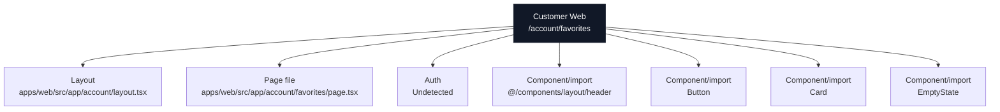

### Actual Page Information

| Field | Value |
| --- | --- |
| App | Customer Web |
| Domain | `ridendine.ca` |
| Route | `/account/favorites` |
| Status | `WIRED` |
| Auth | Undetected |
| Page file | [apps/web/src/app/account/favorites/page.tsx](../../../../apps/web/src/app/account/favorites/page.tsx) |
| Layout | [apps/web/src/app/account/layout.tsx](../../../../apps/web/src/app/account/layout.tsx) |
| Data source summary | @ridendine/auth, @ridendine/ui |

### Data And API Wiring

| Type | Details |
| --- | --- |
| DB tables/RPCs | None detected |
| Fetch/API calls | None detected |
| Shared packages | @ridendine/auth, @ridendine/ui |
| Components/imports | `@/components/layout/header`, `Button`, `Card`, `EmptyState` |
| Environment vars | None detected |

### Navigation And Links

| Status | Kind | Target | Resolved app | Resolved file | Notes |
| --- | --- | --- | --- | --- | --- |
| WORKING | href | `/account` | Customer Web | [apps/web/src/app/account/page.tsx](../../../../apps/web/src/app/account/page.tsx) | href resolves to page /account |
| WORKING | router.push | `/auth/login` | Customer Web | [apps/web/src/app/auth/login/page.tsx](../../../../apps/web/src/app/auth/login/page.tsx) | router.push resolves to page /auth/login |
| WORKING | href | `/chefs` | Customer Web | [apps/web/src/app/chefs/page.tsx](../../../../apps/web/src/app/chefs/page.tsx) | href resolves to page /chefs |

### API Calls From This Page

No outgoing API/fetch calls detected.

### Incoming References

No incoming static references detected.

### Review Notes

- Static wiring scan did not flag this page, but runtime auth, DB data, and external services still need smoke/e2e proof.


---

## Customer Web: `/account/orders`

### Page Diagram

```mermaid
flowchart TB
  Page["Customer Web<br/>/account/orders"]
  Layout["Layout<br/>apps/web/src/app/account/layout.tsx"]
  File["Page file<br/>apps/web/src/app/account/orders/page.tsx"]
  Auth["Auth<br/>Undetected"]
  Page --> Layout
  Page --> File
  Page --> Auth
  Api0["API/fetch<br/>/api/cart"]
  Page --> Api0
  Api1["API/fetch<br/>/api/orders"]
  Page --> Api1
  Api2["API/fetch<br/>/api/orders/${order.id}"]
  Page --> Api2
  Component0["Component/import<br/>@/components/layout/header"]
  Page --> Component0
  Component1["Component/import<br/>Badge"]
  Page --> Component1
  Component2["Component/import<br/>Button"]
  Page --> Component2
  Component3["Component/import<br/>Card"]
  Page --> Component3
  Component4["Component/import<br/>NoOrdersEmpty"]
  Page --> Component4
  Component5["Component/import<br/>Spinner"]
  Page --> Component5
  classDef page fill:#111827,stroke:#111827,color:#ffffff
  classDef data fill:#dcfce7,stroke:#16a34a,color:#172033
  classDef api fill:#dbeafe,stroke:#2563eb,color:#172033
  classDef warn fill:#fef3c7,stroke:#f59e0b,color:#172033
  class Page page
  class Api0,Api1,Api2 api
```

### Actual Page Information

| Field | Value |
| --- | --- |
| App | Customer Web |
| Domain | `ridendine.ca` |
| Route | `/account/orders` |
| Status | `PARTIAL` |
| Auth | Undetected |
| Page file | [apps/web/src/app/account/orders/page.tsx](../../../../apps/web/src/app/account/orders/page.tsx) |
| Layout | [apps/web/src/app/account/layout.tsx](../../../../apps/web/src/app/account/layout.tsx) |
| Data source summary | @ridendine/auth, @ridendine/ui |

### Data And API Wiring

| Type | Details |
| --- | --- |
| DB tables/RPCs | None detected |
| Fetch/API calls | `/api/cart` (DELETE, GET, PATCH, POST)<br>`/api/orders` (GET)<br>`/api/orders/${order.id}` (GET, PATCH) |
| Shared packages | @ridendine/auth, @ridendine/ui |
| Components/imports | `@/components/layout/header`, `Badge`, `Button`, `Card`, `NoOrdersEmpty`, `Spinner` |
| Environment vars | None detected |

### Navigation And Links

| Status | Kind | Target | Resolved app | Resolved file | Notes |
| --- | --- | --- | --- | --- | --- |
| WORKING | href | `/account` | Customer Web | [apps/web/src/app/account/page.tsx](../../../../apps/web/src/app/account/page.tsx) | href resolves to page /account |
| WORKING | router.push | `/checkout?storefrontId=${order.storefront.id}` | Customer Web | [apps/web/src/app/checkout/page.tsx](../../../../apps/web/src/app/checkout/page.tsx) | router.push resolves to page /checkout |
| WORKING_DYNAMIC | href | `/chefs/${order.storefront.slug}` | Customer Web | [apps/web/src/app/chefs/[slug]/page.tsx](../../../../apps/web/src/app/chefs/[slug]/page.tsx) | href resolves to page /chefs/:slug |

### API Calls From This Page

| Status | Kind | Target | Resolved app | Resolved file | Notes |
| --- | --- | --- | --- | --- | --- |
| WORKING | fetch | `/api/cart` | Customer Web | [apps/web/src/app/api/cart/route.ts](../../../../apps/web/src/app/api/cart/route.ts) | fetch resolves to API /api/cart |
| WORKING | fetch | `/api/orders` | Customer Web | [apps/web/src/app/api/orders/route.ts](../../../../apps/web/src/app/api/orders/route.ts) | fetch resolves to API /api/orders |
| WORKING_DYNAMIC | fetch | `/api/orders/${order.id}` | Customer Web | [apps/web/src/app/api/orders/[id]/route.ts](../../../../apps/web/src/app/api/orders/[id]/route.ts) | fetch resolves to API /api/orders/:id |

### Incoming References

| Source app | Source file | Kind | Target | Status |
| --- | --- | --- | --- | --- |
| Customer Web | [apps/web/src/app/page.tsx](../../../../apps/web/src/app/page.tsx) | href | `/account/orders` | WORKING |

### Review Notes

- Page status is PARTIAL; review auth/data/API metadata and runtime behavior.


---

## Customer Web: `/account`

### Page Diagram

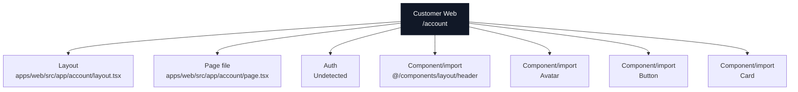

### Actual Page Information

| Field | Value |
| --- | --- |
| App | Customer Web |
| Domain | `ridendine.ca` |
| Route | `/account` |
| Status | `WIRED` |
| Auth | Undetected |
| Page file | [apps/web/src/app/account/page.tsx](../../../../apps/web/src/app/account/page.tsx) |
| Layout | [apps/web/src/app/account/layout.tsx](../../../../apps/web/src/app/account/layout.tsx) |
| Data source summary | @ridendine/auth, @ridendine/ui |

### Data And API Wiring

| Type | Details |
| --- | --- |
| DB tables/RPCs | None detected |
| Fetch/API calls | None detected |
| Shared packages | @ridendine/auth, @ridendine/ui |
| Components/imports | `@/components/layout/header`, `Avatar`, `Button`, `Card` |
| Environment vars | None detected |

### Navigation And Links

| Status | Kind | Target | Resolved app | Resolved file | Notes |
| --- | --- | --- | --- | --- | --- |
| WORKING | router.push | `/` | Customer Web | [apps/web/src/app/page.tsx](../../../../apps/web/src/app/page.tsx) | router.push resolves to page / |
| WORKING | router.push | `/auth/login` | Customer Web | [apps/web/src/app/auth/login/page.tsx](../../../../apps/web/src/app/auth/login/page.tsx) | router.push resolves to page /auth/login |

### API Calls From This Page

No outgoing API/fetch calls detected.

### Incoming References

| Source app | Source file | Kind | Target | Status |
| --- | --- | --- | --- | --- |
| Customer Web | [apps/web/src/app/account/addresses/page.tsx](../../../../apps/web/src/app/account/addresses/page.tsx) | href | `/account` | WORKING |
| Customer Web | [apps/web/src/app/account/favorites/page.tsx](../../../../apps/web/src/app/account/favorites/page.tsx) | href | `/account` | WORKING |
| Customer Web | [apps/web/src/app/account/orders/page.tsx](../../../../apps/web/src/app/account/orders/page.tsx) | href | `/account` | WORKING |
| Customer Web | [apps/web/src/app/account/settings/page.tsx](../../../../apps/web/src/app/account/settings/page.tsx) | href | `/account` | WORKING |
| Customer Web | [apps/web/src/components/layout/header.tsx](../../../../apps/web/src/components/layout/header.tsx) | href | `/account` | WORKING |

### Review Notes

- Static wiring scan did not flag this page, but runtime auth, DB data, and external services still need smoke/e2e proof.


---

## Customer Web: `/account/settings`

### Page Diagram

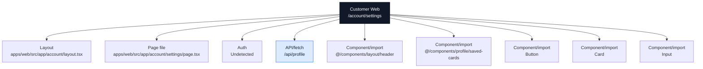

### Actual Page Information

| Field | Value |
| --- | --- |
| App | Customer Web |
| Domain | `ridendine.ca` |
| Route | `/account/settings` |
| Status | `PARTIAL` |
| Auth | Undetected |
| Page file | [apps/web/src/app/account/settings/page.tsx](../../../../apps/web/src/app/account/settings/page.tsx) |
| Layout | [apps/web/src/app/account/layout.tsx](../../../../apps/web/src/app/account/layout.tsx) |
| Data source summary | @ridendine/auth, @ridendine/ui |

### Data And API Wiring

| Type | Details |
| --- | --- |
| DB tables/RPCs | None detected |
| Fetch/API calls | `/api/profile` (GET, PATCH) |
| Shared packages | @ridendine/auth, @ridendine/ui |
| Components/imports | `@/components/layout/header`, `@/components/profile/saved-cards`, `Button`, `Card`, `Input` |
| Environment vars | None detected |

### Navigation And Links

| Status | Kind | Target | Resolved app | Resolved file | Notes |
| --- | --- | --- | --- | --- | --- |
| WORKING | href | `/account` | Customer Web | [apps/web/src/app/account/page.tsx](../../../../apps/web/src/app/account/page.tsx) | href resolves to page /account |
| WORKING | href | `/auth/forgot-password` | Customer Web | [apps/web/src/app/auth/forgot-password/page.tsx](../../../../apps/web/src/app/auth/forgot-password/page.tsx) | href resolves to page /auth/forgot-password |
| WORKING | router.push | `/auth/login` | Customer Web | [apps/web/src/app/auth/login/page.tsx](../../../../apps/web/src/app/auth/login/page.tsx) | router.push resolves to page /auth/login |
| WORKING | href | `/privacy` | Customer Web | [apps/web/src/app/privacy/page.tsx](../../../../apps/web/src/app/privacy/page.tsx) | href resolves to page /privacy |
| WORKING | href | `/terms` | Customer Web | [apps/web/src/app/terms/page.tsx](../../../../apps/web/src/app/terms/page.tsx) | href resolves to page /terms |

### API Calls From This Page

| Status | Kind | Target | Resolved app | Resolved file | Notes |
| --- | --- | --- | --- | --- | --- |
| WORKING | fetch | `/api/profile` | Customer Web | [apps/web/src/app/api/profile/route.ts](../../../../apps/web/src/app/api/profile/route.ts) | fetch resolves to API /api/profile |

### Incoming References

No incoming static references detected.

### Review Notes

- Page status is PARTIAL; review auth/data/API metadata and runtime behavior.


---

## Customer Web: `/auth/forgot-password`

### Page Diagram

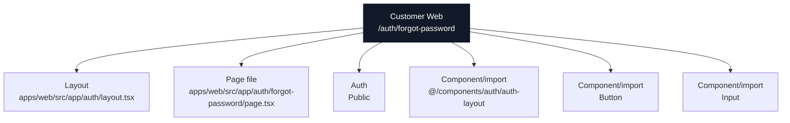

### Actual Page Information

| Field | Value |
| --- | --- |
| App | Customer Web |
| Domain | `ridendine.ca` |
| Route | `/auth/forgot-password` |
| Status | `PARTIAL` |
| Auth | Public |
| Page file | [apps/web/src/app/auth/forgot-password/page.tsx](../../../../apps/web/src/app/auth/forgot-password/page.tsx) |
| Layout | [apps/web/src/app/auth/layout.tsx](../../../../apps/web/src/app/auth/layout.tsx) |
| Data source summary | @ridendine/auth, @ridendine/ui |

### Data And API Wiring

| Type | Details |
| --- | --- |
| DB tables/RPCs | None detected |
| Fetch/API calls | None detected |
| Shared packages | @ridendine/auth, @ridendine/ui |
| Components/imports | `@/components/auth/auth-layout`, `Button`, `Input` |
| Environment vars | None detected |

### Navigation And Links

| Status | Kind | Target | Resolved app | Resolved file | Notes |
| --- | --- | --- | --- | --- | --- |
| WORKING | href | `/auth/login` | Customer Web | [apps/web/src/app/auth/login/page.tsx](../../../../apps/web/src/app/auth/login/page.tsx) | href resolves to page /auth/login |
| WORKING | href | `/auth/signup` | Customer Web | [apps/web/src/app/auth/signup/page.tsx](../../../../apps/web/src/app/auth/signup/page.tsx) | href resolves to page /auth/signup |

### API Calls From This Page

No outgoing API/fetch calls detected.

### Incoming References

| Source app | Source file | Kind | Target | Status |
| --- | --- | --- | --- | --- |
| Customer Web | [apps/web/src/app/account/settings/page.tsx](../../../../apps/web/src/app/account/settings/page.tsx) | href | `/auth/forgot-password` | WORKING |
| Customer Web | [apps/web/src/app/auth/login/page.tsx](../../../../apps/web/src/app/auth/login/page.tsx) | href | `/auth/forgot-password` | WORKING |

### Review Notes

- Page status is PARTIAL; review auth/data/API metadata and runtime behavior.


---

## Customer Web: `/auth/login`

### Page Diagram

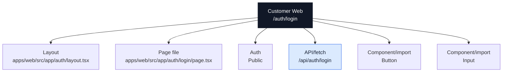

### Actual Page Information

| Field | Value |
| --- | --- |
| App | Customer Web |
| Domain | `ridendine.ca` |
| Route | `/auth/login` |
| Status | `PARTIAL` |
| Auth | Public |
| Page file | [apps/web/src/app/auth/login/page.tsx](../../../../apps/web/src/app/auth/login/page.tsx) |
| Layout | [apps/web/src/app/auth/layout.tsx](../../../../apps/web/src/app/auth/layout.tsx) |
| Data source summary | @ridendine/ui |

### Data And API Wiring

| Type | Details |
| --- | --- |
| DB tables/RPCs | None detected |
| Fetch/API calls | `/api/auth/login` (POST) |
| Shared packages | @ridendine/ui |
| Components/imports | `Button`, `Input` |
| Environment vars | None detected |

### Navigation And Links

| Status | Kind | Target | Resolved app | Resolved file | Notes |
| --- | --- | --- | --- | --- | --- |
| WORKING | href | `/auth/forgot-password` | Customer Web | [apps/web/src/app/auth/forgot-password/page.tsx](../../../../apps/web/src/app/auth/forgot-password/page.tsx) | href resolves to page /auth/forgot-password |
| WORKING | href | `/auth/signup` | Customer Web | [apps/web/src/app/auth/signup/page.tsx](../../../../apps/web/src/app/auth/signup/page.tsx) | href resolves to page /auth/signup |

### API Calls From This Page

| Status | Kind | Target | Resolved app | Resolved file | Notes |
| --- | --- | --- | --- | --- | --- |
| WORKING | fetch | `/api/auth/login` | Customer Web | [apps/web/src/app/api/auth/login/route.ts](../../../../apps/web/src/app/api/auth/login/route.ts) | fetch resolves to API /api/auth/login |

### Incoming References

| Source app | Source file | Kind | Target | Status |
| --- | --- | --- | --- | --- |
| Customer Web | [apps/web/src/app/account/favorites/page.tsx](../../../../apps/web/src/app/account/favorites/page.tsx) | router.push | `/auth/login` | WORKING |
| Customer Web | [apps/web/src/app/account/page.tsx](../../../../apps/web/src/app/account/page.tsx) | router.push | `/auth/login` | WORKING |
| Customer Web | [apps/web/src/app/account/settings/page.tsx](../../../../apps/web/src/app/account/settings/page.tsx) | router.push | `/auth/login` | WORKING |
| Customer Web | [apps/web/src/app/auth/forgot-password/page.tsx](../../../../apps/web/src/app/auth/forgot-password/page.tsx) | href | `/auth/login` | WORKING |
| Customer Web | [apps/web/src/app/auth/signup/page.tsx](../../../../apps/web/src/app/auth/signup/page.tsx) | href | `/auth/login` | WORKING |
| Customer Web | [apps/web/src/app/checkout/page.tsx](../../../../apps/web/src/app/checkout/page.tsx) | router.push | `/auth/login` | WORKING |
| Customer Web | [apps/web/src/app/chef-resources/page.tsx](../../../../apps/web/src/app/chef-resources/page.tsx) | href | `/auth/login` | WORKING |
| Customer Web | [apps/web/src/app/chef-signup/page.tsx](../../../../apps/web/src/app/chef-signup/page.tsx) | href | `/auth/login` | WORKING |
| Customer Web | [apps/web/src/app/orders/[id]/confirmation/page.tsx](../../../../apps/web/src/app/orders/[id]/confirmation/page.tsx) | redirect | `/auth/login` | WORKING |
| Customer Web | [apps/web/src/components/layout/header.tsx](../../../../apps/web/src/components/layout/header.tsx) | href | `/auth/login` | WORKING |

### Review Notes

- Page status is PARTIAL; review auth/data/API metadata and runtime behavior.


---

## Customer Web: `/auth/signup`

### Page Diagram

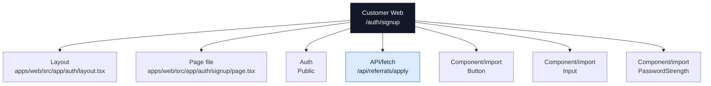

### Actual Page Information

| Field | Value |
| --- | --- |
| App | Customer Web |
| Domain | `ridendine.ca` |
| Route | `/auth/signup` |
| Status | `PARTIAL` |
| Auth | Public |
| Page file | [apps/web/src/app/auth/signup/page.tsx](../../../../apps/web/src/app/auth/signup/page.tsx) |
| Layout | [apps/web/src/app/auth/layout.tsx](../../../../apps/web/src/app/auth/layout.tsx) |
| Data source summary | @ridendine/auth, @ridendine/ui |

### Data And API Wiring

| Type | Details |
| --- | --- |
| DB tables/RPCs | None detected |
| Fetch/API calls | `/api/referrals/apply` (POST) |
| Shared packages | @ridendine/auth, @ridendine/ui |
| Components/imports | `Button`, `Input`, `PasswordStrength` |
| Environment vars | None detected |

### Navigation And Links

| Status | Kind | Target | Resolved app | Resolved file | Notes |
| --- | --- | --- | --- | --- | --- |
| WORKING | href | `/auth/login` | Customer Web | [apps/web/src/app/auth/login/page.tsx](../../../../apps/web/src/app/auth/login/page.tsx) | href resolves to page /auth/login |
| WORKING | router.push | `/chefs` | Customer Web | [apps/web/src/app/chefs/page.tsx](../../../../apps/web/src/app/chefs/page.tsx) | router.push resolves to page /chefs |
| WORKING | href | `/privacy` | Customer Web | [apps/web/src/app/privacy/page.tsx](../../../../apps/web/src/app/privacy/page.tsx) | href resolves to page /privacy |
| WORKING | href | `/terms` | Customer Web | [apps/web/src/app/terms/page.tsx](../../../../apps/web/src/app/terms/page.tsx) | href resolves to page /terms |

### API Calls From This Page

| Status | Kind | Target | Resolved app | Resolved file | Notes |
| --- | --- | --- | --- | --- | --- |
| WORKING | fetch | `/api/referrals/apply` | Customer Web | [apps/web/src/app/api/referrals/apply/route.ts](../../../../apps/web/src/app/api/referrals/apply/route.ts) | fetch resolves to API /api/referrals/apply |

### Incoming References

| Source app | Source file | Kind | Target | Status |
| --- | --- | --- | --- | --- |
| Customer Web | [apps/web/src/app/auth/forgot-password/page.tsx](../../../../apps/web/src/app/auth/forgot-password/page.tsx) | href | `/auth/signup` | WORKING |
| Customer Web | [apps/web/src/app/auth/login/page.tsx](../../../../apps/web/src/app/auth/login/page.tsx) | href | `/auth/signup` | WORKING |
| Customer Web | [apps/web/src/app/how-it-works/page.tsx](../../../../apps/web/src/app/how-it-works/page.tsx) | href | `/auth/signup` | WORKING |
| Customer Web | [apps/web/src/app/page.tsx](../../../../apps/web/src/app/page.tsx) | href | `/auth/signup?role=chef` | WORKING |
| Customer Web | [apps/web/src/components/layout/header.tsx](../../../../apps/web/src/components/layout/header.tsx) | href | `/auth/signup` | WORKING |

### Review Notes

- Page status is PARTIAL; review auth/data/API metadata and runtime behavior.


---

## Customer Web: `/cart`

### Page Diagram

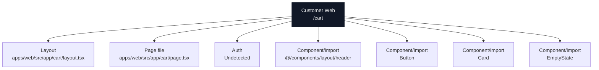

### Actual Page Information

| Field | Value |
| --- | --- |
| App | Customer Web |
| Domain | `ridendine.ca` |
| Route | `/cart` |
| Status | `WIRED` |
| Auth | Undetected |
| Page file | [apps/web/src/app/cart/page.tsx](../../../../apps/web/src/app/cart/page.tsx) |
| Layout | [apps/web/src/app/cart/layout.tsx](../../../../apps/web/src/app/cart/layout.tsx) |
| Data source summary | @ridendine/ui |

### Data And API Wiring

| Type | Details |
| --- | --- |
| DB tables/RPCs | None detected |
| Fetch/API calls | None detected |
| Shared packages | @ridendine/ui |
| Components/imports | `@/components/layout/header`, `Button`, `Card`, `EmptyState` |
| Environment vars | None detected |

### Navigation And Links

| Status | Kind | Target | Resolved app | Resolved file | Notes |
| --- | --- | --- | --- | --- | --- |
| WORKING | href | `/checkout?storefrontId=${cart?.storefront_id}` | Customer Web | [apps/web/src/app/checkout/page.tsx](../../../../apps/web/src/app/checkout/page.tsx) | href resolves to page /checkout |
| WORKING | href | `/chefs` | Customer Web | [apps/web/src/app/chefs/page.tsx](../../../../apps/web/src/app/chefs/page.tsx) | href resolves to page /chefs |

### API Calls From This Page

No outgoing API/fetch calls detected.

### Incoming References

| Source app | Source file | Kind | Target | Status |
| --- | --- | --- | --- | --- |
| Customer Web | [apps/web/src/components/layout/header.tsx](../../../../apps/web/src/components/layout/header.tsx) | href | `/cart` | WORKING |
| Customer Web | [apps/web/src/components/storefront/storefront-menu.tsx](../../../../apps/web/src/components/storefront/storefront-menu.tsx) | href | `/cart?storefrontId=${storefrontId}` | WORKING |

### Review Notes

- Static wiring scan did not flag this page, but runtime auth, DB data, and external services still need smoke/e2e proof.


---

## Customer Web: `/checkout`

### Page Diagram

```mermaid
flowchart TB
  Page["Customer Web<br/>/checkout"]
  Layout["Layout<br/>apps/web/src/app/layout.tsx"]
  File["Page file<br/>apps/web/src/app/checkout/page.tsx"]
  Auth["Auth<br/>Undetected"]
  Page --> Layout
  Page --> File
  Page --> Auth
  Api0["API/fetch<br/>/api/addresses"]
  Page --> Api0
  Api1["API/fetch<br/>/api/cart?storefrontId=${storefrontId}"]
  Page --> Api1
  Api2["API/fetch<br/>/api/checkout"]
  Page --> Api2
  Component0["Component/import<br/>@/components/checkout/checkout-skeleton"]
  Page --> Component0
  Component1["Component/import<br/>@/components/checkout/delivery-time-picker"]
  Page --> Component1
  Component2["Component/import<br/>@/components/checkout/saved-card-selector"]
  Page --> Component2
  Component3["Component/import<br/>@/components/checkout/stripe-payment-form"]
  Page --> Component3
  Component4["Component/import<br/>@/components/layout/header"]
  Page --> Component4
  Component5["Component/import<br/>Button"]
  Page --> Component5
  classDef page fill:#111827,stroke:#111827,color:#ffffff
  classDef data fill:#dcfce7,stroke:#16a34a,color:#172033
  classDef api fill:#dbeafe,stroke:#2563eb,color:#172033
  classDef warn fill:#fef3c7,stroke:#f59e0b,color:#172033
  class Page page
  class Api0,Api1,Api2 api
```

### Actual Page Information

| Field | Value |
| --- | --- |
| App | Customer Web |
| Domain | `ridendine.ca` |
| Route | `/checkout` |
| Status | `PARTIAL` |
| Auth | Undetected |
| Page file | [apps/web/src/app/checkout/page.tsx](../../../../apps/web/src/app/checkout/page.tsx) |
| Layout | [apps/web/src/app/layout.tsx](../../../../apps/web/src/app/layout.tsx) |
| Data source summary | @ridendine/ui |

### Data And API Wiring

| Type | Details |
| --- | --- |
| DB tables/RPCs | None detected |
| Fetch/API calls | `/api/addresses` (DELETE, GET, PATCH, POST)<br>`/api/cart?storefrontId=${storefrontId}` (DELETE, GET, PATCH, POST)<br>`/api/checkout` (POST) |
| Shared packages | @ridendine/ui |
| Components/imports | `@/components/checkout/checkout-skeleton`, `@/components/checkout/delivery-time-picker`, `@/components/checkout/saved-card-selector`, `@/components/checkout/stripe-payment-form`, `@/components/layout/header`, `Button`, `Card`, `Input` |
| Environment vars | `NEXT_PUBLIC_STRIPE_PUBLISHABLE_KEY` |

### Navigation And Links

| Status | Kind | Target | Resolved app | Resolved file | Notes |
| --- | --- | --- | --- | --- | --- |
| WORKING | router.push | `/auth/login` | Customer Web | [apps/web/src/app/auth/login/page.tsx](../../../../apps/web/src/app/auth/login/page.tsx) | router.push resolves to page /auth/login |
| WORKING | href | `/chefs` | Customer Web | [apps/web/src/app/chefs/page.tsx](../../../../apps/web/src/app/chefs/page.tsx) | href resolves to page /chefs |

### API Calls From This Page

| Status | Kind | Target | Resolved app | Resolved file | Notes |
| --- | --- | --- | --- | --- | --- |
| WORKING | fetch | `/api/addresses` | Customer Web | [apps/web/src/app/api/addresses/route.ts](../../../../apps/web/src/app/api/addresses/route.ts) | fetch resolves to API /api/addresses |
| WORKING | fetch | `/api/cart?storefrontId=${storefrontId}` | Customer Web | [apps/web/src/app/api/cart/route.ts](../../../../apps/web/src/app/api/cart/route.ts) | fetch resolves to API /api/cart |
| WORKING | fetch | `/api/checkout` | Customer Web | [apps/web/src/app/api/checkout/route.ts](../../../../apps/web/src/app/api/checkout/route.ts) | fetch resolves to API /api/checkout |

### Incoming References

| Source app | Source file | Kind | Target | Status |
| --- | --- | --- | --- | --- |
| Customer Web | [apps/web/src/app/account/orders/page.tsx](../../../../apps/web/src/app/account/orders/page.tsx) | router.push | `/checkout?storefrontId=${order.storefront.id}` | WORKING |
| Customer Web | [apps/web/src/app/cart/page.tsx](../../../../apps/web/src/app/cart/page.tsx) | href | `/checkout?storefrontId=${cart?.storefront_id}` | WORKING |
| Customer Web | [apps/web/src/components/storefront/storefront-menu.tsx](../../../../apps/web/src/components/storefront/storefront-menu.tsx) | href | `/checkout?storefrontId=${storefrontId}` | WORKING |

### Review Notes

- Page status is PARTIAL; review auth/data/API metadata and runtime behavior.


---

## Customer Web: `/chef-resources`

### Page Diagram

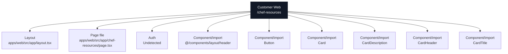

### Actual Page Information

| Field | Value |
| --- | --- |
| App | Customer Web |
| Domain | `ridendine.ca` |
| Route | `/chef-resources` |
| Status | `WIRED` |
| Auth | Undetected |
| Page file | [apps/web/src/app/chef-resources/page.tsx](../../../../apps/web/src/app/chef-resources/page.tsx) |
| Layout | [apps/web/src/app/layout.tsx](../../../../apps/web/src/app/layout.tsx) |
| Data source summary | @ridendine/ui |

### Data And API Wiring

| Type | Details |
| --- | --- |
| DB tables/RPCs | None detected |
| Fetch/API calls | None detected |
| Shared packages | @ridendine/ui |
| Components/imports | `@/components/layout/header`, `Button`, `Card`, `CardDescription`, `CardHeader`, `CardTitle` |
| Environment vars | None detected |

### Navigation And Links

| Status | Kind | Target | Resolved app | Resolved file | Notes |
| --- | --- | --- | --- | --- | --- |
| WORKING | href | `/auth/login` | Customer Web | [apps/web/src/app/auth/login/page.tsx](../../../../apps/web/src/app/auth/login/page.tsx) | href resolves to page /auth/login |
| WORKING | href | `/chef-signup` | Customer Web | [apps/web/src/app/chef-signup/page.tsx](../../../../apps/web/src/app/chef-signup/page.tsx) | href resolves to page /chef-signup |
| WORKING | href | `/contact` | Customer Web | [apps/web/src/app/contact/page.tsx](../../../../apps/web/src/app/contact/page.tsx) | href resolves to page /contact |

### API Calls From This Page

No outgoing API/fetch calls detected.

### Incoming References

| Source app | Source file | Kind | Target | Status |
| --- | --- | --- | --- | --- |
| Customer Web | [apps/web/src/app/chef-signup/page.tsx](../../../../apps/web/src/app/chef-signup/page.tsx) | href | `/chef-resources` | WORKING |
| Customer Web | [apps/web/src/app/page.tsx](../../../../apps/web/src/app/page.tsx) | href | `/chef-resources` | WORKING |

### Review Notes

- Static wiring scan did not flag this page, but runtime auth, DB data, and external services still need smoke/e2e proof.


---

## Customer Web: `/chef-signup`

### Page Diagram

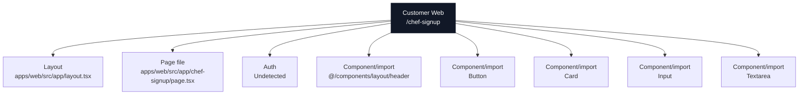

### Actual Page Information

| Field | Value |
| --- | --- |
| App | Customer Web |
| Domain | `ridendine.ca` |
| Route | `/chef-signup` |
| Status | `PARTIAL` |
| Auth | Undetected |
| Page file | [apps/web/src/app/chef-signup/page.tsx](../../../../apps/web/src/app/chef-signup/page.tsx) |
| Layout | [apps/web/src/app/layout.tsx](../../../../apps/web/src/app/layout.tsx) |
| Data source summary | @ridendine/ui |

### Data And API Wiring

| Type | Details |
| --- | --- |
| DB tables/RPCs | None detected |
| Fetch/API calls | None detected |
| Shared packages | @ridendine/ui |
| Components/imports | `@/components/layout/header`, `Button`, `Card`, `Input`, `Textarea` |
| Environment vars | `NEXT_PUBLIC_CHEF_ADMIN_URL` |

### Navigation And Links

| Status | Kind | Target | Resolved app | Resolved file | Notes |
| --- | --- | --- | --- | --- | --- |
| WORKING | href | `/` | Customer Web | [apps/web/src/app/page.tsx](../../../../apps/web/src/app/page.tsx) | href resolves to page / |
| WORKING | href | `/auth/login` | Customer Web | [apps/web/src/app/auth/login/page.tsx](../../../../apps/web/src/app/auth/login/page.tsx) | href resolves to page /auth/login |
| WORKING | href | `/chef-resources` | Customer Web | [apps/web/src/app/chef-resources/page.tsx](../../../../apps/web/src/app/chef-resources/page.tsx) | href resolves to page /chef-resources |

### API Calls From This Page

No outgoing API/fetch calls detected.

### Incoming References

| Source app | Source file | Kind | Target | Status |
| --- | --- | --- | --- | --- |
| Customer Web | [apps/web/src/app/about/page.tsx](../../../../apps/web/src/app/about/page.tsx) | href | `/chef-signup` | WORKING |
| Customer Web | [apps/web/src/app/chef-resources/page.tsx](../../../../apps/web/src/app/chef-resources/page.tsx) | href | `/chef-signup` | WORKING |
| Customer Web | [apps/web/src/app/page.tsx](../../../../apps/web/src/app/page.tsx) | href | `/chef-signup` | WORKING |
| Customer Web | [apps/web/src/components/home/featured-chefs.tsx](../../../../apps/web/src/components/home/featured-chefs.tsx) | href | `/chef-signup` | WORKING |

### Review Notes

- Page status is PARTIAL; review auth/data/API metadata and runtime behavior.


---

## Customer Web: `/chefs/:slug`

### Page Diagram

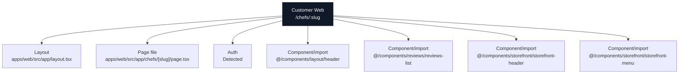

### Actual Page Information

| Field | Value |
| --- | --- |
| App | Customer Web |
| Domain | `ridendine.ca` |
| Route | `/chefs/:slug` |
| Status | `WIRED` |
| Auth | Detected |
| Page file | [apps/web/src/app/chefs/[slug]/page.tsx](../../../../apps/web/src/app/chefs/[slug]/page.tsx) |
| Layout | [apps/web/src/app/layout.tsx](../../../../apps/web/src/app/layout.tsx) |
| Data source summary | @ridendine/db |

### Data And API Wiring

| Type | Details |
| --- | --- |
| DB tables/RPCs | None detected |
| Fetch/API calls | None detected |
| Shared packages | @ridendine/db |
| Components/imports | `@/components/layout/header`, `@/components/reviews/reviews-list`, `@/components/storefront/storefront-header`, `@/components/storefront/storefront-menu` |
| Environment vars | `NEXT_PUBLIC_APP_URL` |

### Navigation And Links

No outgoing page-navigation links detected.

### API Calls From This Page

No outgoing API/fetch calls detected.

### Incoming References

| Source app | Source file | Kind | Target | Status |
| --- | --- | --- | --- | --- |
| Chef Admin | [apps/chef-admin/src/app/dashboard/page.tsx](../../../../apps/chef-admin/src/app/dashboard/page.tsx) | href | `https://ridendine.ca/chefs/${storefront.slug}` | WORKING_DYNAMIC |
| Customer Web | [apps/web/src/app/account/orders/page.tsx](../../../../apps/web/src/app/account/orders/page.tsx) | href | `/chefs/${order.storefront.slug}` | WORKING_DYNAMIC |
| Customer Web | [apps/web/src/components/chefs/chefs-list.tsx](../../../../apps/web/src/components/chefs/chefs-list.tsx) | href | `/chefs/${chef.slug}` | WORKING_DYNAMIC |
| Customer Web | [apps/web/src/components/home/featured-chefs.tsx](../../../../apps/web/src/components/home/featured-chefs.tsx) | href | `/chefs/${chef.slug}` | WORKING_DYNAMIC |

### Review Notes

- Static wiring scan did not flag this page, but runtime auth, DB data, and external services still need smoke/e2e proof.


---

## Customer Web: `/chefs`

### Page Diagram

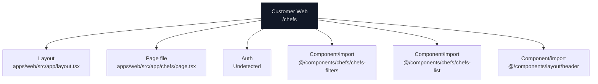

### Actual Page Information

| Field | Value |
| --- | --- |
| App | Customer Web |
| Domain | `ridendine.ca` |
| Route | `/chefs` |
| Status | `WIRED` |
| Auth | Undetected |
| Page file | [apps/web/src/app/chefs/page.tsx](../../../../apps/web/src/app/chefs/page.tsx) |
| Layout | [apps/web/src/app/layout.tsx](../../../../apps/web/src/app/layout.tsx) |
| Data source summary | Static/client component/undetected |

### Data And API Wiring

| Type | Details |
| --- | --- |
| DB tables/RPCs | None detected |
| Fetch/API calls | None detected |
| Shared packages | None detected |
| Components/imports | `@/components/chefs/chefs-filters`, `@/components/chefs/chefs-list`, `@/components/layout/header` |
| Environment vars | None detected |

### Navigation And Links

No outgoing page-navigation links detected.

### API Calls From This Page

No outgoing API/fetch calls detected.

### Incoming References

| Source app | Source file | Kind | Target | Status |
| --- | --- | --- | --- | --- |
| Customer Web | [apps/web/src/app/about/page.tsx](../../../../apps/web/src/app/about/page.tsx) | href | `/chefs` | WORKING |
| Customer Web | [apps/web/src/app/account/favorites/page.tsx](../../../../apps/web/src/app/account/favorites/page.tsx) | href | `/chefs` | WORKING |
| Customer Web | [apps/web/src/app/auth/signup/page.tsx](../../../../apps/web/src/app/auth/signup/page.tsx) | router.push | `/chefs` | WORKING |
| Customer Web | [apps/web/src/app/cart/page.tsx](../../../../apps/web/src/app/cart/page.tsx) | href | `/chefs` | WORKING |
| Customer Web | [apps/web/src/app/checkout/page.tsx](../../../../apps/web/src/app/checkout/page.tsx) | href | `/chefs` | WORKING |
| Customer Web | [apps/web/src/app/how-it-works/page.tsx](../../../../apps/web/src/app/how-it-works/page.tsx) | href | `/chefs` | WORKING |
| Customer Web | [apps/web/src/app/not-found.tsx](../../../../apps/web/src/app/not-found.tsx) | href | `/chefs` | WORKING |
| Customer Web | [apps/web/src/app/orders/[id]/confirmation/page.tsx](../../../../apps/web/src/app/orders/[id]/confirmation/page.tsx) | href | `/chefs` | WORKING |
| Customer Web | [apps/web/src/app/page.tsx](../../../../apps/web/src/app/page.tsx) | href | `/chefs` | WORKING |
| Customer Web | [apps/web/src/components/chefs/chefs-filters.tsx](../../../../apps/web/src/components/chefs/chefs-filters.tsx) | router.push | `/chefs` | WORKING |
| Customer Web | [apps/web/src/components/chefs/chefs-filters.tsx](../../../../apps/web/src/components/chefs/chefs-filters.tsx) | router.push | `/chefs?${params.toString()}` | WORKING |
| Customer Web | [apps/web/src/components/chefs/chefs-list.tsx](../../../../apps/web/src/components/chefs/chefs-list.tsx) | href | `/chefs` | WORKING |
| Customer Web | [apps/web/src/components/layout/header.tsx](../../../../apps/web/src/components/layout/header.tsx) | href | `/chefs` | WORKING |

### Review Notes

- Static wiring scan did not flag this page, but runtime auth, DB data, and external services still need smoke/e2e proof.


---

## Customer Web: `/contact`

### Page Diagram

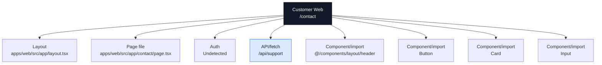

### Actual Page Information

| Field | Value |
| --- | --- |
| App | Customer Web |
| Domain | `ridendine.ca` |
| Route | `/contact` |
| Status | `PARTIAL` |
| Auth | Undetected |
| Page file | [apps/web/src/app/contact/page.tsx](../../../../apps/web/src/app/contact/page.tsx) |
| Layout | [apps/web/src/app/layout.tsx](../../../../apps/web/src/app/layout.tsx) |
| Data source summary | @ridendine/ui |

### Data And API Wiring

| Type | Details |
| --- | --- |
| DB tables/RPCs | None detected |
| Fetch/API calls | `/api/support` (GET, POST) |
| Shared packages | @ridendine/ui |
| Components/imports | `@/components/layout/header`, `Button`, `Card`, `Input` |
| Environment vars | None detected |

### Navigation And Links

No outgoing page-navigation links detected.

### API Calls From This Page

| Status | Kind | Target | Resolved app | Resolved file | Notes |
| --- | --- | --- | --- | --- | --- |
| WORKING | fetch | `/api/support` | Customer Web | [apps/web/src/app/api/support/route.ts](../../../../apps/web/src/app/api/support/route.ts) | fetch resolves to API /api/support |

### Incoming References

| Source app | Source file | Kind | Target | Status |
| --- | --- | --- | --- | --- |
| Customer Web | [apps/web/src/app/chef-resources/page.tsx](../../../../apps/web/src/app/chef-resources/page.tsx) | href | `/contact` | WORKING |
| Customer Web | [apps/web/src/app/not-found.tsx](../../../../apps/web/src/app/not-found.tsx) | href | `/contact` | WORKING |
| Customer Web | [apps/web/src/app/page.tsx](../../../../apps/web/src/app/page.tsx) | href | `/contact` | WORKING |

### Review Notes

- Page status is PARTIAL; review auth/data/API metadata and runtime behavior.


---

## Customer Web: `/how-it-works`

### Page Diagram

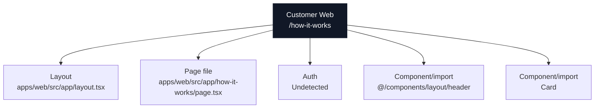

### Actual Page Information

| Field | Value |
| --- | --- |
| App | Customer Web |
| Domain | `ridendine.ca` |
| Route | `/how-it-works` |
| Status | `WIRED` |
| Auth | Undetected |
| Page file | [apps/web/src/app/how-it-works/page.tsx](../../../../apps/web/src/app/how-it-works/page.tsx) |
| Layout | [apps/web/src/app/layout.tsx](../../../../apps/web/src/app/layout.tsx) |
| Data source summary | @ridendine/ui |

### Data And API Wiring

| Type | Details |
| --- | --- |
| DB tables/RPCs | None detected |
| Fetch/API calls | None detected |
| Shared packages | @ridendine/ui |
| Components/imports | `@/components/layout/header`, `Card` |
| Environment vars | None detected |

### Navigation And Links

| Status | Kind | Target | Resolved app | Resolved file | Notes |
| --- | --- | --- | --- | --- | --- |
| WORKING | href | `/auth/signup` | Customer Web | [apps/web/src/app/auth/signup/page.tsx](../../../../apps/web/src/app/auth/signup/page.tsx) | href resolves to page /auth/signup |
| WORKING | href | `/chefs` | Customer Web | [apps/web/src/app/chefs/page.tsx](../../../../apps/web/src/app/chefs/page.tsx) | href resolves to page /chefs |

### API Calls From This Page

No outgoing API/fetch calls detected.

### Incoming References

| Source app | Source file | Kind | Target | Status |
| --- | --- | --- | --- | --- |
| Customer Web | [apps/web/src/app/not-found.tsx](../../../../apps/web/src/app/not-found.tsx) | href | `/how-it-works` | WORKING |
| Customer Web | [apps/web/src/app/page.tsx](../../../../apps/web/src/app/page.tsx) | href | `/how-it-works` | WORKING |
| Customer Web | [apps/web/src/components/layout/header.tsx](../../../../apps/web/src/components/layout/header.tsx) | href | `/how-it-works` | WORKING |

### Review Notes

- Static wiring scan did not flag this page, but runtime auth, DB data, and external services still need smoke/e2e proof.


---

## Customer Web: `/maintenance`

### Page Diagram

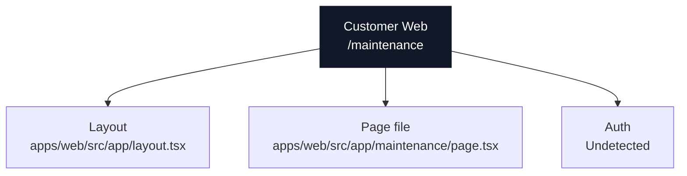

### Actual Page Information

| Field | Value |
| --- | --- |
| App | Customer Web |
| Domain | `ridendine.ca` |
| Route | `/maintenance` |
| Status | `WIRED` |
| Auth | Undetected |
| Page file | [apps/web/src/app/maintenance/page.tsx](../../../../apps/web/src/app/maintenance/page.tsx) |
| Layout | [apps/web/src/app/layout.tsx](../../../../apps/web/src/app/layout.tsx) |
| Data source summary | Static/client component/undetected |

### Data And API Wiring

| Type | Details |
| --- | --- |
| DB tables/RPCs | None detected |
| Fetch/API calls | None detected |
| Shared packages | None detected |
| Components/imports | None detected |
| Environment vars | None detected |

### Navigation And Links

No outgoing page-navigation links detected.

### API Calls From This Page

No outgoing API/fetch calls detected.

### Incoming References

No incoming static references detected.

### Review Notes

- Static wiring scan did not flag this page, but runtime auth, DB data, and external services still need smoke/e2e proof.


---

## Customer Web: `/order-confirmation/:orderId`

### Page Diagram

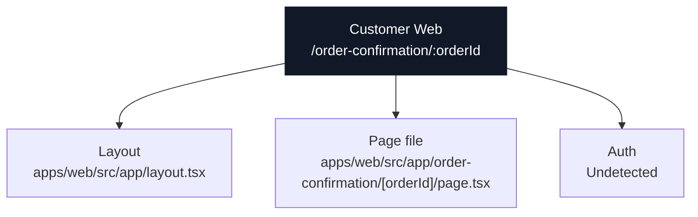

### Actual Page Information

| Field | Value |
| --- | --- |
| App | Customer Web |
| Domain | `ridendine.ca` |
| Route | `/order-confirmation/:orderId` |
| Status | `WIRED` |
| Auth | Undetected |
| Page file | [apps/web/src/app/order-confirmation/[orderId]/page.tsx](../../../../apps/web/src/app/order-confirmation/[orderId]/page.tsx) |
| Layout | [apps/web/src/app/layout.tsx](../../../../apps/web/src/app/layout.tsx) |
| Data source summary | Static/client component/undetected |

### Data And API Wiring

| Type | Details |
| --- | --- |
| DB tables/RPCs | None detected |
| Fetch/API calls | None detected |
| Shared packages | None detected |
| Components/imports | None detected |
| Environment vars | None detected |

### Navigation And Links

No outgoing page-navigation links detected.

### API Calls From This Page

No outgoing API/fetch calls detected.

### Incoming References

No incoming static references detected.

### Review Notes

- Static wiring scan did not flag this page, but runtime auth, DB data, and external services still need smoke/e2e proof.


---

## Customer Web: `/orders/:id/confirmation`

### Page Diagram

```mermaid
flowchart TB
  Page["Customer Web<br/>/orders/:id/confirmation"]
  Layout["Layout<br/>apps/web/src/app/layout.tsx"]
  File["Page file<br/>apps/web/src/app/orders/[id]/confirmation/page.tsx"]
  Auth["Auth<br/>Detected"]
  Page --> Layout
  Page --> File
  Page --> Auth
  Table0["DB table/RPC<br/>orders"]
  Page --> Table0
  Component0["Component/import<br/>@/components/layout/header"]
  Page --> Component0
  Component1["Component/import<br/>@/components/reviews/review-form"]
  Page --> Component1
  Component2["Component/import<br/>@/components/tracking/live-order-tracker"]
  Page --> Component2
  Component3["Component/import<br/>Button"]
  Page --> Component3
  Component4["Component/import<br/>Card"]
  Page --> Component4
  classDef page fill:#111827,stroke:#111827,color:#ffffff
  classDef data fill:#dcfce7,stroke:#16a34a,color:#172033
  classDef api fill:#dbeafe,stroke:#2563eb,color:#172033
  classDef warn fill:#fef3c7,stroke:#f59e0b,color:#172033
  class Page page
  class Table0 data
```

### Actual Page Information

| Field | Value |
| --- | --- |
| App | Customer Web |
| Domain | `ridendine.ca` |
| Route | `/orders/:id/confirmation` |
| Status | `WIRED` |
| Auth | Detected |
| Page file | [apps/web/src/app/orders/[id]/confirmation/page.tsx](../../../../apps/web/src/app/orders/[id]/confirmation/page.tsx) |
| Layout | [apps/web/src/app/layout.tsx](../../../../apps/web/src/app/layout.tsx) |
| Data source summary | table:orders, @ridendine/db, @ridendine/ui |

### Data And API Wiring

| Type | Details |
| --- | --- |
| DB tables/RPCs | `orders` |
| Fetch/API calls | None detected |
| Shared packages | @ridendine/db, @ridendine/ui |
| Components/imports | `@/components/layout/header`, `@/components/reviews/review-form`, `@/components/tracking/live-order-tracker`, `Button`, `Card` |
| Environment vars | None detected |

### Navigation And Links

| Status | Kind | Target | Resolved app | Resolved file | Notes |
| --- | --- | --- | --- | --- | --- |
| WORKING | redirect | `/auth/login` | Customer Web | [apps/web/src/app/auth/login/page.tsx](../../../../apps/web/src/app/auth/login/page.tsx) | redirect resolves to page /auth/login |
| WORKING | href | `/chefs` | Customer Web | [apps/web/src/app/chefs/page.tsx](../../../../apps/web/src/app/chefs/page.tsx) | href resolves to page /chefs |

### API Calls From This Page

No outgoing API/fetch calls detected.

### Incoming References

No incoming static references detected.

### Review Notes

- Static wiring scan did not flag this page, but runtime auth, DB data, and external services still need smoke/e2e proof.


---

## Customer Web: `/`

### Page Diagram

```mermaid
flowchart TB
  Page["Customer Web<br/>/"]
  Layout["Layout<br/>apps/web/src/app/layout.tsx"]
  File["Page file<br/>apps/web/src/app/page.tsx"]
  Auth["Auth<br/>Public"]
  Page --> Layout
  Page --> File
  Page --> Auth
  Table0["DB table/RPC<br/>chef_storefronts"]
  Page --> Table0
  Table1["DB table/RPC<br/>menu_items"]
  Page --> Table1
  Component0["Component/import<br/>@/components/home/featured-chefs"]
  Page --> Component0
  Component1["Component/import<br/>@/components/home/scroll-reveal-section"]
  Page --> Component1
  Component2["Component/import<br/>@/components/layout/header"]
  Page --> Component2
  Component3["Component/import<br/>Button"]
  Page --> Component3
  classDef page fill:#111827,stroke:#111827,color:#ffffff
  classDef data fill:#dcfce7,stroke:#16a34a,color:#172033
  classDef api fill:#dbeafe,stroke:#2563eb,color:#172033
  classDef warn fill:#fef3c7,stroke:#f59e0b,color:#172033
  class Page page
  class Table0,Table1 data
```

### Actual Page Information

| Field | Value |
| --- | --- |
| App | Customer Web |
| Domain | `ridendine.ca` |
| Route | `/` |
| Status | `WIRED` |
| Auth | Public |
| Page file | [apps/web/src/app/page.tsx](../../../../apps/web/src/app/page.tsx) |
| Layout | [apps/web/src/app/layout.tsx](../../../../apps/web/src/app/layout.tsx) |
| Data source summary | table:chef_storefronts, table:menu_items, @ridendine/db, @ridendine/ui |

### Data And API Wiring

| Type | Details |
| --- | --- |
| DB tables/RPCs | `chef_storefronts`, `menu_items` |
| Fetch/API calls | None detected |
| Shared packages | @ridendine/db, @ridendine/ui |
| Components/imports | `@/components/home/featured-chefs`, `@/components/home/scroll-reveal-section`, `@/components/layout/header`, `Button` |
| Environment vars | None detected |

### Navigation And Links

| Status | Kind | Target | Resolved app | Resolved file | Notes |
| --- | --- | --- | --- | --- | --- |
| WORKING | href | `/about` | Customer Web | [apps/web/src/app/about/page.tsx](../../../../apps/web/src/app/about/page.tsx) | href resolves to page /about |
| WORKING | href | `/account/orders` | Customer Web | [apps/web/src/app/account/orders/page.tsx](../../../../apps/web/src/app/account/orders/page.tsx) | href resolves to page /account/orders |
| WORKING | href | `/auth/signup?role=chef` | Customer Web | [apps/web/src/app/auth/signup/page.tsx](../../../../apps/web/src/app/auth/signup/page.tsx) | href resolves to page /auth/signup |
| WORKING | href | `/chef-resources` | Customer Web | [apps/web/src/app/chef-resources/page.tsx](../../../../apps/web/src/app/chef-resources/page.tsx) | href resolves to page /chef-resources |
| WORKING | href | `/chef-signup` | Customer Web | [apps/web/src/app/chef-signup/page.tsx](../../../../apps/web/src/app/chef-signup/page.tsx) | href resolves to page /chef-signup |
| WORKING | href | `/chefs` | Customer Web | [apps/web/src/app/chefs/page.tsx](../../../../apps/web/src/app/chefs/page.tsx) | href resolves to page /chefs |
| WORKING | href | `/contact` | Customer Web | [apps/web/src/app/contact/page.tsx](../../../../apps/web/src/app/contact/page.tsx) | href resolves to page /contact |
| WORKING | href | `/how-it-works` | Customer Web | [apps/web/src/app/how-it-works/page.tsx](../../../../apps/web/src/app/how-it-works/page.tsx) | href resolves to page /how-it-works |
| WORKING | href | `/privacy` | Customer Web | [apps/web/src/app/privacy/page.tsx](../../../../apps/web/src/app/privacy/page.tsx) | href resolves to page /privacy |
| WORKING | href | `/terms` | Customer Web | [apps/web/src/app/terms/page.tsx](../../../../apps/web/src/app/terms/page.tsx) | href resolves to page /terms |

### API Calls From This Page

No outgoing API/fetch calls detected.

### Incoming References

| Source app | Source file | Kind | Target | Status |
| --- | --- | --- | --- | --- |
| Customer Web | [apps/web/src/app/account/page.tsx](../../../../apps/web/src/app/account/page.tsx) | router.push | `/` | WORKING |
| Customer Web | [apps/web/src/app/chef-signup/page.tsx](../../../../apps/web/src/app/chef-signup/page.tsx) | href | `/` | WORKING |
| Customer Web | [apps/web/src/app/error.tsx](../../../../apps/web/src/app/error.tsx) | href | `/` | WORKING |
| Customer Web | [apps/web/src/app/not-found.tsx](../../../../apps/web/src/app/not-found.tsx) | href | `/` | WORKING |
| Customer Web | [apps/web/src/app/privacy/page.tsx](../../../../apps/web/src/app/privacy/page.tsx) | href | `/` | WORKING |
| Customer Web | [apps/web/src/app/terms/page.tsx](../../../../apps/web/src/app/terms/page.tsx) | href | `/` | WORKING |
| Customer Web | [apps/web/src/components/auth/auth-layout.tsx](../../../../apps/web/src/components/auth/auth-layout.tsx) | href | `/` | WORKING |
| Customer Web | [apps/web/src/components/layout/header.tsx](../../../../apps/web/src/components/layout/header.tsx) | href | `/` | WORKING |

### Review Notes

- Static wiring scan did not flag this page, but runtime auth, DB data, and external services still need smoke/e2e proof.


---

## Customer Web: `/privacy`

### Page Diagram

```mermaid
flowchart TB
  Page["Customer Web<br/>/privacy"]
  Layout["Layout<br/>apps/web/src/app/layout.tsx"]
  File["Page file<br/>apps/web/src/app/privacy/page.tsx"]
  Auth["Auth<br/>Public"]
  Page --> Layout
  Page --> File
  Page --> Auth
  Component0["Component/import<br/>@/components/layout/header"]
  Page --> Component0
  classDef page fill:#111827,stroke:#111827,color:#ffffff
  classDef data fill:#dcfce7,stroke:#16a34a,color:#172033
  classDef api fill:#dbeafe,stroke:#2563eb,color:#172033
  classDef warn fill:#fef3c7,stroke:#f59e0b,color:#172033
  class Page page
```

### Actual Page Information

| Field | Value |
| --- | --- |
| App | Customer Web |
| Domain | `ridendine.ca` |
| Route | `/privacy` |
| Status | `PARTIAL` |
| Auth | Public |
| Page file | [apps/web/src/app/privacy/page.tsx](../../../../apps/web/src/app/privacy/page.tsx) |
| Layout | [apps/web/src/app/layout.tsx](../../../../apps/web/src/app/layout.tsx) |
| Data source summary | Static/client component/undetected |

### Data And API Wiring

| Type | Details |
| --- | --- |
| DB tables/RPCs | None detected |
| Fetch/API calls | None detected |
| Shared packages | None detected |
| Components/imports | `@/components/layout/header` |
| Environment vars | None detected |

### Navigation And Links

| Status | Kind | Target | Resolved app | Resolved file | Notes |
| --- | --- | --- | --- | --- | --- |
| WORKING | href | `/` | Customer Web | [apps/web/src/app/page.tsx](../../../../apps/web/src/app/page.tsx) | href resolves to page / |

### API Calls From This Page

No outgoing API/fetch calls detected.

### Incoming References

| Source app | Source file | Kind | Target | Status |
| --- | --- | --- | --- | --- |
| Chef Admin | [apps/chef-admin/src/app/privacy/page.tsx](../../../../apps/chef-admin/src/app/privacy/page.tsx) | href | `https://ridendine.ca/privacy` | WORKING |
| Customer Web | [apps/web/src/app/account/settings/page.tsx](../../../../apps/web/src/app/account/settings/page.tsx) | href | `/privacy` | WORKING |
| Customer Web | [apps/web/src/app/auth/signup/page.tsx](../../../../apps/web/src/app/auth/signup/page.tsx) | href | `/privacy` | WORKING |
| Customer Web | [apps/web/src/app/page.tsx](../../../../apps/web/src/app/page.tsx) | href | `/privacy` | WORKING |
| Driver App | [apps/driver-app/src/app/privacy/page.tsx](../../../../apps/driver-app/src/app/privacy/page.tsx) | href | `https://ridendine.ca/privacy` | WORKING |

### Review Notes

- Page status is PARTIAL; review auth/data/API metadata and runtime behavior.


---

## Customer Web: `/terms`

### Page Diagram

```mermaid
flowchart TB
  Page["Customer Web<br/>/terms"]
  Layout["Layout<br/>apps/web/src/app/layout.tsx"]
  File["Page file<br/>apps/web/src/app/terms/page.tsx"]
  Auth["Auth<br/>Public"]
  Page --> Layout
  Page --> File
  Page --> Auth
  Component0["Component/import<br/>@/components/layout/header"]
  Page --> Component0
  classDef page fill:#111827,stroke:#111827,color:#ffffff
  classDef data fill:#dcfce7,stroke:#16a34a,color:#172033
  classDef api fill:#dbeafe,stroke:#2563eb,color:#172033
  classDef warn fill:#fef3c7,stroke:#f59e0b,color:#172033
  class Page page
```

### Actual Page Information

| Field | Value |
| --- | --- |
| App | Customer Web |
| Domain | `ridendine.ca` |
| Route | `/terms` |
| Status | `PARTIAL` |
| Auth | Public |
| Page file | [apps/web/src/app/terms/page.tsx](../../../../apps/web/src/app/terms/page.tsx) |
| Layout | [apps/web/src/app/layout.tsx](../../../../apps/web/src/app/layout.tsx) |
| Data source summary | Static/client component/undetected |

### Data And API Wiring

| Type | Details |
| --- | --- |
| DB tables/RPCs | None detected |
| Fetch/API calls | None detected |
| Shared packages | None detected |
| Components/imports | `@/components/layout/header` |
| Environment vars | None detected |

### Navigation And Links

| Status | Kind | Target | Resolved app | Resolved file | Notes |
| --- | --- | --- | --- | --- | --- |
| WORKING | href | `/` | Customer Web | [apps/web/src/app/page.tsx](../../../../apps/web/src/app/page.tsx) | href resolves to page / |

### API Calls From This Page

No outgoing API/fetch calls detected.

### Incoming References

| Source app | Source file | Kind | Target | Status |
| --- | --- | --- | --- | --- |
| Chef Admin | [apps/chef-admin/src/app/terms/page.tsx](../../../../apps/chef-admin/src/app/terms/page.tsx) | href | `https://ridendine.ca/terms` | WORKING |
| Customer Web | [apps/web/src/app/account/settings/page.tsx](../../../../apps/web/src/app/account/settings/page.tsx) | href | `/terms` | WORKING |
| Customer Web | [apps/web/src/app/auth/signup/page.tsx](../../../../apps/web/src/app/auth/signup/page.tsx) | href | `/terms` | WORKING |
| Customer Web | [apps/web/src/app/page.tsx](../../../../apps/web/src/app/page.tsx) | href | `/terms` | WORKING |
| Driver App | [apps/driver-app/src/app/terms/page.tsx](../../../../apps/driver-app/src/app/terms/page.tsx) | href | `https://ridendine.ca/terms` | WORKING |

### Review Notes

- Page status is PARTIAL; review auth/data/API metadata and runtime behavior.
