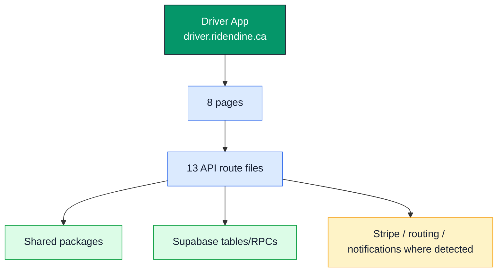

# Driver App

## Surface

- Domain: `driver.ridendine.ca`
- Local development URL: `http://localhost:3003`
- Primary users: Delivery drivers
- Code root: `apps/driver-app`
- App router root: `apps/driver-app/src/app`
- Purpose: Driver onboarding, presence, delivery offers, active deliveries, location updates, history, earnings, and payout setup.

## Status Summary

- Page routes: 8 total, 6 WIRED, 2 PARTIAL, 0 MISSING.
- API route files: 13 total, 4 WIRED, 9 PARTIAL.
- Internal link/API references: 36 total, 3 BROKEN, 0 UNKNOWN_DYNAMIC.

## Standalone App Diagram

## Pages

| Status | Route | Page file | Layout | Auth | Tables | APIs called | Components |
| --- | --- | --- | --- | --- | --- | --- | --- |
| PARTIAL | `/auth/login` | [apps/driver-app/src/app/auth/login/page.tsx](../../../apps/driver-app/src/app/auth/login/page.tsx) | [apps/driver-app/src/app/layout.tsx](../../../apps/driver-app/src/app/layout.tsx) | Public | None detected | `/api/auth/login` | `Button` |
| PARTIAL | `/auth/signup` | [apps/driver-app/src/app/auth/signup/page.tsx](../../../apps/driver-app/src/app/auth/signup/page.tsx) | [apps/driver-app/src/app/layout.tsx](../../../apps/driver-app/src/app/layout.tsx) | Public | None detected | `/api/auth/signup` | `Button`, `Input`, `PasswordStrength` |
| WIRED | `/delivery/:id` | [apps/driver-app/src/app/delivery/[id]/page.tsx](../../../apps/driver-app/src/app/delivery/[id]/page.tsx) | [apps/driver-app/src/app/layout.tsx](../../../apps/driver-app/src/app/layout.tsx) | Detected | `assignment_attempts`, `orders` | None detected | None detected |
| WIRED | `/earnings` | [apps/driver-app/src/app/earnings/page.tsx](../../../apps/driver-app/src/app/earnings/page.tsx) | [apps/driver-app/src/app/layout.tsx](../../../apps/driver-app/src/app/layout.tsx) | Detected | `platform_accounts` | None detected | None detected |
| WIRED | `/history` | [apps/driver-app/src/app/history/page.tsx](../../../apps/driver-app/src/app/history/page.tsx) | [apps/driver-app/src/app/layout.tsx](../../../apps/driver-app/src/app/layout.tsx) | Detected | None detected | None detected | None detected |
| WIRED | `/` | [apps/driver-app/src/app/page.tsx](../../../apps/driver-app/src/app/page.tsx) | [apps/driver-app/src/app/layout.tsx](../../../apps/driver-app/src/app/layout.tsx) | Detected | None detected | None detected | `ErrorState` |
| WIRED | `/profile` | [apps/driver-app/src/app/profile/page.tsx](../../../apps/driver-app/src/app/profile/page.tsx) | [apps/driver-app/src/app/layout.tsx](../../../apps/driver-app/src/app/layout.tsx) | Detected | None detected | None detected | None detected |
| WIRED | `/settings` | [apps/driver-app/src/app/settings/page.tsx](../../../apps/driver-app/src/app/settings/page.tsx) | [apps/driver-app/src/app/layout.tsx](../../../apps/driver-app/src/app/layout.tsx) | Detected | `platform_accounts` | None detected | None detected |

## APIs

| Status | Endpoint | Methods | File | Auth | Tables | Packages | External |
| --- | --- | --- | --- | --- | --- | --- | --- |
| WIRED | `/api/auth/login` | POST | [apps/driver-app/src/app/api/auth/login/route.ts](../../../apps/driver-app/src/app/api/auth/login/route.ts) | Detected | None detected | @ridendine/db, @ridendine/utils | Supabase |
| WIRED | `/api/auth/logout` | POST | [apps/driver-app/src/app/api/auth/logout/route.ts](../../../apps/driver-app/src/app/api/auth/logout/route.ts) | Detected | None detected | @ridendine/db | Supabase |
| WIRED | `/api/auth/signup` | POST | [apps/driver-app/src/app/api/auth/signup/route.ts](../../../apps/driver-app/src/app/api/auth/signup/route.ts) | Detected | `driver_presence` | @ridendine/db, @ridendine/utils | Supabase |
| PARTIAL | `/api/deliveries/:id` | GET, PATCH | [apps/driver-app/src/app/api/deliveries/[id]/route.ts](../../../apps/driver-app/src/app/api/deliveries/[id]/route.ts) | Undetected | `assignment_attempts`, `deliveries` | @ridendine/db | Supabase |
| PARTIAL | `/api/deliveries` | GET | [apps/driver-app/src/app/api/deliveries/route.ts](../../../apps/driver-app/src/app/api/deliveries/route.ts) | Undetected | None detected | @ridendine/db | Supabase |
| PARTIAL | `/api/driver/presence` | GET, PATCH | [apps/driver-app/src/app/api/driver/presence/route.ts](../../../apps/driver-app/src/app/api/driver/presence/route.ts) | Undetected | `deliveries`, `driver_presence` | @ridendine/db | None detected |
| PARTIAL | `/api/driver` | GET, PATCH | [apps/driver-app/src/app/api/driver/route.ts](../../../apps/driver-app/src/app/api/driver/route.ts) | Undetected | `drivers` | @ridendine/db | Supabase |
| PARTIAL | `/api/earnings` | GET | [apps/driver-app/src/app/api/earnings/route.ts](../../../apps/driver-app/src/app/api/earnings/route.ts) | Undetected | None detected | @ridendine/db | Supabase |
| PARTIAL | `/api/health` | GET | [apps/driver-app/src/app/api/health/route.ts](../../../apps/driver-app/src/app/api/health/route.ts) | Undetected | `drivers` | @ridendine/db, @ridendine/utils | Stripe, Supabase |
| PARTIAL | `/api/location` | POST | [apps/driver-app/src/app/api/location/route.ts](../../../apps/driver-app/src/app/api/location/route.ts) | Undetected | `deliveries`, `delivery_tracking_events`, `driver_locations`, `driver_presence`, `orders` | @ridendine/db, @ridendine/utils, @ridendine/validation | None detected |
| PARTIAL | `/api/offers` | GET, POST | [apps/driver-app/src/app/api/offers/route.ts](../../../apps/driver-app/src/app/api/offers/route.ts) | Undetected | `assignment_attempts` | @ridendine/db | None detected |
| PARTIAL | `/api/payouts/instant` | POST | [apps/driver-app/src/app/api/payouts/instant/route.ts](../../../apps/driver-app/src/app/api/payouts/instant/route.ts) | Undetected | `drivers` | @ridendine/db, @ridendine/engine | Supabase |
| WIRED | `/api/payouts/setup` | GET, POST | [apps/driver-app/src/app/api/payouts/setup/route.ts](../../../apps/driver-app/src/app/api/payouts/setup/route.ts) | Detected | `driver_payout_accounts`, `drivers` | @ridendine/db, @ridendine/engine | Stripe, Supabase |

## Broken Or Unproven Links

| Status | Source file | Kind | Target | Notes |
| --- | --- | --- | --- | --- |
| BROKEN | [apps/driver-app/src/app/auth/signup/page.tsx](../../../apps/driver-app/src/app/auth/signup/page.tsx) | href | `/privacy` | No matching page route file detected |
| BROKEN | [apps/driver-app/src/app/auth/signup/page.tsx](../../../apps/driver-app/src/app/auth/signup/page.tsx) | href | `/terms` | No matching page route file detected |
| BROKEN | [apps/driver-app/src/app/delivery/[id]/components/DeliveryDetail.tsx](../../../apps/driver-app/src/app/delivery/[id]/components/DeliveryDetail.tsx) | fetch | `/api/upload` | No matching API route file detected |
