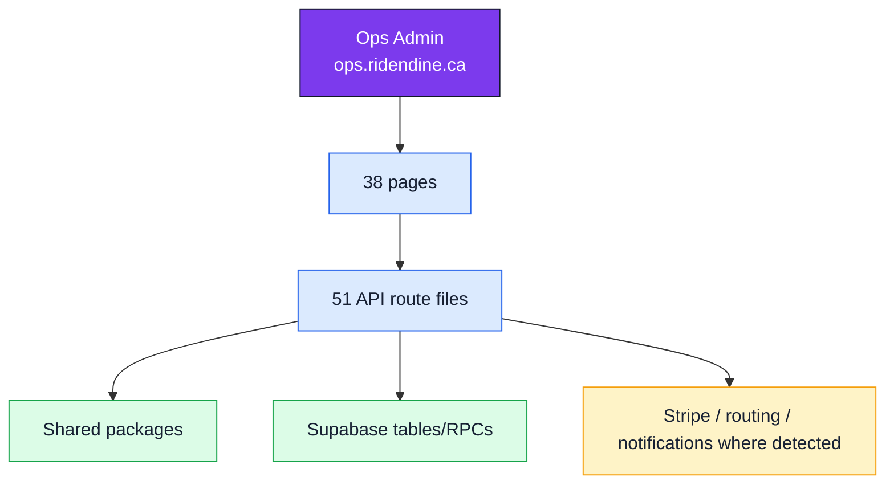

# Ops Admin

## Surface

- Domain: `ops.ridendine.ca`
- Local development URL: `http://localhost:3002`
- Primary users: Platform operators
- Code root: `apps/ops-admin`
- App router root: `apps/ops-admin/src/app`
- Purpose: Control plane for operations, customers, chefs, drivers, dispatch, finance, payouts, reconciliation, support, and system health.

## Status Summary

- Page routes: 38 total, 16 WIRED, 20 PARTIAL, 2 MISSING.
- API route files: 51 total, 0 WIRED, 46 PARTIAL.
- Internal link/API references: 76 total, 0 BROKEN, 1 UNKNOWN_DYNAMIC.

## Standalone App Diagram

## Pages

| Status | Route | Page file | Layout | Auth | Tables | APIs called | Components |
| --- | --- | --- | --- | --- | --- | --- | --- |
| PARTIAL | `/auth/login` | [apps/ops-admin/src/app/auth/login/page.tsx](../../../apps/ops-admin/src/app/auth/login/page.tsx) | [apps/ops-admin/src/app/layout.tsx](../../../apps/ops-admin/src/app/layout.tsx) | Public | None detected | None detected | `Button`, `Card`, `Input` |
| PARTIAL | `/dashboard/activity` | [apps/ops-admin/src/app/dashboard/activity/page.tsx](../../../apps/ops-admin/src/app/dashboard/activity/page.tsx) | [apps/ops-admin/src/app/dashboard/layout.tsx](../../../apps/ops-admin/src/app/dashboard/layout.tsx) | Undetected | `audit_logs`, `ops_override_logs`, `platform_users` | None detected | `@/components/DashboardLayout`, `Badge`, `Card` |
| PARTIAL | `/dashboard/analytics` | [apps/ops-admin/src/app/dashboard/analytics/page.tsx](../../../apps/ops-admin/src/app/dashboard/analytics/page.tsx) | [apps/ops-admin/src/app/dashboard/layout.tsx](../../../apps/ops-admin/src/app/dashboard/layout.tsx) | Undetected | `driver_presence`, `drivers`, `orders` | None detected | `@/components/DashboardLayout`, `KpiTile`, `PageHeader` |
| PARTIAL | `/dashboard/announcements` | [apps/ops-admin/src/app/dashboard/announcements/page.tsx](../../../apps/ops-admin/src/app/dashboard/announcements/page.tsx) | [apps/ops-admin/src/app/dashboard/layout.tsx](../../../apps/ops-admin/src/app/dashboard/layout.tsx) | Undetected | None detected | `/api/announcements` | `@/components/DashboardLayout`, `Button`, `Card` |
| PARTIAL | `/dashboard/automation` | [apps/ops-admin/src/app/dashboard/automation/page.tsx](../../../apps/ops-admin/src/app/dashboard/automation/page.tsx) | [apps/ops-admin/src/app/dashboard/layout.tsx](../../../apps/ops-admin/src/app/dashboard/layout.tsx) | Undetected | None detected | `/api/engine/rules` | `@/components/DashboardLayout`, `Badge`, `Card` |
| WIRED | `/dashboard/chefs/:id` | [apps/ops-admin/src/app/dashboard/chefs/[id]/page.tsx](../../../apps/ops-admin/src/app/dashboard/chefs/[id]/page.tsx) | [apps/ops-admin/src/app/dashboard/layout.tsx](../../../apps/ops-admin/src/app/dashboard/layout.tsx) | Detected | `chef_delivery_zones` | None detected | `@/components/DashboardLayout`, `Badge`, `Card` |
| PARTIAL | `/dashboard/chefs/approvals` | [apps/ops-admin/src/app/dashboard/chefs/approvals/page.tsx](../../../apps/ops-admin/src/app/dashboard/chefs/approvals/page.tsx) | [apps/ops-admin/src/app/dashboard/layout.tsx](../../../apps/ops-admin/src/app/dashboard/layout.tsx) | Undetected | None detected | `/api/chefs/${id}`, `/api/chefs?status=pending` | `@/components/DashboardLayout`, `Badge`, `Card` |
| WIRED | `/dashboard/chefs` | [apps/ops-admin/src/app/dashboard/chefs/page.tsx](../../../apps/ops-admin/src/app/dashboard/chefs/page.tsx) | [apps/ops-admin/src/app/dashboard/layout.tsx](../../../apps/ops-admin/src/app/dashboard/layout.tsx) | Undetected | None detected | None detected | `@/components/DashboardLayout`, `Button`, `DataTable`, `EmptyState`, `Modal`, `PageHeader`, `StatusBadge` |
| WIRED | `/dashboard/customers/:id` | [apps/ops-admin/src/app/dashboard/customers/[id]/page.tsx](../../../apps/ops-admin/src/app/dashboard/customers/[id]/page.tsx) | [apps/ops-admin/src/app/dashboard/layout.tsx](../../../apps/ops-admin/src/app/dashboard/layout.tsx) | Undetected | None detected | None detected | `@/components/DashboardLayout`, `Badge`, `Card` |
| PARTIAL | `/dashboard/customers` | [apps/ops-admin/src/app/dashboard/customers/page.tsx](../../../apps/ops-admin/src/app/dashboard/customers/page.tsx) | [apps/ops-admin/src/app/dashboard/layout.tsx](../../../apps/ops-admin/src/app/dashboard/layout.tsx) | Undetected | None detected | `/api/customers` | `@/components/DashboardLayout`, `DataTable`, `EmptyState`, `PageHeader` |
| WIRED | `/dashboard/deliveries/:id` | [apps/ops-admin/src/app/dashboard/deliveries/[id]/page.tsx](../../../apps/ops-admin/src/app/dashboard/deliveries/[id]/page.tsx) | [apps/ops-admin/src/app/dashboard/layout.tsx](../../../apps/ops-admin/src/app/dashboard/layout.tsx) | Undetected | None detected | None detected | `@/components/DashboardLayout`, `Badge`, `Card` |
| PARTIAL | `/dashboard/deliveries` | [apps/ops-admin/src/app/dashboard/deliveries/page.tsx](../../../apps/ops-admin/src/app/dashboard/deliveries/page.tsx) | [apps/ops-admin/src/app/dashboard/layout.tsx](../../../apps/ops-admin/src/app/dashboard/layout.tsx) | Undetected | None detected | None detected | `@/components/DashboardLayout`, `Badge`, `Card` |
| PARTIAL | `/dashboard/dispatch` | [apps/ops-admin/src/app/dashboard/dispatch/page.tsx](../../../apps/ops-admin/src/app/dashboard/dispatch/page.tsx) | [apps/ops-admin/src/app/dashboard/layout.tsx](../../../apps/ops-admin/src/app/dashboard/layout.tsx) | Undetected | None detected | `/api/engine/dispatch`, `/api/engine/dispatch/offer-history` | `@/components/DashboardLayout`, `@/components/map/delivery-map`, `Button`, `Card`, `DataTable`, `EmptyState`, `Modal`, `PageHeader`, `StatusBadge` |
| WIRED | `/dashboard/drivers/:id` | [apps/ops-admin/src/app/dashboard/drivers/[id]/page.tsx](../../../apps/ops-admin/src/app/dashboard/drivers/[id]/page.tsx) | [apps/ops-admin/src/app/dashboard/layout.tsx](../../../apps/ops-admin/src/app/dashboard/layout.tsx) | Undetected | None detected | None detected | `@/components/DashboardLayout`, `Badge`, `Card` |
| WIRED | `/dashboard/drivers` | [apps/ops-admin/src/app/dashboard/drivers/page.tsx](../../../apps/ops-admin/src/app/dashboard/drivers/page.tsx) | [apps/ops-admin/src/app/dashboard/layout.tsx](../../../apps/ops-admin/src/app/dashboard/layout.tsx) | Undetected | None detected | None detected | `@/components/DashboardLayout`, `Button`, `DataTable`, `EmptyState`, `Modal`, `PageHeader`, `StatusBadge` |
| MISSING | `/dashboard/finance/accounts/chefs/:id` | [apps/ops-admin/src/app/dashboard/finance/accounts/chefs/[id]/page.tsx](../../../apps/ops-admin/src/app/dashboard/finance/accounts/chefs/[id]/page.tsx) | [apps/ops-admin/src/app/dashboard/layout.tsx](../../../apps/ops-admin/src/app/dashboard/layout.tsx) | Undetected | None detected | None detected | None detected |
| PARTIAL | `/dashboard/finance/accounts/chefs` | [apps/ops-admin/src/app/dashboard/finance/accounts/chefs/page.tsx](../../../apps/ops-admin/src/app/dashboard/finance/accounts/chefs/page.tsx) | [apps/ops-admin/src/app/dashboard/layout.tsx](../../../apps/ops-admin/src/app/dashboard/layout.tsx) | Undetected | `chef_storefronts`, `platform_accounts` | None detected | `@/components/DashboardLayout`, `Badge`, `Card` |
| MISSING | `/dashboard/finance/accounts/drivers/:id` | [apps/ops-admin/src/app/dashboard/finance/accounts/drivers/[id]/page.tsx](../../../apps/ops-admin/src/app/dashboard/finance/accounts/drivers/[id]/page.tsx) | [apps/ops-admin/src/app/dashboard/layout.tsx](../../../apps/ops-admin/src/app/dashboard/layout.tsx) | Undetected | None detected | None detected | None detected |
| PARTIAL | `/dashboard/finance/accounts/drivers` | [apps/ops-admin/src/app/dashboard/finance/accounts/drivers/page.tsx](../../../apps/ops-admin/src/app/dashboard/finance/accounts/drivers/page.tsx) | [apps/ops-admin/src/app/dashboard/layout.tsx](../../../apps/ops-admin/src/app/dashboard/layout.tsx) | Undetected | `drivers`, `platform_accounts` | None detected | `@/components/DashboardLayout`, `Badge`, `Card` |
| PARTIAL | `/dashboard/finance/instant-payouts` | [apps/ops-admin/src/app/dashboard/finance/instant-payouts/page.tsx](../../../apps/ops-admin/src/app/dashboard/finance/instant-payouts/page.tsx) | [apps/ops-admin/src/app/dashboard/layout.tsx](../../../apps/ops-admin/src/app/dashboard/layout.tsx) | Undetected | `instant_payout_requests` | None detected | `@/components/DashboardLayout`, `Badge`, `Card` |
| WIRED | `/dashboard/finance` | [apps/ops-admin/src/app/dashboard/finance/page.tsx](../../../apps/ops-admin/src/app/dashboard/finance/page.tsx) | [apps/ops-admin/src/app/dashboard/layout.tsx](../../../apps/ops-admin/src/app/dashboard/layout.tsx) | Undetected | None detected | None detected | `@/components/DashboardLayout`, `EmptyState`, `KpiTile`, `PageHeader` |
| PARTIAL | `/dashboard/finance/payouts/:runId` | [apps/ops-admin/src/app/dashboard/finance/payouts/[runId]/page.tsx](../../../apps/ops-admin/src/app/dashboard/finance/payouts/[runId]/page.tsx) | [apps/ops-admin/src/app/dashboard/layout.tsx](../../../apps/ops-admin/src/app/dashboard/layout.tsx) | Undetected | `driver_payouts`, `ledger_entries`, `payout_runs` | None detected | `@/components/DashboardLayout`, `Badge`, `Card` |
| PARTIAL | `/dashboard/finance/payouts` | [apps/ops-admin/src/app/dashboard/finance/payouts/page.tsx](../../../apps/ops-admin/src/app/dashboard/finance/payouts/page.tsx) | [apps/ops-admin/src/app/dashboard/layout.tsx](../../../apps/ops-admin/src/app/dashboard/layout.tsx) | Undetected | `payout_runs` | None detected | `@/components/DashboardLayout`, `EmptyState`, `PageHeader`, `StatusBadge` |
| PARTIAL | `/dashboard/finance/reconciliation` | [apps/ops-admin/src/app/dashboard/finance/reconciliation/page.tsx](../../../apps/ops-admin/src/app/dashboard/finance/reconciliation/page.tsx) | [apps/ops-admin/src/app/dashboard/layout.tsx](../../../apps/ops-admin/src/app/dashboard/layout.tsx) | Undetected | `stripe_reconciliation` | None detected | `@/components/DashboardLayout`, `EmptyState`, `PageHeader`, `StatusBadge` |
| WIRED | `/dashboard/finance/refunds` | [apps/ops-admin/src/app/dashboard/finance/refunds/page.tsx](../../../apps/ops-admin/src/app/dashboard/finance/refunds/page.tsx) | [apps/ops-admin/src/app/dashboard/layout.tsx](../../../apps/ops-admin/src/app/dashboard/layout.tsx) | Undetected | None detected | None detected | `@/components/DashboardLayout`, `EmptyState`, `KpiTile`, `PageHeader` |
| PARTIAL | `/dashboard/health` | [apps/ops-admin/src/app/dashboard/health/page.tsx](../../../apps/ops-admin/src/app/dashboard/health/page.tsx) | [apps/ops-admin/src/app/dashboard/layout.tsx](../../../apps/ops-admin/src/app/dashboard/layout.tsx) | Undetected | None detected | `${baseUrl}/api/health` | `@/components/DashboardLayout`, `Card` |
| WIRED | `/dashboard/integrations` | [apps/ops-admin/src/app/dashboard/integrations/page.tsx](../../../apps/ops-admin/src/app/dashboard/integrations/page.tsx) | [apps/ops-admin/src/app/dashboard/layout.tsx](../../../apps/ops-admin/src/app/dashboard/layout.tsx) | Undetected | None detected | None detected | `@/components/DashboardLayout`, `Badge`, `Card` |
| WIRED | `/dashboard/map` | [apps/ops-admin/src/app/dashboard/map/page.tsx](../../../apps/ops-admin/src/app/dashboard/map/page.tsx) | [apps/ops-admin/src/app/dashboard/layout.tsx](../../../apps/ops-admin/src/app/dashboard/layout.tsx) | Undetected | None detected | None detected | `@/components/DashboardLayout`, `Card` |
| WIRED | `/dashboard/orders/:id` | [apps/ops-admin/src/app/dashboard/orders/[id]/page.tsx](../../../apps/ops-admin/src/app/dashboard/orders/[id]/page.tsx) | [apps/ops-admin/src/app/dashboard/layout.tsx](../../../apps/ops-admin/src/app/dashboard/layout.tsx) | Undetected | `order_exceptions` | None detected | `@/components/DashboardLayout`, `Badge`, `Card` |
| PARTIAL | `/dashboard/orders` | [apps/ops-admin/src/app/dashboard/orders/page.tsx](../../../apps/ops-admin/src/app/dashboard/orders/page.tsx) | [apps/ops-admin/src/app/dashboard/layout.tsx](../../../apps/ops-admin/src/app/dashboard/layout.tsx) | Undetected | None detected | `/api/engine/orders/${orderId}`, `/api/orders` | `@/components/DashboardLayout`, `Badge`, `Card` |
| WIRED | `/dashboard` | [apps/ops-admin/src/app/dashboard/page.tsx](../../../apps/ops-admin/src/app/dashboard/page.tsx) | [apps/ops-admin/src/app/dashboard/layout.tsx](../../../apps/ops-admin/src/app/dashboard/layout.tsx) | Detected | `deliveries`, `driver_presence`, `drivers`, `orders` | None detected | `@/components/DashboardLayout`, `KpiTile`, `PageHeader`, `StatusBadge` |
| PARTIAL | `/dashboard/promos` | [apps/ops-admin/src/app/dashboard/promos/page.tsx](../../../apps/ops-admin/src/app/dashboard/promos/page.tsx) | [apps/ops-admin/src/app/dashboard/layout.tsx](../../../apps/ops-admin/src/app/dashboard/layout.tsx) | Undetected | None detected | None detected | `@/components/DashboardLayout`, `Badge`, `Button`, `Card`, `Input` |
| WIRED | `/dashboard/reports` | [apps/ops-admin/src/app/dashboard/reports/page.tsx](../../../apps/ops-admin/src/app/dashboard/reports/page.tsx) | [apps/ops-admin/src/app/dashboard/layout.tsx](../../../apps/ops-admin/src/app/dashboard/layout.tsx) | Undetected | None detected | None detected | `@/components/DashboardLayout`, `Button`, `Card` |
| WIRED | `/dashboard/settings` | [apps/ops-admin/src/app/dashboard/settings/page.tsx](../../../apps/ops-admin/src/app/dashboard/settings/page.tsx) | [apps/ops-admin/src/app/dashboard/layout.tsx](../../../apps/ops-admin/src/app/dashboard/layout.tsx) | Undetected | None detected | None detected | `@/components/DashboardLayout`, `Badge`, `Card` |
| PARTIAL | `/dashboard/support` | [apps/ops-admin/src/app/dashboard/support/page.tsx](../../../apps/ops-admin/src/app/dashboard/support/page.tsx) | [apps/ops-admin/src/app/dashboard/layout.tsx](../../../apps/ops-admin/src/app/dashboard/layout.tsx) | Undetected | None detected | None detected | `@/components/DashboardLayout`, `Badge`, `Card` |
| PARTIAL | `/dashboard/team` | [apps/ops-admin/src/app/dashboard/team/page.tsx](../../../apps/ops-admin/src/app/dashboard/team/page.tsx) | [apps/ops-admin/src/app/dashboard/layout.tsx](../../../apps/ops-admin/src/app/dashboard/layout.tsx) | Undetected | None detected | None detected | `@/components/DashboardLayout`, `Badge`, `Button`, `Card`, `Input` |
| WIRED | `/internal/command-center` | [apps/ops-admin/src/app/internal/command-center/page.tsx](../../../apps/ops-admin/src/app/internal/command-center/page.tsx) | [apps/ops-admin/src/app/layout.tsx](../../../apps/ops-admin/src/app/layout.tsx) | Undetected | None detected | None detected | None detected |
| WIRED | `/` | [apps/ops-admin/src/app/page.tsx](../../../apps/ops-admin/src/app/page.tsx) | [apps/ops-admin/src/app/layout.tsx](../../../apps/ops-admin/src/app/layout.tsx) | Public | None detected | None detected | None detected |

## APIs

| Status | Endpoint | Methods | File | Auth | Tables | Packages | External |
| --- | --- | --- | --- | --- | --- | --- | --- |
| PARTIAL | `/api/analytics` | GET | [apps/ops-admin/src/app/api/analytics/route.ts](../../../apps/ops-admin/src/app/api/analytics/route.ts) | Undetected | `chef_storefronts`, `deliveries`, `drivers`, `orders` | @ridendine/db | None detected |
| PARTIAL | `/api/analytics/trends` | GET | [apps/ops-admin/src/app/api/analytics/trends/route.ts](../../../apps/ops-admin/src/app/api/analytics/trends/route.ts) | Undetected | `chef_profiles`, `ledger_entries`, `orders` | @ridendine/db | None detected |
| PARTIAL | `/api/announcements` | POST | [apps/ops-admin/src/app/api/announcements/route.ts](../../../apps/ops-admin/src/app/api/announcements/route.ts) | Undetected | `chef_profiles`, `customers`, `drivers`, `notifications`, `platform_users` | @ridendine/db | None detected |
| PARTIAL | `/api/audit/recent` | GET | [apps/ops-admin/src/app/api/audit/recent/route.ts](../../../apps/ops-admin/src/app/api/audit/recent/route.ts) | Undetected | `audit_logs` | @ridendine/db | Supabase |
| MISSING | `/api/chefs/:id` | PATCH | [apps/ops-admin/src/app/api/chefs/[id]/route.ts](../../../apps/ops-admin/src/app/api/chefs/[id]/route.ts) | Undetected | None detected | None detected | None detected |
| PARTIAL | `/api/chefs` | GET, POST | [apps/ops-admin/src/app/api/chefs/route.ts](../../../apps/ops-admin/src/app/api/chefs/route.ts) | Undetected | `audit_logs` | @ridendine/db, @ridendine/validation | Supabase |
| PARTIAL | `/api/cron/expired-offers` | GET, POST | [apps/ops-admin/src/app/api/cron/expired-offers/route.ts](../../../apps/ops-admin/src/app/api/cron/expired-offers/route.ts) | Undetected | None detected | @ridendine/db, @ridendine/engine, @ridendine/types, @ridendine/utils | None detected |
| PARTIAL | `/api/cron/payouts-chef-preview` | GET, POST | [apps/ops-admin/src/app/api/cron/payouts-chef-preview/route.ts](../../../apps/ops-admin/src/app/api/cron/payouts-chef-preview/route.ts) | Undetected | None detected | @ridendine/db, @ridendine/engine, @ridendine/utils | None detected |
| PARTIAL | `/api/cron/payouts-driver-preview` | GET, POST | [apps/ops-admin/src/app/api/cron/payouts-driver-preview/route.ts](../../../apps/ops-admin/src/app/api/cron/payouts-driver-preview/route.ts) | Undetected | None detected | @ridendine/db, @ridendine/engine, @ridendine/utils | None detected |
| PARTIAL | `/api/cron/reconciliation-daily` | GET, POST | [apps/ops-admin/src/app/api/cron/reconciliation-daily/route.ts](../../../apps/ops-admin/src/app/api/cron/reconciliation-daily/route.ts) | Undetected | None detected | @ridendine/db, @ridendine/engine, @ridendine/utils | None detected |
| PARTIAL | `/api/cron/sla-tick` | GET, POST | [apps/ops-admin/src/app/api/cron/sla-tick/route.ts](../../../apps/ops-admin/src/app/api/cron/sla-tick/route.ts) | Undetected | None detected | @ridendine/db, @ridendine/engine, @ridendine/types, @ridendine/utils | None detected |
| PARTIAL | `/api/customers/:id/notify` | POST | [apps/ops-admin/src/app/api/customers/[id]/notify/route.ts](../../../apps/ops-admin/src/app/api/customers/[id]/notify/route.ts) | Undetected | `customers`, `notifications` | @ridendine/db | None detected |
| PARTIAL | `/api/customers` | GET, POST | [apps/ops-admin/src/app/api/customers/route.ts](../../../apps/ops-admin/src/app/api/customers/route.ts) | Undetected | None detected | @ridendine/db, @ridendine/validation | Supabase |
| MISSING | `/api/deliveries/:id` | PATCH | [apps/ops-admin/src/app/api/deliveries/[id]/route.ts](../../../apps/ops-admin/src/app/api/deliveries/[id]/route.ts) | Undetected | None detected | None detected | None detected |
| PARTIAL | `/api/deliveries` | GET | [apps/ops-admin/src/app/api/deliveries/route.ts](../../../apps/ops-admin/src/app/api/deliveries/route.ts) | Undetected | None detected | @ridendine/db | Supabase |
| MISSING | `/api/drivers/:id` | PATCH | [apps/ops-admin/src/app/api/drivers/[id]/route.ts](../../../apps/ops-admin/src/app/api/drivers/[id]/route.ts) | Undetected | None detected | None detected | None detected |
| PARTIAL | `/api/drivers` | GET, POST | [apps/ops-admin/src/app/api/drivers/route.ts](../../../apps/ops-admin/src/app/api/drivers/route.ts) | Undetected | `audit_logs`, `driver_presence` | @ridendine/db, @ridendine/validation | Supabase |
| PARTIAL | `/api/engine/dashboard` | GET, POST | [apps/ops-admin/src/app/api/engine/dashboard/route.ts](../../../apps/ops-admin/src/app/api/engine/dashboard/route.ts) | Undetected | `get_ops_dashboard_stats`, `orders`, `system_alerts` | @ridendine/db, @ridendine/validation | Supabase |
| PARTIAL | `/api/engine/dispatch/offer-history` | GET | [apps/ops-admin/src/app/api/engine/dispatch/offer-history/route.ts](../../../apps/ops-admin/src/app/api/engine/dispatch/offer-history/route.ts) | Undetected | `assignment_attempts` | @ridendine/db | None detected |
| PARTIAL | `/api/engine/dispatch` | GET, POST | [apps/ops-admin/src/app/api/engine/dispatch/route.ts](../../../apps/ops-admin/src/app/api/engine/dispatch/route.ts) | Undetected | None detected | @ridendine/validation | None detected |
| PARTIAL | `/api/engine/exceptions/:id` | GET, PATCH | [apps/ops-admin/src/app/api/engine/exceptions/[id]/route.ts](../../../apps/ops-admin/src/app/api/engine/exceptions/[id]/route.ts) | Undetected | None detected | @ridendine/validation | None detected |
| PARTIAL | `/api/engine/exceptions` | GET, POST | [apps/ops-admin/src/app/api/engine/exceptions/route.ts](../../../apps/ops-admin/src/app/api/engine/exceptions/route.ts) | Undetected | None detected | @ridendine/types, @ridendine/validation | None detected |
| PARTIAL | `/api/engine/finance` | GET, POST | [apps/ops-admin/src/app/api/engine/finance/route.ts](../../../apps/ops-admin/src/app/api/engine/finance/route.ts) | Undetected | None detected | @ridendine/validation | None detected |
| PARTIAL | `/api/engine/health` | GET | [apps/ops-admin/src/app/api/engine/health/route.ts](../../../apps/ops-admin/src/app/api/engine/health/route.ts) | Undetected | None detected | @ridendine/db, @ridendine/engine | None detected |
| PARTIAL | `/api/engine/maintenance` | GET, POST | [apps/ops-admin/src/app/api/engine/maintenance/route.ts](../../../apps/ops-admin/src/app/api/engine/maintenance/route.ts) | Undetected | `chef_storefronts`, `platform_settings` | @ridendine/db, @ridendine/validation | None detected |
| PARTIAL | `/api/engine/orders/:id` | GET, PATCH | [apps/ops-admin/src/app/api/engine/orders/[id]/route.ts](../../../apps/ops-admin/src/app/api/engine/orders/[id]/route.ts) | Undetected | `order_exceptions`, `orders` | @ridendine/db, @ridendine/validation | Supabase |
| PARTIAL | `/api/engine/payouts/execute` | POST | [apps/ops-admin/src/app/api/engine/payouts/execute/route.ts](../../../apps/ops-admin/src/app/api/engine/payouts/execute/route.ts) | Undetected | None detected | @ridendine/types | None detected |
| PARTIAL | `/api/engine/payouts/instant/:id` | DELETE, POST | [apps/ops-admin/src/app/api/engine/payouts/instant/[id]/route.ts](../../../apps/ops-admin/src/app/api/engine/payouts/instant/[id]/route.ts) | Undetected | `instant_payout_requests` | @ridendine/db, @ridendine/types | None detected |
| PARTIAL | `/api/engine/payouts/instant` | GET | [apps/ops-admin/src/app/api/engine/payouts/instant/route.ts](../../../apps/ops-admin/src/app/api/engine/payouts/instant/route.ts) | Undetected | `instant_payout_requests` | @ridendine/db | None detected |
| MISSING | `/api/engine/payouts/preview` | POST | [apps/ops-admin/src/app/api/engine/payouts/preview/route.ts](../../../apps/ops-admin/src/app/api/engine/payouts/preview/route.ts) | Undetected | None detected | None detected | None detected |
| PARTIAL | `/api/engine/payouts` | GET, POST | [apps/ops-admin/src/app/api/engine/payouts/route.ts](../../../apps/ops-admin/src/app/api/engine/payouts/route.ts) | Undetected | `chef_payout_accounts`, `chef_payouts`, `chef_profiles`, `chef_storefronts`, `ledger_entries` | @ridendine/db, @ridendine/validation | Stripe |
| PARTIAL | `/api/engine/processors/expired-offers` | GET, POST | [apps/ops-admin/src/app/api/engine/processors/expired-offers/route.ts](../../../apps/ops-admin/src/app/api/engine/processors/expired-offers/route.ts) | Undetected | None detected | @ridendine/db, @ridendine/engine, @ridendine/utils | None detected |
| PARTIAL | `/api/engine/processors/sla` | GET, POST | [apps/ops-admin/src/app/api/engine/processors/sla/route.ts](../../../apps/ops-admin/src/app/api/engine/processors/sla/route.ts) | Undetected | `deliveries`, `system_alerts` | @ridendine/db, @ridendine/engine, @ridendine/utils | None detected |
| PARTIAL | `/api/engine/reconciliation` | GET, POST | [apps/ops-admin/src/app/api/engine/reconciliation/route.ts](../../../apps/ops-admin/src/app/api/engine/reconciliation/route.ts) | Undetected | `stripe_reconciliation` | @ridendine/db, @ridendine/types | Stripe |
| PARTIAL | `/api/engine/refunds` | GET, POST | [apps/ops-admin/src/app/api/engine/refunds/route.ts](../../../apps/ops-admin/src/app/api/engine/refunds/route.ts) | Undetected | None detected | @ridendine/validation | None detected |
| PARTIAL | `/api/engine/rules` | GET, PATCH | [apps/ops-admin/src/app/api/engine/rules/route.ts](../../../apps/ops-admin/src/app/api/engine/rules/route.ts) | Undetected | `platform_settings` | @ridendine/db, @ridendine/validation | None detected |
| PARTIAL | `/api/engine/settings` | GET, POST | [apps/ops-admin/src/app/api/engine/settings/route.ts](../../../apps/ops-admin/src/app/api/engine/settings/route.ts) | Undetected | None detected | @ridendine/validation | None detected |
| PARTIAL | `/api/engine/storefronts/:id` | GET, PATCH | [apps/ops-admin/src/app/api/engine/storefronts/[id]/route.ts](../../../apps/ops-admin/src/app/api/engine/storefronts/[id]/route.ts) | Undetected | `chef_storefronts`, `storefront_state_changes` | @ridendine/db | Supabase |
| PARTIAL | `/api/export` | GET | [apps/ops-admin/src/app/api/export/route.ts](../../../apps/ops-admin/src/app/api/export/route.ts) | Undetected | `chef_payouts`, `chef_profiles`, `customers`, `drivers`, `ledger_entries`, `orders`, `stripe_events_processed` | @ridendine/db | Stripe |
| PARTIAL | `/api/health` | GET | [apps/ops-admin/src/app/api/health/route.ts](../../../apps/ops-admin/src/app/api/health/route.ts) | Undetected | `chef_profiles`, `customers`, `deliveries`, `driver_presence`, `drivers`, `orders` | @ridendine/db, @ridendine/utils | Stripe, Supabase |
| MISSING | `/api/internal/command-center/change-requests` | GET, PATCH, POST | [apps/ops-admin/src/app/api/internal/command-center/change-requests/route.ts](../../../apps/ops-admin/src/app/api/internal/command-center/change-requests/route.ts) | Undetected | None detected | None detected | None detected |
| PARTIAL | `/api/ops/live-board` | GET | [apps/ops-admin/src/app/api/ops/live-board/route.ts](../../../apps/ops-admin/src/app/api/ops/live-board/route.ts) | Undetected | `chef_storefronts`, `drivers`, `orders` | @ridendine/db, @ridendine/types | None detected |
| PARTIAL | `/api/orders/:id/refund` | POST | [apps/ops-admin/src/app/api/orders/[id]/refund/route.ts](../../../apps/ops-admin/src/app/api/orders/[id]/refund/route.ts) | Undetected | None detected | @ridendine/utils, @ridendine/validation | None detected |
| PARTIAL | `/api/orders/:id` | GET, PATCH | [apps/ops-admin/src/app/api/orders/[id]/route.ts](../../../apps/ops-admin/src/app/api/orders/[id]/route.ts) | Undetected | None detected | @ridendine/db, @ridendine/types, @ridendine/utils | Supabase |
| PARTIAL | `/api/orders` | GET | [apps/ops-admin/src/app/api/orders/route.ts](../../../apps/ops-admin/src/app/api/orders/route.ts) | Undetected | None detected | @ridendine/db, @ridendine/validation | Supabase |
| PARTIAL | `/api/promos` | DELETE, GET, PATCH, POST | [apps/ops-admin/src/app/api/promos/route.ts](../../../apps/ops-admin/src/app/api/promos/route.ts) | Undetected | `promo_codes` | @ridendine/db | None detected |
| PARTIAL | `/api/stripe/webhook` | POST | [apps/ops-admin/src/app/api/stripe/webhook/route.ts](../../../apps/ops-admin/src/app/api/stripe/webhook/route.ts) | Undetected | None detected | @ridendine/db, @ridendine/engine, @ridendine/engine/server | Stripe |
| PARTIAL | `/api/support/:id` | PATCH | [apps/ops-admin/src/app/api/support/[id]/route.ts](../../../apps/ops-admin/src/app/api/support/[id]/route.ts) | Undetected | None detected | @ridendine/db, @ridendine/types | Supabase |
| PARTIAL | `/api/support` | GET, POST | [apps/ops-admin/src/app/api/support/route.ts](../../../apps/ops-admin/src/app/api/support/route.ts) | Undetected | None detected | @ridendine/db | Supabase |
| PARTIAL | `/api/surge` | GET, PATCH | [apps/ops-admin/src/app/api/surge/route.ts](../../../apps/ops-admin/src/app/api/surge/route.ts) | Undetected | `service_areas` | @ridendine/db, @ridendine/engine | None detected |
| PARTIAL | `/api/team` | GET, PATCH, POST | [apps/ops-admin/src/app/api/team/route.ts](../../../apps/ops-admin/src/app/api/team/route.ts) | Undetected | `platform_users` | @ridendine/db | None detected |

## Broken Or Unproven Links

| Status | Source file | Kind | Target | Notes |
| --- | --- | --- | --- | --- |
| UNKNOWN_DYNAMIC | [apps/ops-admin/src/app/dashboard/health/page.tsx](../../../apps/ops-admin/src/app/dashboard/health/page.tsx) | fetch | `${baseUrl}/api/health` | Not an internal route path |
