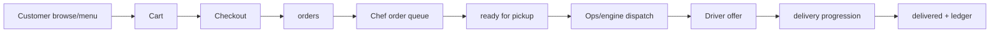

# Order Delivery Flow

```mermaid
flowchart LR
  Browse["Customer browse/menu"] --> Cart
  Cart --> Checkout
  Checkout --> Order["orders"]
  Order --> Kitchen["Chef order queue"]
  Kitchen --> Ready["ready for pickup"]
  Ready --> Dispatch["Ops/engine dispatch"]
  Dispatch --> Offer["Driver offer"]
  Offer --> Delivery["delivery progression"]
  Delivery --> Complete["delivered + ledger"]
```
