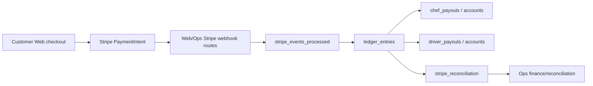

# Payment Flow

```mermaid
flowchart LR
  Customer["Customer Web checkout"] --> Stripe["Stripe PaymentIntent"]
  Stripe --> Webhook["Web/Ops Stripe webhook routes"]
  Webhook --> Idempotency["stripe_events_processed"]
  Idempotency --> Ledger["ledger_entries"]
  Ledger --> ChefPayout["chef_payouts / accounts"]
  Ledger --> DriverPayout["driver_payouts / accounts"]
  Ledger --> Reconciliation["stripe_reconciliation"]
  Reconciliation --> Ops["Ops finance/reconciliation"]
```

Primary source maps:

- `docs/architecture/PAYMENT_WORKFLOW_SCHEMATIC.md`
- `docs/architecture/payment-workflow-schematic.html`
- `docs/wiring/API_INVENTORY.md`
