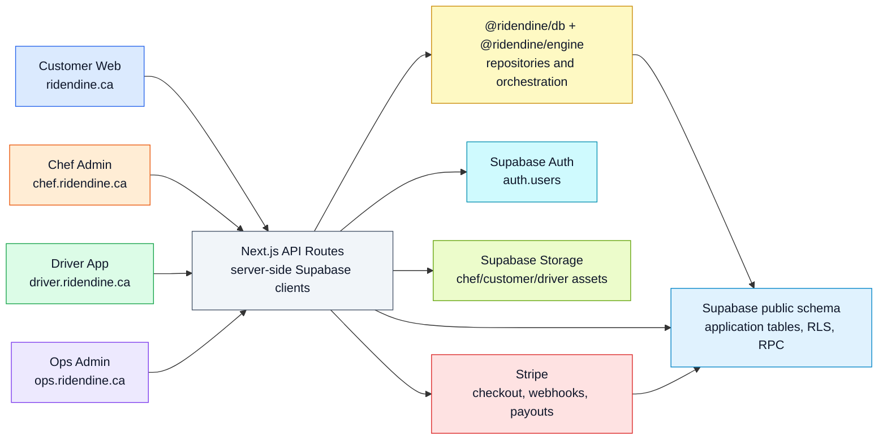
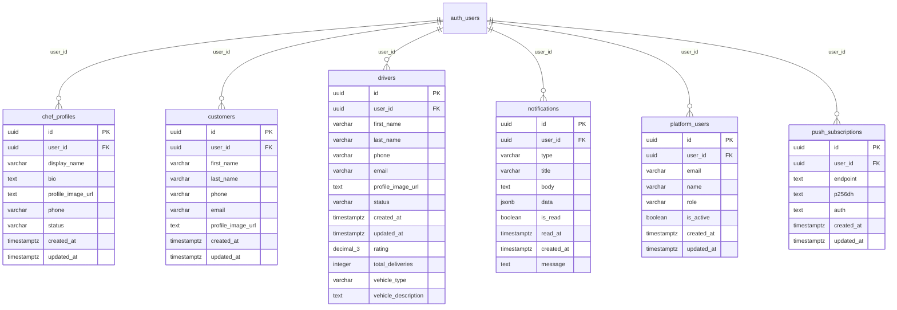
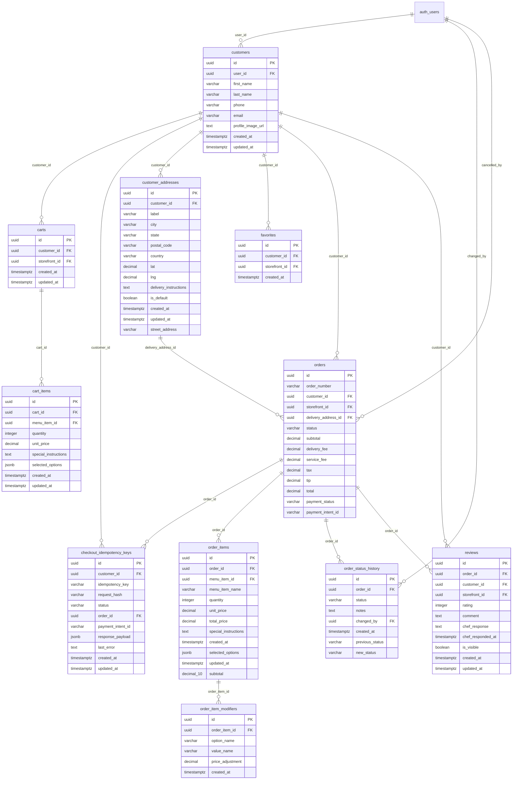
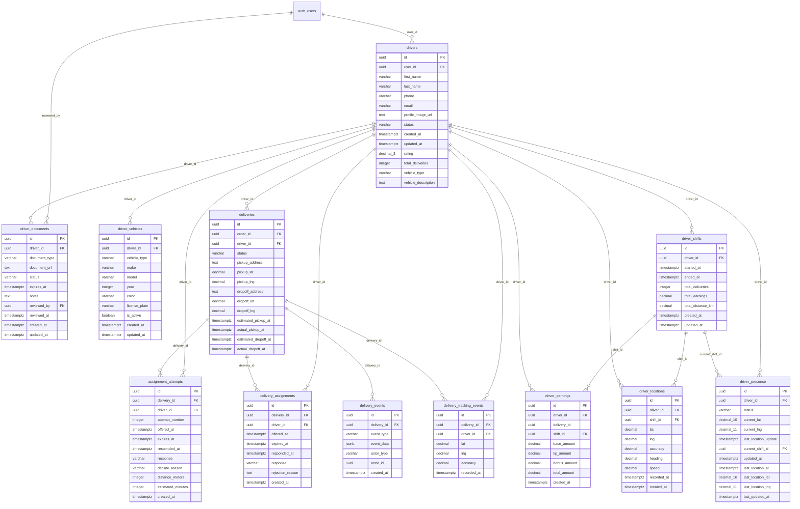
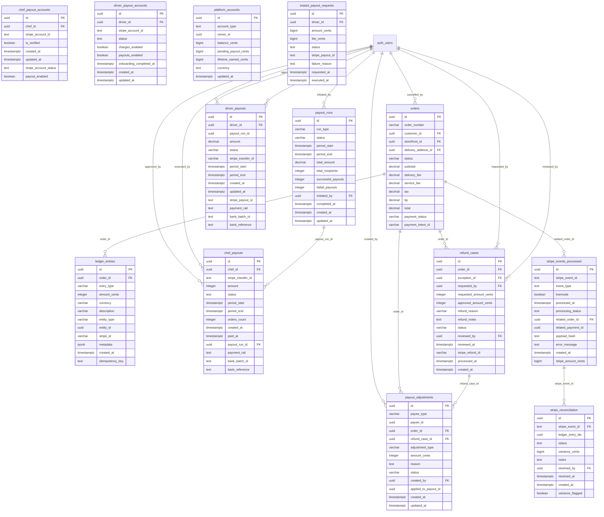
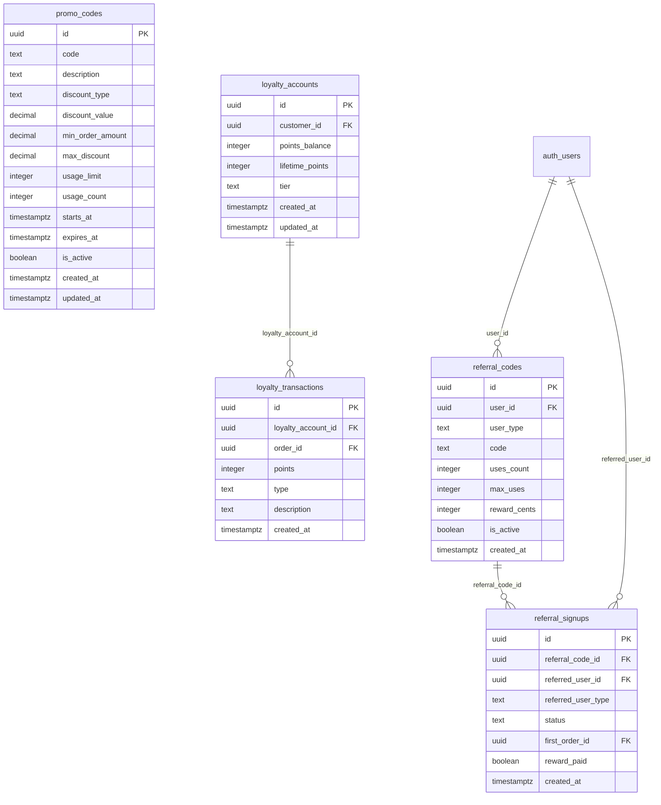

# Supabase SQL Diagram

Source of truth: [[Every Page Document]], Supabase migrations, and app/package Supabase calls.

## System

## App Wiring

```mermaid
flowchart LR
  CustomerWeb["Customer Web"]:::surface
  table_customers["customers"]:::table
  CustomerWeb --> table_customers
  table_customer_addresses["customer_addresses"]:::table
  CustomerWeb --> table_customer_addresses
  table_cart_items["cart_items"]:::table
  CustomerWeb --> table_cart_items
  table_favorites["favorites"]:::table
  CustomerWeb --> table_favorites
  table_orders["orders"]:::table
  CustomerWeb --> table_orders
  table_reviews["reviews"]:::table
  CustomerWeb --> table_reviews
  table_notifications["notifications"]:::table
  CustomerWeb --> table_notifications
  table_loyalty_transactions["loyalty_transactions"]:::table
  CustomerWeb --> table_loyalty_transactions
  ChefAdmin["Chef Admin"]:::surface
  table_chef_profiles["chef_profiles"]:::table
  ChefAdmin --> table_chef_profiles
  table_chef_storefronts["chef_storefronts"]:::table
  ChefAdmin --> table_chef_storefronts
  table_chef_kitchens["chef_kitchens"]:::table
  ChefAdmin --> table_chef_kitchens
  table_chef_availability["chef_availability"]:::table
  ChefAdmin --> table_chef_availability
  table_menu_items["menu_items"]:::table
  ChefAdmin --> table_menu_items
  table_orders["orders"]:::table
  ChefAdmin --> table_orders
  table_order_items["order_items"]:::table
  ChefAdmin --> table_order_items
  table_reviews["reviews"]:::table
  ChefAdmin --> table_reviews
  table_chef_payout_accounts["chef_payout_accounts"]:::table
  ChefAdmin --> table_chef_payout_accounts
  DriverApp["Driver App"]:::surface
  table_drivers["drivers"]:::table
  DriverApp --> table_drivers
  table_driver_presence["driver_presence"]:::table
  DriverApp --> table_driver_presence
  table_driver_locations["driver_locations"]:::table
  DriverApp --> table_driver_locations
  table_deliveries["deliveries"]:::table
  DriverApp --> table_deliveries
  table_assignment_attempts["assignment_attempts"]:::table
  DriverApp --> table_assignment_attempts
  table_delivery_tracking_events["delivery_tracking_events"]:::table
  DriverApp --> table_delivery_tracking_events
  table_driver_payout_accounts["driver_payout_accounts"]:::table
  DriverApp --> table_driver_payout_accounts
  OpsAdmin["Ops Admin"]:::surface
  table_platform_users["platform_users"]:::table
  OpsAdmin --> table_platform_users
  table_orders["orders"]:::table
  OpsAdmin --> table_orders
  table_deliveries["deliveries"]:::table
  OpsAdmin --> table_deliveries
  table_drivers["drivers"]:::table
  OpsAdmin --> table_drivers
  table_chef_profiles["chef_profiles"]:::table
  OpsAdmin --> table_chef_profiles
  table_customers["customers"]:::table
  OpsAdmin --> table_customers
  table_ledger_entries["ledger_entries"]:::table
  OpsAdmin --> table_ledger_entries
  table_payout_runs["payout_runs"]:::table
  OpsAdmin --> table_payout_runs
  table_stripe_reconciliation["stripe_reconciliation"]:::table
  OpsAdmin --> table_stripe_reconciliation
  table_support_tickets["support_tickets"]:::table
  OpsAdmin --> table_support_tickets
  table_audit_logs["audit_logs"]:::table
  OpsAdmin --> table_audit_logs
  SharedPackages["Shared Packages"]:::surface
  table_orders["orders"]:::table
  SharedPackages --> table_orders
  table_deliveries["deliveries"]:::table
  SharedPackages --> table_deliveries
  table_ledger_entries["ledger_entries"]:::table
  SharedPackages --> table_ledger_entries
  table_assignment_attempts["assignment_attempts"]:::table
  SharedPackages --> table_assignment_attempts
  table_order_exceptions["order_exceptions"]:::table
  SharedPackages --> table_order_exceptions
  table_system_alerts["system_alerts"]:::table
  SharedPackages --> table_system_alerts
  table_support_tickets["support_tickets"]:::table
  SharedPackages --> table_support_tickets
  table_platform_settings["platform_settings"]:::table
  SharedPackages --> table_platform_settings
  classDef surface fill:#f8fafc,stroke:#475569,color:#0f172a
  classDef table fill:#e0f2fe,stroke:#0284c7,color:#0f172a
```

## ERD Groups

### Identity and Roles

### Chef, Storefront, and Menu

```mermaid
erDiagram
  chef_profiles {
    uuid id PK
    uuid user_id FK
    varchar display_name
    text bio
    text profile_image_url
    varchar phone
    varchar status
    timestamptz created_at
    timestamptz updated_at
  }
  chef_kitchens {
    uuid id PK
    uuid chef_id FK
    varchar name
    varchar address_line1
    varchar address_line2
    varchar city
    varchar state
    varchar postal_code
    varchar country
    decimal lat
    decimal lng
    boolean is_verified
    timestamptz created_at
    timestamptz updated_at
  }
  chef_storefronts {
    uuid id PK
    uuid chef_id FK
    uuid kitchen_id FK
    varchar slug
    varchar name
    text description
    text cuisine_types
    text cover_image_url
    text logo_url
    boolean is_active
    boolean is_featured
    decimal average_rating
    integer total_reviews
    decimal min_order_amount
  }
  chef_documents {
    uuid id PK
    uuid chef_id FK
    varchar document_type
    text document_url
    varchar status
    timestamptz expires_at
    text notes
    uuid reviewed_by FK
    timestamptz reviewed_at
    timestamptz created_at
    timestamptz updated_at
  }
  chef_availability {
    uuid id PK
    uuid storefront_id FK
    integer day_of_week
    time start_time
    time end_time
    boolean is_available
    timestamptz created_at
    timestamptz updated_at
  }
  chef_delivery_zones {
    uuid id PK
    uuid storefront_id FK
    varchar name
    decimal radius_km
    geometry polygon
    decimal delivery_fee
    decimal min_order_for_free_delivery
    integer estimated_delivery_min
    integer estimated_delivery_max
    boolean is_active
    timestamptz created_at
    timestamptz updated_at
  }
  menu_categories {
    uuid id PK
    uuid storefront_id FK
    varchar name
    text description
    integer sort_order
    boolean is_active
    timestamptz created_at
    timestamptz updated_at
  }
  menu_items {
    uuid id PK
    uuid category_id FK
    uuid storefront_id FK
    varchar name
    text description
    decimal price
    text image_url
    boolean is_available
    boolean is_featured
    text dietary_tags
    integer prep_time_minutes
    integer sort_order
    timestamptz created_at
    timestamptz updated_at
  }
  menu_item_options {
    uuid id PK
    uuid menu_item_id FK
    varchar name
    boolean is_required
    integer max_selections
    integer sort_order
    timestamptz created_at
    timestamptz updated_at
  }
  menu_item_option_values {
    uuid id PK
    uuid option_id FK
    varchar name
    decimal price_adjustment
    boolean is_available
    integer sort_order
    timestamptz created_at
    timestamptz updated_at
  }
  menu_item_availability {
    uuid id PK
    uuid menu_item_id FK
    integer day_of_week
    time start_time
    time end_time
    boolean is_available
    timestamptz created_at
    timestamptz updated_at
  }
  storefront_state_changes {
    uuid id PK
    uuid storefront_id FK
    varchar previous_state
    varchar new_state
    text reason
    uuid changed_by FK
    varchar changed_by_role
    jsonb metadata
    timestamptz created_at
  }
  chef_storefronts ||--o{ chef_availability : "storefront_id"
  chef_storefronts ||--o{ chef_delivery_zones : "storefront_id"
  chef_profiles ||--o{ chef_documents : "chef_id"
  auth_users ||--o{ chef_documents : "reviewed_by"
  chef_profiles ||--o{ chef_kitchens : "chef_id"
  auth_users ||--o{ chef_profiles : "user_id"
  chef_profiles ||--o{ chef_storefronts : "chef_id"
  chef_kitchens ||--o{ chef_storefronts : "kitchen_id"
  auth_users ||--o{ chef_storefronts : "paused_by"
  chef_storefronts ||--o{ menu_categories : "storefront_id"
  menu_items ||--o{ menu_item_availability : "menu_item_id"
  menu_item_options ||--o{ menu_item_option_values : "option_id"
  menu_items ||--o{ menu_item_options : "menu_item_id"
  menu_categories ||--o{ menu_items : "category_id"
  chef_storefronts ||--o{ menu_items : "storefront_id"
  auth_users ||--o{ storefront_state_changes : "changed_by"
  chef_storefronts ||--o{ storefront_state_changes : "storefront_id"
```

### Customer, Cart, Orders, and Reviews

### Driver and Delivery

### Payments, Ledger, Payouts, and Finance

### Ops, Engine, Support, and Audit

```mermaid
erDiagram
  domain_events {
    uuid id PK
    varchar event_type
    varchar entity_type
    uuid entity_id
    jsonb payload
    uuid actor_user_id FK
    varchar actor_role
    uuid actor_entity_id
    integer version
    boolean published
    timestamptz published_at
    timestamptz created_at
  }
  order_exceptions {
    uuid id PK
    varchar exception_type
    varchar severity
    varchar status
    uuid order_id FK
    uuid customer_id FK
    uuid chef_id FK
    uuid driver_id FK
    uuid delivery_id FK
    varchar title
    text description
    jsonb recommended_actions
    text internal_notes
    text resolution
  }
  sla_timers {
    uuid id PK
    varchar sla_type
    varchar status
    varchar entity_type
    uuid entity_id
    timestamptz started_at
    timestamptz warning_at
    timestamptz deadline_at
    timestamptz completed_at
    timestamptz breached_at
    jsonb metadata
    timestamptz created_at
    timestamptz updated_at
  }
  kitchen_queue_entries {
    uuid id PK
    uuid storefront_id FK
    uuid order_id FK
    integer position
    integer estimated_prep_minutes
    integer actual_prep_minutes
    varchar status
    timestamptz started_at
    timestamptz completed_at
    timestamptz created_at
    timestamptz updated_at
  }
  ops_override_logs {
    uuid id PK
    varchar action
    varchar entity_type
    uuid entity_id
    jsonb before_state
    jsonb after_state
    text reason
    uuid actor_user_id FK
    varchar actor_role
    uuid approved_by FK
    timestamptz created_at
  }
  system_alerts {
    uuid id PK
    varchar alert_type
    varchar severity
    varchar title
    text message
    varchar entity_type
    uuid entity_id
    boolean acknowledged
    uuid acknowledged_by FK
    timestamptz acknowledged_at
    boolean auto_resolved
    timestamptz resolved_at
    jsonb metadata
    timestamptz created_at
  }
  support_tickets {
    uuid id PK
    uuid order_id FK
    uuid customer_id FK
    uuid chef_id FK
    uuid driver_id
    varchar subject
    text description
    varchar status
    varchar priority
    uuid assigned_to FK
    timestamptz resolved_at
    timestamptz created_at
    timestamptz updated_at
  }
  admin_notes {
    uuid id PK
    varchar entity_type
    uuid entity_id
    text note
    uuid created_by FK
    timestamptz created_at
  }
  audit_logs {
    uuid id PK
    varchar actor_type
    uuid actor_id
    varchar action
    varchar entity_type
    uuid entity_id
    jsonb old_data
    jsonb new_data
    inet ip_address
    text user_agent
    timestamptz created_at
    text actor_role
    text reason
    jsonb metadata
  }
  ops_processor_runs {
    uuid id PK
    text processor_name
    text idempotency_key
    text status
    timestamptz started_at
    timestamptz finished_at
    jsonb result
    text error_message
  }
  platform_settings {
    uuid id PK
    decimal_5 platform_fee_percent
    decimal_5 service_fee_percent
    decimal_5 hst_rate
    decimal_10 min_order_amount
    decimal_5 max_delivery_radius_km
    timestamptz updated_at
    decimal_5 dispatch_radius_km
    decimal_5 max_delivery_distance_km
    integer default_prep_time_minutes
    integer offer_timeout_seconds
    integer max_assignment_attempts
    boolean auto_assign_enabled
    integer refund_auto_review_threshold_cents
  }
  service_areas {
    uuid id PK
    text name
    geography polygon
    boolean is_active
    numeric surge_multiplier
    numeric dispatch_radius_km
    integer offer_ttl_seconds
    integer max_offer_attempts
    timestamptz created_at
    timestamptz updated_at
  }
  analytics_events {
    uuid id PK
    varchar event_name
    jsonb properties
    uuid user_id
    text session_id
    text page_url
    text referrer
    text user_agent
    timestamptz created_at
  }
  auth_users ||--o{ admin_notes : "created_by"
  auth_users ||--o{ audit_logs : "user_id"
  auth_users ||--o{ domain_events : "actor_user_id"
  auth_users ||--o{ ops_override_logs : "actor_user_id"
  auth_users ||--o{ ops_override_logs : "approved_by"
  auth_users ||--o{ order_exceptions : "resolved_by"
  auth_users ||--o{ platform_settings : "updated_by"
  auth_users ||--o{ support_tickets : "assigned_to"
  auth_users ||--o{ system_alerts : "acknowledged_by"
```

### Growth, Promo, Loyalty, and Referral

## Review Gaps

| Name | Surfaces | Example File | Review Note |
| --- | --- | --- | --- |
| None | None | None | None |

## Linked Repo Docs

- `docs/architecture/supabase/SUPABASE_SQL_DIAGRAM.md`
- `docs/architecture/supabase/SUPABASE_TABLE_INVENTORY.md`
- `docs/architecture/supabase/SUPABASE_APP_USAGE_MATRIX.md`
- `graphify-out/ridendine-codebase-map/supabase-graph.json`
