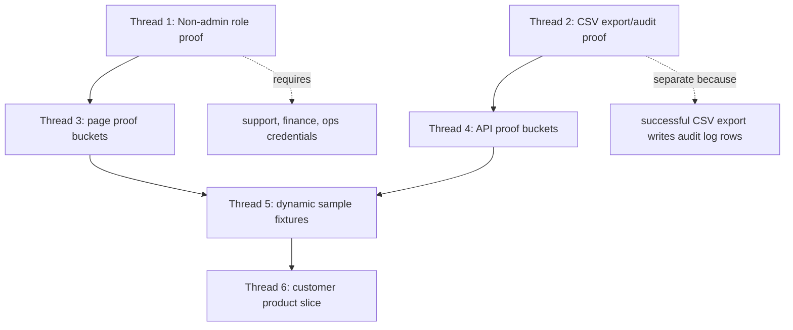

# Remaining Issue Threads Implementation Plan

> **For agentic workers:** REQUIRED SUB-SKILL: Use superpowers:subagent-driven-development (recommended) or superpowers:executing-plans to implement this plan task-by-task. Steps use checkbox (`- [ ]`) syntax for tracking.

**Goal:** Convert the five remaining post-closure items into focused, verifiable issue threads that can be implemented, pushed, deployed, and smoke-tested without reopening the completed wiring-hardening phase track.

**Architecture:** Treat this as five independent issue threads with shared release gates. Credentials, CSV/audit proof, runtime proof buckets, dynamic fixtures, and customer workflow work must be shipped separately because they have different risk levels and different data-mutation behavior.

**Tech Stack:** RidenDine monorepo, Next.js App Router, Supabase, Vercel, GitHub Actions, PowerShell, Node `node:test`, Playwright smoke tooling, existing `scripts/smoke/*` and `scripts/audit/*` gates.

---

## File Structure

This plan creates a master execution record. Future implementation tasks should touch the listed files by issue thread.

| Thread | Planned files |
|---|---|
| 1. Non-admin Ops live role proof | `scripts/smoke/non-admin-role-fixture-smoke.cjs`, `docs/wiring/NON_ADMIN_ROLE_FIXTURE_SMOKE.md`, `docs/architecture/codebase-map/wiring/NON_ADMIN_ROLE_FIXTURE_SMOKE.md`, `docs/obsidian/codebase-map/Non Admin Role Fixture Smoke.md` |
| 2. Ops CSV export/audit proof | `apps/ops-admin/src/app/api/export/route.ts`, `apps/ops-admin/src/app/api/audit/recent/route.ts`, `scripts/smoke/ops-export-audit-smoke.cjs`, `scripts/smoke/ops-export-audit-smoke.test.cjs`, `docs/wiring/OPS_EXPORT_AUDIT_SMOKE.md`, `package.json` |
| 3. Public and login-guard page proof bucket | `scripts/smoke/runtime-proof-action-smoke.cjs`, `scripts/smoke/runtime-proof-action-smoke.test.cjs`, `scripts/smoke/runtime-contract-smoke.cjs`, `scripts/smoke/runtime-contracts.cjs`, `docs/wiring/RUNTIME_PROOF_ACTION_SMOKE.md`, `package.json` |
| 4. Authenticated JSON and negative/special API proof bucket | `scripts/smoke/runtime-proof-action-smoke.cjs`, `scripts/smoke/runtime-proof-action-smoke.test.cjs`, `scripts/audit/high-risk-ops-negative-authz.cjs`, `docs/wiring/RUNTIME_PROOF_ACTION_SMOKE.md`, `docs/wiring/RUNTIME_COVERAGE_AUDIT.md` |
| 5. Dynamic sample-data fixtures | `scripts/smoke/runtime-sample-fixtures.cjs`, `scripts/smoke/runtime-sample-fixtures.test.cjs`, `docs/wiring/RUNTIME_SAMPLE_FIXTURES.md`, `package.json` |
| 6. Customer product roadmap slice | `apps/web/src/app/account/*`, `apps/web/src/app/orders/*`, `apps/web/src/app/checkout/*`, `apps/web/src/app/api/orders/*`, `apps/web/src/app/api/support/*`, customer tests under `apps/web/src/**/__tests__` |

## Execution Order



## Shared Gate For Every Thread

Run this before starting each issue thread:

```powershell
$repo = 'C:\RIDENDINE\ridendine-marketplace'
Set-Location -LiteralPath $repo
git status --short
git pull --ff-only origin master
. .\scripts\tools\ensure-node-pnpm.ps1
$tool = Use-RidendineNodePnpm -Quiet
```

Expected:

- `git pull --ff-only origin master` succeeds.
- Only the known untracked `graphify-out` scratch folders may be present before starting.
- Do not include untracked `graphify-out` folders in any commit unless the user explicitly asks for graph output packaging.

Run this before pushing each issue thread:

```powershell
& $tool.PnpmCmd test:wiring-fixes
git diff --check
git status --short
```

Expected:

- `test:wiring-fixes` exits `0`.
- `git diff --check` exits `0`.
- `git status --short` shows only intended files plus the existing untracked `graphify-out` scratch folders.

Run this after pushing each issue thread:

```powershell
git push origin master
$sha = git rev-parse HEAD
$headers = @{ 'User-Agent' = 'Codex-Ridendine-Verification' }
Invoke-RestMethod -Headers $headers -Uri "https://api.github.com/repos/SeanCFAFinlay/ridendine-marketplace/commits/$sha/status"
Invoke-RestMethod -Headers $headers -Uri "https://api.github.com/repos/SeanCFAFinlay/ridendine-marketplace/actions/runs?head_sha=$sha&per_page=1"
```

Expected:

- GitHub Actions completes successfully.
- Vercel contexts for `ridendine-web`, `ridendine-chef-admin`, `ridendine-driver-app`, and `ridendine-ops-admin` complete successfully.

## Thread 1: Non-Admin Ops Live Role Proof

**Goal:** Prove support-agent, finance-manager, and ops-agent roles can access only their intended live-safe Ops read APIs.

**Risk:** Low application risk, but blocked until non-admin credentials exist.

**Status:** Complete on 2026-06-07. Smoke-role accounts were created through the guarded Ops team API, live credential readiness passed, and 15/15 live allow/deny probes passed. Generated proof docs were updated without printing credential values.

**Files:**
- Read: `scripts/smoke/non-admin-role-fixture-smoke.cjs`
- Read: `scripts/smoke/non-admin-role-fixture-smoke.test.cjs`
- Modify after successful live proof: `docs/wiring/NON_ADMIN_ROLE_FIXTURE_SMOKE.md`
- Modify after successful live proof: `docs/architecture/codebase-map/wiring/NON_ADMIN_ROLE_FIXTURE_SMOKE.md`
- Modify after successful live proof: `docs/obsidian/codebase-map/Non Admin Role Fixture Smoke.md`

- [x] **Step 1: Confirm the role contracts are still valid**

Run:

```powershell
& $tool.PnpmCmd smoke:non-admin-role-fixture -- --contracts-only --write-docs
& $tool.PnpmCmd test:wiring-fixes
```

Expected:

- Contracts-only non-admin role fixture exits `0`.
- `test:wiring-fixes` exits `0`.

- [x] **Step 2: Configure non-admin credentials**

Required environment variables:

```powershell
$env:RIDENDINE_SUPPORT_AGENT_EMAIL
$env:RIDENDINE_SUPPORT_AGENT_PASSWORD
$env:RIDENDINE_FINANCE_MANAGER_EMAIL
$env:RIDENDINE_FINANCE_MANAGER_PASSWORD
$env:RIDENDINE_OPS_AGENT_EMAIL
$env:RIDENDINE_OPS_AGENT_PASSWORD
```

Use real test-role accounts only. Do not reuse the seeded full-admin account for this thread.

- [x] **Step 3: Run credential readiness preflight**

Run:

```powershell
& $tool.PnpmCmd smoke:non-admin-role-readiness
```

Expected:

- Exits `0`.
- Prints which role credential slots are configured.
- Does not print passwords or secret values.

- [x] **Step 4: Run live non-admin role proof**

Run:

```powershell
& $tool.PnpmCmd smoke:non-admin-role-fixture -- --require-auth --require-all-roles --write-docs
```

Expected:

- Support-agent allow/deny probes pass.
- Finance-manager allow/deny probes pass.
- Ops-agent allow/deny probes pass.
- Generated docs update with live proof evidence.

- [x] **Step 5: Commit and push Thread 1**

Run:

```powershell
git diff --check
git add docs/wiring/NON_ADMIN_ROLE_FIXTURE_SMOKE.md docs/architecture/codebase-map/wiring/NON_ADMIN_ROLE_FIXTURE_SMOKE.md "docs/obsidian/codebase-map/Non Admin Role Fixture Smoke.md"
git commit -m "docs: record live non-admin role proof"
git push origin master
```

Expected:

- Commit contains only non-admin role proof docs.
- GitHub Actions and Vercel pass on the pushed commit.

## Thread 2: Ops CSV Export And Audit Proof

**Goal:** Prove Ops CSV export returns valid CSV and writes an audit-log row for successful exports.

**Risk:** Medium because successful export writes audit-log data. Run this separately from read-only live smoke.

**Status:** Complete on 2026-06-07. Added `smoke:ops-export-audit`, registered its helper tests in `test:wiring-fixes`, generated proof docs, and verified a live Ops `orders` CSV export wrote audit entry `159e0041-59a6-475a-9bf1-69f17febef59`.

**Files:**
- Read: `apps/ops-admin/src/app/api/export/route.ts`
- Read: `apps/ops-admin/src/app/api/audit/recent/route.ts`
- Create: `scripts/smoke/ops-export-audit-smoke.cjs`
- Create: `scripts/smoke/ops-export-audit-smoke.test.cjs`
- Create: `docs/wiring/OPS_EXPORT_AUDIT_SMOKE.md`
- Modify: `package.json`
- Modify: `docs/wiring/RUNTIME_PROOF_DISPOSITION.md` only through the existing generator if the proof model changes

- [x] **Step 1: Write the failing test for CSV export proof helpers**

Create `scripts/smoke/ops-export-audit-smoke.test.cjs` with tests for:

```javascript
const assert = require('node:assert/strict');
const test = require('node:test');

const {
  buildExportUrl,
  isCsvResponse,
  findExportAuditEntry,
  parseArgs,
} = require('./ops-export-audit-smoke.cjs');

test('buildExportUrl creates a bounded orders export URL', () => {
  const url = buildExportUrl('https://ops.ridendine.ca', {
    type: 'orders',
    start: '2026-06-01T00:00:00.000Z',
    end: '2026-06-02T00:00:00.000Z',
  });

  assert.equal(
    url,
    'https://ops.ridendine.ca/api/export?type=orders&start=2026-06-01T00%3A00%3A00.000Z&end=2026-06-02T00%3A00%3A00.000Z'
  );
});

test('isCsvResponse requires text/csv and a header row', () => {
  assert.equal(isCsvResponse({ contentType: 'text/csv', body: 'Order Number,Status\\nR-1,paid' }), true);
  assert.equal(isCsvResponse({ contentType: 'application/json', body: '{\"ok\":true}' }), false);
});

test('findExportAuditEntry locates an export audit row by action and entity type', () => {
  const item = findExportAuditEntry([
    { action: 'status_change', entity_type: 'order' },
    { action: 'export', entity_type: 'export', created_at: '2026-06-07T19:00:00.000Z' },
  ]);
  assert.equal(item.action, 'export');
});

test('parseArgs defaults to a live-safe operational export type', () => {
  const args = parseArgs([]);
  assert.equal(args.type, 'orders');
  assert.equal(args.requireAuth, false);
});
```

Run:

```powershell
& $tool.NodeExe --test scripts/smoke/ops-export-audit-smoke.test.cjs
```

Expected before implementation: fails because `scripts/smoke/ops-export-audit-smoke.cjs` does not exist.

- [x] **Step 2: Implement the CSV export proof script**

Create `scripts/smoke/ops-export-audit-smoke.cjs` with these exported functions:

```javascript
module.exports = {
  buildExportUrl,
  findExportAuditEntry,
  isCsvResponse,
  parseArgs,
  runOpsExportAuditSmoke,
};
```

Runtime behavior:

- Default export type: `orders`.
- Default date window: last 24 hours.
- Login: use `RIDENDINE_SMOKE_EMAIL` and `RIDENDINE_SMOKE_PASSWORD` when `--require-auth` is passed.
- Export check: `GET /api/export?type=orders&start=<iso>&end=<iso>` must return `text/csv`.
- Audit check: `GET /api/audit/recent?limit=20` must include an item with `action === 'export'` and `entity_type === 'export'`.
- Failure behavior: exit non-zero if export is not CSV, if login fails, or if the audit row cannot be found.

- [x] **Step 3: Add package script and wiring test inclusion**

Modify `package.json`:

```json
"smoke:ops-export-audit": "node scripts/smoke/ops-export-audit-smoke.cjs"
```

Append the new test file to `test:wiring-fixes`:

```json
"scripts/smoke/ops-export-audit-smoke.test.cjs"
```

Expected:

- `pnpm smoke:ops-export-audit -- --help` is not required.
- `pnpm test:wiring-fixes` runs the new unit tests.

- [x] **Step 4: Run local proof tests**

Run:

```powershell
& $tool.NodeExe --test scripts/smoke/ops-export-audit-smoke.test.cjs
& $tool.PnpmCmd test:wiring-fixes
```

Expected:

- New tests pass.
- Full wiring gate passes.

- [x] **Step 5: Run live CSV export/audit proof**

Set:

```powershell
$env:RIDENDINE_SMOKE_EMAIL = 'sean@ridendine.ca'
$env:RIDENDINE_SMOKE_PASSWORD = 'password123'
```

Run:

```powershell
& $tool.PnpmCmd smoke:ops-export-audit -- --require-auth --type orders --write-docs
```

Expected:

- Ops login returns a session cookie.
- Orders export returns `text/csv`.
- Recent audit endpoint returns an `export` audit row.
- `docs/wiring/OPS_EXPORT_AUDIT_SMOKE.md` records the proof.

- [x] **Step 6: Commit and push Thread 2**

Run:

```powershell
git diff --check
git add package.json scripts/smoke/ops-export-audit-smoke.cjs scripts/smoke/ops-export-audit-smoke.test.cjs docs/wiring/OPS_EXPORT_AUDIT_SMOKE.md
git commit -m "test(ops): add csv export audit smoke"
git push origin master
```

Expected:

- GitHub Actions and Vercel pass.
- `pnpm smoke:prod` passes after deployment.

## Thread 3: Public And Login-Guard Page Proof Buckets

**Goal:** Convert safe page proof-disposition buckets into executable smoke coverage.

**Risk:** Low because this thread uses public pages and unauthenticated protected-page guard checks.

**Status:** Complete on 2026-06-07. `smoke:proof-actions` passed for `public-page-smoke` and `login-guard-page-smoke` with 76 executed page checks, 0 failures, and 2 dynamic public pages deferred to Thread 5 sample fixtures. Runtime page proof coverage now reports 80/90 covered with 10 remaining page proof gaps.

**Files:**
- Read: `scripts/smoke/runtime-proof-disposition.cjs`
- Read: `scripts/smoke/runtime-contract-smoke.cjs`
- Create: `scripts/smoke/runtime-proof-action-smoke.cjs`
- Create: `scripts/smoke/runtime-proof-action-smoke.test.cjs`
- Create: `docs/wiring/RUNTIME_PROOF_ACTION_SMOKE.md`
- Modify: `package.json`

- [x] **Step 1: Write failing selection tests**

Create `scripts/smoke/runtime-proof-action-smoke.test.cjs` with tests for:

```javascript
const assert = require('node:assert/strict');
const test = require('node:test');

const {
  selectProofActions,
  summarizeProofActionResults,
} = require('./runtime-proof-action-smoke.cjs');

test('selectProofActions picks only requested page buckets', () => {
  const selected = selectProofActions({
    disposition: {
      pages: [
        { route: '/', proofCovered: false, proofDisposition: { nextProofAction: 'public-page-smoke' } },
        { route: '/dashboard', proofCovered: false, proofDisposition: { nextProofAction: 'login-guard-page-smoke' } },
        { route: '/api/orders', proofCovered: false, proofDisposition: { nextProofAction: 'authenticated-json-smoke' } },
      ],
      apis: [],
    },
    buckets: ['public-page-smoke', 'login-guard-page-smoke'],
  });

  assert.deepEqual(selected.map((item) => item.route), ['/', '/dashboard']);
});

test('summarizeProofActionResults fails when one result fails', () => {
  const summary = summarizeProofActionResults([
    { ok: true, bucket: 'public-page-smoke' },
    { ok: false, bucket: 'login-guard-page-smoke', message: 'not guarded' },
  ]);
  assert.equal(summary.ok, false);
  assert.equal(summary.failures.length, 1);
});
```

Run:

```powershell
& $tool.NodeExe --test scripts/smoke/runtime-proof-action-smoke.test.cjs
```

Expected before implementation: fails because the script does not exist.

- [x] **Step 2: Implement page-bucket proof action script**

Create `scripts/smoke/runtime-proof-action-smoke.cjs` that:

- imports `collectProofDisposition` from `scripts/smoke/runtime-proof-disposition.cjs`;
- imports `checkPageContract` and `baseUrlForApp` from `scripts/smoke/runtime-contract-smoke.cjs`;
- supports `--bucket public-page-smoke`;
- supports `--bucket login-guard-page-smoke`;
- supports `--bucket sampled-login-guard-page-smoke`;
- supports `--write-docs`;
- writes `docs/wiring/RUNTIME_PROOF_ACTION_SMOKE.md`.

Initial Thread 3 live run should use only:

```powershell
& $tool.PnpmCmd smoke:proof-actions -- --bucket public-page-smoke --bucket login-guard-page-smoke --write-docs
```

Expected:

- Public pages return `200` HTML.
- Protected pages resolve to login guard or redirect.
- No authenticated or mutating API calls are made.

- [x] **Step 3: Add script wiring**

Modify `package.json`:

```json
"smoke:proof-actions": "node scripts/smoke/runtime-proof-action-smoke.cjs"
```

Append `scripts/smoke/runtime-proof-action-smoke.test.cjs` to `test:wiring-fixes`.

- [x] **Step 4: Run and document Thread 3**

Run:

```powershell
& $tool.NodeExe --test scripts/smoke/runtime-proof-action-smoke.test.cjs
& $tool.PnpmCmd smoke:proof-actions -- --bucket public-page-smoke --bucket login-guard-page-smoke --write-docs
& $tool.PnpmCmd smoke:runtime-coverage -- --write-docs
& $tool.PnpmCmd smoke:proof-disposition -- --write-docs
& $tool.PnpmCmd test:wiring-fixes
```

Expected:

- Page proof coverage count increases in `docs/wiring/RUNTIME_COVERAGE_AUDIT.md`.
- Proof disposition docs show fewer page proof gaps.
- Full wiring gate passes.

- [x] **Step 5: Commit and push Thread 3**

Run:

```powershell
git diff --check
git add package.json scripts/smoke/runtime-proof-action-smoke.cjs scripts/smoke/runtime-proof-action-smoke.test.cjs docs/wiring/RUNTIME_PROOF_ACTION_SMOKE.md docs/wiring/RUNTIME_COVERAGE_AUDIT.md docs/wiring/RUNTIME_PROOF_DISPOSITION.md docs/architecture/codebase-map/wiring/RUNTIME_COVERAGE_AUDIT.md docs/architecture/codebase-map/wiring/RUNTIME_PROOF_DISPOSITION.md "docs/obsidian/codebase-map/Runtime Coverage Audit.md" "docs/obsidian/codebase-map/Runtime Proof Disposition.md"
git commit -m "test(smoke): prove public and guarded page buckets"
git push origin master
```

Expected:

- CI and Vercel pass.
- Production smoke passes after deployment.

## Thread 4: Authenticated JSON And Negative/Special API Proof Buckets

**Goal:** Execute authenticated read-only JSON probes and contract-only negative/special API proof actions.

**Risk:** Medium. Authenticated GETs are read-only, but negative/special contracts touch high-risk route families and should stay contract-first.

**Status:** Complete on 2026-06-07. `smoke:proof-actions` passed authenticated public/authenticated JSON checks and contract-only negative/special API buckets with 195 executed checks, 0 failures, and 5 deferred sample/CSV-specific skips. Runtime API proof coverage now reports 116/120 covered with 4 sample-fixture API proof gaps remaining.

**Files:**
- Modify: `scripts/smoke/runtime-proof-action-smoke.cjs`
- Modify: `scripts/smoke/runtime-proof-action-smoke.test.cjs`
- Modify: `docs/wiring/RUNTIME_PROOF_ACTION_SMOKE.md`
- Modify: `docs/wiring/RUNTIME_COVERAGE_AUDIT.md`
- Modify: `docs/wiring/RUNTIME_PROOF_DISPOSITION.md`

- [x] **Step 1: Add authenticated JSON bucket tests**

Extend `runtime-proof-action-smoke.test.cjs` so `selectProofActions` supports:

```javascript
[
  'public-json-smoke',
  'authenticated-json-smoke',
  'sampled-authenticated-json-smoke',
]
```

Expected:

- Static selection tests pass.
- Dynamic sampled endpoints are excluded unless sample fixtures exist.

- [x] **Step 2: Add negative and special contract bucket tests**

Extend tests for:

```javascript
[
  'negative-authz-contract',
  'authenticated-read-and-negative-write-contract',
  'auth-entry-contract',
  'token-contract',
  'signature-contract',
  'command-center-contract',
  'fixture-contract',
  'internal-docs-contract',
]
```

Expected:

- Contract-only buckets run without mutating live data.
- Token/signature routes are verified with intentionally missing or invalid credentials/signatures.

- [x] **Step 3: Run authenticated JSON smoke with seeded admin**

Set:

```powershell
$env:RIDENDINE_SMOKE_EMAIL = 'sean@ridendine.ca'
$env:RIDENDINE_SMOKE_PASSWORD = 'password123'
```

Run:

```powershell
& $tool.PnpmCmd smoke:proof-actions -- --require-auth --bucket public-json-smoke --bucket authenticated-json-smoke --write-docs
```

Expected:

- Public JSON endpoints return expected JSON statuses.
- Authenticated JSON GET endpoints return JSON with non-error statuses.
- Sampled dynamic JSON routes remain deferred until Thread 5 unless fixture IDs are configured.

- [x] **Step 4: Run negative and special contracts**

Run:

```powershell
& $tool.PnpmCmd smoke:proof-actions -- --bucket negative-authz-contract --bucket authenticated-read-and-negative-write-contract --bucket auth-entry-contract --bucket token-contract --bucket signature-contract --bucket command-center-contract --bucket fixture-contract --bucket internal-docs-contract --write-docs
```

Expected:

- Unauthenticated or under-authorized calls reject with expected 401/403/400/405 style statuses.
- Invalid token/signature cases reject.
- No successful mutating production call is made.

- [x] **Step 5: Recompute coverage and push Thread 4**

Run:

```powershell
& $tool.PnpmCmd smoke:runtime-coverage -- --write-docs
& $tool.PnpmCmd smoke:proof-disposition -- --write-docs
& $tool.PnpmCmd test:wiring-fixes
git diff --check
git add scripts/smoke/runtime-proof-action-smoke.cjs scripts/smoke/runtime-proof-action-smoke.test.cjs docs/wiring/RUNTIME_PROOF_ACTION_SMOKE.md docs/wiring/RUNTIME_COVERAGE_AUDIT.md docs/wiring/RUNTIME_PROOF_DISPOSITION.md docs/architecture/codebase-map/wiring/RUNTIME_COVERAGE_AUDIT.md docs/architecture/codebase-map/wiring/RUNTIME_PROOF_DISPOSITION.md "docs/obsidian/codebase-map/Runtime Coverage Audit.md" "docs/obsidian/codebase-map/Runtime Proof Disposition.md"
git commit -m "test(smoke): prove api proof action buckets"
git push origin master
```

Expected:

- Runtime proof coverage improves for API route handlers.
- CI and Vercel pass.

## Thread 5: Dynamic Sample-Data Fixtures

**Goal:** Create stable sample IDs so dynamic page and dynamic API probes can run without guessing production identifiers.

**Risk:** Medium-high. This thread must not create uncontrolled production data. Prefer read-only discovery or fixture-controlled rows.

**Status:** Complete on 2026-06-07. Runtime sample discovery resolved live chef, storefront, driver, delivery, order, and support-ticket samples; one controlled customer support-ticket fixture was created or reused for proof. Sampled page/API proof actions passed with `--require-samples`, raising page proof coverage to 89/90 and API proof coverage to 120/120. The remaining page proof gap is the customer `/checkout` product-workflow shell, which stays assigned to Thread 6.

**Files:**
- Create: `scripts/smoke/runtime-sample-fixtures.cjs`
- Create: `scripts/smoke/runtime-sample-fixtures.test.cjs`
- Create: `docs/wiring/RUNTIME_SAMPLE_FIXTURES.md`
- Modify: `scripts/smoke/runtime-proof-action-smoke.cjs`
- Modify: `package.json`

- [x] **Step 1: Write fixture resolution tests**

Create `scripts/smoke/runtime-sample-fixtures.test.cjs` with tests for:

```javascript
const assert = require('node:assert/strict');
const test = require('node:test');

const {
  applySampleValues,
  collectRequiredSamples,
} = require('./runtime-sample-fixtures.cjs');

test('collectRequiredSamples finds dynamic route placeholders', () => {
  const samples = collectRequiredSamples([
    { route: '/dashboard/orders/[id]' },
    { endpoint: '/api/support/tickets/[id]' },
  ]);

  assert.deepEqual(samples.sort(), ['id']);
});

test('applySampleValues replaces dynamic segments', () => {
  const result = applySampleValues('/dashboard/orders/[id]', { id: 'order_123' });
  assert.equal(result, '/dashboard/orders/order_123');
});
```

Run:

```powershell
& $tool.NodeExe --test scripts/smoke/runtime-sample-fixtures.test.cjs
```

Expected before implementation: fails because `runtime-sample-fixtures.cjs` does not exist.

- [x] **Step 2: Implement sample fixture resolver**

Create `scripts/smoke/runtime-sample-fixtures.cjs` with:

```javascript
module.exports = {
  applySampleValues,
  collectRequiredSamples,
  parseArgs,
  resolveSamplesFromEnv,
  writeSampleFixtureDocs,
};
```

Required env vars for sampled routes:

```powershell
$env:RIDENDINE_SAMPLE_CHEF_ID
$env:RIDENDINE_SAMPLE_CHEF_SLUG
$env:RIDENDINE_SAMPLE_CUSTOMER_ID
$env:RIDENDINE_SAMPLE_DRIVER_ID
$env:RIDENDINE_SAMPLE_DELIVERY_ID
$env:RIDENDINE_SAMPLE_ORDER_ID
$env:RIDENDINE_SAMPLE_PAYOUT_RUN_ID
$env:RIDENDINE_SAMPLE_SUPPORT_TICKET_ID
```

Expected:

- Missing sample env vars fail preflight.
- Resolved samples never print secrets.
- Sample docs list IDs by type and route usage.

- [x] **Step 3: Integrate samples into proof actions**

Modify `runtime-proof-action-smoke.cjs` so sampled buckets require fixture values:

```powershell
& $tool.PnpmCmd smoke:proof-actions -- --require-auth --bucket sampled-login-guard-page-smoke --bucket sampled-authenticated-json-smoke --require-samples --write-docs
```

Expected:

- The command exits non-zero if required sample values are missing.
- The command runs dynamic page/API probes only when sample values exist.

- [x] **Step 4: Run fixture and sampled proof gates**

Run:

```powershell
& $tool.NodeExe --test scripts/smoke/runtime-sample-fixtures.test.cjs
& $tool.PnpmCmd smoke:proof-actions -- --require-auth --bucket sampled-login-guard-page-smoke --bucket sampled-authenticated-json-smoke --require-samples --write-docs
& $tool.PnpmCmd smoke:runtime-coverage -- --write-docs
& $tool.PnpmCmd smoke:proof-disposition -- --write-docs
& $tool.PnpmCmd test:wiring-fixes
```

Expected:

- Sampled proof coverage increases.
- Missing fixtures are visible in `docs/wiring/RUNTIME_SAMPLE_FIXTURES.md`.

- [x] **Step 5: Commit and push Thread 5**

Run:

```powershell
git diff --check
git add package.json scripts/smoke/runtime-sample-fixtures.cjs scripts/smoke/runtime-sample-fixtures.test.cjs scripts/smoke/runtime-proof-action-smoke.cjs docs/wiring/RUNTIME_SAMPLE_FIXTURES.md docs/wiring/RUNTIME_PROOF_ACTION_SMOKE.md docs/wiring/RUNTIME_COVERAGE_AUDIT.md docs/wiring/RUNTIME_PROOF_DISPOSITION.md
git commit -m "test(smoke): add dynamic runtime sample fixtures"
git push origin master
```

Expected:

- CI and Vercel pass.
- Production smoke passes after deployment.

## Thread 6: Customer Product Roadmap Slice

**Goal:** Resume product work only after proof infrastructure is stable, starting with customer account/order workflow clarity.

**Risk:** Medium-high because this changes customer-facing UI/API behavior.

**Recommended first slice:** Customer account/order workflow clarity.

**Files:**
- Read: `apps/web/src/app/account/page.tsx`
- Read: `apps/web/src/app/account/orders/page.tsx`
- Read: `apps/web/src/app/orders/[id]/confirmation/page.tsx`
- Read: `apps/web/src/app/api/orders/route.ts`
- Read: `apps/web/src/app/api/orders/[id]/route.ts`
- Modify only after design review: customer UI and focused tests
- Update: `C:\RIDENDINE\Ridendine_Business_Bible_Obsidian_Vault\Ridendine_Business_Bible_Obsidian_Vault\06 - Product and Technology\App Architecture\15 - Phased Improvement Execution Plan.md`

- [ ] **Step 1: Write a product spec before code**

Create:

```text
docs/superpowers/specs/2026-06-07-customer-account-order-workflow.md
```

Spec must define:

- Account page states.
- Order list states.
- Order detail or confirmation states.
- Customer support handoff from order context.
- No changes to payment capture, refunds, payouts, or driver assignment.

- [ ] **Step 2: Write focused UI/model tests**

Add tests under the customer app for any new model functions before editing UI.

Expected:

- Tests fail before implementation.
- Tests verify status labels, next action labels, and support handoff copy.

- [ ] **Step 3: Implement one customer workflow surface**

Recommended first UI target:

```text
apps/web/src/app/account/orders/page.tsx
```

Keep the slice limited to display clarity and navigation. Do not mutate order lifecycle in this thread.

- [ ] **Step 4: Verify customer slice**

Run:

```powershell
& $tool.PnpmCmd --filter @ridendine/web test
& $tool.PnpmCmd --filter @ridendine/web typecheck
& $tool.PnpmCmd --filter @ridendine/web build
& $tool.PnpmCmd smoke:prod:contracts -- --require-auth
git diff --check
```

Expected:

- Customer tests, typecheck, and build pass.
- Runtime contracts still pass.

- [ ] **Step 5: Commit and push Thread 6**

Run:

```powershell
git add docs/superpowers/specs/2026-06-07-customer-account-order-workflow.md apps/web
git commit -m "feat(web): clarify customer order workflow"
git push origin master
```

Expected:

- CI and Vercel pass.
- Production smoke passes after deployment.

## Final Closure Gate After All Threads

Run:

```powershell
& $tool.PnpmCmd lint
& $tool.PnpmCmd typecheck
& $tool.PnpmCmd test
& $tool.PnpmCmd build
& $tool.PnpmCmd test:wiring-fixes
& $tool.PnpmCmd audit:guards
& $tool.PnpmCmd smoke:prod:contracts -- --require-auth
& $tool.PnpmCmd smoke:prod
git diff --check
```

Expected:

- All commands exit `0`.
- GitHub Actions passes.
- Vercel passes for all four apps.
- Runtime proof coverage docs show the improved proof baseline.

## Self-Review

Spec coverage:

- Non-admin Ops credentials/proof: Thread 1.
- CSV export/audit proof: Thread 2.
- Proof-bucket execution: Threads 3 and 4.
- Dynamic sample-data fixtures: Thread 5.
- Customer/product workflow phase: Thread 6.

Placeholder scan:

- The only unknown values are secrets and sample IDs. They are modeled as required environment variables and must not be hardcoded in the repo.

Type consistency:

- Proof-disposition terminology matches `docs/wiring/RUNTIME_PROOF_DISPOSITION.md`.
- Smoke script naming follows existing `scripts/smoke/*-smoke.cjs` conventions.
- Generated doc naming follows existing `docs/wiring/*.md` conventions.

## Execution Handoff

Recommended execution mode: start with Thread 1 inline after credentials are available, then use a fresh focused issue thread for each of Threads 2 through 6.

Do not combine CSV export/audit proof with page/API proof buckets. The CSV proof intentionally writes audit-log data and deserves its own commit, deployment, and production smoke.
