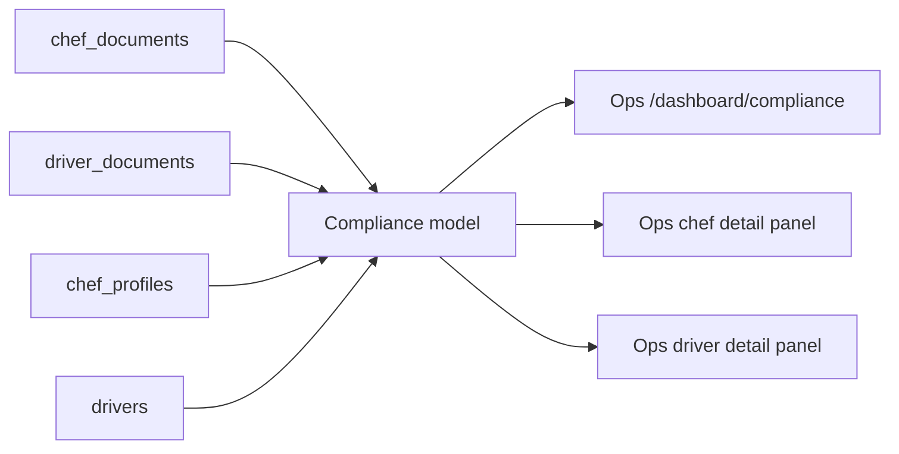

# Compliance Ops Dashboard Design

Status: approved for Phase 4 execution  
Date: 2026-06-06  
Scope: Ops-admin read-only compliance visibility

## Goal

Give Ops one reliable place to see chef and driver document coverage, review state, and expiry risk, while also showing the same context on chef and driver detail pages.

## Current Context

The schema already supports compliance documents:

- `chef_documents`: `document_type`, `document_url`, `status`, `expires_at`, `reviewed_by`, `reviewed_at`, `notes`
- `driver_documents`: same review and expiry fields
- `chef_profiles.status` and `drivers.status`: `pending`, `approved`, `rejected`, `suspended`

The missing workflow surface is visibility. Ops can approve/suspend chefs and drivers, but cannot quickly tell whether required compliance documents are missing, pending, expired, or about to expire.

## Approaches Considered

Recommended: read-only model plus Ops dashboard.

This adds a pure TypeScript compliance model, a new `/dashboard/compliance` page, and compact panels on chef/driver detail pages. It uses existing tables and does not change status transitions.

Alternative: add document approval mutations now.

This would move faster toward a full compliance workflow, but risks inventing decision semantics before Ops has reviewed the actual document states and required document list.

Alternative: only update the vault and defer code.

This is lowest risk but does not give Ops a usable queue.

## Design

The Phase 4 implementation uses existing data only.

Required chef document types:

- `food_handler_certificate`
- `business_license`
- `insurance`
- `kitchen_inspection`

Required driver document types:

- `drivers_license`
- `vehicle_registration`
- `vehicle_insurance`

The compliance model computes:

- missing required document types
- pending review count
- rejected document count
- expired document count
- documents expiring within 30 days
- documents expiring within 7 days
- documents missing expiry dates
- an overall risk level: `critical`, `warning`, `attention`, or `healthy`

The dashboard reads chefs and drivers with their document rows, builds compliance subjects, and shows summary counts plus review queues. The chef and driver detail pages fetch only the relevant owner documents and render a compact document panel.

## Data Flow

## Error Handling

The central dashboard is guarded by `ops_entity_read`. If the actor lacks that capability, it renders an access-restricted card. Missing documents are represented as computed missing requirements, not as database errors. Unknown document statuses remain visible and contribute to attention-level review.

## Testing

Model tests cover required-document coverage, expiry windows, status labels, and queue summary counts. Runtime verification is limited locally because `pnpm` is not installed and the available WindowsApps `node.exe` is access-denied in this environment; Vercel production deployment status remains the external build check after push.

