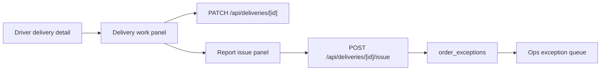

# Driver Workflow Clarity Design

## Goal

Make the driver app easier to operate during live delivery work by clarifying the current delivery step, the next safe action, and the path for reporting issues to Ops.

## Approval

Approved by the user on 2026-06-06 as Phase 6b, followed by Phase 6c chef readiness workflow and Phase 6d customer order confidence.

## Current Wiring

- The driver dashboard is rendered by `apps/driver-app/src/app/components/DriverDashboard.tsx`.
- Active delivery detail is rendered by `apps/driver-app/src/app/delivery/[id]/components/DeliveryDetail.tsx`.
- Delivery status changes already call `PATCH /api/deliveries/[id]`.
- Pickup/dropoff proof capture already uses `/api/upload` and the delivery PATCH path.
- Driver-reported issues already call `POST /api/deliveries/[id]/issue`.
- `POST /api/deliveries/[id]/issue` already writes to `order_exceptions`, which makes the report visible to Ops.
- Existing issue types are `chef_delay`, `customer_unavailable`, `damaged_package`, `unsafe_route`, `driver_emergency`, `wrong_address`, and `unable_to_complete`.

## Design

Add a focused delivery-work panel to the active delivery detail page. It should explain:

- The current delivery stage in plain field language.
- The next action the driver should take.
- Whether the driver should focus on pickup or dropoff.
- The pickup/dropoff address, payout, distance, and contact action already present on the page.

Add an issue reporting action to the delivery detail page. The driver should be able to open a compact issue panel, choose one of the existing issue types, enter required notes, and submit the report. On success, the UI should show that Ops has received the issue. On failure, the UI should keep the notes in place and show a clear retryable error.

Improve dashboard state language:

- Offline: tell the driver they must go online to receive offers.
- Online with no delivery: tell the driver they are waiting for offers and should keep the app open.
- Active delivery: show the active step and a stronger link into the delivery detail page.

## Data And API Flow

## Boundaries

- Do not add database schema.
- Do not add new driver issue types in this phase.
- Do not change the delivery state machine.
- Do not add new Ops APIs.
- Do not change chef or customer apps in Phase 6b.
- Do not send support messages outside the existing `order_exceptions` path.

## Testing

- Add a focused component test for the delivery detail work panel text.
- Add a focused component test for the issue panel success path.
- Keep existing route tests for delivery issue creation.
- Run available local checks; if `pnpm` remains unavailable, record the blocker and rely on Vercel build plus production smoke probes after push.

## Verification

- Driver login with the seeded account still works.
- Driver dashboard renders offline/online/active delivery states with clearer copy.
- Delivery detail renders the current step and next action.
- Issue submission calls `/api/deliveries/[id]/issue` and shows Ops-received confirmation.
- Driver production deployment is READY before Phase 6c starts.

## Rollback

- Remove the new delivery-work and issue-panel UI from `DeliveryDetail.tsx`.
- Restore dashboard copy and active delivery card copy if needed.
- Existing `order_exceptions` records remain valid because this phase only uses the existing issue API.
