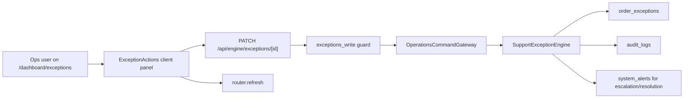

# Exception Actions Design

## Goal

Give Ops a controlled way to act on open operational exceptions from the deployed `/dashboard/exceptions` queue without changing customer, chef, or driver workflows.

## Current Wiring

- `order_exceptions` already stores owner, severity, status, notes, escalation, resolution, and SLA fields.
- `/api/engine/exceptions` already supports read and create through `exceptions_read` and `exceptions_write`.
- `/api/engine/exceptions/[id]` already supports PATCH actions for acknowledge, status update, escalate, resolve, and add note.
- `SupportExceptionEngine` already writes audit entries for acknowledge, status changes, escalation, and resolution.
- Acknowledgement self-assigns open exceptions to the current platform user, but there is no separate self-assign action for already-acknowledged or pending exceptions.

## Design

Add one small backend command, `assign_exception`, that assigns an exception to the current Ops actor without changing status. Keep assignment Ops-only through the existing `exceptions_write` capability and record an audit entry with the previous and new owner.

Add a focused client action panel to each exception row. The panel exposes:

- Acknowledge and self-assign for `open` exceptions.
- Self-assign for unassigned exceptions in any active status.
- Status update to `in_progress`, `pending_customer`, `pending_chef`, or `pending_driver`.
- Escalation with required reason.
- Resolution with required resolution note.
- Internal note with required note text.

The client should call only `/api/engine/exceptions/[id]` and refresh the server-rendered queue after successful actions. Operators without `exceptions_write` keep the read-only queue.

## Data And API Flow

## Boundaries

- Do not add database schema.
- Do not add customer, chef, or driver UI changes.
- Do not create refund, payout, cancellation, or delivery side effects from this panel.
- Do not expose bulk actions in this phase.

## Testing

- Add model tests for action availability and payload construction.
- Add gateway coverage proving `assign_exception` dispatches to the support engine.
- Run focused commands where local tooling allows; record local `pnpm` blockage if it remains unavailable.

## Rollback

- Remove the client action panel import from `/dashboard/exceptions`.
- Remove `assign_exception` from validation, route aliasing, gateway dispatch, and support engine.
- Existing exception records remain valid because this phase does not change schema.
