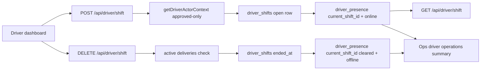

# Driver Shift Lifecycle Design

Status: approved for execution  
Date: 2026-06-08  
Project: Ridendine marketplace  
Apps affected: Driver App, Ops Admin  

## Goal

Make driver shift state a first-class operational workflow. A driver should explicitly start and end a shift, the system should keep `driver_shifts` and `driver_presence.current_shift_id` in sync, and Ops should see the same shift state that controls driver availability.

## Current State

The Driver app currently has:

- `PATCH /api/driver/presence` for online/offline/busy presence.
- `GET /api/driver/shift` for a read-only shift summary.
- `GET /api/driver/readiness` for approval, compliance, payout, location, and active-delivery readiness.
- Dashboard controls that toggle online/offline presence.

The database already has `driver_shifts` and `driver_presence.current_shift_id`, so Phase 10 should not add a parallel clock-in model. The gap is workflow ownership: shift start/end is not yet the business action that controls presence and Ops visibility.

## Requirements

1. Approved drivers can start a shift from the Driver app.
2. Pending, rejected, suspended, and missing-profile drivers cannot start a shift.
3. Starting a shift creates an open `driver_shifts` row when no open shift exists.
4. Starting a shift upserts `driver_presence` with `status = 'online'` and `current_shift_id` set to the open shift.
5. Re-starting while already on shift is idempotent and returns the existing open shift summary.
6. Drivers can end a shift only when they have no active deliveries.
7. Ending a shift sets `driver_shifts.ended_at`, clears `driver_presence.current_shift_id`, and sets presence to `offline`.
8. Ending a shift with active delivery work returns a clear blocking error for the Driver app.
9. The Driver dashboard uses shift actions as the primary work toggle while preserving existing presence/readiness behavior.
10. Ops driver operations include shift state, shift start time, current duration, and active shift totals.
11. No customer surface receives raw driver coordinates or shift internals.
12. Production smoke should avoid mutating live shift state unless a dedicated safe fixture is added later.

## Architecture

Phase 10 keeps shift lifecycle inside the Driver app API boundary and reports the result through existing Ops driver operations summaries.



`GET /api/driver/shift` remains the read model. `POST /api/driver/shift` starts or returns the active shift. `DELETE /api/driver/shift` ends the current shift when safe.

## Data Model

Use existing tables:

- `driver_shifts.id`
- `driver_shifts.driver_id`
- `driver_shifts.started_at`
- `driver_shifts.ended_at`
- `driver_shifts.total_deliveries`
- `driver_shifts.total_earnings`
- `driver_shifts.total_distance_km`
- `driver_presence.driver_id`
- `driver_presence.status`
- `driver_presence.current_shift_id`
- `driver_presence.updated_at`

No migration is required for the first implementation slice.

## API Contract

### `POST /api/driver/shift`

Starts the current driver's shift.

Success response:

```json
{
  "success": true,
  "data": {
    "driverId": "driver-1",
    "presenceStatus": "online",
    "currentShiftId": "shift-1",
    "isOnShift": true,
    "shiftStartedAt": "2026-06-08T16:00:00.000Z",
    "shiftEndedAt": null,
    "lastLocationAt": null,
    "activeDeliveryCount": 0,
    "activeDeliveries": [],
    "currentShift": {
      "totalDeliveries": 0,
      "totalEarnings": 0,
      "totalDistanceKm": null
    },
    "today": {
      "completedDeliveries": 0,
      "earnings": 0
    }
  }
}
```

Failure cases:

- `401 UNAUTHORIZED`: no approved driver context.
- `500 SHIFT_START_ERROR`: database write failed.

### `DELETE /api/driver/shift`

Ends the current driver's shift.

Failure cases:

- `401 UNAUTHORIZED`: no approved driver context.
- `409 ACTIVE_DELIVERY_BLOCK`: active delivery exists.
- `200` with an off-shift summary when there is no active shift, so repeated end actions are safe.
- `500 SHIFT_END_ERROR`: database write failed.

## Driver UI

The dashboard will keep the existing readiness panel and presence state labels, but the main work button becomes shift-aware:

- Off shift: show `Start shift`.
- Starting: show loading state and disable the button.
- On shift without active deliveries: show `End shift`.
- On shift with active deliveries: keep the shift active and explain that ending is blocked until delivery work is complete.
- Existing GPS retry and active-delivery workflow behavior stays intact.

The old online/offline presence PATCH remains available for lower-level presence updates, but the dashboard work toggle should call the shift lifecycle endpoint.

## Ops UI

Ops driver operations should include a shift card alongside readiness, active deliveries, exceptions, payout, and compliance:

- Shift state: `On shift` or `Off shift`.
- Started time.
- Current duration in minutes/hours.
- Shift totals: deliveries, earnings, distance.
- Presence status remains visible so Ops can tell the difference between off shift, online, and busy.

## Testing

Use TDD. Add failing tests before production code:

- Driver route tests for `POST /api/driver/shift`.
- Driver route tests for `DELETE /api/driver/shift`.
- Driver dashboard tests for start/end shift buttons and active-delivery blocking copy.
- Ops driver operations tests for shift summary fields.

## Verification

Minimum local gate:

- `pnpm --filter @ridendine/driver-app test -- driver-shift-route.test.ts`
- `pnpm --filter @ridendine/driver-app test -- driver-dashboard-empty-state.test.tsx`
- `pnpm --filter @ridendine/ops-admin test -- driver-operations-route.test.ts`
- `pnpm lint`
- `pnpm typecheck`
- `pnpm test`
- `pnpm build`
- `pnpm test:wiring-fixes`
- `pnpm audit:guards`
- `git diff --check`

Remote gate after commit/push:

- GitHub Actions green.
- Vercel production deployments ready for Web, Chef, Driver, and Ops.
- Production contract smoke and broad production smoke pass.

Production mutating shift actions should not be called by smoke unless a dedicated disposable driver fixture is added.

## Rollback

Revert the Phase 10 commit to restore the previous read-only shift summary and presence-only dashboard toggle. No schema rollback is expected because Phase 10 uses existing tables.
