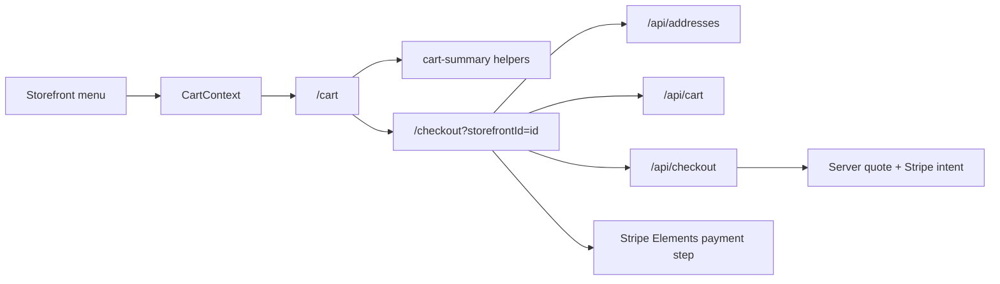

# Customer Cart Checkout Clarity Design

## Purpose

Phase 3 improves the customer path after a menu item is added to cart. The cart and checkout screens should make pricing, delivery details, and payment steps feel clear and trustworthy while preserving the existing RideNDine warm visual system.

The immediate issue is that the cart page currently calculates hardcoded delivery fee, service fee, tax, and total estimates. Checkout already treats fees and totals as server-authoritative. Phase 3 aligns the customer experience with that rule: the cart shows the real subtotal, then checkout confirms delivery, service fees, tax, discounts, and payment through the server flow.

## Scope

Included:

- Cart page pricing clarity.
- Checkout step/progress clarity.
- Shared cart-summary helpers for subtotal and display copy.
- A small checkout progress component for the details and payment steps.
- Existing mobile sticky bars updated to use truthful subtotal language.

Excluded:

- Stripe API changes.
- Checkout API changes.
- Cart API changes.
- Address CRUD changes.
- Driver, chef, and ops app changes.

## UX Direction

The cart should answer: what did I add, what is my current subtotal, and what happens next? It should not pretend to know final fees before the server confirms delivery and tax.

Checkout should answer: where am I in the process, what still needs attention, and when will I see the final price? The details step keeps address, delivery time, tip, payment method, promo, and order review. The payment step remains the secure Stripe payment surface.

The styling remains consistent with existing customer pages: `bg-background`, `bg-surface`, `primary`, `primarySoft`, `textMuted`, `surfaceMuted`, compact cards, and familiar button controls.

## Architecture

Add `apps/web/src/lib/cart-summary.ts` for cart subtotal, line totals, item count, checkout URL, and explanatory copy. This keeps pricing language testable and prevents hardcoded fee math from creeping back into cart.

Add `apps/web/src/components/checkout/checkout-progress.tsx` for the visible two-step checkout progress indicator. It is a presentational component used by checkout and tested independently.

Update `apps/web/src/app/cart/page.tsx` to show subtotal-only cart summary and “fees confirmed at checkout” messaging.

Update `apps/web/src/app/checkout/page.tsx` to render the checkout progress component and use the shared cart currency helper where appropriate.

## Data Flow

## Requirements

- Cart page must not show hardcoded delivery fee, service fee, HST, or final total.
- Cart page must show cart subtotal and clear copy that final delivery, service fee, tax, promos, and payment are confirmed in checkout.
- Cart mobile sticky bar must say “Subtotal”, not “Total”.
- Checkout page must show a two-step progress indicator: “Delivery details” and “Secure payment”.
- Checkout details step must clearly say the server confirms fees and taxes when continuing to payment.
- Existing sticky cart tests must continue to pass.
- Checkout server-authoritative totals tests must continue to pass.

## Testing

- Unit tests cover `cart-summary` helpers.
- Cart page tests cover truthful subtotal messaging and absence of hardcoded fee rows.
- Checkout progress component tests cover active/current step display.
- Existing full customer tests, typecheck, lint, build, Vercel status, and production responsive smoke must pass before Phase 3 is complete.

## Follow-Up Recommendation

Phase 4 should improve customer trust surfaces: chef story, food safety cues, richer review cards, favorites/reorder entry points, and better account-order history continuity.
