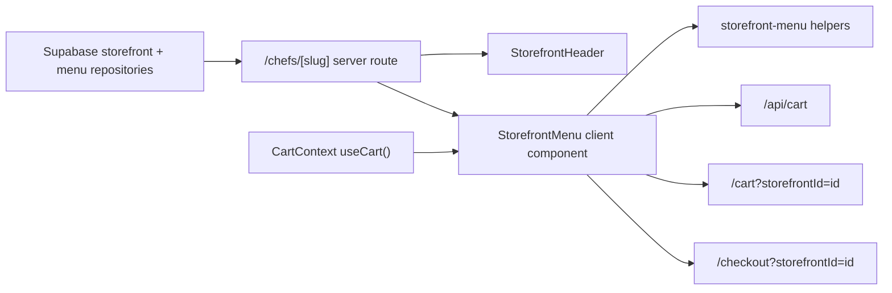

# Customer Storefront Menu Experience Design

## Purpose

Phase 2 improves the customer path after discovery: a customer lands on a chef storefront, understands what is available, finds the right item quickly, sees what is already in the cart, and can move toward checkout without confusion.

This phase preserves the current RideNDine visual feel: warm `bg-background`, `bg-surface`, `primary`, `accent`, `surfaceMuted`, and compact rounded cards. It does not introduce the dark blueprint visual direction from prior screenshots.

## Scope

Included:

- Storefront menu browsing improvements on `/chefs/[slug]`.
- Menu search by item name, description, category, and dietary tag.
- Category jump navigation using existing menu categories.
- Dietary quick filters using tags already present on menu items.
- Featured/popular item surfacing using the existing `is_featured` flag.
- Cart-side clarity: item count, current subtotal, minimum-order progress, and checkout readiness.
- Mobile sticky bar keeps the existing PWA-friendly behavior and adds clearer checkout context.

Excluded:

- Checkout payment flow changes.
- Cart API contract changes.
- Database schema changes.
- Ops, chef, and driver app behavior changes.

## UX Direction

The storefront should feel more like a working food-ordering screen and less like a static menu. The first menu section should immediately answer:

- What is popular here?
- How do I find dishes quickly?
- Which category am I in?
- Do dietary filters apply?
- What have I already added?
- Am I ready to check out?

The layout remains quiet and brand-consistent. Controls use familiar forms: search input, segmented-style category links, pill filters, and primary checkout buttons. The page should work cleanly on desktop and mobile without horizontal overflow.

## Architecture

Add focused customer ordering helpers in `apps/web/src/lib/storefront-menu.ts` so filtering, grouping, price formatting, and minimum-order progress are testable outside React.

Update `StorefrontMenu` to use those helpers. The component remains client-side because it already depends on `useCart`. It will receive storefront metadata from the page so the cart sidebar can show minimum-order progress without additional API calls.

The route at `apps/web/src/app/chefs/[slug]/page.tsx` will pass `storefrontName` and `minOrderAmount` into the menu component. Checkout links remain `/checkout?storefrontId=...`, and cart links remain `/cart?storefrontId=...`.

## Data Flow

## Requirements

- If featured items exist, show a compact featured strip above categories.
- Search filters menu items without changing URLs.
- Dietary filters are derived from menu item `dietary_tags`.
- Category navigation is anchor-based and does not require JavaScript routing.
- Empty filtered results show a helpful in-page state without hiding the whole cart sidebar.
- The cart summary shows minimum-order progress when `minOrderAmount > 0`.
- Checkout buttons are disabled until the minimum order is reached.
- Mobile sticky bar shows subtotal and minimum-order status.
- Existing sticky cart tests remain valid.

## Testing

- Unit tests cover helper behavior: category grouping, tag extraction, item filtering, price formatting, and minimum-order progress.
- React tests cover the storefront UI: featured section, search, dietary filters, category links, in-cart count, minimum-order progress, and disabled checkout when below minimum.
- Existing customer web tests, typecheck, lint, build, and production responsive smoke must pass before the phase is considered complete.

## Recommendations After Phase 2

Phase 3 should improve cart and checkout clarity: address selection, delivery window selection, promo code surface, and the final review step. Phase 4 should add customer trust surfaces: chef story, food safety cues, richer reviews, and reorder/favorites entry points.
