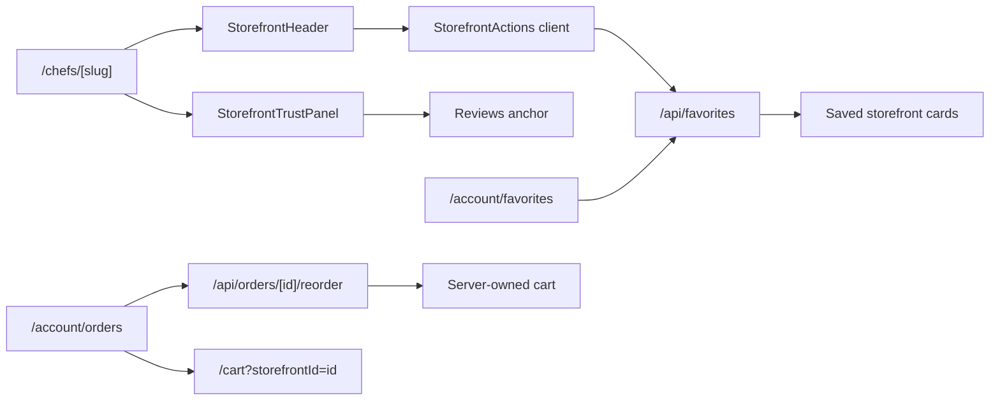

# Customer Trust Repeat Order Design

## Purpose

Phase 4 strengthens the customer-facing app after the ordering path has been clarified. Customers should feel safer choosing a chef, be able to save a storefront, return to saved chefs, and reorder from past delivered orders without relying on brittle client-side cart rebuilding.

This phase preserves the current RideNDine customer feel: warm background, white surfaces, orange primary actions, teal/accent trust cues, compact mobile-first layouts, and simple ordering language.

## Scope

Included:

- Storefront trust panel using existing public storefront, chef, rating, ETA, cuisine, and minimum-order data.
- Storefront favorite action wired to the existing `/api/favorites` toggle endpoint.
- Favorites page wired to the existing `/api/favorites` list endpoint.
- Order history reorder action wired to the existing protected `/api/orders/[id]/reorder` endpoint.
- Tests for helper behavior and customer UI wiring.

Excluded:

- Database schema changes.
- Favorites API contract changes.
- Reorder API contract changes.
- Checkout, Stripe, driver, chef, or ops behavior changes.
- Full review-authoring redesign.

## UX Direction

The storefront should answer customer trust questions before they commit to a cart:

- Who is cooking this?
- Why can I trust this storefront?
- What do other customers say?
- How long will it take?
- Is checkout/payment handled securely?

The favorite button should be a real action, not a static icon. If a signed-in customer saves a chef, the state should update immediately. If the customer is not signed in, the UI should explain that sign-in is required without breaking the page.

The favorites page should become a useful return path. Saved storefronts should show name, cuisines, rating/review count, and a direct menu link. Empty state remains for customers with no saved chefs.

The order history reorder action should use the server-side reorder endpoint. The customer should be routed to the cart after a successful reorder so they can review current prices, availability, and final checkout details.

## Architecture

Add `apps/web/src/lib/storefront-trust.ts` for deterministic trust copy, delivery ETA formatting, rating text, and favorite list mapping. This keeps Phase 4 presentation copy testable outside React.

Add `apps/web/src/components/storefront/storefront-actions.tsx` as a client component for favorite/share actions. `StorefrontHeader` remains primarily presentational and receives `id` and `slug` so the action component can call `/api/favorites`.

Add `apps/web/src/components/storefront/storefront-trust-panel.tsx` for the trust section rendered between `StorefrontHeader` and `StorefrontMenu`.

Update `apps/web/src/app/account/favorites/page.tsx` to fetch and render favorite storefronts.

Update `apps/web/src/app/account/orders/page.tsx` to call `/api/orders/[id]/reorder` instead of rebuilding the cart item-by-item in the browser.

## Data Flow

## Requirements

- Storefront header favorite action must call `/api/favorites` and update visible saved state on success.
- Storefront favorite action must show a sign-in-required message on `401`.
- Storefront trust panel must show chef approval, rating/review confidence, delivery/prep timing, and secure checkout messaging.
- Storefront reviews section must have a stable `id="reviews"` anchor for trust panel links.
- Favorites page must fetch `/api/favorites` for signed-in customers and render saved storefront cards.
- Favorites page must support removing a saved storefront by calling `/api/favorites` with the storefront id and updating the list.
- Order history reorder must call `/api/orders/[id]/reorder` and route to `/cart?storefrontId=...` on success.
- Reorder failures must show customer-readable error text without navigating away.
- Existing customer marketplace, menu, cart, checkout, and API tests must keep passing.

## Testing

- Unit tests cover `storefront-trust` helper output.
- Storefront header/action tests cover favorite fetch/toggle and unauthorized messaging.
- Storefront trust panel tests cover trust copy and review anchor link.
- Favorites page tests cover loading favorites, empty state, rendering saved storefronts, and removing a favorite.
- Order history tests cover use of the server reorder endpoint and cart redirect.
- Full customer web tests, typecheck, lint, build, Vercel status, and production responsive smoke must pass before Phase 4 is complete.

## Self-Review

- No placeholder requirements remain.
- Phase is scoped to existing APIs and customer UI only.
- No server money, checkout, dispatch, ops, chef, or driver behavior changes are included.
