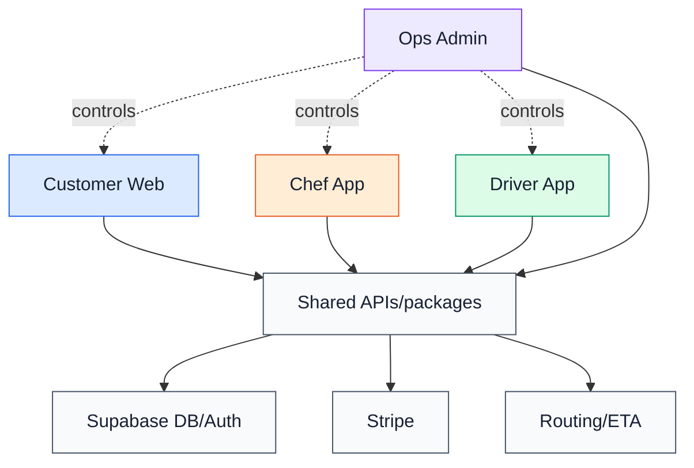

# Graphify Master Graph

```mermaid
flowchart TB
  classDef customer fill:#dbeafe,stroke:#2563eb,color:#172033
  classDef chef fill:#ffedd5,stroke:#e85d26,color:#172033
  classDef driver fill:#dcfce7,stroke:#059669,color:#172033
  classDef ops fill:#ede9fe,stroke:#7c3aed,color:#172033
  classDef shared fill:#f8fafc,stroke:#475569,color:#172033
  Web["Customer Web"]:::customer --> Shared["Shared APIs/packages"]:::shared
  Chef["Chef App"]:::chef --> Shared
  Driver["Driver App"]:::driver --> Shared
  Ops["Ops Admin"]:::ops --> Shared
  Shared --> DB["Supabase DB/Auth"]:::shared
  Shared --> Stripe["Stripe"]:::shared
  Shared --> Routing["Routing/ETA"]:::shared
  Ops -. controls .-> Web
  Ops -. controls .-> Chef
  Ops -. controls .-> Driver
```
